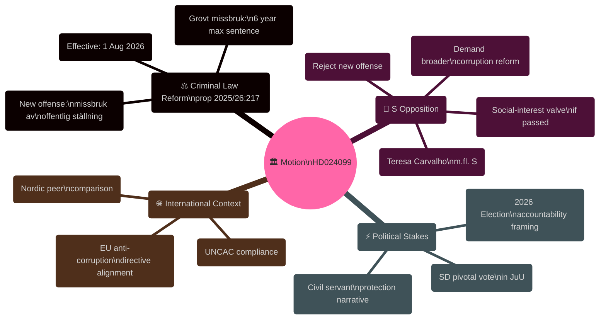

# Synthesis Summary — Opposition Motions 2026-04-28

**Author**: James Pether Sörling  
**Date**: 2026-04-28  
**Confidence**: HIGH [B2]

## Lead Story Decision

The critical decision point is **whether the Social Democrats' opposition to prop. 2025/26:217 represents a principled rule-of-law position or pre-election posturing** — analysis of HD024099 reveals both dimensions are present, with the principled legal argument (chilling effect on civil servants, wrong instrument for the problem) substantively stronger than the electoral positioning framing favoured by government defenders.

## DIW-Weighted Intelligence Ranking

| Document | DIW Weight | Tier | Significance |
|----------|-----------|------|-------------|
| HD024099 (S mot. re prop. 2025/26:217) | 8.2/10 | L2+ Priority | Single highest-impact motion filed 2026-04-27; touches criminal justice reform, rule of law, civil service accountability, 2026 electoral dynamics |

**Ranking rationale (HD024099)**:
- **Depth**: L2+ — involves constitutional criminal law, BrB amendment, impacts 1.2 million public sector workers [riksdagen.se/HD024099]
- **Influence**: High — potential SD defection from governing coalition; pre-election judicial accountability framing
- **Wedge potential**: HIGH — S exploits tension between government's anti-corruption rhetoric and civil servants' (SD electorate) fear of criminalisation

## Integrated Intelligence Picture

Motion HD024099 is a **counter-narrative document** in the criminal justice reform debate. The governing coalition (M/KD/L/C with SD) tabled prop. 2025/26:217 to create new criminal offenses for public officials who "misuse their public position" — a direct response to municipal contract manipulation and institutional lawfare cases. Justice Minister Gunnar Strömmer (M) has presented this as essential for preserving public trust [HD03217].

S counters on three fronts:

1. **Instrumentally**: The proposed offense "missbruk av offentlig ställning" sets a too-low intent threshold — civil servants face criminal risk for ordinary errors in judgment, not just corrupt self-dealing. S cites the risk of chilling administrative discretion [HD024099, B2].

2. **Comprehensively**: The government cherry-picked the easiest element of the Corruption Investigation Committee's recommendations while leaving the substantive Chapter 10 BrB reforms (aimed at high-level corruption) off the table [HD024099, C3].

3. **Procedurally**: S demands a social-interest exemption clause as a minimum safeguard if the offense is passed anyway [HD024099, A2].

The intelligence picture is that this motion **strengthens S's accountability credentials** ahead of the 2026 election while exposing a potential crack in the Tidö coalition — SD's working-class municipal employees are precisely the workers most exposed to the new criminal risk.

## Cross-Document Synthesis

No additional motions filed on 2026-04-28. Lookback to 2026-04-27 yields HD024099 as the sole qualifying document. Context motions from April 16-17 (HD024092, HD024094, HD024096, HD024098 — on fuel tax, defence exports, municipal healthcare) are not in scope for this run but represent consistent opposition-party counter-budgeting and regulatory challenge activity in the same riksmöte.

