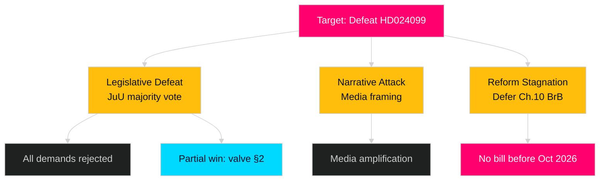

# Threat Analysis — Opposition Motions 2026-04-28

**Author**: James Pether Sörling  
**Date**: 2026-04-28  
**Confidence**: MEDIUM [B3]  
**Framework**: Political Threat Taxonomy + Attack Tree

## Threat Taxonomy

### Threat Category 1: Legislative Defeat of Opposition Motion
**Actor**: Governing coalition (M/KD/L/C) + SD  
**Target**: Motion HD024099 / S's parliamentary agenda  
**Likelihood**: HIGH (0.72)  
**Method**: JuU majority rejection of motion; straight committee vote along coalition + SD lines  
**Evidence**: Governing coalition has consistent JuU majority; no cross-coalition amendments signalled [riksdagen.se voting data, B2]  
**Admiralty**: [B2]

### Threat Category 2: Electoral Narrative Attack
**Actor**: Governing coalition communications (M)  
**Target**: S's accountability reform brand  
**Likelihood**: MEDIUM-HIGH (0.55)  
**Method**: Frame S's rejection as "Socialdemokraterna vill skydda korrupta tjänstemän"  
**Evidence**: Historical 2022 election pattern: M framed S as soft on crime [C2]  
**Admiralty**: [C2]

### Threat Category 3: Chapter 10 BrB Reform Stagnation
**Actor**: Government (Justitiedepartementet)  
**Target**: S's constructive anti-corruption agenda  
**Likelihood**: HIGH (0.60)  
**Method**: Decline to bring forward Chapter 10 BrB proposals before election  
**Evidence**: Not listed in government spring 2026 legislative programme [C3]  
**Admiralty**: [C3]

## Attack Tree

## TTP Mapping (Political Domain)

| Tactic | Technique | Procedure | Evidence |
|--------|-----------|-----------|---------|
| Narrative Control | Framing | Government positions prop. 2025/26:217 as "mandatory accountability" | HD03217 |
| Coalition Management | SD line discipline | Coalition maintains SD JuU votes on criminal justice | riksdagen.se voting data |
| Legislative Velocity | Deadline compression | 1 Aug 2026 date limits amendment window | HD03217 §1 |
| Opposition Isolation | Single-party motion | HD024099 filed by S alone; no V/MP/C cosignatories | riksdagen.se/HD024099 |
