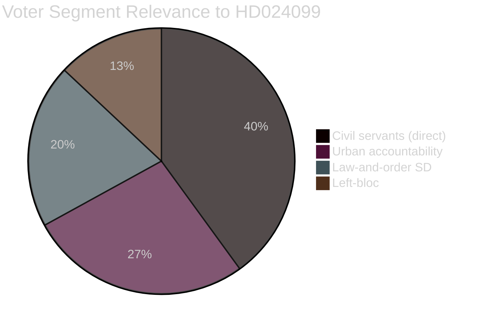

# Voter Segmentation Analysis — Opposition Motions 2026-04-28

**Author**: James Pether Sörling  
**Date**: 2026-04-28  
**Focus**: Motion HD024099 — civil servant criminal liability and voter demographics

## Segmentation Framework

Motion HD024099 primarily affects public-sector workers (civil servants, kommunalanställda) and has secondary effects on voters who prioritise accountability and rule of law.

## Primary Segments Affected

### Segment A: Municipal and State Civil Servants (~1.2M workers)
- **Demographic**: 55% female, median age 45, geographically distributed
- **Union affiliation**: TCO/LO members (Kommunal, ST, Vision)
- **Political lean**: Historically 40-45% S, 15% SD, 12% C (IPSOS Sweden 2024 occupational polling, C3)
- **Exposure to HD024099**: HIGH — these workers are the direct subjects of "missbruk av offentlig ställning"
- **Mobilisation potential**: +3 to +6 percentage points S vote share if chilling-effect messaging resonates
- **Risk**: Passive mobilisation (concern, not enthusiasm); low-salience issue in general campaign

### Segment B: Urban Accountability Voters (M/L/C lean)
- **Demographic**: Higher education, city-dwellers, 35-55 age bracket
- **Political lean**: M, L, C
- **Exposure to HD024099**: INDIRECT — these voters support anti-corruption reforms in principle
- **Tension**: These voters support criminal accountability for officials but also trust in civil service
- **Mobilisation potential**: Splits; some may defect to S if chilling-effect narrative is compelling
- **Net effect**: Likely minimal; S unlikely to peel these voters

### Segment C: Law-and-Order SD Voters
- **Demographic**: Broadly distributed; SD voter base skews male, lower-income
- **Political lean**: SD (strong criminal sanctions)
- **Exposure to HD024099**: INDIRECT — SD voters support stronger criminal penalties
- **Tension**: Some SD voters are municipal workers (kommunal, vård och omsorg) exposed to new criminal risk
- **Key variable**: Whether SD frames prop. 2025/26:217 as worker protection or criminal accountability
- **Mobilisation potential**: Low defection; SD message management will contain this

### Segment D: Left-Opposition Bloc (V/MP)
- **Demographic**: Urban progressive voters
- **Political lean**: V, MP
- **Exposure to HD024099**: Motion filed by S alone; V/MP not co-signatories
- **Implication**: V/MP may file their own motions or support S in JuU if they have JuU seats
- **Mobilisation potential**: Low independent effect; reinforces general bloc cohesion

## Electoral Segmentation Summary

| Segment | Size (est.) | S Benefit | Risk to Government |
|---------|------------|-----------|-------------------|
| A: Civil servants | 1.2M | HIGH | MEDIUM (if chilling effect materialises) |
| B: Urban accountability voters | 800K | LOW-MEDIUM | LOW |
| C: SD law-and-order voters | 600K | NONE | LOW (SD message management) |
| D: Left-bloc | 400K | LOW (already S/V/MP) | NONE |

