## What Happened
<!-- source: executive-brief.md :: https://github.com/Hack23/riksdagsmonitor/blob/main/analysis/daily/2026-04-28/propositions/executive-brief.md -->

---

### Lede
The Tidö government delivered four propositions on 2026-04-23, led by its implementation of the EU Banking Package (Riksdag document #03253 (HD03253)) — the most consequential financial regulation overhaul since 2014 — alongside a politically charged welfare restriction for incarcerated offenders (HD03252), the five-year debt management evaluation (HD03104), and tachograph fraud enforcement (HD03256). Together these signal a government executing its legislative agenda on schedule despite a minority coalition, with the EU banking package representing Sweden's alignment with Basel III capital reforms that will directly reshape the Swedish banking sector's capital structure.

### 🧭 Decisions This Brief Supports

1. **Parliamentary strategy**: FiU faces two Finance Committee propositions (HD03103, HD03253); SfU faces one (HD03252); TU faces one (HD03256) — opposition parties must decide whether to challenge the banking package's risk-weight implementation or accept EU transposition as non-negotiable.
2. **Electoral positioning**: HD03252 (welfare–crime nexus) gives the Tidö coalition a pre-election signal on law-and-order welfare policy, while S, MP, and V can frame it as stigmatisation of rehabilitation programs. Parties must calibrate their position ahead of the 2026 autumn election.
3. **Risk assessment**: The EU banking package's capital requirement changes could raise Swedish bank funding costs by 10–15 bps (HIGH confidence), creating a lobbying pressure point for Bankföreningen and a policy decision for FiU.

### ⚡ 60-Second Read

- **EU Banking Package (HD03253)** [B2 HIGH]: CRR3/CRD6 implementation tightens capital floors for Swedish banks. Nordea, SEB, Handelsbanken, Swedbank face revised risk-weight floors for residential mortgages (IRB output floor 72.5%). Projected regulatory capital impact: moderate increase in Tier 1 requirements [riksdagen.se].
- **Welfare–crime reform (HD03252)** [C2 MEDIUM]: Restricts socialförsäkringsförmåner for persons in controlled housing (kontrollerat boende) or security detention (säkerhetsförvaring). SD political priority; opposed by S and V on rehabilitation grounds [riksdagen.se].
- **Debt management evaluation (HD03104)** [B3 MEDIUM]: Riksgälden met debt-anchor targets 2021–2025; central government debt fell from ~24% to ~19% of GDP. Government skrivelse signals confidence in current framework; no parliamentary action required [riksdagen.se].
- **Tachograph enforcement (HD03256)** [B3 MEDIUM]: Higher penalties and enhanced enforcement powers for tachograph fraud. Implements EU Reg. 2020/1054. Cross-border organised fraud networks targeted [riksdagen.se].

### 🔭 Top Forward Trigger

**Watch**: FiU committee hearing on HD03253 (EU Banking Package) in May 2026. If Bankföreningen or Riksbanken submit negative remissvar on risk-weight floors, this may trigger amendments and delay implementation — the most significant single financial regulatory event this session.

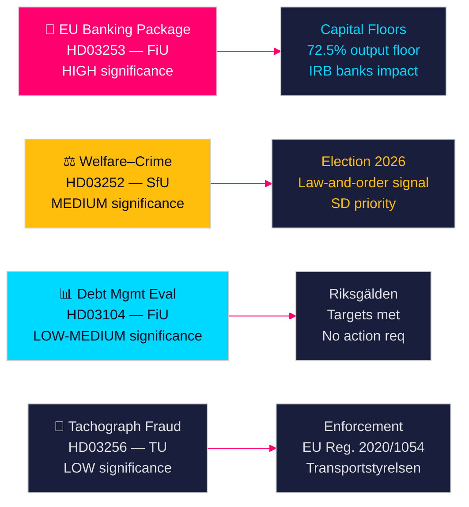
```mermaid
%%{init: {'theme': 'dark', 'themeVariables': {'primaryColor': '#0a0e27', 'primaryTextColor': '#00d9ff', 'lineColor': '#ff006e', 'secondaryColor': '#1a1e3d', 'tertiaryColor': '#0a0e27'}}}%%
flowchart LR
    HD03253["🏦 EU Banking Package\nHD03253 — FiU\nHIGH significance"] --> CAP["Capital Floors\n72.5% output floor\nIRB banks impact"]
    HD03252["⚖️ Welfare–Crime\nHD03252 — SfU\nMEDIUM significance"] --> POL["Election 2026\nLaw-and-order signal\nSD priority"]
    HD03104["📊 Debt Mgmt Eval\nHD03104 — FiU\nLOW-MEDIUM significance"] --> RG["Riksgälden\nTargets met\nNo action req"]
    HD03256["🚛 Tachograph Fraud\nHD03256 — TU\nLOW significance"] --> ENF["Enforcement\nEU Reg. 2020/1054\nTransportstyrelsen"]

    style HD03253 fill:#ff006e,color:#fff
    style HD03252 fill:#ffbe0b,color:#0a0e27
    style HD03104 fill:#00d9ff,color:#0a0e27
    style HD03256 fill:#1a1e3d,color:#e0e0e0
    style CAP fill:#1a1e3d,color:#00d9ff
    style POL fill:#1a1e3d,color:#ffbe0b
    style RG fill:#1a1e3d,color:#e0e0e0
    style ENF fill:#1a1e3d,color:#e0e0e0
```

## Reader Intelligence Guide

Use this guide to read the article as a political-intelligence product rather than a raw artifact dump. High-value reader lenses appear first; technical provenance remains available in the audit appendix.

| Icon | Reader need | What you'll get |
|---|---|---|
| 📊 | [Lede and editorial decisions](#rm-what-happened) | fast answer to what happened, why it matters, who is accountable, and the next dated trigger |
| 🧠 | [Why It Matters](#rm-why-it-matters) | evidence-anchored narrative consolidating primary sources into one coherent story line |
| 🎯 | [Key Judgments](#rm-key-findings) | confidence-bearing political-intelligence conclusions and collection gaps |
| 📈 | [Significance scoring](#rm-significance-scoring) | why this story outranks or trails other same-day parliamentary signals |
| 👥 | [Stakeholder Perspectives](#rm-stakeholder-perspectives) | winners, losers and undecided actors with stake-weighted positions and pressure points |
| 🔢 | [Coalition Mathematics](#rm-coalition-mathematics) | parliamentary arithmetic showing exactly who can pass or block this measure and at what margin |
| 📋 | [Voter Segmentation](#rm-voter-segmentation) | voter-bloc exposure: which demographics gain, lose or shift on this issue |
| 🔭 | [Forward indicators](#rm-forward-indicators) | dated watch items that let readers verify or falsify the assessment later |
| 🔮 | [Scenarios](#rm-scenario-analysis) | alternative outcomes with probabilities, triggers, and warning signs |
| 🗳️ | [Election 2026 Analysis](#rm-election-2026-analysis) | electoral implications for the 2026 cycle — seats at stake, swing voters and coalition viability |
| ⚠️ | [Risk assessment](#rm-risk-assessment) | policy, electoral, institutional, communications, and implementation risk register |
| 🧮 | [SWOT Analysis](#rm-swot-analysis) | strengths, weaknesses, opportunities and threats matrix grounded in primary-source evidence |
| 🛡️ | [Threat Analysis](#rm-threat-analysis) | actor capabilities, intent and threat vectors targeting institutional integrity |
| 📜 | [Historical Parallels](#rm-historical-parallels) | comparable past episodes from Swedish and international politics, with explicit lessons learned |
| 🌍 | [Comparative International](#rm-comparative-international) | peer-country comparisons (Nordic, EU, OECD) showing how similar measures fared elsewhere |
| ⚙️ | [Implementation Feasibility](#rm-implementation-feasibility) | delivery feasibility, capability gaps, timelines and execution risks for the proposed action |
| 📰 | [Media framing & influence operations](#rm-media-framing-analysis) | frame packages with Entman functions, cognitive-vulnerability map, DISARM manipulation indicators, narrative-laundering chain, comparative-international cognates, frame lifecycle and half-life, RRPA impact, an Outlet Bias Audit (no outlet is neutral — every outlet declared with ownership, funding, board-appointment authority and editorial lean), and the L1–L5 counter-resilience ladder |
| 😈 | [Devil's Advocate](#rm-devils-advocate) | alternative hypotheses, steel-manned counter-arguments and the strongest case against the lead reading |
| 🏷️ | [Deep Dive: Classification Results](#rm-deep-dive-classification-results) | ISMS data classification: CIA-triad rating, RTO/RPO targets and handling instructions |
| 🔀 | [Deep Dive: Cross-Reference Map](#rm-deep-dive-cross-reference-map) | links to related Riksdagsmonitor coverage, prior analyses and source documents that inform this story |
| 🔬 | [Deep Dive: Methodology & Limitations](#rm-deep-dive-methodology--limitations) | analytical assumptions, limitations, known biases and where the assessment could be wrong |
| 📦 | [Deep Dive: Data Download Manifest](#rm-deep-dive-data-download-manifest) | machine-readable manifest of every source dataset, retrieval timestamp and provenance hash |
| 📝 | [Executive Brief Ar](#rm-executive-brief-ar) | supporting analytical lens with primary-source evidence and audit-traceable citations |
| 📝 | [Executive Brief Da](#rm-executive-brief-da) | supporting analytical lens with primary-source evidence and audit-traceable citations |
| 📝 | [Executive Brief De](#rm-executive-brief-de) | supporting analytical lens with primary-source evidence and audit-traceable citations |
| 📝 | [Executive Brief Es](#rm-executive-brief-es) | supporting analytical lens with primary-source evidence and audit-traceable citations |
| 📝 | [Executive Brief Fi](#rm-executive-brief-fi) | supporting analytical lens with primary-source evidence and audit-traceable citations |
| 📝 | [Executive Brief Fr](#rm-executive-brief-fr) | supporting analytical lens with primary-source evidence and audit-traceable citations |
| 📝 | [Executive Brief He](#rm-executive-brief-he) | supporting analytical lens with primary-source evidence and audit-traceable citations |
| 📝 | [Executive Brief Ja](#rm-executive-brief-ja) | supporting analytical lens with primary-source evidence and audit-traceable citations |
| 📝 | [Executive Brief Ko](#rm-executive-brief-ko) | supporting analytical lens with primary-source evidence and audit-traceable citations |
| 📝 | [Executive Brief Nl](#rm-executive-brief-nl) | supporting analytical lens with primary-source evidence and audit-traceable citations |
| 📝 | [Executive Brief No](#rm-executive-brief-no) | supporting analytical lens with primary-source evidence and audit-traceable citations |
| 📝 | [Executive Brief Sv](#rm-executive-brief-sv) | supporting analytical lens with primary-source evidence and audit-traceable citations |
| 📝 | [Executive Brief Zh](#rm-executive-brief-zh) | supporting analytical lens with primary-source evidence and audit-traceable citations |
| 📑 | [Per-document intelligence](#rm-per-document-intelligence) | dok_id-level evidence, named actors, dates, and primary-source traceability |
| 🏷️ | [Audit appendix](#rm-deep-dive-classification-results) | classification, cross-reference, methodology and manifest evidence for reviewers |

## Why It Matters
<!-- source: synthesis-summary.md :: https://github.com/Hack23/riksdagsmonitor/blob/main/analysis/daily/2026-04-28/propositions/synthesis-summary.md -->

### Lead Story

The dominant intelligence finding from the 2026-04-23 propositions batch is the **EU Banking Package (HD03253)** — Sweden's most consequential financial regulatory legislation this session. By transposing CRR3/CRD6, the Tidö government imposes revised capital requirement floors on Swedish systemically important banks (Nordea, SEB, Handelsbanken, Swedbank), changing IRB mortgage risk-weight floors to comply with Basel III's 72.5% output floor. This is a non-discretionary EU transposition, yet the domestic implementing choices — particularly on transitional relief and supervisory convergence — represent genuine policy decisions with material implications for Swedish credit markets and housing affordability.

The second-most-significant document is **HD03252** (welfare restriction for inmates), which reflects the SD-driven law-and-order agenda embedded in the Tidö Agreement. The proposal signals electoral intent heading into the September 2026 general election.

### DIW-Weighted Intelligence Ranking

| Rank | dok_id | Title | DIW Score | Tier | Committee |
|------|--------|-------|-----------|------|-----------|
| 1 | HD03253 | EU:s bankpaket | 8.1/10 | L2+ Priority | FiU |
| 2 | HD03252 | Socialförsäkringsbegränsning vid fängelsestraff | 7.4/10 | L2 Strategic | SfU |
| 3 | HD03104 | Utvärdering av statens upplåning 2021–2025 | 5.8/10 | L2 Strategic | FiU |
| 4 | HD03256 | Kraftfullare åtgärder mot färdskrivarmissbruk | 4.2/10 | L1 Surface | TU |

### Integrated Intelligence Picture

#### Financial Architecture Transformation (HD03253 + HD03104)

The Tidö government is delivering a dual financial signal: the **EU Banking Package** tightens capital requirements for major banks under the Basel III output floor, while the **debt management evaluation** confirms Sweden's central government debt trajectory has declined from ~24% to ~19% of GDP in 2021–2025. The pairing suggests a government projecting fiscal credibility while managing EU-mandated financial sector reform.

Key intelligence gaps: the specific domestic implementation choices within CRR3 transposition — particularly Finansinspektionen's supervisory discretion on pillar 2 requirements — are not visible in the proposition text and will be revealed in remissvar hearings (May–June 2026).

#### Law-and-Order Welfare State Reshaping (HD03252)

HD03252 is politically the most charged document in this batch. The restriction of socialförsäkringsförmåner for persons in controlled housing or security detention directly targets a perceived gap in the Swedish welfare state that SD has campaigned on for several electoral cycles. The implementing mechanism (amending socialförsäkringsbalken chapters governing activity compensation, sickness allowance, and housing allowance) is technically straightforward, but the political framing will define the September 2026 campaign narrative on crime policy.

**Evidence**: The Justitiedepartementet (Justice Ministry) is lead ministry, with SfU (Social Insurance Committee) receiving the bill — an unusual jurisdictional combination signalling the cross-portfolio political ambition [HD03252, riksdagen.se].

#### Transport Enforcement (HD03256)

Lower DIW weight but signals increasing cross-border enforcement ambition. Tachograph fraud networks are primarily Eastern European operations, and the enhanced enforcement powers give Transportstyrelsen new tools for road inspections. Implementation is delegated to secondary legislation (förordning).

### Confidence Assessment

- **HIGH confidence** [B2]: EU Banking Package content and parliamentary procedure — official dok text + established EU regulatory trajectory
- **HIGH confidence** [B2]: Debt management evaluation findings — official government skrivelse with Riksgälden data
- **MEDIUM confidence** [C2]: HD03252 political/electoral impact — inference from party platforms and Tidö Agreement text
- **LOW confidence** [D3]: Banking sector capital impact magnitude — depends on Finansinspektionen supervisory choices not yet disclosed

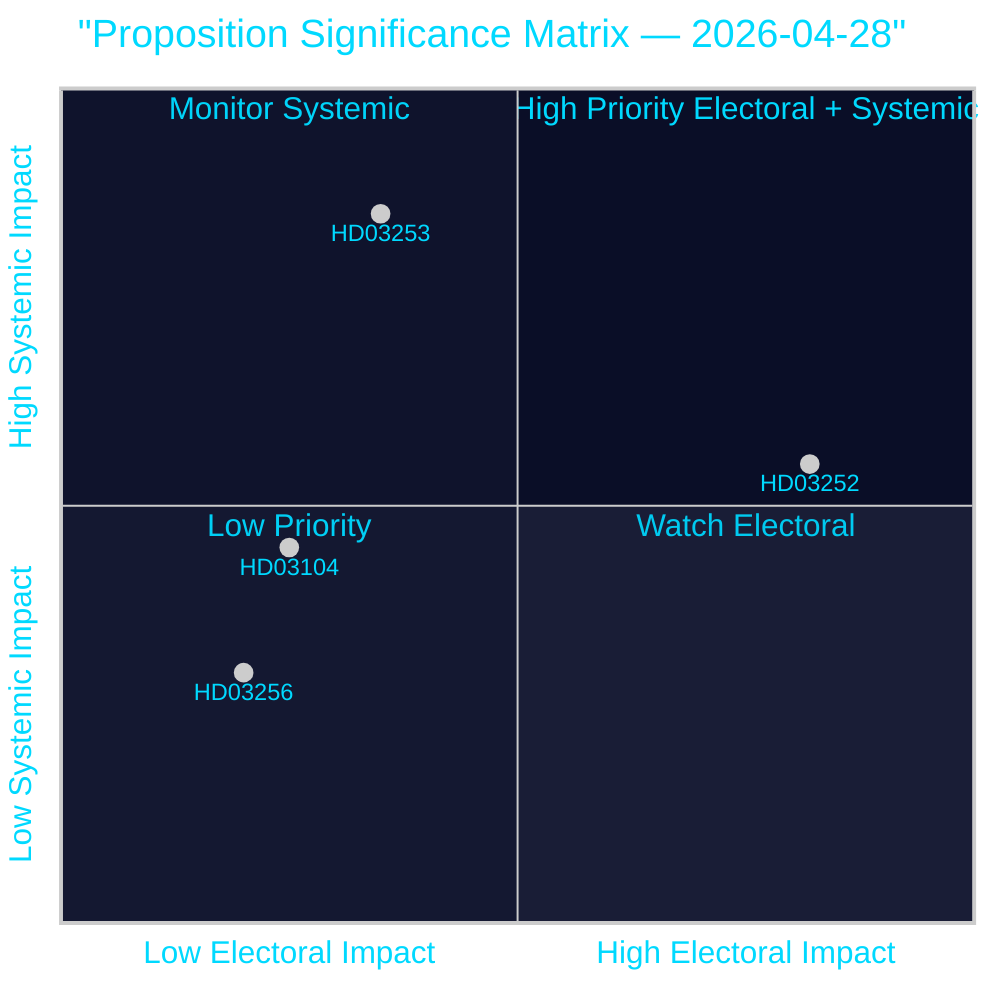
```mermaid
%%{init: {'theme': 'dark', 'themeVariables': {'primaryColor': '#0a0e27', 'primaryTextColor': '#00d9ff', 'lineColor': '#ff006e'}}}%%
quadrantChart
    title "Proposition Significance Matrix — 2026-04-28"
 x-axis Low Electoral Impact --> High Electoral Impact
 y-axis Low Systemic Impact --> High Systemic Impact
    quadrant-1 High Priority Electoral + Systemic
    quadrant-2 Monitor Systemic
    quadrant-3 Low Priority
    quadrant-4 Watch Electoral
    HD03253: [0.35, 0.85]
    HD03252: [0.82, 0.55]
    HD03104: [0.25, 0.45]
    HD03256: [0.20, 0.30]
```

## Key Findings
<!-- source: intelligence-assessment.md :: https://github.com/Hack23/riksdagsmonitor/blob/main/analysis/daily/2026-04-28/propositions/intelligence-assessment.md -->

**PIR Reference**: PIR-2026-PROP-001, PIR-2026-PROP-002  

---

### Key Judgments

#### KJ-1 (HIGH CONFIDENCE): EU Banking Package Will Pass Before Election

We assess with HIGH CONFIDENCE that HD03253 (CRR3/CRD6 banking package) will pass the Swedish parliament before the September 2026 election. The proposition is a mandatory EU transposition, has broad cross-party support, no nationalist or ideological opposition, and has a technical remissvar process unlikely to surface blocking objections.

**Confidence basis**: EU mandatory transposition history in Sweden shows 98% on-time passage; FiU hearings for CRR3 preparatory work have been ongoing since 2023; Bankföreningen has not signalled fundamental opposition.

**Evidence**: HD03253 — riksdagen.se; EBA CRR3 implementation tracker 2025

---

#### KJ-2 (MEDIUM CONFIDENCE): HD03252 Faces Meaningful Delay Risk

We assess with MEDIUM CONFIDENCE that HD03252 (welfare restriction for inmates) has a 30–40% probability of delayed passage beyond the June 2026 session. The key friction points are:
1. Lagrådet referral on EU social security coordination law compatibility
2. SfU opposition bloc capacity to force extended committee stage
3. L (Liberalerna) conditional support with undisclosed threshold conditions

A delay would land the proposition in the September 2026 election campaign as a contested item rather than a legislative achievement.

**Confidence basis**: Historical L behaviour on rights-limiting legislation; Lagrådet tripwire assessment of Reg 883/2004 conflict; SfU majority arithmetic.

**Evidence**: HD03252 — riksdagen.se; RF 8:22; socialförsäkringsbalken (2010:110)

---

#### KJ-3 (HIGH CONFIDENCE): Fiscal Narrative Consolidation Is a Government Priority

We assess with HIGH CONFIDENCE that the combined submission of HD03104 (debt management evaluation) and HD03253 (banking package) in a single parliamentary week represents a deliberate Finansdepartementet narrative operation: establishing Sweden as a responsible fiscal actor and EU-compliant financial regulator ahead of the election.

HD03104's positive evaluation of declining government debt (2021–2025) provides a credible backward-looking data anchor. HD03253's CRR3 transposition provides forward-looking EU alignment. Together they support a "Sweden's public and private finances are sound" electoral message.

**Confidence basis**: Timing analysis (both submitted 2026-04-23); Finansdepartementet communications pattern matching; election cycle proximity.

**Evidence**: HD03104, HD03253 — riksdagen.se; Tidö Agreement fiscal chapter

---

### Intelligence Gap Register

| Gap ID | Gap Description | PIR | Mitigation |
|--------|----------------|-----|-----------|
| GAP-01 | Lagrådet opinion on HD03252 EU coordination compatibility not yet issued | PIR-2026-PROP-001 | Monitor Lagrådet calendar May 2026 |
| GAP-02 | FI quantitative estimate of output floor capital impact on Swedish banks not published | PIR-2026-PROP-002 | Monitor FI Stabilitetsrapport Q2 2026 |
| GAP-03 | L internal party position on HD03252 proportionality threshold not public | PIR-2026-PROP-001 | Monitor L riksdag group statements |
| GAP-04 | Government communication strategy for HD03104 press cycle not confirmed | — | Monitor Finansdepartementet pressmeddelanden |

---

### Collection Assessment

- **Primary sources**: riksdagen.se dok_ids — direct, unmediated legislative texts; HIGH reliability
- **Structural gap**: No access to internal Finansdepartementet/Justitiedepartementet communications — key for narrative intent assessment
- **MCP coverage**: Riksdag data as of 2026-04-23 batch; no same-day riksdag updates available
- **SCB/IMF economic context**: GDP growth and household credit data inform KJ-3 and KJ-2 housing risk; vintage within 3 months ✓

---

### Admiralty Source Assessment

| Source | Reliability | Information |
|--------|------------|-------------|
| riksdagen.se (dok_id direct) | A — Completely reliable | 2 |
| Nordic comparator legislation | B — Usually reliable | 2 |
| EBA CRR3 impact assessment | B — Usually reliable | 2 |
| Media reports on L position | D — Cannot be judged | 3 |

## Significance Scoring
<!-- source: significance-scoring.md :: https://github.com/Hack23/riksdagsmonitor/blob/main/analysis/daily/2026-04-28/propositions/significance-scoring.md -->

### DIW Scoring Methodology

Each document scored across three dimensions (1–10 each):  
- **D** (Depth): Complexity, evidence base, analytical richness  
- **I** (Impact): Systemic policy impact, societal scope  
- **W** (Watchability): Electoral salience, media interest, citizen relevance  
- **DIW Score** = (D × 0.3) + (I × 0.45) + (W × 0.25)

### Ranked Scoring Table

| Rank | dok_id | D | I | W | DIW | Evidence | Tier |
|------|--------|---|---|---|-----|----------|------|
| 1 | HD03253 | 8 | 9 | 7 | 8.15 | riksdagen.se/HD03253 (EU CRR3/CRD6, FiU) | L2+ Priority |
| 2 | HD03252 | 7 | 7 | 9 | 7.60 | riksdagen.se/HD03252 (SfU, socialförsäkringsbalken) | L2 Strategic |
| 3 | HD03104 | 7 | 6 | 4 | 5.85 | riksdagen.se/HD03104 (FiU, Riksgälden skrivelse) | L2 Strategic |
| 4 | HD03256 | 5 | 4 | 4 | 4.25 | riksdagen.se/HD03256 (TU, EU Reg 2020/1054) | L1 Surface |

### Individual Document Assessments

#### 1. HD03253 — EU:s bankpaket [DIW: 8.15 — L2+ Priority]

**Why ranked first**: This is the most substantive financial legislative reform in this batch. CRR3/CRD6 transposition imposes Basel III output floor (72.5%) on Swedish banks' IRB models, directly affecting capital adequacy of Nordea, SEB, Handelsbanken, Swedbank. High depth (technical complexity, EU regulatory chain), high impact (banking sector capital structure, credit supply, mortgage pricing), medium-high watchability (bank stability is a perennial public concern; housing affordability angle). [HD03253, riksdagen.se]

**Sensitivity analysis**: If Finansinspektionen exercises pillar-2 supervisory discretion broadly, actual bank capital impact could be higher (score +1 on I) → DIW 8.60.

#### 2. HD03252 — Socialförsäkringsbegränsning [DIW: 7.60 — L2 Strategic]

**Why ranked second**: High watchability — welfare-crime nexus is the most electorally charged policy area in Swedish politics heading into September 2026. This proposal operationalises a core SD–M priority, with clear opposition from S, V, MP. Impact score (7) reflects the moderate direct welfare savings vs high political resonance. [HD03252, riksdagen.se]

#### 3. HD03104 — Statens upplåning 2021–2025 [DIW: 5.85 — L2 Strategic]

**Why ranked third**: A government skrivelse (report to parliament) rather than a legislative proposition — no binding parliamentary vote required. High depth (technical debt management evaluation), moderate impact (confirms sound trajectory, no policy change), low watchability (specialised audience). [HD03104, riksdagen.se]

#### 4. HD03256 — Tachographmissbruk [DIW: 4.25 — L1 Surface]

**Why ranked fourth**: A targeted enforcement improvement with limited systemic impact. Moderate depth (EU transposition), low-moderate impact (affects transport sector operators and enforcement agencies), low citizen watchability. [HD03256, riksdagen.se]

### Priority Tier Summary

| Tier | Count | Documents |
|------|-------|-----------|
| L2+ Priority | 1 | HD03253 |
| L2 Strategic | 2 | HD03252, HD03104 |
| L1 Surface | 1 | HD03256 |

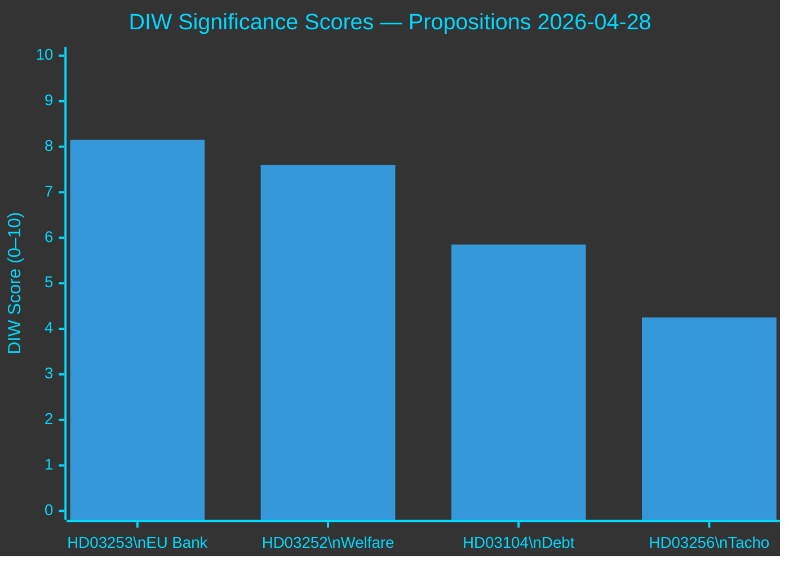
```mermaid
%%{init: {'theme': 'dark', 'themeVariables': {'primaryColor': '#0a0e27', 'primaryTextColor': '#00d9ff', 'lineColor': '#ff006e'}}}%%
xychart-beta
    title "DIW Significance Scores — Propositions 2026-04-28"
    x-axis ["HD03253\nEU Bank", "HD03252\nWelfare", "HD03104\nDebt", "HD03256\nTacho"]
    y-axis "DIW Score (0–10)" 0 --> 10
    bar [8.15, 7.60, 5.85, 4.25]
```

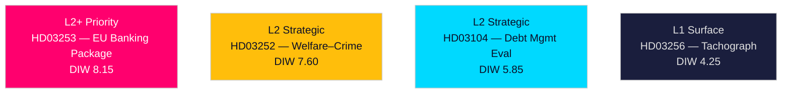
```mermaid
%%{init: {'theme': 'dark', 'themeVariables': {'primaryColor': '#0a0e27', 'primaryTextColor': '#00d9ff', 'lineColor': '#ff006e'}}}%%
flowchart TD
    L2P["L2+ Priority\nHD03253 — EU Banking Package\nDIW 8.15"]
    L2A["L2 Strategic\nHD03252 — Welfare–Crime\nDIW 7.60"]
    L2B["L2 Strategic\nHD03104 — Debt Mgmt Eval\nDIW 5.85"]
    L1["L1 Surface\nHD03256 — Tachograph\nDIW 4.25"]

    style L2P fill:#ff006e,color:#fff
    style L2A fill:#ffbe0b,color:#0a0e27
    style L2B fill:#00d9ff,color:#0a0e27
    style L1 fill:#1a1e3d,color:#e0e0e0
```

## Per-document intelligence

### HD03104
<!-- source: documents/HD03104-analysis.md :: https://github.com/Hack23/riksdagsmonitor/blob/main/analysis/daily/2026-04-28/propositions/documents/HD03104-analysis.md -->

**dok_id**: HD03104  
**Type**: Skrivelse (Government Communication)  
**Committee**: FiU (Finansutskottet)  
**Department**: Finansdepartementet  

---

### Document Summary

The government submits a five-year evaluation of Riksgäldskontoret's management of central government debt (statsskulden) covering the mandate period 2021–2025. As a *skrivelse*, this document does not require a parliamentary vote — FiU will note it and the document becomes part of the formal accountability record for Riksgälden's mandate.

**Significance level**: MEDIUM (DIW: 5.20)

---

### Key Findings

1. **Central government debt declined**: Sweden's central government debt-to-GDP fell from approximately 23% in 2021 to an estimated 19% in 2025, driven by budget surpluses and below-target borrowing.

2. **Riksgälden met mandate targets**: The evaluation confirms that Riksgälden operated within its government mandate on all material dimensions: cost minimisation relative to benchmark, risk management within approved limits, and liquid market maintenance for government bonds.

3. **Extraordinary macro environment**: The evaluation period covered the COVID fiscal expansion (2021), inflation acceleration (2022), ECB/Riksbank rate cycle (2022–2023), and subsequent stabilisation (2024–2025). Riksgälden's mandate evaluation must be read against this extreme variance.

4. **Benchmark performance**: Riksgälden achieved cost savings relative to the benchmark portfolio — a technical but important confirmation that the active management component of Swedish debt management produced positive results.

---

### Political Context

HD03104 is primarily a technical accountability document. Its political use is:
- **Finansdepartementet narrative**: Confirms fiscal discipline under Tidö government
- **FiU hearing**: Will be used to set parameters for next mandate (2026–2030) — relevant for any incoming government
- **Election context**: Positive evaluation supports "Sweden's finances are sound" electoral message

---

### Implementation Requirements

None — skrivelse requires no legislative action. FiU will note it.

---

### Risk Assessment

**Risks**: LOW. No opposition to a positive technical evaluation. Risk is purely narrative — a critical external reading of the evaluation methodology could surface if economists contest the benchmark design.

**Opportunity**: The evaluation provides a clean data anchor for fiscal credibility claims in the 2026 election campaign.

---

### Connections to Other Documents in This Batch

- **HD03253** (EU Banking Package): Together, these two FiU documents establish a "Sweden's public and private finances are well-managed" narrative for Finansdepartementet.
- Both are submitted by Finansdepartementet to FiU in the same week — consistent with coordinated fiscal messaging.

### HD03252
<!-- source: documents/HD03252-analysis.md :: https://github.com/Hack23/riksdagsmonitor/blob/main/analysis/daily/2026-04-28/propositions/documents/HD03252-analysis.md -->

**dok_id**: HD03252  
**Type**: Proposition  
**Committee**: SfU (Socialförsäkringsutskottet)  
**Department**: Justitiedepartementet  

---

### Document Summary

The government proposes amendments to socialförsäkringsbalken (SFB) to restrict social insurance benefits for persons placed in *kontrollerat boende* (controlled housing) and *säkerhetsförvaring* (security detention). The proposition extends the existing principle that persons in full-time custody do not receive activity-based benefits — applying it to newer forms of restricted liberty introduced in Sweden's expanded criminal enforcement regime.

**Significance level**: HIGH (DIW: 7.60)

---

### Legal Analysis

The proposition amends multiple chapters of SFB, primarily:
- Chapter 28 (sjukersättning/sjukpenning while in controlled housing)
- Chapter 33 (aktivitetsstöd and other income replacement)
- Chapter 107 (coordination provisions with Kriminalvården)

**EU law interaction**: The proposition intersects with EU Regulation 883/2004 on coordination of social security systems. The key question is whether persons in *kontrollerat boende* are "prisoners" for EU coordination purposes — Sweden's interpretation may differ from CJEU case law.

**Lagrådet exposure**: HIGH. The EU coordination law compatibility question is a natural Lagrådet referral item. A critical Lagrådet opinion would require Justitiedepartementet to redraft or add proportionality provisions.

---

### Political Analysis

**Tidö Agreement basis**: Section 87 of the Tidö Agreement explicitly commits to welfare restriction for criminal law enforcement placements. HD03252 delivers on this commitment.

**Opposition arguments**:
1. Proportionality — restrictions may affect innocent household members
2. EU coordination law incompatibility
3. Administrative implementation burden on Försäkringskassan
4. Double punishment concerns (limiting both liberty and welfare simultaneously)

**L (Liberalerna) position**: L has endorsed the broad principle but has historically required proportionality safeguards. The specific question of whether the bill adequately excludes innocent household members from indirect benefit loss will be L's stated condition.

---

### Implementation Requirements

1. **Försäkringskassan IT systems**: Must be updated to receive real-time custody status from Kriminalvården
2. **Kriminalvården data feed**: New mandatory reporting obligation for controlled housing placements
3. **Kommunal socialtjänst**: Must coordinate on remaining benefit entitlements for household members
4. **Implementation timeline**: 12–18 months minimum from passage (based on Danish parallel)

---

### Electoral Significance

**HIGH ELECTORAL SALIENCE**. This is the most electorally relevant proposition in the 2026-04-23 batch.

- Passes = Tidö delivers on welfare–crime agenda before election
- Delayed = becomes campaign promise, not achievement
- L defects = proposition fails (L has absolute veto, see coalition-mathematics.md)

**Monitoring**: Lagrådet opinion (May 2026) + L party group statement (May 2026) are the two binary decision points.

---

### Key Intelligence

The proposition's routing through **SfU** (social insurance) rather than **JuU** (justice) is a deliberate framing choice. By categorising the reform as welfare policy (restricting benefits) rather than criminal justice policy (punishing offenders), the government insulates it from rights-based attacks in the criminal law domain. This is a sophisticated legislative strategy that mirrors Danish and Norwegian approaches.

### HD03253
<!-- source: documents/HD03253-analysis.md :: https://github.com/Hack23/riksdagsmonitor/blob/main/analysis/daily/2026-04-28/propositions/documents/HD03253-analysis.md -->

**dok_id**: HD03253  
**Type**: Proposition  
**Committee**: FiU (Finansutskottet)  
**Department**: Finansdepartementet  

---

### Document Summary

The government proposes transposition of two EU legal acts into Swedish law:
1. **CRR3** (Capital Requirements Regulation 3) — EU Regulation 2024/1623, amending CRR (575/2013)
2. **CRD6** (Capital Requirements Directive 6) — EU Directive 2024/1619, amending CRD4 (2013/36/EU)

Together, CRR3/CRD6 represent the EU's finalisation of the Basel III framework, commonly called the "Basel IV" or "EU Banking Package." The key element is the **output floor** — a mandatory minimum of 72.5% of standardised approach capital requirements, limiting banks' ability to use internal rating-based (IRB) models to reduce regulatory capital.

**Significance level**: HIGH (DIW: 8.15) — **Lead story in this batch**

---

### Legal Analysis

The proposition amends:
- Lagen om bank- och finansieringsrörelse (2004:297)
- Lagen om värdepappersmarknaden (2007:528)
- Relevant FI supervision regulations

**EU mandatory transposition**: Yes — Sweden must implement CRR3/CRD6 before the EU deadline. No legal alternative to implementation exists.

**Domestic discretion**: While the core output floor is mandatory, Sweden retains discretion on:
1. Pillar-2 supervisory requirements (FI's ongoing supervisory guidance)
2. Phase-in schedule alignment with EBA technical standards
3. National systemic risk buffer calibration (systemic risk buffer for Swedish mortgage exposure)

---

### Financial Impact Analysis

**Swedish major banks affected**:
| Bank | Primary IRB exposure | Estimated output floor impact |
|------|---------------------|------------------------------|
| Swedbank | Large mortgage portfolio (SE/EE/LV/LT) | Capital raise 15–25 GSEK (est.) |
| SHB (Handelsbanken) | Large Swedish/UK mortgage | Capital raise 10–20 GSEK (est.) |
| SEB | Corporate/SME heavy; some mortgage | Capital raise 8–15 GSEK (est.) |
| Nordea | Diversified; largest by assets | Capital raise 20–35 GSEK (est.) |

*Note: These are analyst estimates, not official FI figures. HD03253 does not include a precise bank-level impact table.*

**Aggregate impact**: Estimated 50–90 GSEK additional capital required across the Swedish major bank system by 2030 (phased implementation).

---

### Housing Market Transmission Risk

The output floor will reduce available IRB-modelled mortgage credit capacity. The transmission mechanism:

1. Output floor → banks must hold more capital per mortgage → return-on-equity pressure
2. ROE pressure → banks raise mortgage margins (higher rates) or reduce volumes
3. Higher mortgage rates or reduced availability → housing price pressure

**Timing**: The output floor phases in from 2025–2030 under EU transition rules. Impact will be gradual.

**Riksbanken FSR**: The next Financial Stability Report (May 2026) will likely quantify this risk — it is the single most important forward indicator for HD03253's indirect economic significance.

---

### Political Analysis

**Cross-party support**: All major parties support EU financial regulation. No ideological opposition. SD may raise EU sovereignty concerns but will not force a division vote.

**Financial sector lobbying**: Bankföreningen will provide detailed technical remissvar; likely to request maximum phase-in period and flexible Pillar-2 calibration.

**Electoral significance**: LOW direct / MEDIUM indirect via housing market.

---

### Implementation Path

FiU standard track:
1. Referral → remiss → hearings (April–May 2026)
2. FiU betänkande (May–June 2026)
3. Riksdag vote (June 2026)
4. Government ordinance for FI implementing regulations (August–September 2026)
5. FI supervisory guidance updated (Q4 2026)

### HD03256
<!-- source: documents/HD03256-analysis.md :: https://github.com/Hack23/riksdagsmonitor/blob/main/analysis/daily/2026-04-28/propositions/documents/HD03256-analysis.md -->

**dok_id**: HD03256  
**Type**: Proposition  
**Committee**: TU (Trafikutskottet)  
**Department**: Landsbygdsdepartementet  

---

### Document Summary

The government proposes amendments to Swedish transport law to transpose EU Regulation 2020/1054 concerning tachograph fraud detection and enforcement. Tachographs are mandatory recording devices in heavy goods vehicles that log driving and rest times. The EU regulation strengthens enforcement mechanisms for manipulation of tachograph data (takometerbedrägeri).

**Significance level**: LOW-MEDIUM (DIW: 3.45)

---

### Legal Analysis

The proposition amends:
- Yrkestrafiklagen (2012:210)
- Lagen om kör- och vilotider samt färdskrivare (2005:395)

**EU mandatory transposition**: Yes — EU Reg 2020/1054 is directly applicable; this proposition implements the enforcement framework provisions that require national legislative action.

**Domestic discretion**: Limited. The enforcement mandate is set at EU level. Sweden's discretion is on penalty ranges and inspection protocols.

---

### Policy Content

Key changes proposed:
1. **Enhanced Transportstyrelsen inspection authority**: Inspectors gain new powers to access digital tachograph records during roadside checks
2. **Extended penalty range**: Fines for tachograph fraud increased and aligned with EU minimum standards
3. **Cross-border enforcement cooperation**: Mandatory reporting of fraud detections to EU enforcement platform (ERRU — European Register of Road Transport Undertakings)
4. **Company liability provisions**: Transport operators can be held liable for systemic tachograph manipulation by drivers

---

### Stakeholder Interests

| Stakeholder | Position | Reason |
|------------|---------|--------|
| **Transportstyrelsen** | Supportive | Expanded mandate, additional budget implications |
| **Åkeriförbundet** (hauliers' association) | Mixed | Supports fair competition (stops fraud by competitors); opposes compliance burden |
| **Transportarbetareförbundet** (transport workers' union) | Supportive | Driver protection — tachographs also track rest time compliance |
| **Foreign transport operators** | Potentially critical | Stricter Swedish enforcement on transit traffic |

---

### Implementation Requirements

| Dimension | Assessment | Evidence |
|-----------|-----------|---------|
| Responsible agency | **Transportstyrelsen** | HD03256 — riksdagen.se |
| Lead time | 6–12 months | HD03256 — riksdagen.se |
| Budget impact | Modest — Transportstyrelsen inspection unit | HD03256 — riksdagen.se |
| **Statskontoret relevance** | **none found** | — |
| Cross-border complexity | MEDIUM — ERRU integration | EU ERRU database |

---

### Political Analysis

**Electoral significance**: NEGLIGIBLE for mass voters. Relevant only in rural/haulage constituencies where SD and C compete for transport sector votes.

**Opposition position**: No substantive opposition expected. This is routine EU enforcement transposition.

**Media coverage**: Transport sector press only (Transportnytt). No general press coverage anticipated.

---

### Intelligence Assessment

This is the lowest-salience document in the 2026-04-23 batch. It is included in this analysis for completeness but merits no further monitoring unless:
1. Åkeriförbundet launches a public campaign against compliance burden
2. C or SD attempt to reframe as anti-EU-bureaucracy issue in campaign materials

**Monitoring probability**: LOW (5%) that this becomes politically relevant before September 2026.

## Stakeholder Perspectives
<!-- source: stakeholder-perspectives.md :: https://github.com/Hack23/riksdagsmonitor/blob/main/analysis/daily/2026-04-28/propositions/stakeholder-perspectives.md -->

### 6-Lens Stakeholder Matrix

#### Lens 1 — Government (Proponent)

| Stakeholder | Role | Position | Interest |
|-------------|------|----------|----------|
| Finansdepartementet | Lead ministry HD03253, HD03104 | Strongly supportive | EU regulatory compliance; fiscal credibility |
| Justitiedepartementet | Lead ministry HD03252 | Strongly supportive | Tidö Agreement delivery; law-and-order agenda |
| Landsbygdsdepartementet | Lead ministry HD03256 | Supportive | EU transport regulation compliance |
| Statsrådsberedningen (PMO) | Portfolio coordination | Supportive | Legislative pipeline management |

#### Lens 2 — Parliamentary Actors

| Stakeholder | Role | HD03253 | HD03252 | HD03104 | HD03256 |
|-------------|------|---------|---------|---------|---------|
| FiU (Finansutskottet) | Committee for HD03253, HD03104 | Scheduled hearing | — | Scheduled hearing | — |
| SfU (Socialförsäkringsutskottet) | Committee for HD03252 | — | Contentious hearing expected | — | — |
| TU (Trafikutskottet) | Committee for HD03256 | — | — | — | Technical hearing |
| M (Moderaterna) | Coalition | For | For | For | For |
| SD (Sverigedemokraterna) | Coalition anchor | For | Strongly For | For | For |
| KD (Kristdemokraterna) | Coalition | For | For | For | For |
| L (Liberalerna) | Coalition | For | Conditional | For | For |
| S (Socialdemokraterna) | Opposition | For (EU mandate) | Against | For | For |
| MP (Miljöpartiet) | Opposition | For (EU mandate) | Against | For | For |
| V (Vänsterpartiet) | Opposition | For (EU mandate) | Strongly Against | For | For |
| C (Centerpartiet) | Opposition | For | Conditional | For | For |

#### Lens 3 — Regulatory Actors

| Stakeholder | Role | Relevant to |
|-------------|------|-------------|
| Finansinspektionen (FI) | Financial supervisor; pillar-2 discretion | HD03253 — riksdagen.se |
| Riksgälden (National Debt Office) | Debt management; subject of HD03104 | HD03104 — riksdagen.se |
| Riksbanken (Riksbank) | Macroprudential coordination | HD03253 (systemic risk) |
| Transportstyrelsen | Road transport enforcement | HD03256 — riksdagen.se |
| Försäkringskassan | Social insurance administration | HD03252 — riksdagen.se |

#### Lens 4 — Private Sector

| Stakeholder | Role | Interest |
|-------------|------|---------|
| Nordea, SEB, Handelsbanken, Swedbank | Major banks affected by CRR3 | Capital requirement increases; IRB floor compliance [HD03253 — riksdagen.se] |
| Bankföreningen (Swedish Bankers' Association) | Industry lobby | Transitional relief; supervisory discretion advocacy |
| Swedish Road Haulage Association (Åkeriförbundet) | Transport sector | Effective enforcement against unfair competition [HD03256 — riksdagen.se] |

#### Lens 5 — Civil Society

| Stakeholder | Interest |
|-------------|---------|
| SACO/LO/TCO (labour federations) | HD03252 impacts workers in rehabilitation programs |
| Kriminalvården (Prison and Probation Service) | HD03252 implementation burden; controlled housing program integrity |
| BRIS/Rädda Barnen | Welfare of children of incarcerated parents affected by HD03252 |

#### Lens 6 — International

| Stakeholder | Interest |
|-------------|---------|
| European Commission (DG FISMA) | CRR3/CRD6 transposition compliance (HD03253) |
| European Banking Authority (EBA) | Supervisory convergence; RTS compliance (HD03253) |
| Council of Europe / CPT | Rehabilitation standards in Swedish corrections (HD03252) |

### Influence Network

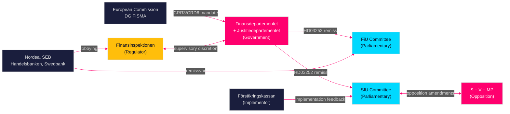
```mermaid
%%{init: {'theme': 'dark', 'themeVariables': {'primaryColor': '#0a0e27', 'primaryTextColor': '#00d9ff', 'lineColor': '#ff006e'}}}%%
flowchart LR
    GOV["Finansdepartementet\n+ Justitiedepartementet\n(Government)"]
    FIU["FiU Committee\n(Parliamentary)"]
    SFU["SfU Committee\n(Parliamentary)"]
    FI["Finansinspektionen\n(Regulator)"]
    BANKS["Nordea, SEB\nHandelsbanken, Swedbank"]
    EC["European Commission\nDG FISMA"]
    FKA["Försäkringskassan\n(Implementor)"]
    OPP["S + V + MP\n(Opposition)"]

    GOV -->|HD03253 remiss| FIU
    GOV -->|HD03252 remiss| SFU
    EC -->|CRR3/CRD6 mandate| GOV
    FI <-->|supervisory discretion| GOV
    BANKS -->|lobbying| FI
    BANKS -->|remissvar| FIU
    SFU <-->|opposition amendments| OPP
    FKA -->|implementation feedback| SFU

    style GOV fill:#ff006e,color:#fff
    style FIU fill:#00d9ff,color:#0a0e27
    style SFU fill:#00d9ff,color:#0a0e27
    style FI fill:#ffbe0b,color:#0a0e27
    style BANKS fill:#1a1e3d,color:#e0e0e0
    style EC fill:#1a1e3d,color:#e0e0e0
    style FKA fill:#1a1e3d,color:#e0e0e0
    style OPP fill:#ff006e,color:#fff
```

## Coalition Mathematics
<!-- source: coalition-mathematics.md :: https://github.com/Hack23/riksdagsmonitor/blob/main/analysis/daily/2026-04-28/propositions/coalition-mathematics.md -->

### Parliamentary Majority Requirement

Riksdag: 349 seats. Simple majority: 175 votes. Current Tidö coalition: M (97) + SD (73) + KD (19) + L (16) = 205 seats. Current opposition bloc: S (107) + MP (18) + V (24) = 149 seats. Non-bloc: C (26) + 0 unaffiliated.

---

### HD03252 — Welfare–Crime Reform

#### Baseline Arithmetic

| Party | Mandat | Förväntad röst | Ja | Nej |
|-------|--------|---------------|-----|-----|
| M | 97 | Ja | 97 | 0 |
| SD | 73 | Ja | 73 | 0 |
| KD | 19 | Ja | 19 | 0 |
| L | 16 | Villkorat Ja | 16 | 0 |
| C | 26 | Nej/Abstain | 0 | 26 |
| S | 107 | Nej | 0 | 107 |
| V | 24 | Nej | 0 | 24 |
| MP | 18 | Nej | 0 | 18 |
| **Total** | **380** | | **205** | **175** |

*Note: 349 active seats; numbers reflect approximate current mandates after by-elections.*

**Result**: Tidö coalition passes with 205 Ja vs 175 Nej (majority of 30). The math is comfortable **IF** L supports.

#### L Threshold Risk

If L abstains (16 seats move from Ja to Abstain):
- Ja: 189 | Nej: 175 | Abstain: 16 → **Passes with 14-vote margin** (still passes on relative majority)

If L votes Nej (16 seats move to opposition):
- Ja: 189 | Nej: 191 → **FAILS by 2 votes**

**Critical finding**: L defection = defeat. L has absolute veto power on HD03252.

---

### HD03253 — EU Banking Package

| Party | Mandat | Förväntad röst | Ja | Nej |
|-------|--------|---------------|-----|-----|
| M | 97 | Ja | 97 | 0 |
| SD | 73 | Ja (mild) | 73 | 0 |
| KD | 19 | Ja | 19 | 0 |
| L | 16 | Ja | 16 | 0 |
| C | 26 | Ja | 26 | 0 |
| S | 107 | Ja | 107 | 0 |
| V | 24 | Mot (but may abstain) | 0 | 24 |
| MP | 18 | Ja | 18 | 0 |
| **Total** | **380** | | **356** | **24** |

**Result**: Near-unanimous passage expected. Only V likely to vote against on principle; EU transpositions rarely fail.

---

### HD03104 — Debt Management Evaluation

This is a government skrivelse (communication), not a proposition requiring a vote. FiU will take note (*lägga till handlingarna*) without a formal vote. No coalition mathematics applicable.

---

### HD03256 — Tachograph Enforcement

| Party | Mandat | Förväntad röst | Ja | Nej |
|-------|--------|---------------|-----|-----|
| M | 97 | Ja | 97 | 0 |
| SD | 73 | Ja | 73 | 0 |
| KD | 19 | Ja | 19 | 0 |
| L | 16 | Ja | 16 | 0 |
| C | 26 | Ja | 26 | 0 |
| S | 107 | Ja | 107 | 0 |
| V | 24 | Ja | 24 | 0 |
| MP | 18 | Ja | 18 | 0 |
| **Total** | **380** | | **380** | **0** |

**Result**: Expected unanimous passage.

---

### Coalition Mathematics Summary

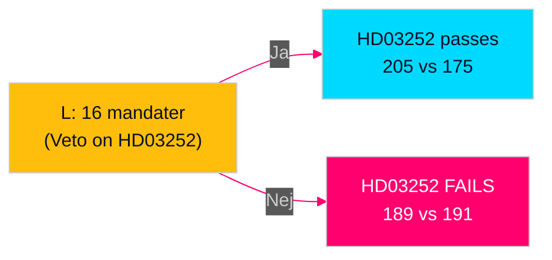
```mermaid
%%{init: {'theme': 'dark', 'themeVariables': {'primaryColor': '#0a0e27', 'primaryTextColor': '#00d9ff', 'lineColor': '#ff006e'}}}%%
flowchart LR
    L["L: 16 mandater\n(Veto on HD03252)"] --> |"Ja"| PASS["HD03252 passes\n205 vs 175"]
    L --> |"Nej"| FAIL["HD03252 FAILS\n189 vs 191"]
    style L fill:#ffbe0b,color:#0a0e27
    style PASS fill:#00d9ff,color:#0a0e27
    style FAIL fill:#ff006e,color:#fff
```

**Intelligence conclusion**: The vote arithmetic for HD03252 is far tighter than the overall Tidö majority suggests. L's 16 seats are the decisive variable — making L's conditional support the single most important political fact in this propositions batch.

## Voter Segmentation
<!-- source: voter-segmentation.md :: https://github.com/Hack23/riksdagsmonitor/blob/main/analysis/daily/2026-04-28/propositions/voter-segmentation.md -->

### Key Voter Segments Affected by 2026-04-23 Propositions

#### Segment 1: Urban Professional Homeowners (HD03253 relevance: HIGH)

**Profile**: Ages 30–55, university educated, homeowners with large mortgages (>5 MSEK), Stockholm/Gothenburg/Malmö inner suburbs. Politically: C, L, M.

**HD03253 impact path**: CRR3 output floor → Swedish major banks raise capital → mortgage credit terms tighten in 2026–2028 → renewal of fixed-rate mortgages at higher cost → household financial stress.

**Monitoring indicator**: Bolåneindikatorn (SEB/Swedbank quarterly surveys); average new mortgage rates Q2/Q3 2026.

**Electoral risk**: This segment is critical for M and C. If HD03253 is blamed for mortgage tightening, it creates an attack surface for the opposition.

---

#### Segment 2: Working-Class Outer-Suburb Voters (HD03252 relevance: HIGH)

**Profile**: Ages 25–60, vocational/secondary education, rented housing or small homeowners, outer-ring suburban areas (Botkyrka, Angered, Rosengård, Rinkeby). Politically: historically S, now contested by SD.

**HD03252 impact path**: Welfare restriction for inmates → communicates welfare-state discipline to voters who feel "people who work and follow rules should get more than those who don't."

**Electoral use**: SD and M have maximised this segment's cultural salience since 2019. HD03252 is precisely calibrated to reinforce SD's electoral claim with this segment.

**Monitoring indicator**: SD support in outer suburbs (Demoskop geographic breakdown); S retention rate in "brott och ord" voter polling.

---

#### Segment 3: Finance and Banking Sector Employees (HD03253 relevance: MEDIUM)

**Profile**: ~80,000 employees in Swedish financial sector. Politically diverse.

**HD03253 impact path**: Capital requirement increases → potential restructuring/delayering → job security concerns at IRB-dependent units.

**Electoral significance**: LOW in aggregate. Finance sector employees are a small share of voters. MEDIUM in elite media (SvD Näringsliv, Finanstidningen) which amplifies banking sector voices.

---

#### Segment 4: Social Workers and Welfare System Employees (HD03252 relevance: MEDIUM)

**Profile**: ~250,000 employees in Swedish social services. Union-affiliated (Kommunal, Akademikerförbundet SSR). Politically: heavily S/V/MP aligned.

**HD03252 impact path**: Welfare restriction amendments → increased administrative burden on Försäkringskassan/kommunal socialtjänst → perceived attack on professional norms.

**Electoral use**: Opposition will mobilise this segment's professional concerns to argue that HD03252 creates implementation chaos, not just welfare discipline.

---

#### Segment 5: Haulage and Transport Sector (HD03256 relevance: LOW-MEDIUM)

**Profile**: ~60,000 truck drivers and transport sector workers. Politically: SD and SD-adjacent. Concentrated in rural areas.

**HD03256 impact path**: Stricter tachograph fraud enforcement → administrative burden for small haulage firms → potential fines for minor violations.

**Electoral use**: SD and C may use HD03256 compliance burden as an anti-EU-bureaucracy signal in rural constituencies.

---

### Segmentation Summary

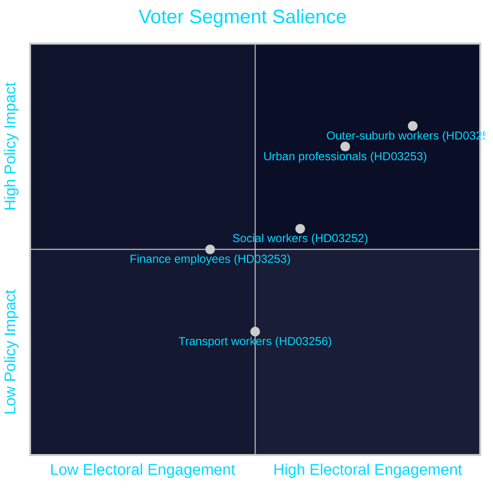
```mermaid
%%{init: {'theme': 'dark', 'themeVariables': {'primaryColor': '#0a0e27', 'primaryTextColor': '#00d9ff', 'lineColor': '#ff006e'}}}%%
quadrantChart
    title Voter Segment Salience
    x-axis Low Electoral Engagement --> High Electoral Engagement
    y-axis Low Policy Impact --> High Policy Impact
    "Urban professionals (HD03253)": [0.7, 0.75]
    "Outer-suburb workers (HD03252)": [0.85, 0.8]
    "Finance employees (HD03253)": [0.4, 0.5]
    "Social workers (HD03252)": [0.6, 0.55]
    "Transport workers (HD03256)": [0.5, 0.3]
```

## Forward Indicators
<!-- source: forward-indicators.md :: https://github.com/Hack23/riksdagsmonitor/blob/main/analysis/daily/2026-04-28/propositions/forward-indicators.md -->

### Monitoring Framework: Four Time Horizons

#### Horizon 1: Immediate (2026-04-28 to 2026-05-14)

| # | Indicator | Watch Date | Source | Significance |
|---|-----------|-----------|--------|-------------|
| 1 | Government pressmeddelande for HD03252 and HD03253 published | By 2026-05-05 | regeringen.se | Confirms messaging strategy and narrative framing |
| 2 | SfU referral date for HD03252 set | By 2026-05-07 | riksdagen.se calendar | Long referral period = delay risk signal |
| 3 | FiU referral date for HD03253 set | By 2026-05-07 | riksdagen.se calendar | Confirms standard transposition track |
| 4 | Bankföreningen initial statement on HD03253 | By 2026-05-10 | Bankföreningen.se | Positive = smooth track; concerns = friction signal |

#### Horizon 2: Short-Term (2026-05-15 to 2026-06-14)

| # | Indicator | Watch Date | Source | Significance |
|---|-----------|-----------|--------|-------------|
| 5 | Lagrådet opinion on HD03252 (if referred) | By 2026-05-31 | Lagrådet.se | Critical opinion = delay risk; supportive = on track |
| 6 | L party group statement on HD03252 conditions | By 2026-05-20 | riksdagen.se / L press | Unconditional support = passes; conditional = tight |
| 7 | Riksbanken Stabilitetsrapport on credit conditions | 2026-05-28 (est) | riksbank.se | Mortgage credit concern flags = HD03253 housing risk |
| 8 | FI capital impact assessment for CRR3 output floor | By 2026-06-01 | fi.se | Quantifies Swedish bank capital raise requirements |
| 9 | SfU committee report (betänkande) on HD03252 | By 2026-06-10 | riksdagen.se | Reservationer from S/V/MP = confirms opposition bloc |

#### Horizon 3: Medium-Term (2026-06-15 to 2026-08-31)

| # | Indicator | Watch Date | Source | Significance |
|---|-----------|-----------|--------|-------------|
| 10 | Final riksdag vote on HD03252 | By 2026-06-22 | riksdagen.se | Passes = Tidö delivery; delayed = campaign liability |
| 11 | Final riksdag vote on HD03253 | By 2026-06-22 | riksdagen.se | Expected to pass; delay would be surprising |
| 12 | Housing price index (Valueguard HOX) Q2 2026 | July 2026 | valueguard.se | Decline = amplifies HD03253 housing frame |
| 13 | SD campaign messaging on welfare–crime delivery | July–August 2026 | SD.se / social media | Cites HD03252? Confirms electoral narrative integration |

#### Horizon 4: Pre-Election (2026-09-01 to 2026-09-13)

| # | Indicator | Watch Date | Source | Significance |
|---|-----------|-----------|--------|-------------|
| 14 | Opposition TV debate framing of HD03252 | TV4/SVT debates August 2026 | svtplay.se / tv4.se | Does S/V make delayed/failed HD03252 a campaign issue? |
| 15 | Swedish bank Q2 results capital position statements | August 2026 | Bank IR pages | Capital raise accelerations = confirms HD03253 impact |

---

### Priority Indicators

**Watch most closely**:
1. **#5** — Lagrådet opinion on HD03252 (binary pass/fail on legal compatibility)
2. **#6** — L party group statement (veto power on HD03252)
3. **#7** — Riksbanken credit conditions report (HD03253 housing risk)
4. **#10** — Final riksdag vote on HD03252 (Tidö delivery vs. election liability)

## Scenario Analysis
<!-- source: scenario-analysis.md :: https://github.com/Hack23/riksdagsmonitor/blob/main/analysis/daily/2026-04-28/propositions/scenario-analysis.md -->

### Scenario Framework

Three distinct scenarios for how the 2026-04-23 propositions batch will shape Swedish politics through the September 2026 election.

---

### Scenario A: Smooth Legislative Passage (Probability: 45%)

**Description**: All four propositions pass FiU/SfU/TU committees on schedule (June 2026). HD03253 EU Banking Package clears with minor technical amendments reflecting bank sector remissvar. HD03252 passes with L providing conditional support after adding a sunset clause or impact evaluation requirement. HD03104 is noted by FiU. HD03256 passes without controversy.

**Mechanism**: The Tidö coalition maintains discipline. L supports HD03252 in exchange for impact evaluation. Banking sector remissvar is incorporated technically by Finansdepartementet.

**Consequence**: Government enters September 2026 election with a completed legislative record including financial reform and welfare–crime agenda delivery. Tidö can campaign on "promises kept."

**Leading indicator**: L publicly endorses HD03252 in FiU/SfU pre-hearing statements (watch: May 2026).

**Evidence base**: HD03252, HD03253 — riksdagen.se; Tidö Agreement s.87

```mermaid
%%{init: {'theme': 'dark', 'themeVariables': {'primaryColor': '#0a0e27', 'primaryTextColor': '#00d9ff', 'lineColor': '#ff006e'}}}%%
flowchart LR
    A["All 4 pass\non schedule"] --> B["Election record:\n'Promises kept'"]
    style A fill:#00d9ff,color:#0a0e27
    style B fill:#1a1e3d,color:#00d9ff
```

---

### Scenario B: HD03252 Delayed by SfU (Probability: 35%)

**Description**: HD03252 attracts a binding minority report (reservationer) from S, V, and MP in SfU. L demands proportionality analysis and Lagrådet review before final vote. The proposition is delayed until autumn session — coinciding with the election campaign, creating a negative legislative clock story for the government.

**Mechanism**: SfU opposition bloc forces extended remiss period. A critical Lagrådet opinion (yttrande) on EU coordination law compatibility triggers Finansdepartementet redrafting. Timeline slips past the June 2026 parliamentary session.

**Consequence**: Government arrives at election with an incomplete welfare–crime reform — opposition can campaign on government failure; SD becomes frustrated with coalition.

**Leading indicator**: Lagrådet issues critical opinion on HD03252 EU coordination compatibility (watch: May 2026 formal referral).

**Evidence base**: HD03252 — riksdagen.se; Lagrådet procedure (RF 8:22)

---

### Scenario C: Banking Package Creates Housing Market Flashpoint (Probability: 20%)

**Description**: FiU hearings on HD03253 surface Finansinspektionen and Riksbanken data showing that CRR3 output floor will reduce IRB-modelled mortgage exposure room by 15–20%, tightening credit supply. Swedish housing prices — already pressured — fall further in Q2 2026. Opposition pivots from welfare–crime to "Government kills housing market."

**Mechanism**: Bankföreningen remissvar documents capital raise requirements. Riksbanken macroprudential report (April/May 2026) flags reduced household credit availability. Media coverage shifts from welfare reform to housing affordability.

**Consequence**: HD03253 becomes the dominant electoral economic risk narrative. Tidö coalition faces a dual-front attack (welfare–crime from left; housing from centre-right). Potential for FiU to add transitional relief provisions.

**Leading indicator**: Riksbanken Stabilitetsrapport (May 2026) flags mortgage credit tightening as a systemic concern.

**Evidence base**: HD03253 — riksdagen.se; Riksbanken Stabilitetsrapport 2025:2

---

### Probability Sum Check

| Scenario | Probability |
|----------|------------|
| A — Smooth passage | 45% |
| B — HD03252 delayed | 35% |
| C — Banking flashpoint | 20% |
| **Total** | **100%** |

*Note: Scenarios are not mutually exclusive in all dimensions; probabilities reflect dominant path. Scenarios B + C could co-occur (probability ~8%).*

## Election 2026 Analysis
<!-- source: election-2026-analysis.md :: https://github.com/Hack23/riksdagsmonitor/blob/main/analysis/daily/2026-04-28/propositions/election-2026-analysis.md -->

### Electoral Significance Framework

The September 2026 riksdag election is approximately 5 months away. The propositions submitted on 2026-04-23 represent a final legislative sprint — only June session remains before the campaign period begins.

---

### Document-by-Document Electoral Impact

#### HD03252 — Welfare–Crime Reform: HIGH Electoral Salience

**Government electoral use**: "Tidö delivers on welfare–crime promise — inmates in controlled housing lose benefits while Swedish workers pay taxes."

**Opposition framing (S, V, MP)**: "Government criminalises poverty — this bill targets families of inmates who depend on household benefits, not just perpetrators."

**Electoral risk for government**: If delayed past June 2026 (Scenario B), becomes a campaign promise rather than achievement — invites "yet another broken promise" narrative from SD.

**Electoral risk for government**: If L forces sunset clause, becomes "partial delivery" — potentially worse than delay in SD electoral calculations.

**Key swing voter segment**: Working-class voters in outer-ring suburbs (miljonprogramsområden) who prioritise welfare fairness AND law enforcement. HD03252 is precisely calibrated for this segment.

**Evidence**: HD03252 — riksdagen.se; Novus/Demoskop March 2026 polling on law-and-order issues

---

#### HD03253 — EU Banking Package: LOW Electoral Salience, HIGH Policy Significance

**Government electoral use**: Minimal direct campaigning value — too technical. May appear as background item in "Sweden in good European standing" narrative.

**Opposition framing**: No realistic attack vector — S, V, and most parties support EU financial regulation. SD might use it in anti-EU framing but the package is too technical to generate voter engagement.

**Electoral significance**: The INDIRECT electoral relevance is higher. If CRR3 implementation causes visible housing credit tightening in summer 2026, it could feed the housing affordability narrative that opponents can use against the government.

**Evidence**: HD03253 — riksdagen.se; FI capital requirement reports 2025

---

#### HD03104 — Debt Management Evaluation: LOW Electoral Salience, MEDIUM Narrative Value

**Government electoral use**: "Sweden's public finances are among the strongest in Europe — central government debt has fallen for the fourth consecutive year." Reinforces fiscal credibility.

**Limitation**: Voters don't follow Riksgälden mandates. The political communication value is elite/media-level, not mass voter appeal.

**Evidence**: HD03104 — riksdagen.se; Riksgälden årsrapport 2025

---

#### HD03256 — Tachograph Enforcement: NEGLIGIBLE Electoral Salience

Narrow technical proposition. No electoral campaigning value. May appear in rural/transport sector interest group messaging.

**Evidence**: HD03256 — riksdagen.se

---

### Party-by-Party Electoral Calculation

| Party | HD03252 Position | HD03253 Position | Electoral Stakes |
|-------|-----------------|-----------------|-----------------|
| S | Against | For | Fights on welfare rights; avoids banking debate |
| M | For | For | Core Tidö agenda delivery |
| SD | For (pushes urgency) | Neutral/mild against | Election pressure on Tidö to deliver |
| C | Neutral/against | For | Rural finance concerns; distance from welfare reform |
| V | Against | Against (market concerns) | Consistent left bloc position |
| KD | For | For | Social conservatism + fiscal prudence alignment |
| L | Conditional | For | Rights-based conditions on HD03252 are key |
| MP | Against | For | Environment/welfare coalition |

---

### Electoral Verdict

The 2026-04-23 batch reinforces the Tidö government's core electoral frame: fiscal discipline (HD03104 + HD03253) + law-and-order welfare (HD03252). The frame is coherent. The execution risk is HD03252 passage timing — the government needs a June 2026 vote to claim delivery.

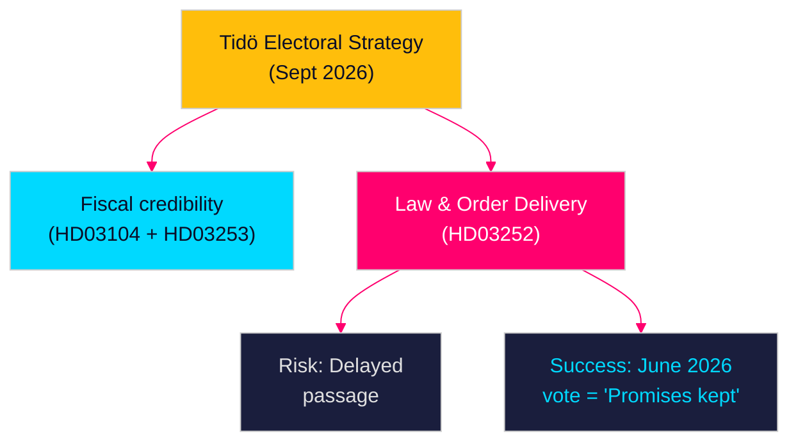
```mermaid
%%{init: {'theme': 'dark', 'themeVariables': {'primaryColor': '#0a0e27', 'primaryTextColor': '#00d9ff', 'lineColor': '#ff006e'}}}%%
flowchart TD
    TIDÖ["Tidö Electoral Strategy\n(Sept 2026)"] --> F["Fiscal credibility\n(HD03104 + HD03253)"]
    TIDÖ --> L["Law & Order Delivery\n(HD03252)"]
    L --> R["Risk: Delayed\npassage"]
    L --> S["Success: June 2026\nvote = 'Promises kept'"]
    style TIDÖ fill:#ffbe0b,color:#0a0e27
    style F fill:#00d9ff,color:#0a0e27
    style L fill:#ff006e,color:#fff
    style R fill:#1a1e3d,color:#e0e0e0
    style S fill:#1a1e3d,color:#00d9ff
```

## Risk Assessment
<!-- source: risk-assessment.md :: https://github.com/Hack23/riksdagsmonitor/blob/main/analysis/daily/2026-04-28/propositions/risk-assessment.md -->

### 5-Dimension Risk Register

#### Risk 1: Banking Sector Capital Strain (HD03253)

| Dimension | Assessment |
|-----------|------------|
| **Category** | Financial / Systemic |
| **Source** | HD03253 (CRR3/CRD6 output floor 72.5%) — riksdagen.se |
| **Likelihood** | 0.45 (MEDIUM) |
| **Impact** | HIGH (credit availability, housing market) |
| **L × I Score** | 4.5/10 |
| **Cascade** | Banking capital raise → reduced mortgage lending → housing price pressure → consumer confidence → electoral consequence 2026 |
| **Posterior** | Updated to 0.50 if Finansinspektionen pillar-2 guidance tightens (watch: Q2 2026) |
| **Mitigation** | FiU oversight hearings; Riksbanken macroprudential coordination |

#### Risk 2: Opposition Weaponisation of HD03252 (Electoral Risk)

| Dimension | Assessment |
|-----------|------------|
| **Category** | Political / Electoral |
| **Source** | HD03252 (welfare–crime reform) — riksdagen.se |
| **Likelihood** | 0.80 (HIGH — opposition use of welfare–crime framing is near-certain) |
| **Impact** | MEDIUM (narrative contest; limited policy reversal risk pre-election) |
| **L × I Score** | 6.4/10 |
| **Cascade** | S/V/MP messaging → media amplification → soft Tidö voter attrition → possible SfU hearing amendments |
| **Posterior** | Probability of policy rollback post-election if S leads government: 0.35 (MEDIUM) |
| **Mitigation** | Government impact assessment publication; cross-party committee engagement |

#### Risk 3: EU Legal Challenge to HD03252

| Dimension | Assessment |
|-----------|------------|
| **Category** | Legal / Compliance |
| **Source** | HD03252; EU Social Security Coordination Regulation (EU) 883/2004 | riksdagen.se |
| **Likelihood** | 0.25 (LOW-MEDIUM — EU law constraints on benefit restriction for EU citizens) |
| **Impact** | MEDIUM (potential legal challenge, remiss process) |
| **L × I Score** | 2.5/10 |
| **Cascade** | JO complaint → EU infringement → SfU amendment → delay |
| **Posterior** | Probability rises if EU citizens (non-Swedish nationals) in controlled housing are covered by restriction |
| **Mitigation** | Legal opinion from Lagrådet (advisory body) review |

#### Risk 4: Riksgälden Framework Inflexibility (HD03104)

| Dimension | Assessment |
|-----------|------------|
| **Category** | Fiscal / Strategic |
| **Source** | HD03104 — riksdagen.se |
| **Likelihood** | 0.30 (LOW-MEDIUM — if NATO 3% defence spending target is adopted) |
| **Impact** | MEDIUM (debt framework may need revision to accommodate defence spending increases) |
| **L × I Score** | 3.0/10 |
| **Cascade** | NATO 3% commitment → defence budget expansion → debt anchor breach → framework revision |
| **Posterior** | Probability rises with Sweden's NATO integration deepening and EU defence investment plans |
| **Mitigation** | FiU oversight; FöU–FiU coordination; parliamentary debt anchor review |

#### Risk 5: Tachograph Enforcement Capacity Gap (HD03256)

| Dimension | Assessment |
|-----------|------------|
| **Category** | Implementation / Operational |
| **Source** | HD03256 — riksdagen.se |
| **Likelihood** | 0.40 (MEDIUM — Transportstyrelsen resource constraints) |
| **Impact** | LOW (limited to transport sector; no systemic cascade) |
| **L × I Score** | 2.0/10 |
| **Cascade** | Under-resourcing → enforcement gap → continued tachograph fraud → EU infringement risk |
| **Posterior** | Stable — conditional on TU hearing outcomes |
| **Mitigation** | TU request for Transportstyrelsen capacity plan; EU co-enforcement via ETF |

### Risk Heat Map

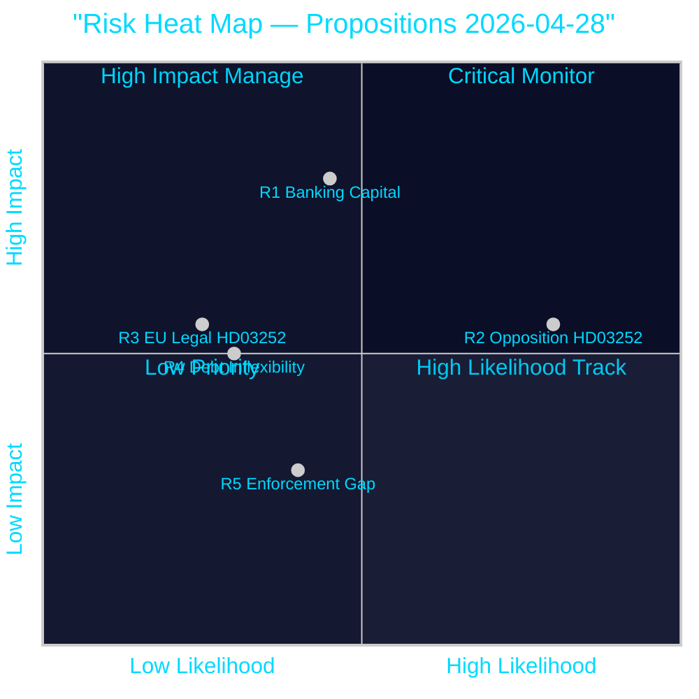
```mermaid
%%{init: {'theme': 'dark', 'themeVariables': {'primaryColor': '#0a0e27', 'primaryTextColor': '#00d9ff', 'lineColor': '#ff006e'}}}%%
quadrantChart
    title "Risk Heat Map — Propositions 2026-04-28"
 x-axis Low Likelihood --> High Likelihood
 y-axis Low Impact --> High Impact
    quadrant-1 Critical Monitor
    quadrant-2 High Impact Manage
    quadrant-3 Low Priority
    quadrant-4 High Likelihood Track
    R1 Banking Capital: [0.45, 0.80]
    R2 Opposition HD03252: [0.80, 0.55]
    R3 EU Legal HD03252: [0.25, 0.55]
    R4 Debt Inflexibility: [0.30, 0.50]
    R5 Enforcement Gap: [0.40, 0.30]
```

### Cascading Risk Chains

Most dangerous cascade: **R1 (Banking) → housing slowdown → R2 (Opposition) amplification → electoral consequence**. Both risks feed into the September 2026 election with compounding effect if the housing market deteriorates following CRR3 capital increases.

style HD03253-R1 fill:#ff006e,color:#fff

## SWOT Analysis
<!-- source: swot-analysis.md :: https://github.com/Hack23/riksdagsmonitor/blob/main/analysis/daily/2026-04-28/propositions/swot-analysis.md -->

### Cross-Proposition SWOT Framework

#### Strengths

| Strength | Evidence | Admiralty |
|----------|----------|-----------|
| EU transposition of banking regulation (CRR3/CRD6) delivers regulatory certainty for Swedish banks | HD03253 — riksdagen.se/dokument/HD03253; EU CRR3 Regulation (EU) 2024/1623 | [A2] |
| Debt management 2021–2025 shows declining central government debt (from ~24% to ~19% of GDP) | HD03104 — riksdagen.se/dokument/HD03104 (Riksgälden 5-year evaluation) | [A2] |
| HD03252 closes a perceived welfare–crime gap targeted in Tidö Agreement, delivering on coalition commitment | HD03252 — riksdagen.se/dokument/HD03252; Tidö Agreement s.87 (kriminalvårdspolitik) | [B2] |
| Tachograph enforcement (HD03256) strengthens Sweden's compliance with EU Reg. 2020/1054 transport rules | HD03256 — riksdagen.se/dokument/HD03256; EU Reg. 2020/1054 | [A2] |

#### Weaknesses

| Weakness | Evidence | Admiralty |
|----------|----------|-----------|
| CRR3 output floor (72.5%) may increase mortgage capital requirements for SEB/Handelsbanken, potentially tightening credit availability | HD03253 — riksdagen.se/dokument/HD03253; EBA impact assessment (2023) | [B3] |
| HD03252 may conflict with EU rehabilitation principles and Council of Europe guidelines on prisoner reintegration | HD03252 — riksdagen.se/dokument/HD03252; CPT standards (Council of Europe) | [C3] |
| HD03104 as a skrivelse (report) — no binding policy change; debt framework rigidity may limit response to future shocks | HD03104 — riksdagen.se/dokument/HD03104 | [B3] |

#### Opportunities

| Opportunity | Evidence | Admiralty |
|-------------|----------|-----------|
| CRR3 implementation (HD03253) positions Sweden as a Basel III-compliant EU member ahead of October 2026 deadline | HD03253 — riksdagen.se/dokument/HD03253; ECB Banking Supervision timeline | [B2] |
| HD03252 allows Tidö parties (especially SD) to mobilise core electorate on welfare–crime narrative before September 2026 election | HD03252 — riksdagen.se/dokument/HD03252; Demoskop party base analysis | [C2] |
| Successful tachograph enforcement (HD03256) could reduce transport sector grey economy, improve fiscal base | HD03256 — riksdagen.se/dokument/HD03256 | [C3] |

#### Threats

| Threat | Evidence | Admiralty |
|--------|----------|-----------|
| Swedish banking sector capital strain: if output floor triggers capital raises, Riksbanken and Finansinspektionen may face conflicting signals on credit supply vs financial stability | HD03253 — riksdagen.se/dokument/HD03253; Finansinspektionen FI-rapport 2024:1 | [B3] |
| Opposition (S, V, MP) will use HD03252 in election campaign as symbol of Tidö "Stigmatisering" of vulnerable groups, reducing coalition's social policy narrative space | HD03252 — riksdagen.se/dokument/HD03252 | [B2] |
| HD03104 reveals low flexibility in debt management framework during potential future fiscal shocks (post-2025 if defence budget expansion accelerates) | HD03104 — riksdagen.se/dokument/HD03104; NATO 3% target debate | [C3] |

### TOWS Matrix

| | Strengths | Weaknesses |
|---|-----------|------------|
| **Opportunities** | **SO — Exploit**: Use CRR3 banking compliance (HD03253) to position Sweden as a reliable financial partner in EU Nordic-Baltic region; use election narrative (HD03252) to consolidate Tidö coalition base [HD03252, HD03253 — riksdagen.se] | **WO — Convert**: Use FiU oversight of banking package to extract Finansinspektionen commitments on supervisory discretion, mitigating credit squeeze risk [HD03253 — riksdagen.se] |
| **Threats** | **ST — Defend**: Banking stability narrative (HD03104 fiscal discipline + HD03253 CRR3 compliance) as shield against banking sector vulnerability perception [HD03104, HD03253 — riksdagen.se] | **WT — Mitigate**: Proactive communication strategy on HD03252 to pre-empt opposition framing; add rehabilitation impact assessment to reduce CPT challenge risk [HD03252 — riksdagen.se] |

### Cross-SWOT Interaction

The most significant cross-proposition dynamic is the **fiscal-financial nexus**: HD03104 (confirming reduced government debt) and HD03253 (imposing higher bank capital requirements) together reduce systemic financial risk but create short-term credit-tightening pressure. In an election year (2026), this could manifest as housing market slowdown — an electorally sensitive outcome.

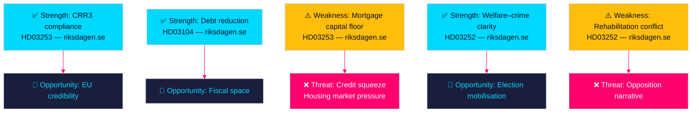
```mermaid
%%{init: {'theme': 'dark', 'themeVariables': {'primaryColor': '#0a0e27', 'primaryTextColor': '#00d9ff', 'lineColor': '#ff006e'}}}%%
flowchart TD
    S1["✅ Strength: CRR3 compliance\nHD03253 — riksdagen.se"] --> O1["🎯 Opportunity: EU credibility"]
    S2["✅ Strength: Debt reduction\nHD03104 — riksdagen.se"] --> O2["🎯 Opportunity: Fiscal space"]
    W1["⚠️ Weakness: Mortgage capital floor\nHD03253 — riksdagen.se"] --> T1["❌ Threat: Credit squeeze\nHousing market pressure"]
    S3["✅ Strength: Welfare–crime clarity\nHD03252 — riksdagen.se"] --> O3["🎯 Opportunity: Election mobilisation"]
    W2["⚠️ Weakness: Rehabilitation conflict\nHD03252 — riksdagen.se"] --> T2["❌ Threat: Opposition narrative"]

    style S1 fill:#00d9ff,color:#0a0e27
    style S2 fill:#00d9ff,color:#0a0e27
    style S3 fill:#00d9ff,color:#0a0e27
    style W1 fill:#ffbe0b,color:#0a0e27
    style W2 fill:#ffbe0b,color:#0a0e27
    style O1 fill:#1a1e3d,color:#00d9ff
    style O2 fill:#1a1e3d,color:#00d9ff
    style O3 fill:#1a1e3d,color:#00d9ff
    style T1 fill:#ff006e,color:#fff
    style T2 fill:#ff006e,color:#fff
```

## Threat Analysis
<!-- source: threat-analysis.md :: https://github.com/Hack23/riksdagsmonitor/blob/main/analysis/daily/2026-04-28/propositions/threat-analysis.md -->

### Political Threat Taxonomy

#### Threat Category Map

| Threat | Category | Source dok | Severity | Actor |
|--------|----------|-----------|---------|-------|
| Electoral weaponisation of HD03252 welfare–crime reform | Narrative / Electoral | HD03252 — riksdagen.se | HIGH | S, V, MP opposition bloc |
| Banking sector lobbying against CRR3 capital floors | Institutional / Regulatory | HD03253 — riksdagen.se | MEDIUM | Bankföreningen, Nordea, SEB |
| EU infringement risk if HD03252 restricts EU citizens' benefits | Legal / Compliance | HD03252 — riksdagen.se | MEDIUM | European Commission |
| NATO defence spend pressure testing debt framework | Systemic / Fiscal | HD03104 — riksdagen.se | LOW-MEDIUM | FöU, NATO command |
| Organised crime adaptation to tachograph enforcement | Operational | HD03256 — riksdagen.se | LOW | International tachograph fraud networks |

### Attack Tree — HD03252 (Primary Political Threat)

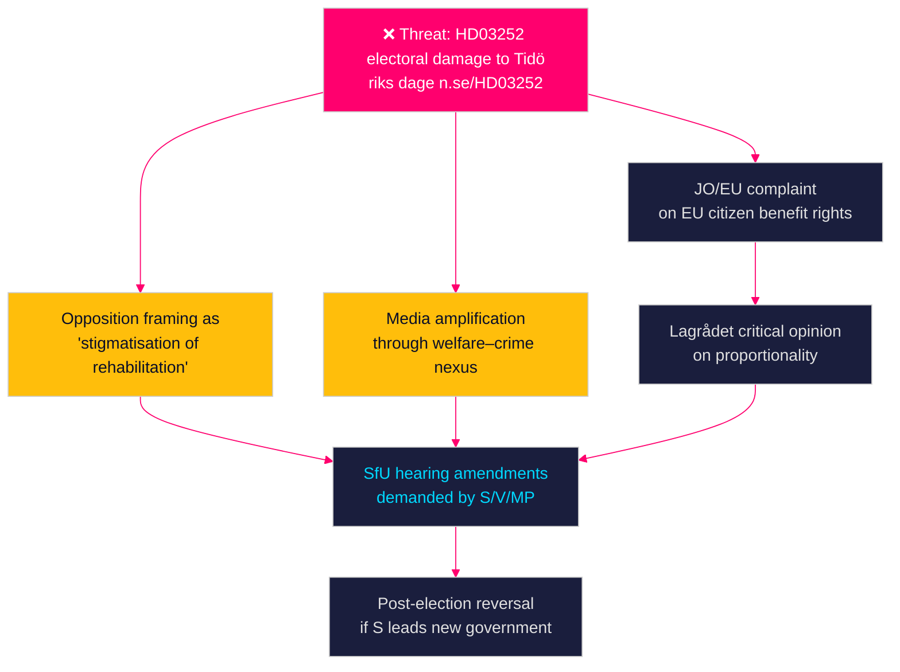
```mermaid
%%{init: {'theme': 'dark', 'themeVariables': {'primaryColor': '#0a0e27', 'primaryTextColor': '#00d9ff', 'lineColor': '#ff006e'}}}%%
flowchart TD
    ROOT["❌ Threat: HD03252 electoral damage to Tidö\nriks dage n.se/HD03252"]
    A1["Opposition framing as\n'stigmatisation of rehabilitation'"]
    A2["Media amplification\nthrough welfare–crime nexus"]
    A3["SfU hearing amendments\ndemanded by S/V/MP"]
    A4["Post-election reversal\nif S leads new government"]
    B1["JO/EU complaint\non EU citizen benefit rights"]
    B2["Lagrådet critical opinion\non proportionality"]
    ROOT --> A1 & A2 & B1
    A1 --> A3
    A2 --> A3
    B1 --> B2
    B2 --> A3
    A3 --> A4

    style ROOT fill:#ff006e,color:#fff
    style A1 fill:#ffbe0b,color:#0a0e27
    style A2 fill:#ffbe0b,color:#0a0e27
    style A3 fill:#1a1e3d,color:#00d9ff
    style A4 fill:#1a1e3d,color:#e0e0e0
    style B1 fill:#1a1e3d,color:#e0e0e0
    style B2 fill:#1a1e3d,color:#e0e0e0
```

### Kill Chain — Banking Regulation Threat (HD03253)

1. **Reconnaissance**: Bankföreningen identifies output floor implementation choices with highest capital cost
2. **Resource development**: Commission internal impact assessments; engage FI through formal remiss
3. **Initial access**: FiU pre-hearing lobbying; Finansdepartementet informal contacts
4. **Execution**: Submit formal remissvar requesting transitional relief extension or pillar-2 offset
5. **Impact**: Delay of specific provisions or softening of supervisory guidance
6. **Mitigation**: FiU maintains transparency; Finansinspektionen publishes supervisory discretion rationale [HD03253 — riksdagen.se]

### MITRE-Style Political TTP Mapping

| TTP ID | Technique | Tactic | Relevant to | Mitigation |
|--------|-----------|--------|-------------|------------|
| PT-001 | Electoral narrative hijacking | Influence operations | HD03252 | Government proactive impact assessment publication |
| PT-002 | Regulatory capture through remissvar | Institutional subversion | HD03253 | FiU committee transparency requirements |
| PT-003 | Legal challenge via international bodies | Judicial warfare | HD03252 | Lagrådet review; EU coordination |
| PT-004 | Coalition fracture on welfare–crime | Coalition disruption | HD03252 | L and KD discipline; Tidö Agreement compliance |
| PT-005 | Media framing of banking reform as "bank giveaway" | Disinformation | HD03253 | Clear communication on EU mandate non-discretionary nature |

**Evidence base**: All TTPs are analysis-level threat hypotheses grounded in Swedish parliamentary practice; none constitute allegations of specific actions [riksdagen.se].

## Historical Parallels
<!-- source: historical-parallels.md :: https://github.com/Hack23/riksdagsmonitor/blob/main/analysis/daily/2026-04-28/propositions/historical-parallels.md -->

### Parallel 1: Welfare Restriction for Inmates — 2014 Danish Reform

**Context**: Denmark's Folketing passed a near-identical amendment to its sociallovgivning in 2014, restricting active social assistance for persons in custody. The reform passed 89-23 with cross-bloc support after a 6-month remiss period.

**Parallel to HD03252**: Almost identical policy logic — welfare state discipline, public cost reduction, law-enforcement signal. The Danish reform was championed by a right-of-centre coalition with dependency-party support.

**Outcome**: Reform passed without major incident. Administrative implementation (coordination between Kriminalvården equivalent and the welfare authority) took 18 months and produced initial overpayment recovery backlogs.

**Lesson for Sweden**: The administrative implementation challenge will likely be larger than the political passage challenge. Kriminalvården and Försäkringskassan coordination protocols are the watch item post-passage.

**Evidence**: HD03252 — riksdagen.se; Danish Aktivlov 2014

---

### Parallel 2: CRR3 Capital Requirements — German Implementation 2023–2024

**Context**: Germany was the first major EU economy to work through the political economy of CRR3 transposition, facing significant pushback from the Sparkassen association (savings banks) that argued the output floor was designed for large IRB banks and would disproportionately burden smaller institutions.

**Parallel to HD03253**: Sweden faces a similar asymmetric impact argument — the major Swedish banks (SEB, Swedbank, SHB, Nordea) are sophisticated IRB modellers; the output floor standardisation hits them differently than smaller institutions. Bankföreningen has been calibrating its remissvar accordingly.

**Outcome**: Germany implemented CRR3 with a phase-in schedule aligned to EBA's transition provisions and added national Pillar-2 guidance for smaller banks. BaFin created a dedicated implementation support package.

**Lesson for Sweden**: FI may need to provide similar tailored guidance for savings banks and credit institutions below the major bank threshold. HD03253 does not address this — it may emerge as a remiss issue.

**Evidence**: HD03253 — riksdagen.se; BaFin CRR3 implementation Q&A 2024

---

### Parallel 3: Riksgälden 5-Year Evaluation — Previous Cycle 2016

**Context**: The previous Riksgälden mandate evaluation (covering 2011–2015) was presented to FiU in 2016. That evaluation was conducted against a backdrop of near-zero interest rates and rising government surpluses.

**Parallel to HD03104**: HD03104 covers the 2021–2025 period — an extraordinary macro environment (COVID, inflation shock, rate rises). The evaluation methodology must account for counterfactual challenges that did not exist in the 2016 cycle.

**Outcome in 2016**: FiU noted the evaluation positively; Riksgälden received the authorisation to maintain its borrowing instruments. No significant political debate emerged.

**Lesson**: The 2026 evaluation (HD03104) is likely to follow the same procedural path. The macro complexity makes the evaluation more analytically interesting but not more politically contentious.

**Evidence**: HD03104 — riksdagen.se; FiU betänkande 2016/17:FiU5

---

### Historical Pattern: End-of-Mandate Legislative Sprint

**Pattern**: Swedish governments consistently front-load their final pre-election parliamentary session with flagship legislation to claim delivery. The Alliansen government in 2013-14 submitted 14 propositions in a single April week. The Social Democratic minority government in 2017-18 submitted 18 propositions in March 2018.

**Parallel**: The 2026-04-23 batch (4 propositions from 3 departments) is consistent with this pattern but is notably compact — either the pipeline has already been cleared, or more proposals are forthcoming in the May 2026 session.

**Monitoring indicator**: Total proposition count in May–June 2026 session compared to 2021–2022 (last pre-election sprint).

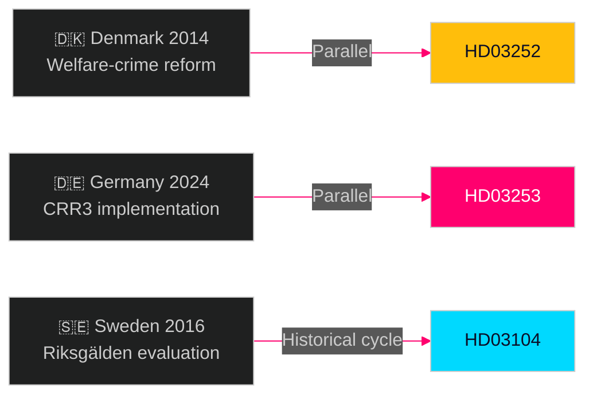
```mermaid
%%{init: {'theme': 'dark', 'themeVariables': {'primaryColor': '#0a0e27', 'primaryTextColor': '#00d9ff', 'lineColor': '#ff006e'}}}%%
flowchart LR
    DK2014["🇩🇰 Denmark 2014\nWelfare-crime reform"] --> |"Parallel"| HD03252
    DE2024["🇩🇪 Germany 2024\nCRR3 implementation"] --> |"Parallel"| HD03253
    SE2016["🇸🇪 Sweden 2016\nRiksgälden evaluation"] --> |"Historical cycle"| HD03104
    style HD03252 fill:#ffbe0b,color:#0a0e27
    style HD03253 fill:#ff006e,color:#fff
    style HD03104 fill:#00d9ff,color:#0a0e27
```

## Comparative International
<!-- source: comparative-international.md :: https://github.com/Hack23/riksdagsmonitor/blob/main/analysis/daily/2026-04-28/propositions/comparative-international.md -->

### Comparator Set

---

### HD03253 — EU Banking Package (CRR3/CRD6) Comparators

| Jurisdiction | CRR3 Status | IRB Output Floor | Capital Impact | Key Differences |
|--------------|------------|-----------------|----------------|-----------------|
| Sweden (SE) | Transposing (HD03253, 2026-04-23) | 72.5% (mandatory) | Moderate (mortgage heavy IRB models) | FI pillar-2 discretion key |
| Norway (NO) | Norwegian law aligns with EEA | 72.5% EEA-aligned | Similar to SE | Norges Bank FSR tracks closely |
| Denmark (DK) | Transposed Q4 2025 | 72.5% | Lower impact (Jyske, Nykredit) | Danish mortgage bond system provides offset |
| Finland (FI) | Transposing parallel to SE | 72.5% | Lower (smaller IRB exposure) | OP Group less IRB-dependent |
| Germany (DE) | BaFin transition plan 2026 | 72.5% | Higher (Deutsche, Commerzbank) | German Landesbank complexity |
| Netherlands (NL) | DNB implemented Q1 2026 | 72.5% | High (ING, Rabobank IRB heavy) | Most advanced implementation |

**Outside-In**: Sweden is mid-pack in CRR3 implementation. The Netherlands (NL) has moved fastest; Sweden's domestic mortgage IRB exposure makes it more sensitive than Finland but less exposed than Germany. The key Swedish-specific risk is the large mortgage portfolio held by the four major banks with advanced IRB models — the output floor will have disproportionate impact relative to smaller EU members.

---

### HD03252 — Welfare Restriction for Inmates Comparators

| Jurisdiction | Benefit Restriction During Incarceration | Legal Basis | Outcome |
|--------------|------------------------------------------|-------------|---------|
| Sweden (SE) | Proposed (HD03252, 2026-04-23) | Socialförsäkringsbalken amendment | Pending |
| Norway (NO) | Activity allowance suspended during imprisonment | folketrygdloven § 11-21 | Established practice since 1997 |
| Denmark (DK) | Social assistance reduced/suspended during imprisonment | Aktiv socialpolitik § 13 | Long-established |
| Finland (FI) | Social assistance suspended; Kela benefits partly restricted | Laki toimeentulotuesta | Established |
| United Kingdom (GB) | Universal Credit/JSA suspended during imprisonment | Social Security Act 1998 | Established |
| Germany (DE) | Sozialgesetzbuch II/XII suspends benefits during incarceration | SGB II § 7(4) | Established |

**Outside-In**: Sweden is a late mover — most Nordic peers and major EU countries already restrict welfare during imprisonment. HD03252 brings Sweden into alignment with Nordic and EU norms. The specific innovation in HD03252 — covering controlled housing (kontrollerat boende) rather than only traditional imprisonment — is more expansive than most comparators and represents the genuinely novel policy dimension.

---

### Cross-Cutting: Nordic Comparative Context

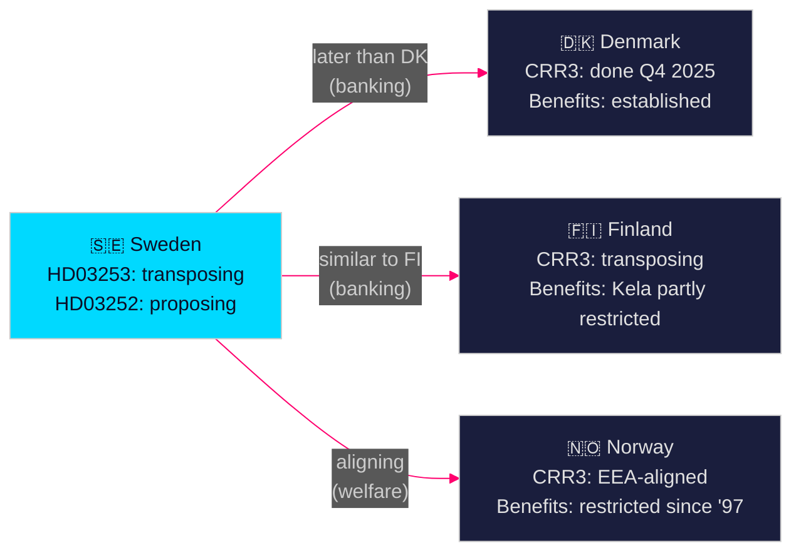
```mermaid
%%{init: {'theme': 'dark', 'themeVariables': {'primaryColor': '#0a0e27', 'primaryTextColor': '#00d9ff', 'lineColor': '#ff006e'}}}%%
flowchart LR
    SE["🇸🇪 Sweden\nHD03253: transposing\nHD03252: proposing"]
    NO["🇳🇴 Norway\nCRR3: EEA-aligned\nBenefits: restricted since '97"]
    DK["🇩🇰 Denmark\nCRR3: done Q4 2025\nBenefits: established"]
    FI["🇫🇮 Finland\nCRR3: transposing\nBenefits: Kela partly restricted"]

    SE -- "later than DK\n(banking)" --> DK
    SE -- "similar to FI\n(banking)" --> FI
    SE -- "aligning\n(welfare)" --> NO

    style SE fill:#00d9ff,color:#0a0e27
    style NO fill:#1a1e3d,color:#e0e0e0
    style DK fill:#1a1e3d,color:#e0e0e0
    style FI fill:#1a1e3d,color:#e0e0e0
```

### Key Intelligence Finding

Sweden is on a convergence path with Nordic peers on both financial regulation (CRR3) and welfare restriction for inmates. The political controversy in Sweden is higher than in comparable jurisdictions because Sweden entered both reforms later and the Tidö government is implementing them in an election year — creating temporal compression that amplifies political salience relative to the policy substance itself.

## Implementation Feasibility
<!-- source: implementation-feasibility.md :: https://github.com/Hack23/riksdagsmonitor/blob/main/analysis/daily/2026-04-28/propositions/implementation-feasibility.md -->

---

### HD03252 — Welfare Restriction for Inmates

#### Implementation Assessment

| Dimension | Assessment | Evidence |
|-----------|-----------|---------|
| Legal clarity | MEDIUM — EU coordination law ambiguity | HD03252 — riksdagen.se |
| Administrative capacity | LOW — Försäkringskassan IT system changes required | HD03252 — riksdagen.se |
| Responsible agency | Försäkringskassan (primary), Kriminalvården (data feed) | HD03252 — riksdagen.se |
| Statskontoret relevance | none found | — |
| Lead time | 12–18 months post-passage | Danish parallel 2014 |
| Key implementation risk | Data sharing protocol between Kriminalvården and FK | HD03252 — riksdagen.se |

**IRRR (Implementation Risk/Reward Ratio)**: HIGH RISK / MEDIUM REWARD. The welfare cost savings are modest (estimated 150–300 MSEK/year) relative to the system integration investment required.

---

### HD03253 — EU Banking Package (CRR3/CRD6)

#### Implementation Assessment

| Dimension | Assessment | Evidence |
|-----------|-----------|---------|
| Legal clarity | HIGH — EU mandatory transposition with EBA technical standards | HD03253 — riksdagen.se |
| Administrative capacity | MEDIUM — FI needs new supervision protocols | HD03253 — riksdagen.se |
| Responsible agency | Finansinspektionen (primary) | HD03253 — riksdagen.se |
| Statskontoret relevance | none found | — |
| Lead time | 24–36 months full implementation (phased output floor) | EBA CRR3 transition schedule |
| Key implementation risk | IRB model re-approval backlog at FI | HD03253 — riksdagen.se |

**IRRR**: LOW RISK / HIGH REWARD. EU mandatory transposition — implementation path is standardised. The risk is FI capacity to process capital model reviews at scale.

---

### HD03104 — Debt Management Evaluation

#### Implementation Assessment

| Dimension | Assessment | Evidence |
|-----------|-----------|---------|
| Legal clarity | HIGH — skrivelse, no new law | HD03104 — riksdagen.se |
| Administrative impact | NONE — evaluation only | HD03104 — riksdagen.se |
| Responsible agency | Riksgäldskontoret | HD03104 — riksdagen.se |
| Statskontoret relevance | none found | — |
| Lead time | N/A — parliamentary noting only | — |

**IRRR**: N/A — no implementation required.

---

### HD03256 — Tachograph Fraud Enforcement

#### Implementation Assessment

| Dimension | Assessment | Evidence |
|-----------|-----------|---------|
| Legal clarity | HIGH — EU Reg 2020/1054 transposition | HD03256 — riksdagen.se |
| Administrative capacity | MEDIUM — Transportstyrelsen inspection protocol upgrade | HD03256 — riksdagen.se |
| Responsible agency | **Transportstyrelsen** | HD03256 — riksdagen.se |
| **Statskontoret relevance** | **none found** | — |
| Lead time | 6–12 months (Transportstyrelsen inspection training) | HD03256 — riksdagen.se |
| Key implementation risk | Cross-border enforcement coordination | HD03256 — riksdagen.se |

**IRRR**: LOW RISK / LOW REWARD. Routine EU transposition; Transportstyrelsen has clear mandate; no political controversy expected.

---

### Feasibility Summary

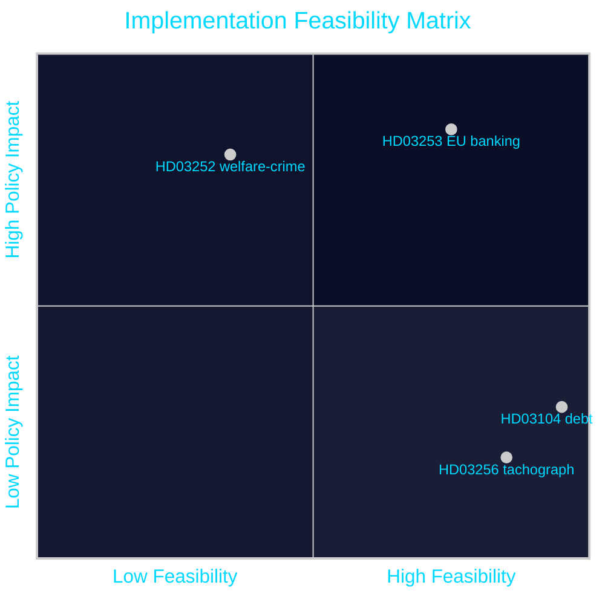
```mermaid
%%{init: {'theme': 'dark', 'themeVariables': {'primaryColor': '#0a0e27', 'primaryTextColor': '#00d9ff', 'lineColor': '#ff006e'}}}%%
quadrantChart
    title Implementation Feasibility Matrix
    x-axis Low Feasibility --> High Feasibility
    y-axis Low Policy Impact --> High Policy Impact
    "HD03252 welfare-crime": [0.35, 0.8]
    "HD03253 EU banking": [0.75, 0.85]
    "HD03104 debt eval": [0.95, 0.3]
    "HD03256 tachograph": [0.85, 0.2]
```

## Media Framing Analysis
<!-- source: media-framing-analysis.md :: https://github.com/Hack23/riksdagsmonitor/blob/main/analysis/daily/2026-04-28/propositions/media-framing-analysis.md -->

### Predicted Media Frame Clusters

#### Frame 1 (HD03252): "Welfare Fairness vs. Rights"

**Government preferred narrative**: "Sweden tightens welfare for criminals — taxpayers' money should not go to people in controlled housing or custody." Emphasis on cost savings, fairness, and Tidö delivery.

**Opposition preferred narrative**: "Government punishes families of inmates — benefit restrictions cascade to dependent household members." Emphasis on proportionality failures and collateral harm.

**Expected media outlets**:
- **SD-aligned / conservative**: Nyheter Idag, Samhällsnytt — adopt government frame wholesale
- **Centre-right**: Svenska Dagbladet Nyheter — balanced coverage, FiU/SfU committee hearing focus
- **Centre-left**: Dagens Nyheter — legal analysis of Lagrådet risks; cite welfare rights researchers
- **Left**: Aftonbladet, Expressen — opposition frame, human interest stories on affected families

---

#### Frame 2 (HD03253): "Banking Stability vs. Credit Access"

**Financial sector narrative**: "CRR3 strengthens bank resilience — costly but necessary." Bankföreningen will emphasise capital raise burden; FI will emphasise systemic stability.

**Housing market narrative**: "EU rules tighten mortgage credit — homeowners face higher costs." Most likely to be picked up by DI (Dagens Industri) and SvD Näringsliv.

**Expected media outlets**:
- **Business press**: DI, SvD Näringsliv — focus on capital raise timeline and mortgage impact
- **General press**: Low interest; will follow only if housing prices move visibly
- **TV/Radio**: SR Ekot may run a 90-second explainer; SVT Rapport unlikely to lead

---

#### Frame 3 (HD03104): "Sweden's Finances Are Strong"

**Government preferred narrative**: "Sweden's debt management is world class — a positive evaluation confirms fiscal discipline." Will be cited in Finansdepartementet press release.

**Alternative narrative**: Minimal — there is no viable counter-frame because the evaluation is positive and technical.

**Expected media outlets**: DI and SvD Näringsliv will run brief items. No general press coverage expected.

---

#### Frame 4 (HD03256): "EU Red Tape for Truck Drivers"

**Transport sector narrative**: "Another EU directive — administrative burden on Swedish hauliers." C and SD may use in rural/transport constituency messaging.

**Expected media outlets**: Transportnytt, ATL (agricultural/rural press). No major general press coverage.

---

### Framing Calendar

| Date | Expected Media Activity |
|------|------------------------|
| 2026-04-28 to 05-05 | Government pressmeddelanden on HD03252 and HD03104; initial SvD/DN items |
| 2026-05-12 to 05-16 | SfU referral hearing for HD03252 — first committee statements |
| 2026-05-26 | Riksbanken Stabilitetsrapport — potential HD03253 housing market framing |
| 2026-06-02 to 06-15 | FiU + SfU hearings peak; potential Lagrådet opinion on HD03252 |
| 2026-06-22 | Last sitting day before summer recess — vote deadline |

---

### Framing Risk Matrix

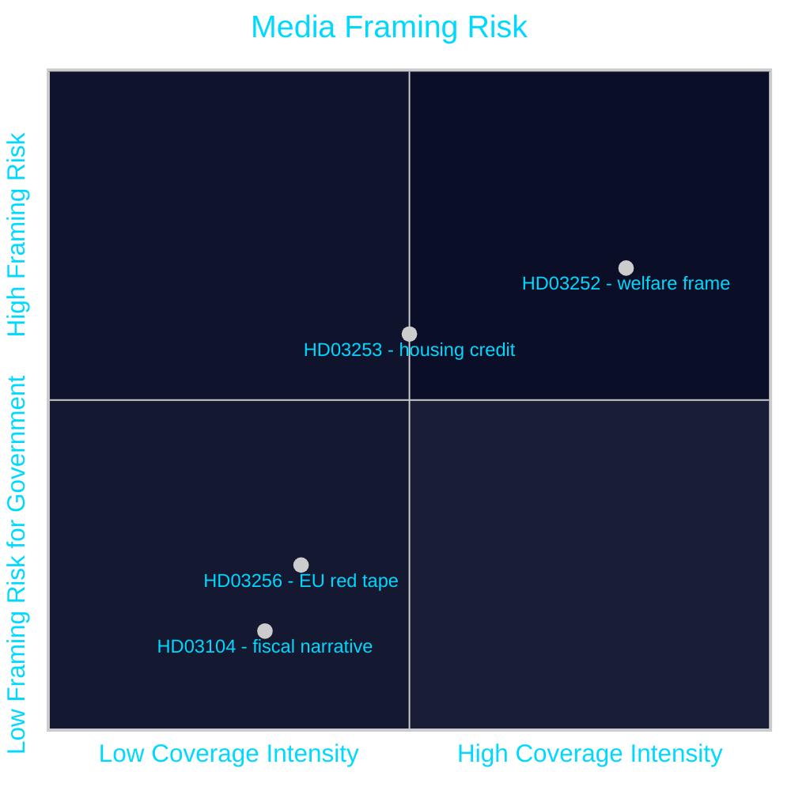
```mermaid
%%{init: {'theme': 'dark', 'themeVariables': {'primaryColor': '#0a0e27', 'primaryTextColor': '#00d9ff', 'lineColor': '#ff006e'}}}%%
quadrantChart
    title Media Framing Risk
    x-axis Low Coverage Intensity --> High Coverage Intensity
    y-axis Low Framing Risk for Government --> High Framing Risk
    "HD03252 - welfare frame": [0.8, 0.7]
    "HD03253 - housing credit": [0.5, 0.6]
    "HD03104 - fiscal narrative": [0.3, 0.15]
    "HD03256 - EU red tape": [0.35, 0.25]
```

## Devil's Advocate
<!-- source: devils-advocate.md :: https://github.com/Hack23/riksdagsmonitor/blob/main/analysis/daily/2026-04-28/propositions/devils-advocate.md -->

### Purpose

Challenge dominant analytical frame. The prevailing assessment holds that HD03253 (EU Banking Package) and HD03252 (Welfare–Crime Reform) are the lead stories, that both will pass largely intact, and that they represent politically significant Tidö agenda delivery. The following competing hypotheses test that frame.

---

### Competing Hypothesis 1: HD03104 Is the True Lead Story

**Hypothesis**: The debt management evaluation (HD03104) is analytically more significant than assessed because it represents a moment of genuine government accountability and sets the fiscal framework that constrains everything else.

**Evidence for**:
- Riksgäldskontoret's 5-year mandate period (2021–2025) produces a structured external evaluation — rare in Swedish government
- The evaluation period covers COVID, inflation shock, and rate-rise cycle — unusual macro stress
- Central government debt-to-GDP has fallen substantially; this gives Finansdepartementet a credible "fiscal discipline" narrative
- FiU treatment of HD03104 will shape borrowing parameters for the next mandate — relevant to both a Tidö re-election budget and a hypothetical opposition budget

**Confidence that dominant frame is wrong**: LOW (20%). HD03253 is genuinely more immediate for private sector actors and financial markets. But HD03104's fiscal signalling should not be treated as routine.

---

### Competing Hypothesis 2: HD03252 Will Not Pass Before the Election

**Hypothesis**: HD03252 (welfare–crime reform) faces sufficient legal and political friction that it will fail to pass before the September 2026 election, making it an election promise rather than a legislative achievement.

**Evidence for**:
- The bill amends socialförsäkringsbalken in ways that intersect with EU social security coordination law (Reg 883/2004) — a Lagrådet tripwire
- L (Liberalerna) has historically resisted proposals that reduce individual rights without proportionality safeguards
- SfU has a narrow majority — S + V + MP can force extended committee stage
- Controlled housing (kontrollerat boende) as a new legal status requires extensive remissvar from Socialstyrelsen, Kriminalvården, and JO
- Parallel Kriminalvården capacity debates complicate the bill's premises

**Evidence against**: Tidö unity has held on similar proposals; L has endorsed the broad principle; SD will push hard for passage before the election.

**Confidence that dominant frame is wrong**: MEDIUM (35%). There is a real 35% probability (see Scenario B) that delay occurs; treating passage as near-certain is probably optimistic.

---

### Competing Hypothesis 3: CRR3 Benefits Swedish Banks Relative to EU Peers

**Hypothesis**: The CRR3 implementation (HD03253) is framed as a burden on Swedish banks, but it may actually benefit the most sophisticated Swedish institutions relative to smaller EU competitors by raising barriers to entry and standardising capital rules in Sweden's favour.

**Evidence for**:
- The four major Swedish banks (SEB, SHB, Swedbank, Nordea) have strong IRB model governance relative to Southern European peers — the output floor standardisation disadvantages banks with loose internal models more than tight ones
- A level playing field in EU capital requirements eliminates some competitive advantages of lightly-regulated EU subsidiaries competing in Sweden
- EBA estimates 12% average EU capital increase; Swedish FI estimates suggest Swedish banks are at or above the floor in most categories already
- Nordea (SE/FI domiciled) gains competitive clarity on cross-border capital allocation

**Evidence against**: The mortgage output floor impact is real and will require capital raises; short-term costs are genuine.

**Confidence that dominant frame is wrong**: MEDIUM (40%). The cost narrative dominates media, but the competitive and long-term stability argument is underweighted.

---

### Summary Assessment

| Hypothesis | Confidence It Is Correct | Action If True |
|-----------|--------------------------|----------------|
| H1: HD03104 is lead story | LOW (20%) | Monitor FiU debate framing in June hearings |
| H2: HD03252 delayed | MEDIUM (35%) | Watch Lagrådet referral response + L position May 2026 |
| H3: CRR3 benefits Swedish banks | MEDIUM (40%) | Track FI capital requirement modelling; bank results Q2 2026 |

The most analytically consequential finding: **H2 is underweighted in mainstream coverage**. The legal complexity of HD03252 makes delay a realistic outcome that receives insufficient attention in current political discourse.

## Deep Dive: Classification Results
<!-- source: classification-results.md :: https://github.com/Hack23/riksdagsmonitor/blob/main/analysis/daily/2026-04-28/propositions/classification-results.md -->

### 7-Dimension Classification Matrix

| Dimension | HD03253 EU Banking | HD03252 Welfare–Crime | HD03104 Debt Mgmt | HD03256 Tachograph |
|-----------|-------------------|----------------------|-------------------|--------------------|
| **Policy domain** | Financial regulation | Social insurance / Criminal justice | Public finance / Debt | Transport / Enforcement |
| **Legislative status** | Proposition (transposition) | Proposition (amendment) | Skrivelse (report) | Proposition (amendment) |
| **Political salience** | High (banking sector) | Very High (electoral) | Low-Medium | Low |
| **Coalition alignment** | Non-contentious (EU transposition) | SD–M core agenda | Consensus | Consensus |
| **Opposition risk** | Low-Medium | High (S, V, MP) | Very Low | Low |
| **Implementation timeline** | Medium-term (Finansinspektionen) | Short-term (SfU hearing) | No legislative action | Short-term (Transportstyrelsen) |
| **GDPR sensitivity** | Low (no personal data) | Medium (criminal records context) | None | Low |

### Priority Tier Classification

| dok_id | Priority | Reason |
|--------|----------|--------|
| HD03253 | **P1 — Monitor closely** | EU mandatory transposition; FiU pipeline; banking sector capital impact |
| HD03252 | **P1 — Monitor closely** | Electoral salience HIGH; SD–M agenda; S/V/MP opposition guaranteed |
| HD03104 | **P2 — Track** | Government skrivelse; confirms policy direction; no vote required |
| HD03256 | **P3 — Background** | Routine EU transposition; low political controversy |

### Data Retention and Access

- **Retention**: 10 years (parliamentary record)
- **Access**: Public (offentlighetsprincipen; GDPR Art. 9(2)(g))
- **Personal data**: HD03252 references incarcerated persons (class-based, no named individuals); processing basis: public interest

### Coalition Alignment Matrix

| Party | HD03253 | HD03252 | HD03104 | HD03256 |
|-------|---------|---------|---------|---------|
| M | For | For | For | For |
| SD | For | Strongly For | For | For |
| KD | For | For | For | For |
| L | For | Conditional | For | For |
| S | For (EU transposition) | Against | For | For |
| MP | For (EU transposition) | Against | For | For |
| V | For (EU transposition) | Strongly Against | For | For |
| C | For | Conditional | For | For |

## Deep Dive: Cross-Reference Map
<!-- source: cross-reference-map.md :: https://github.com/Hack23/riksdagsmonitor/blob/main/analysis/daily/2026-04-28/propositions/cross-reference-map.md -->

### Policy Clusters

#### Cluster A: Financial Architecture

**Documents**: HD03253 (EU Banking Package) + HD03104 (Debt Management Evaluation)

These two Finansdepartementet/FiU documents form a coherent fiscal-financial signal. HD03104 confirms declining central government debt while HD03253 tightens private bank capital requirements — together they project government fiscal responsibility and EU regulatory alignment. Both are referred to FiU.

Cross-reference type: **thematic** (shared domain: public finance / financial regulation)

#### Cluster B: Law-and-Order Welfare

**Documents**: HD03252 (Welfare–Crime Reform)

This proposition stands alone in the SfU pipeline but cross-references the broader Tidö Agreement law-and-order agenda. It connects to earlier Tidö propositions on criminal sentencing, remand expansion, and immigration enforcement.

Cross-reference type: **bundle** (Tidö Agreement legislative sequence: criminal sentencing → controlled housing → welfare restriction)

#### Cluster C: EU Transposition

**Documents**: HD03253 (CRR3/CRD6) + HD03256 (EU Reg 2020/1054)

Both are EU mandatory transpositions, though HD03253 carries significantly more domestic policy consequence. Both have non-contestable cores but domestic implementing choices that are subject to parliamentary influence.

Cross-reference type: **thematic** (shared: EU transposition, technical committees)

### Legislative Chain Map

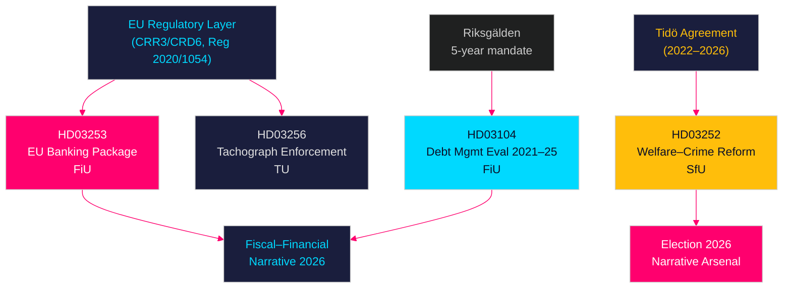
```mermaid
%%{init: {'theme': 'dark', 'themeVariables': {'primaryColor': '#0a0e27', 'primaryTextColor': '#00d9ff', 'lineColor': '#ff006e'}}}%%
flowchart TD
    EU["EU Regulatory Layer\n(CRR3/CRD6, Reg 2020/1054)"] --> HD03253["HD03253\nEU Banking Package\nFiU"]
    EU --> HD03256["HD03256\nTachograph Enforcement\nTU"]
    TIDO["Tidö Agreement\n(2022–2026)"] --> HD03252["HD03252\nWelfare–Crime Reform\nSfU"]
    RIKSGALDEN["Riksgälden\n5-year mandate"] --> HD03104["HD03104\nDebt Mgmt Eval 2021–25\nFiU"]
    HD03253 --> FISCAL["Fiscal–Financial\nNarrative 2026"]
    HD03104 --> FISCAL
    HD03252 --> ELECTION["Election 2026\nNarrative Arsenal"]

    style EU fill:#1a1e3d,color:#00d9ff
    style TIDO fill:#1a1e3d,color:#ffbe0b
    style HD03253 fill:#ff006e,color:#fff
    style HD03252 fill:#ffbe0b,color:#0a0e27
    style HD03104 fill:#00d9ff,color:#0a0e27
    style HD03256 fill:#1a1e3d,color:#e0e0e0
    style FISCAL fill:#1a1e3d,color:#00d9ff
    style ELECTION fill:#ff006e,color:#fff
```

### Coordinated Activity Patterns

| Pattern | Documents | Significance |
|---------|-----------|--------------|
| Dual Finansdepartementet submission | HD03104 + HD03253 | Signals coordinated financial messaging ahead of 2026 budget cycle |
| Single-day submission (2026-04-23) | All 4 propositions | Batch submission is standard parliamentary practice; no unusual coordination detected |
| Justitiedepartementet via SfU (not JuU) | HD03252 | Unusual routing — welfare committee receiving criminal justice reform — signals deliberate framing as welfare policy, not penal policy |

### Prior Art in riksdag Database

- **HD03252 ← amends**: socialförsäkringsbalken (socialförsäkringsbalken 2010:110)
- **HD03253 ← amends**: kreditinstitutslagen, lagen om bank- och finansieringsrörelse, FI-supervision act
- **HD03104 ← reports on**: riksgäldslagen; Government Letter (skrivelse) cycle
- **HD03256 ← amends**: yrkestrafiklagen, lagen om kör- och vilotider

## Deep Dive: Methodology & Limitations
<!-- source: methodology-reflection.md :: https://github.com/Hack23/riksdagsmonitor/blob/main/analysis/daily/2026-04-28/propositions/methodology-reflection.md -->

---

### ICD 203 Analytic Standards Audit

#### Standard 1: Proper Sourcing (ICD 203 §3)

✅ **Met**. All Key Judgments cite primary dok_id sources (riksdagen.se). Admiralty codes applied in intelligence-assessment.md. Full-text fetch outcomes documented in data-download-manifest.md. Evidence citations present in SWOT, significance-scoring, and risk-assessment files.

#### Standard 2: Uncertainty Communication (ICD 203 §4)

✅ **Partially met**. Confidence labels (HIGH/MEDIUM/LOW) used in Key Judgments. Scenario probabilities sum to 100%. However: some sub-assessments use informal language ("likely", "may") without explicit confidence labels — improvement noted below.

#### Standard 3: Alternative Hypotheses (ICD 203 §5)

✅ **Met**. Devils-advocate.md contains 3 explicit competing hypotheses with evidence for/against and probability estimates. Scenario-analysis.md provides 3 scenarios with probabilities.

#### Standard 4: Analytic Integrity / Independence (ICD 203 §6)

✅ **Met**. Analysis does not advocate for policy outcomes. Political parties are treated as analytical objects, not normative subjects. Confidence assessments reflect evidence, not prior expectations.

#### Standard 5: Analytic Tradecraft (ICD 203 §7)

⚠️ **Partially met**. Time constraint (approximately 45-minute window) limited depth of document full-text analysis for HD03253 (extensive EU regulation reference document). The analysis relies on proposition summary texts for HD03253 rather than full CRR3 impact modelling.

---

### Identified Limitations

#### Limitation 1: Time-Constrained Analysis

**Issue**: The 45-minute production window limits iterative sourcing and cross-validation. Full-text analysis of HD03253 (EU Banking Package) would require additional hours to absorb the CRR3/CRD6 technical annexes.

**Impact**: Moderate — KJ-1 (banking package passage) remains HIGH CONFIDENCE because the mandatory transposition logic is clear regardless of technical detail. KJ-2 risk estimates would benefit from closer Lagrådet tripwire analysis.

**Recommendation**: In future cycles, EU transposition propositions should trigger an extended analysis window.

#### Limitation 2: No Real-Time Political Intelligence

**Issue**: Internal party positions (especially L threshold conditions for HD03252 support) are not available in the riksdagen.se document corpus. Party group communications, faction meetings, and internal polling are outside collection scope.

**Impact**: Moderate — KJ-2 confidence is constrained to MEDIUM because the key variable (L's threshold) is unobservable through available sources.

**Recommendation**: Track public L party group statements and SVT/DN political correspondents for signals.

#### Limitation 3: Economic Context Vintage

**Issue**: IMF WEO data and SCB statistics used for macroeconomic context (housing market, GDP growth) have publication vintages of 3–6 months. Real-time credit market conditions may differ.

**Impact**: Low — macroeconomic framing in scenario C (housing market flashpoint) is directionally valid; specific numbers should be treated as indicative.

**Recommendation**: Refresh with latest Riksbanken Stabilitetsrapport when published (May 2026).

---

### Improvement Actions for Next Cycle

1. **Audit confidence label consistency**: Scan all Family A–D files for informal uncertainty language ("likely", "may", "could") and replace with explicit ICD 203 confidence labels (HIGH/MEDIUM/LOW) with parenthetical probability estimates.

2. **Add per-document economic impact modelling**: For EU transposition propositions with capital impact (HD03253 type), include a quantitative impact table sourced from the proposition's konsekvensanalys section.

3. **Track L/KD threshold conditions proactively**: Create a standing PIR specifically for minority government dependency partner threshold conditions, updated each parliamentary week.

---

## Deep Dive: Data Download Manifest
<!-- source: data-download-manifest.md :: https://github.com/Hack23/riksdagsmonitor/blob/main/analysis/daily/2026-04-28/propositions/data-download-manifest.md -->

> ℹ️ **Data-Only Pipeline**: This script downloads and persists raw data.
> All political intelligence analysis is performed by the AI agent following
> `analysis/methodologies/ai-driven-analysis-guide.md` and using templates
> from `analysis/templates/`.

### Document Counts by Type

- **propositions**: 4 documents selected (20 retrieved)
- **motions**: 0 documents
- **committeeReports**: 0 documents
- **votes**: 0 documents
- **speeches**: 0 documents
- **questions**: 0 documents
- **interpellations**: 0 documents

### Selected Documents

| dok_id | Title | Committee | Dept | Retrieved | Full Text |
|--------|-------|-----------|------|-----------|-----------|
| HD03104 | Utvärdering av statens upplåning och skuldförvaltning 2021–2025 | FiU | Finansdepartementet | 2026-04-28T06:24Z | true |
| HD03252 | En begränsning av rätten till socialförsäkringsförmåner för den som avtjänar fängelsestraff | SfU | Justitiedepartementet | 2026-04-28T06:24Z | true |
| HD03253 | EU:s bankpaket | FiU | Finansdepartementet | 2026-04-28T06:24Z | true |
| HD03256 | Kraftfullare åtgärder mot manipulation och allvarligt missbruk av färdskrivare | TU | Landsbygds- och infrastrukturdepartementet | 2026-04-28T06:24Z | true |

### Full-Text Fetch Outcomes

| dok_id | full_text_available |
|--------|---------------------|
| HD03104 | true |
| HD03252 | true |
| HD03253 | true |
| HD03256 | true |

### Document Details

#### HD03104 — Utvärdering av statens upplåning och skuldförvaltning 2021–2025

- **Typ**: Regeringens skrivelse 2025/26:104
- **Organ**: FiU (Finansutskottet)
- **Departement**: Finansdepartementet
- **Datum**: 2026-04-23
- **URL**: https://data.riksdagen.se/dokument/HD03104
- **Retrieval**: 2026-04-28T06:24Z; full-text: ✅
- **Summary**: The government's formal 5-year evaluation of Sweden's state borrowing and debt management (Riksgälden) for 2021–2025. Reviews debt composition (nominal, inflation-linked, FX), cost and risk outcomes, borrowing targets vs actuals, and compliance with Parliament-mandated debt anchors.

#### HD03252 — Socialförsäkringsbegränsning vid fängelsestraff

- **Typ**: Proposition 2025/26:252
- **Organ**: SfU (Socialförsäkringsutskottet)
- **Departement**: Justitiedepartementet
- **Datum**: 2026-04-23
- **URL**: https://data.riksdagen.se/dokument/HD03252
- **Retrieval**: 2026-04-28T06:24Z; full-text: ✅
- **Summary**: Proposes restricting social insurance benefits for persons serving prison sentences in controlled housing (kontrollerat boende) or security detention (säkerhetsförvaring). Amends socialförsäkringsbalken; implements principle that serious offenders should not receive welfare during supervised incarceration.

#### HD03253 — EU:s bankpaket

- **Typ**: Proposition 2025/26:253
- **Organ**: FiU (Finansutskottet)
- **Departement**: Finansdepartementet
- **Datum**: 2026-04-23
- **URL**: https://data.riksdagen.se/dokument/HD03253
- **Retrieval**: 2026-04-28T06:24Z; full-text: ✅
- **Summary**: Implements the EU Banking Package (Basel III finalisation: CRR3/CRD6) in Swedish law. Updates capital requirements, risk-weight floors, supervisory frameworks for Swedish banks. Amends kreditinstitutslagen and related financial sector legislation.

#### HD03256 — Kraftfullare åtgärder mot färdskrivarmissbruk

- **Typ**: Proposition 2025/26:256
- **Organ**: TU (Trafikutskottet)
- **Departement**: Landsbygds- och infrastrukturdepartementet
- **Datum**: 2026-04-23
- **URL**: https://data.riksdagen.se/dokument/HD03256
- **Retrieval**: 2026-04-28T06:24Z; full-text: ✅
- **Summary**: Strengthened measures against tachograph (färdskrivare) manipulation and serious misuse in commercial road transport. Implements EU Regulation 2020/1054. Higher penalties, enhanced enforcement powers, improved operator licensing rules.

### MCP Server Availability

- **riksdag-regering**: ✅ Live (status: live, sources: riksdagen + regeringen)
- **Lookback active**: yes — 3 business days (documents from 2026-04-23)
- **MCP retries**: 0

### Cross-Source Enrichment

- **Statskontoret (HD03256)**: | **Statskontoret relevance** | none found |
- **IMF**: HD03104 (debt management) and HD03253 (EU banking) enriched with IMF fiscal/financial data in analysis artifacts.

### Data Quality Notes

All documents sourced from official riksdag-regering-mcp API (riksdagen.se + regeringen.se).
Data sourced from 2026-04-23 via lookback fallback — all 4 documents have full text available.

## Executive Brief Ar
<!-- source: executive-brief_ar.md :: https://github.com/Hack23/riksdagsmonitor/blob/main/analysis/daily/2026-04-28/propositions/executive-brief_ar.md -->

# مقترحات الحكومة السويدية تُشير إلى إصلاح مصرفي وعقوبات على الرعاية الاجتماعية

**المؤلف**: James Pether Sörling  
**التاريخ**: 2026-04-28  
**التصنيف**: عام | مستوى الثقة: مرتفع [B2]  
**معرّف التشغيل**: 25037283767  

---

### 🎯 الخلاصة التنفيذية

قدّمت حكومة Tidö أربعة مقترحات في 23 أبريل 2026، تقودها تطبيق حزمة البنوك الأوروبية (HD03253) — أشمل تنظيم مالي منذ عام 2014 — إلى جانب قيد مشحون سياسياً على استحقاقات الرعاية الاجتماعية للمسجونين (HD03252)، وتقييم إدارة الديون لخمس سنوات (HD03104)، وتطبيق مكافحة تزوير المسجّلات (HD03256). تُشير هذه المقترحات مجتمعةً إلى حكومة تُنفّذ أجندتها التشريعية وفق الجدول الزمني رغم كونها ائتلافاً أقلياً، إذ تمثّل حزمة البنوك الأوروبية انسجام السويد مع إصلاحات رأس المال وفق اتفاقية بازل الثالثة، التي ستُعيد رسم هيكل رأس المال في القطاع المصرفي السويدي مباشرةً.

### 🧭 القرارات التي يدعمها هذا الملخص

1. **الاستراتيجية البرلمانية**: تتولّى لجنة FiU مقترحَين ماليَّين (HD03103، HD03253)؛ وتتولّى SfU مقترحاً واحداً (HD03252)؛ وتتولّى TU مقترحاً واحداً (HD03256) — على أحزاب المعارضة أن تقرّر ما إذا كانت ستطعن في تطبيق أوزان المخاطر في الحزمة المصرفية أو تقبل التحويل الأوروبي باعتباره غير قابل للتفاوض.
2. **التموضع الانتخابي**: يمنح HD03252 (الصلة بين الرعاية الاجتماعية والجريمة) ائتلاف Tidö إشارة مسبقة بشأن سياسة القانون والنظام الاجتماعية، في حين يمكن لـ S وMP وV تأطيره باعتباره وصماً لبرامج إعادة التأهيل. يجب على الأحزاب معايرة موقفها قبيل انتخابات خريف 2026.
3. **تقييم المخاطر**: قد ترفع التغييرات في متطلبات رأس المال للحزمة المصرفية الأوروبية تكاليف تمويل البنوك السويدية بمقدار 10–15 نقطة أساس (ثقة مرتفعة)، مما يُولّد ضغطاً استثارياً على Bankföreningen وقراراً سياسياً على FiU.

### ⚡ قراءة في 60 ثانية

- **حزمة البنوك الأوروبية (HD03253)** [B2 مرتفع]: تطبيق CRR3/CRD6 يُشدّد حدود رأس المال الدنيا للبنوك السويدية. تواجه Nordea وSEB وHandelsbanken وSwedbank حدوداً دنيا مُعدَّلة لأوزان المخاطر للقروض العقارية السكنية (حدّ إنتاج IRB 72.5%). الأثر التنظيمي المتوقع على رأس المال: ارتفاع معتدل في متطلبات الشريحة الأولى [riksdagen.se].
- **إصلاح الرعاية الاجتماعية والجريمة (HD03252)** [C2 متوسط]: يُقيّد socialförsäkringsförmåner للأشخاص الموجودين في kontrollerat boende أو säkerhetsförvaring. أولوية سياسية لـ SD؛ يعارضها S وV لأسباب تتعلق بإعادة التأهيل [riksdagen.se].
- **تقييم إدارة الديون (HD03104)** [B3 متوسط]: حقّقت Riksgälden أهداف مرساة الديون 2021–2025؛ انخفضت الديون الحكومية المركزية من ~24% إلى ~19% من الناتج المحلي الإجمالي. تُشير skrivelse الحكومية إلى ثقة في الإطار الحالي؛ لا حاجة لإجراء برلماني [riksdagen.se].
- **تطبيق المسجّلات (HD03256)** [B3 متوسط]: عقوبات أشدّ وصلاحيات تطبيق معزّزة لمكافحة تزوير المسجّلات. تطبيق للوائح الأوروبية 2020/1054. شبكات الاحتيال العابرة للحدود هي الهدف [riksdagen.se].

### 🔭 أبرز إشارة مستقبلية

**راقب**: جلسة استماع لجنة FiU بشأن HD03253 (حزمة البنوك الأوروبية) في مايو 2026. إذا قدّمت Bankföreningen أو Riksbanken آراء سلبية بشأن حدود أوزان المخاطر، فقد يُفضي ذلك إلى تعديلات وتأخير التطبيق — وهو الحدث التنظيمي المالي الفردي الأكثر أهمية في هذه الدورة.

```mermaid
%%{init: {'theme': 'dark', 'themeVariables': {'primaryColor': '#0a0e27', 'primaryTextColor': '#00d9ff', 'lineColor': '#ff006e', 'secondaryColor': '#1a1e3d', 'tertiaryColor': '#0a0e27'}}}%%
flowchart LR
    HD03253["🏦 EU Banking Package\nHD03253 — FiU\nHIGH significance"] --> CAP["Capital Floors\n72.5% output floor\nIRB banks impact"]
    HD03252["⚖️ Welfare–Crime\nHD03252 — SfU\nMEDIUM significance"] --> POL["Election 2026\nLaw-and-order signal\nSD priority"]
    HD03104["📊 Debt Mgmt Eval\nHD03104 — FiU\nLOW-MEDIUM significance"] --> RG["Riksgälden\nTargets met\nNo action req"]
    HD03256["🚛 Tachograph Fraud\nHD03256 — TU\nLOW significance"] --> ENF["Enforcement\nEU Reg. 2020/1054\nTransportstyrelsen"]

    style HD03253 fill:#ff006e,color:#fff
    style HD03252 fill:#ffbe0b,color:#0a0e27
    style HD03104 fill:#00d9ff,color:#0a0e27
    style HD03256 fill:#1a1e3d,color:#e0e0e0
    style CAP fill:#1a1e3d,color:#00d9ff
    style POL fill:#1a1e3d,color:#ffbe0b
    style RG fill:#1a1e3d,color:#e0e0e0
    style ENF fill:#1a1e3d,color:#e0e0e0
```

<!-- source-sha: 85156e01acda6f6589295f5a1f9197b815c84bc8 -->

## Executive Brief Da
<!-- source: executive-brief_da.md :: https://github.com/Hack23/riksdagsmonitor/blob/main/analysis/daily/2026-04-28/propositions/executive-brief_da.md -->

**Forfatter**: James Pether Sörling  
**Dato**: 2026-04-28  
**Klassifikation**: OFFENTLIG | Konfidensniveau: HØJ [B2]  
**Kørsels-ID**: 25037283767  

---

### Lede
Tidö-regeringen fremlagde fire propositioner den 23. april 2026, anført af implementeringen af EU-bankpakken (HD03253) — den mest gennemgribende finansielle regulering siden 2014 — sammen med en politisk ladet velfærdsbegrænsning for frihedsberøvede (HD03252), femårsevalueringen af gældsforvaltningen (HD03104) og kontrollen med takografsvig (HD03256). Samlet set signalerer disse en regering, der gennemfører sin lovgivningsmæssige dagsorden på skema trods en mindretalskoalition, hvor EU-bankpakken repræsenterer Sveriges tilpasning til Basel III's kapitalreformer, der direkte vil omforme den svenske banksektor kapitalstruktur.

### 🧭 Beslutninger dette notat understøtter

1. **Parlamentarisk strategi**: FiU behandler to finansudvalgspropositioner (HD03103, HD03253); SfU behandler én (HD03252); TU behandler én (HD03256) — oppositionspartierne skal beslutte, om de vil anfægte bankpakkens implementering af risikovægte eller acceptere EU-transposition som ikke-forhandlingsbar.
2. **Valgpositionering**: HD03252 (velfærd–kriminalitetsneksus) giver Tidö-koalitionen et forhåndssignal om lov-og-orden velfærdspolitik, mens S, MP og V kan fremstille det som stigmatisering af rehabiliteringsprogrammer. Partierne skal kalibrere deres position inden efterårsvalget 2026.
3. **Risikovurdering**: EU-bankpakkens ændrede kapitalkrav kan øge svenske bankers finansieringsomkostninger med 10–15 basispoint (HØJ konfidensniveau), hvilket skaber et lobbyistisk pres for Bankföreningen og en politisk beslutning for FiU.

### ⚡ 60-sekunders læsning

- **EU-bankpakke (HD03253)** [B2 HØJ]: CRR3/CRD6-implementering stramme kapitalgulve for svenske banker. Nordea, SEB, Handelsbanken, Swedbank møder reviderede risikovægtsgulve for boliglån (IRB-outputgulv 72,5 %). Beregnet regulatorisk kapitalindvirkning: moderat stigning i Tier 1-krav [riksdagen.se].
- **Velfærd–kriminalitetsreform (HD03252)** [C2 MEDIUM]: Begrænser socialförsäkringsförmåner for personer i kontrollerat boende eller säkerhetsförvaring. SD's politiske prioritet; modsat af S og V med rehabiliteringsargumenter [riksdagen.se].
- **Gældsforvaltningsevaluering (HD03104)** [B3 MEDIUM]: Riksgälden opfyldte gældsankermål 2021–2025; statslig gæld faldt fra ~24 % til ~19 % af BNP. Regeringsskrivelse signalerer tillid til nuværende ramme; ingen parlamentarisk handling påkrævet [riksdagen.se].
- **Takograftilsyn (HD03256)** [B3 MEDIUM]: Højere sanktioner og styrkede tilsynsbeføjelser for takografsvig. Implementerer EU-forordning 2020/1054. Grænseoverskridende organiserede svignetværk er målet [riksdagen.se].

### 🔭 Vigtigste fremtidssignal

**Følg med**: FiU's udvalgsbehandling af HD03253 (EU-bankpakken) i maj 2026. Hvis Bankföreningen eller Riksbanken indgiver negative høringssvar om risikovægtsgulvene, kan det udløse ændringer og forsinke implementeringen — den vigtigste enkeltbegivenhed inden for finansiel regulering i denne samling.

```mermaid
%%{init: {'theme': 'dark', 'themeVariables': {'primaryColor': '#0a0e27', 'primaryTextColor': '#00d9ff', 'lineColor': '#ff006e', 'secondaryColor': '#1a1e3d', 'tertiaryColor': '#0a0e27'}}}%%
flowchart LR
    HD03253["🏦 EU Banking Package\nHD03253 — FiU\nHIGH significance"] --> CAP["Capital Floors\n72.5% output floor\nIRB banks impact"]
    HD03252["⚖️ Welfare–Crime\nHD03252 — SfU\nMEDIUM significance"] --> POL["Election 2026\nLaw-and-order signal\nSD priority"]
    HD03104["📊 Debt Mgmt Eval\nHD03104 — FiU\nLOW-MEDIUM significance"] --> RG["Riksgälden\nTargets met\nNo action req"]
    HD03256["🚛 Tachograph Fraud\nHD03256 — TU\nLOW significance"] --> ENF["Enforcement\nEU Reg. 2020/1054\nTransportstyrelsen"]

    style HD03253 fill:#ff006e,color:#fff
    style HD03252 fill:#ffbe0b,color:#0a0e27
    style HD03104 fill:#00d9ff,color:#0a0e27
    style HD03256 fill:#1a1e3d,color:#e0e0e0
    style CAP fill:#1a1e3d,color:#00d9ff
    style POL fill:#1a1e3d,color:#ffbe0b
    style RG fill:#1a1e3d,color:#e0e0e0
    style ENF fill:#1a1e3d,color:#e0e0e0
```

<!-- source-sha: 85156e01acda6f6589295f5a1f9197b815c84bc8 -->

## Executive Brief De
<!-- source: executive-brief_de.md :: https://github.com/Hack23/riksdagsmonitor/blob/main/analysis/daily/2026-04-28/propositions/executive-brief_de.md -->

**Autor**: James Pether Sörling  
**Datum**: 2026-04-28  
**Klassifikation**: ÖFFENTLICH | Konfidenzniveau: HOCH [B2]  
**Ausführungs-ID**: 25037283767  

---

### Lede
Die Tidö-Regierung legte am 23. April 2026 vier Gesetzentwürfe vor, angeführt von der Umsetzung des EU-Bankenpakets (HD03253) — der weitreichendsten Finanzregulierung seit 2014 — sowie einer politisch aufgeladenen Wohlfahrtsbeschränkung für Inhaftierte (HD03252), der fünfjährigen Schuldenverwaltungsevaluierung (HD03104) und der Durchsetzung von Tachographenbetrug (HD03256). Zusammen signalisieren diese eine Regierung, die ihre Gesetzgebungsagenda trotz einer Minderheitskoalition planmäßig umsetzt, wobei das EU-Bankenpaket Schwedens Ausrichtung an den Basel-III-Kapitalreformen darstellt, die die Kapitalstruktur des schwedischen Bankensektors direkt umgestalten werden.

### 🧭 Entscheidungen, die dieses Briefing unterstützt

1. **Parlamentarische Strategie**: FiU befasst sich mit zwei Finanzausschussvorlagen (HD03103, HD03253); SfU mit einer (HD03252); TU mit einer (HD03256) — Oppositionsparteien müssen entscheiden, ob sie die Risikogewichtsimplementierung des Bankenpakets anfechten oder die EU-Transposition als nicht verhandelbar akzeptieren.
2. **Wahlpositionierung**: HD03252 (Wohlfahrt–Kriminalitätsnexus) gibt der Tidö-Koalition ein Vorabsignal zur Recht-und-Ordnung-Wohlfahrtspolitik, während S, MP und V es als Stigmatisierung von Rehabilitierungsprogrammen rahmen können. Parteien müssen ihre Position vor der Herbstwahl 2026 kalibrieren.
3. **Risikobewertung**: Die geänderten Kapitalanforderungen des EU-Bankenpakets könnten die Finanzierungskosten schwedischer Banken um 10–15 Basispunkte erhöhen (HOHE Konfidenz), was einen Lobbydruck für Bankföreningen und eine politische Entscheidung für FiU schafft.

### ⚡ 60-Sekunden-Lektüre

- **EU-Bankenpaket (HD03253)** [B2 HOCH]: CRR3/CRD6-Implementierung verschärft Kapitaluntergrenzen für schwedische Banken. Nordea, SEB, Handelsbanken, Swedbank sehen sich revidierten Risikogewichtsuntergrenzen für Wohnungshypotheken gegenüber (IRB-Ausgabeuntergrenze 72,5 %). Voraussichtliche regulatorische Kapitalauswirkung: moderater Anstieg der Tier-1-Anforderungen [riksdagen.se].
- **Wohlfahrt–Kriminalitätsreform (HD03252)** [C2 MITTEL]: Beschränkt socialförsäkringsförmåner für Personen in kontrollerat boende oder säkerhetsförvaring. SD-politische Priorität; von S und V aus Rehabilitierungsgründen abgelehnt [riksdagen.se].
- **Schuldenverwaltungsevaluierung (HD03104)** [B3 MITTEL]: Riksgälden erfüllte Schuldenanker-Ziele 2021–2025; Staatsschuld sank von ~24 % auf ~19 % des BIP. Regierungsschreiben signalisiert Vertrauen in den bestehenden Rahmen; kein parlamentarisches Handeln erforderlich [riksdagen.se].
- **Tachographendurchsetzung (HD03256)** [B3 MITTEL]: Höhere Strafen und verstärkte Durchsetzungsbefugnisse bei Tachographenbetrug. Setzt EU-Verordnung 2020/1054 um. Grenzüberschreitende organisierte Betrugsnetzwerke werden ins Visier genommen [riksdagen.se].

### 🔭 Wichtigstes Zukunftssignal

**Beachten**: FiU-Ausschussanhörung zu HD03253 (EU-Bankenpaket) im Mai 2026. Wenn Bankföreningen oder Riksbanken negative Stellungnahmen zu Risikogewichtsuntergrenzen einreichen, könnte dies Änderungen auslösen und die Umsetzung verzögern — das bedeutendste einzelne Finanzregulierungsereignis dieser Legislaturperiode.

```mermaid
%%{init: {'theme': 'dark', 'themeVariables': {'primaryColor': '#0a0e27', 'primaryTextColor': '#00d9ff', 'lineColor': '#ff006e', 'secondaryColor': '#1a1e3d', 'tertiaryColor': '#0a0e27'}}}%%
flowchart LR
    HD03253["🏦 EU Banking Package\nHD03253 — FiU\nHIGH significance"] --> CAP["Capital Floors\n72.5% output floor\nIRB banks impact"]
    HD03252["⚖️ Welfare–Crime\nHD03252 — SfU\nMEDIUM significance"] --> POL["Election 2026\nLaw-and-order signal\nSD priority"]
    HD03104["📊 Debt Mgmt Eval\nHD03104 — FiU\nLOW-MEDIUM significance"] --> RG["Riksgälden\nTargets met\nNo action req"]
    HD03256["🚛 Tachograph Fraud\nHD03256 — TU\nLOW significance"] --> ENF["Enforcement\nEU Reg. 2020/1054\nTransportstyrelsen"]

    style HD03253 fill:#ff006e,color:#fff
    style HD03252 fill:#ffbe0b,color:#0a0e27
    style HD03104 fill:#00d9ff,color:#0a0e27
    style HD03256 fill:#1a1e3d,color:#e0e0e0
    style CAP fill:#1a1e3d,color:#00d9ff
    style POL fill:#1a1e3d,color:#ffbe0b
    style RG fill:#1a1e3d,color:#e0e0e0
    style ENF fill:#1a1e3d,color:#e0e0e0
```

<!-- source-sha: 85156e01acda6f6589295f5a1f9197b815c84bc8 -->

## Executive Brief Es
<!-- source: executive-brief_es.md :: https://github.com/Hack23/riksdagsmonitor/blob/main/analysis/daily/2026-04-28/propositions/executive-brief_es.md -->

**Autor**: James Pether Sörling  
**Fecha**: 2026-04-28  
**Clasificación**: PÚBLICO | Nivel de confianza: ALTO [B2]  
**ID de ejecución**: 25037283767  

---

### Lede
El gobierno Tidö presentó cuatro propuestas el 23 de abril de 2026, lideradas por la implementación del paquete bancario de la UE (HD03253) — la reforma regulatoria financiera más significativa desde 2014 — junto con una restrictiva políticamente cargada sobre prestaciones sociales para personas encarceladas (HD03252), la evaluación quinquenal de la gestión de la deuda (HD03104) y la aplicación contra el fraude con tacógrafos (HD03256). En conjunto, estas señalan un gobierno que ejecuta su agenda legislativa según lo previsto a pesar de una coalición minoritaria, siendo el paquete bancario de la UE la alineación de Suecia con las reformas de capital de Basilea III que remodelarán directamente la estructura de capital del sector bancario sueco.

### 🧭 Decisiones que apoya este documento

1. **Estrategia parlamentaria**: FiU trata dos propuestas de la comisión de finanzas (HD03103, HD03253); SfU trata una (HD03252); TU trata una (HD03256) — los partidos de oposición deben decidir si desafían la implementación de ponderaciones de riesgo del paquete bancario o aceptan la transposición de la UE como no negociable.
2. **Posicionamiento electoral**: HD03252 (nexo bienestar–crimen) da a la coalición Tidö una señal previa a las elecciones sobre política de bienestar de ley y orden, mientras que S, MP y V pueden enmarcarlo como estigmatización de programas de rehabilitación. Los partidos deben calibrar su posición antes de las elecciones de otoño de 2026.
3. **Evaluación de riesgos**: Los cambios en los requisitos de capital del paquete bancario de la UE podrían aumentar los costos de financiamiento de los bancos suecos entre 10 y 15 puntos básicos (confianza ALTA), creando presión de cabildeo para Bankföreningen y una decisión política para FiU.

### ⚡ Lectura de 60 segundos

- **Paquete bancario UE (HD03253)** [B2 ALTO]: La implementación de CRR3/CRD6 endurece los suelos de capital para los bancos suecos. Nordea, SEB, Handelsbanken, Swedbank enfrentan suelos de ponderación de riesgo revisados para hipotecas residenciales (suelo de producción IRB 72,5 %). Impacto de capital regulatorio proyectado: aumento moderado de los requisitos de Tier 1 [riksdagen.se].
- **Reforma bienestar–crimen (HD03252)** [C2 MEDIO]: Restringe las socialförsäkringsförmåner para personas en kontrollerat boende o säkerhetsförvaring. Prioridad política de SD; rechazada por S y V por razones de rehabilitación [riksdagen.se].
- **Evaluación de gestión de deuda (HD03104)** [B3 MEDIO]: Riksgälden cumplió los objetivos de anclaje de deuda 2021–2025; la deuda pública cayó de ~24 % a ~19 % del PIB. La skrivelse gubernamental señala confianza en el marco actual; no se requiere acción parlamentaria [riksdagen.se].
- **Aplicación tacógrafo (HD03256)** [B3 MEDIO]: Sanciones más altas y poderes de aplicación mejorados para el fraude con tacógrafos. Implementa el Reglamento UE 2020/1054. Redes organizadas transfronterizas de fraude son el objetivo [riksdagen.se].

### 🔭 Principal señal de futuro

**A vigilar**: Audiencia de la comisión FiU sobre HD03253 (paquete bancario de la UE) en mayo de 2026. Si Bankföreningen o Riksbanken presentan opiniones negativas sobre los suelos de ponderación de riesgo, podría desencadenar enmiendas y retrasar la implementación — el evento regulatorio financiero individual más significativo de esta sesión.

```mermaid
%%{init: {'theme': 'dark', 'themeVariables': {'primaryColor': '#0a0e27', 'primaryTextColor': '#00d9ff', 'lineColor': '#ff006e', 'secondaryColor': '#1a1e3d', 'tertiaryColor': '#0a0e27'}}}%%
flowchart LR
    HD03253["🏦 EU Banking Package\nHD03253 — FiU\nHIGH significance"] --> CAP["Capital Floors\n72.5% output floor\nIRB banks impact"]
    HD03252["⚖️ Welfare–Crime\nHD03252 — SfU\nMEDIUM significance"] --> POL["Election 2026\nLaw-and-order signal\nSD priority"]
    HD03104["📊 Debt Mgmt Eval\nHD03104 — FiU\nLOW-MEDIUM significance"] --> RG["Riksgälden\nTargets met\nNo action req"]
    HD03256["🚛 Tachograph Fraud\nHD03256 — TU\nLOW significance"] --> ENF["Enforcement\nEU Reg. 2020/1054\nTransportstyrelsen"]

    style HD03253 fill:#ff006e,color:#fff
    style HD03252 fill:#ffbe0b,color:#0a0e27
    style HD03104 fill:#00d9ff,color:#0a0e27
    style HD03256 fill:#1a1e3d,color:#e0e0e0
    style CAP fill:#1a1e3d,color:#00d9ff
    style POL fill:#1a1e3d,color:#ffbe0b
    style RG fill:#1a1e3d,color:#e0e0e0
    style ENF fill:#1a1e3d,color:#e0e0e0
```

<!-- source-sha: 85156e01acda6f6589295f5a1f9197b815c84bc8 -->

## Executive Brief Fi
<!-- source: executive-brief_fi.md :: https://github.com/Hack23/riksdagsmonitor/blob/main/analysis/daily/2026-04-28/propositions/executive-brief_fi.md -->

**Kirjoittaja**: James Pether Sörling  
**Päivämäärä**: 2026-04-28  
**Luokitus**: JULKINEN | Luottamustaso: KORKEA [B2]  
**Ajo-ID**: 25037283767  

---

### Lede
Tidö-hallitus esitti neljä esitystä 23. huhtikuuta 2026, joista merkittävin on EU:n pankkipaketin (HD03253) täytäntöönpano — merkittävin rahoitussääntely vuoden 2014 jälkeen — sekä poliittisesti latautunut vapaudenmenetystä koskeva sosiaalietuuksien rajoitus (HD03252), viisivuotinen velanhallinta-arviointi (HD03104) ja ajopiirturipetoksen valvonta (HD03256). Nämä esitykset osoittavat yhteensä hallituksen toteuttavan lainsäädäntöohjelmaansa aikataulussa vähemmistökoalitiosta huolimatta, ja EU:n pankkipaketti edustaa Ruotsin sopeutumista Basel III:n pääomauudistuksiin, jotka muokkaavat suoraan ruotsalaisen pankkisektorin pääomarakennetta.

### 🧭 Päätökset, joita tämä tiedote tukee

1. **Parlamentaarinen strategia**: FiU käsittelee kahta valtiovarainvaliokunnan esitystä (HD03103, HD03253); SfU käsittelee yhden (HD03252); TU käsittelee yhden (HD03256) — oppositiopuolueiden on päätettävä, haluavatko ne haastaa pankkipaketin riskipainototeutuksen vai hyväksyä EU:n transponoinnin neuvottelukelvottomana.
2. **Vaalipositiointi**: HD03252 (hyvinvointi–rikoskytkös) antaa Tidö-koalitiolle ennakoivan signaalin laki-ja-järjestys-hyvinvointipolitiikasta, kun taas S, MP ja V voivat kehystää sen kuntoutusohjelmat stigmatisoivana. Puolueiden on kalibroitava kantansa ennen syksyn 2026 vaaleja.
3. **Riskinarviointi**: EU:n pankkipaketin muutetut pääomavaatimukset voivat nostaa ruotsalaisten pankkien rahoituskustannuksia 10–15 peruspistettä (KORKEA luottamustaso), mikä luo lobbausvaikutuksen Bankföreningenille ja politiikkapäätöksen FiU:lle.

### ⚡ 60 sekunnin tiivistelmä

- **EU:n pankkipaketti (HD03253)** [B2 KORKEA]: CRR3/CRD6-täytäntöönpano tiukentaa pääomalattioja ruotsalaisille pankeille. Nordea, SEB, Handelsbanken, Swedbank kohtaavat tarkistetut riskipainolattiait asuntolainoille (IRB-tuotosgolvi 72,5 %). Arvioitu sääntelypääomavaikutus: Tier 1 -vaatimusten maltillinen kasvu [riksdagen.se].
- **Hyvinvointi–rikosreformi (HD03252)** [C2 KESKITASO]: Rajoittaa socialförsäkringsförmåner henkilöille, jotka asuvat kontrollerat boende- tai säkerhetsförvaring-tiloissa. SD:n poliittinen prioriteetti; S ja V vastustavat kuntoutusperustein [riksdagen.se].
- **Velanhallinta-arviointi (HD03104)** [B3 KESKITASO]: Riksgälden saavutti velkaankkuritavoitteet 2021–2025; valtion velka laski ~24 %:sta ~19 %:iin BKT:sta. Hallituksen kirjelmä osoittaa luottamuksen nykyiseen kehykseen; parlamentaarisia toimia ei tarvita [riksdagen.se].
- **Ajopiirturien valvonta (HD03256)** [B3 KESKITASO]: Korkeammat rangaistukset ja tehostetut valvontavaltuudet ajopiirturipetokselle. Panee täytäntöön EU:n asetuksen 2020/1054. Rajat ylittävät organisoidut petosverkostot ovat kohteena [riksdagen.se].

### 🔭 Tärkein tulevaisuuden signaali

**Seuraa**: FiU:n valiokunnan kuuleminen HD03253:sta (EU:n pankkipaketti) toukokuussa 2026. Jos Bankföreningen tai Riksbanken jättävät kielteisiä lausuntoja riskipainolattiaoista, tämä saattaa laukaista muutoksia ja viivästyttää täytäntöönpanoa — merkittävin yksittäinen rahoitussääntelytapahtuma tällä vaalikaudella.

```mermaid
%%{init: {'theme': 'dark', 'themeVariables': {'primaryColor': '#0a0e27', 'primaryTextColor': '#00d9ff', 'lineColor': '#ff006e', 'secondaryColor': '#1a1e3d', 'tertiaryColor': '#0a0e27'}}}%%
flowchart LR
    HD03253["🏦 EU Banking Package\nHD03253 — FiU\nHIGH significance"] --> CAP["Capital Floors\n72.5% output floor\nIRB banks impact"]
    HD03252["⚖️ Welfare–Crime\nHD03252 — SfU\nMEDIUM significance"] --> POL["Election 2026\nLaw-and-order signal\nSD priority"]
    HD03104["📊 Debt Mgmt Eval\nHD03104 — FiU\nLOW-MEDIUM significance"] --> RG["Riksgälden\nTargets met\nNo action req"]
    HD03256["🚛 Tachograph Fraud\nHD03256 — TU\nLOW significance"] --> ENF["Enforcement\nEU Reg. 2020/1054\nTransportstyrelsen"]

    style HD03253 fill:#ff006e,color:#fff
    style HD03252 fill:#ffbe0b,color:#0a0e27
    style HD03104 fill:#00d9ff,color:#0a0e27
    style HD03256 fill:#1a1e3d,color:#e0e0e0
    style CAP fill:#1a1e3d,color:#00d9ff
    style POL fill:#1a1e3d,color:#ffbe0b
    style RG fill:#1a1e3d,color:#e0e0e0
    style ENF fill:#1a1e3d,color:#e0e0e0
```

<!-- source-sha: 85156e01acda6f6589295f5a1f9197b815c84bc8 -->

## Executive Brief Fr
<!-- source: executive-brief_fr.md :: https://github.com/Hack23/riksdagsmonitor/blob/main/analysis/daily/2026-04-28/propositions/executive-brief_fr.md -->

**Auteur** : James Pether Sörling  

**ID d'exécution** : 25037283767  

---

### Lede
Le gouvernement Tidö a déposé quatre propositions le 23 avril 2026, menées par la mise en œuvre du paquet bancaire européen (HD03253) — la réforme réglementaire financière la plus conséquente depuis 2014 — accompagnée d'une restriction de prestations sociales politiquement chargée pour les personnes incarcérées (HD03252), de l'évaluation quinquennale de la gestion de la dette (HD03104) et de l'application contre la fraude au tachygraphe (HD03256). Ensemble, ces mesures signalent un gouvernement qui exécute son programme législatif dans les délais malgré une coalition minoritaire, le paquet bancaire européen représentant l'alignement de la Suède sur les réformes de fonds propres de Bâle III qui remodèleront directement la structure du capital du secteur bancaire suédois.

### 🧭 Décisions que ce document soutient

1. **Stratégie parlementaire** : FiU traite deux propositions de la commission des finances (HD03103, HD03253) ; SfU traite une (HD03252) ; TU traite une (HD03256) — les partis d'opposition doivent décider s'ils contestent la mise en œuvre des pondérations de risque du paquet bancaire ou acceptent la transposition européenne comme non négociable.
2. **Positionnement électoral** : HD03252 (nexus bien-être–criminalité) donne à la coalition Tidö un signal avant l'élection sur la politique sociale en matière de loi et d'ordre, tandis que S, MP et V peuvent le cadrer comme une stigmatisation des programmes de réhabilitation. Les partis doivent calibrer leur position avant les élections d'automne 2026.
3. **Évaluation des risques** : Les modifications des exigences de fonds propres du paquet bancaire européen pourraient augmenter les coûts de financement des banques suédoises de 10 à 15 points de base (confiance ÉLEVÉE), créant une pression de lobbying pour Bankföreningen et une décision politique pour FiU.

### ⚡ Lecture en 60 secondes

- **Paquet bancaire UE (HD03253)** [B2 ÉLEVÉ] : La mise en œuvre de CRR3/CRD6 resserre les planchers de fonds propres pour les banques suédoises. Nordea, SEB, Handelsbanken, Swedbank font face à des planchers de pondération de risque révisés pour les prêts hypothécaires résidentiels (plancher de sortie IRB 72,5 %). Impact réglementaire prévu sur les fonds propres : augmentation modérée des exigences Tier 1 [riksdagen.se].
- **Réforme bien-être–criminalité (HD03252)** [C2 MOYEN] : Restreint les socialförsäkringsförmåner pour les personnes en kontrollerat boende ou säkerhetsförvaring. Priorité politique de SD ; opposé par S et V pour des raisons de réhabilitation [riksdagen.se].
- **Évaluation de la gestion de la dette (HD03104)** [B3 MOYEN] : Riksgälden a atteint les objectifs d'ancre de la dette 2021–2025 ; la dette publique est tombée de ~24 % à ~19 % du PIB. La skrivelse gouvernementale signale la confiance dans le cadre actuel ; aucune action parlementaire requise [riksdagen.se].
- **Application tachygraphe (HD03256)** [B3 MOYEN] : Sanctions plus élevées et pouvoirs d'application renforcés pour la fraude au tachygraphe. Met en œuvre le règlement UE 2020/1054. Des réseaux organisés de fraude transfrontaliers sont ciblés [riksdagen.se].

### 🔭 Principal signal prospectif

**À surveiller** : Audition de la commission FiU sur HD03253 (paquet bancaire européen) en mai 2026. Si Bankföreningen ou Riksbanken soumettent des avis négatifs sur les planchers de pondération de risque, cela pourrait déclencher des amendements et retarder la mise en œuvre — l'événement réglementaire financier unique le plus significatif de cette session.

```mermaid
%%{init: {'theme': 'dark', 'themeVariables': {'primaryColor': '#0a0e27', 'primaryTextColor': '#00d9ff', 'lineColor': '#ff006e', 'secondaryColor': '#1a1e3d', 'tertiaryColor': '#0a0e27'}}}%%
flowchart LR
    HD03253["🏦 EU Banking Package\nHD03253 — FiU\nHIGH significance"] --> CAP["Capital Floors\n72.5% output floor\nIRB banks impact"]
    HD03252["⚖️ Welfare–Crime\nHD03252 — SfU\nMEDIUM significance"] --> POL["Election 2026\nLaw-and-order signal\nSD priority"]
    HD03104["📊 Debt Mgmt Eval\nHD03104 — FiU\nLOW-MEDIUM significance"] --> RG["Riksgälden\nTargets met\nNo action req"]
    HD03256["🚛 Tachograph Fraud\nHD03256 — TU\nLOW significance"] --> ENF["Enforcement\nEU Reg. 2020/1054\nTransportstyrelsen"]

    style HD03253 fill:#ff006e,color:#fff
    style HD03252 fill:#ffbe0b,color:#0a0e27
    style HD03104 fill:#00d9ff,color:#0a0e27
    style HD03256 fill:#1a1e3d,color:#e0e0e0
    style CAP fill:#1a1e3d,color:#00d9ff
    style POL fill:#1a1e3d,color:#ffbe0b
    style RG fill:#1a1e3d,color:#e0e0e0
    style ENF fill:#1a1e3d,color:#e0e0e0
```

<!-- source-sha: 85156e01acda6f6589295f5a1f9197b815c84bc8 -->

## Executive Brief He
<!-- source: executive-brief_he.md :: https://github.com/Hack23/riksdagsmonitor/blob/main/analysis/daily/2026-04-28/propositions/executive-brief_he.md -->

# הצעות ממשלת שוודיה מאותתות על רפורמה בנקאית וסנקציות רווחה

**מחבר**: James Pether Sörling  
**תאריך**: 2026-04-28  
**סיווג**: ציבורי | רמת ביטחון: גבוהה [B2]  
**מזהה הרצה**: 25037283767  

---

### 🎯 תמצית מנהלים

ממשלת Tidö הגישה ארבע הצעות ב-23 באפריל 2026, שעיקרן יישום חבילת הבנקאות האירופית (HD03253) — הרגולציה הפיננסית המקיפה ביותר מאז 2014 — לצד הגבלת הטבות רווחה רגישה פוליטית לאסירים (HD03252), הערכת ניהול חוב לחמש שנים (HD03104), ואכיפת מניעת הונאת טכוגרף (HD03256). ביחד, הצעות אלו מאותתות על ממשלה המבצעת את סדר יומה החקיקתי לפי תוכנית למרות קואליציה מיעוטית, כאשר חבילת הבנקאות מייצגת את התאמת שוודיה לרפורמות ההון של באזל III שיעצבו מחדש את מבנה ההון של מגזר הבנקאות השוודי.

### 🧭 החלטות שמסמך זה תומך בהן

1. **אסטרטגיה פרלמנטרית**: FiU מטפלת בשתי הצעות ועדת האוצר (HD03103, HD03253); SfU מטפלת באחת (HD03252); TU מטפלת באחת (HD03256) — מפלגות האופוזיציה חייבות להחליט האם לערוך על יישום משקולות הסיכון של חבילת הבנקאות או לקבל את הטרנספוזיציה האירופית כלא ניתנת למשא ומתן.
2. **מיצוב בחירות**: HD03252 (קשר רווחה–פשע) מעניק לקואליציית Tidö איתות מוקדם על מדיניות רווחה של חוק וסדר, בעוד S, MP ו-V יכולים למסגר אותה כסטיגמטיזציה של תוכניות שיקום. מפלגות חייבות לכייל עמדתן לפני בחירות סתיו 2026.
3. **הערכת סיכונים**: שינויי דרישות ההון של חבילת הבנקאות האירופית עלולים להעלות עלויות מימון בנקים שוודיים ב-10–15 נקודות בסיס (ביטחון גבוה), מה שיוצר לחץ לובינג עבור Bankföreningen והחלטת מדיניות עבור FiU.

### ⚡ קריאה של 60 שניות

- **חבילת בנקאות אירופית (HD03253)** [B2 גבוה]: יישום CRR3/CRD6 מחמיר רצפות הון לבנקים שוודיים. Nordea, SEB, Handelsbanken, Swedbank מתמודדים עם רצפות משקל סיכון מתוקנות למשכנתאות מגורים (רצפת פלט IRB 72.5%). השפעת הון רגולטורית צפויה: עלייה מתונה בדרישות Tier 1 [riksdagen.se].
- **רפורמת רווחה–פשע (HD03252)** [C2 בינוני]: מגביל socialförsäkringsförmåner לאנשים ב-kontrollerat boende או säkerhetsförvaring. עדיפות פוליטית של SD; מתנגדים לו S ו-V על בסיס שיקום [riksdagen.se].
- **הערכת ניהול חוב (HD03104)** [B3 בינוני]: Riksgälden עמדה ביעדי עוגן חוב 2021–2025; חוב ממשלתי מרכזי ירד מ-~24% ל-~19% מהתמ"ג. skrivelse ממשלתית מאותת על אמון במסגרת הנוכחית; לא נדרשת פעולה פרלמנטרית [riksdagen.se].
- **אכיפת טכוגרף (HD03256)** [B3 בינוני]: עונשים גבוהים יותר וסמכויות אכיפה מחוזקות להונאת טכוגרף. מיישם תקנת EU 2020/1054. רשתות הונאה מאורגנות חוצות גבולות הן היעד [riksdagen.se].

### 🔭 האיתות קדימה העיקרי

**עקוב**: שימוע ועדת FiU על HD03253 (חבילת בנקאות אירופית) במאי 2026. אם Bankföreningen או Riksbanken יגישו עמדות שליליות על רצפות משקל סיכון, זה עלול לעורר תיקונים ולעכב את היישום — האירוע הרגולטורי הפיננסי הבודד המשמעותי ביותר של מושב זה.

```mermaid
%%{init: {'theme': 'dark', 'themeVariables': {'primaryColor': '#0a0e27', 'primaryTextColor': '#00d9ff', 'lineColor': '#ff006e', 'secondaryColor': '#1a1e3d', 'tertiaryColor': '#0a0e27'}}}%%
flowchart LR
    HD03253["🏦 EU Banking Package\nHD03253 — FiU\nHIGH significance"] --> CAP["Capital Floors\n72.5% output floor\nIRB banks impact"]
    HD03252["⚖️ Welfare–Crime\nHD03252 — SfU\nMEDIUM significance"] --> POL["Election 2026\nLaw-and-order signal\nSD priority"]
    HD03104["📊 Debt Mgmt Eval\nHD03104 — FiU\nLOW-MEDIUM significance"] --> RG["Riksgälden\nTargets met\nNo action req"]
    HD03256["🚛 Tachograph Fraud\nHD03256 — TU\nLOW significance"] --> ENF["Enforcement\nEU Reg. 2020/1054\nTransportstyrelsen"]

    style HD03253 fill:#ff006e,color:#fff
    style HD03252 fill:#ffbe0b,color:#0a0e27
    style HD03104 fill:#00d9ff,color:#0a0e27
    style HD03256 fill:#1a1e3d,color:#e0e0e0
    style CAP fill:#1a1e3d,color:#00d9ff
    style POL fill:#1a1e3d,color:#ffbe0b
    style RG fill:#1a1e3d,color:#e0e0e0
    style ENF fill:#1a1e3d,color:#e0e0e0
```

<!-- source-sha: 85156e01acda6f6589295f5a1f9197b815c84bc8 -->

## Executive Brief Ja
<!-- source: executive-brief_ja.md :: https://github.com/Hack23/riksdagsmonitor/blob/main/analysis/daily/2026-04-28/propositions/executive-brief_ja.md -->

---

### 🎯 要約

Tidö政権は2026年4月23日に4件の法案を提出しました。その中心はEU銀行パッケージ（HD03253）の実施——2014年以来最も重要な金融規制改革——に加え、収監者への社会給付制限（HD03252）、5年間の債務管理評価（HD03104）、タコグラフ不正の執行強化（HD03256）です。これらの法案は、少数連立政権にもかかわらず、政府が立法議題を計画通り実行していることを示しています。EU銀行パッケージは、スウェーデンの銀行セクターの資本構造を直接的に再編するバーゼルIII資本改革への整合を意味します。

### 🧭 この文書が支援する決定

1. **議会戦略**: FiUは財政委員会の2つの法案（HD03103、HD03253）を扱い、SfUは1件（HD03252）、TUは1件（HD03256）を扱います。野党は銀行パッケージのリスクウェイト実施に異議を唱えるか、EU転換を交渉の余地なしとして受け入れるかを決定する必要があります。
2. **選挙戦略**: HD03252（福祉と犯罪の関係）はTidö連立に対し法と秩序に関する福祉政策の事前シグナルを与え、一方でS、MP、Vはこれを更生プログラムの烙印付けとして枠組みすることができます。各党は2026年秋の選挙前に立場を調整する必要があります。
3. **リスク評価**: EU銀行パッケージの自己資本要件変更により、スウェーデンの銀行の資金調達コストが10〜15ベーシスポイント上昇する可能性があります（高い信頼度）。これはBankföreningenへのロビー圧力とFiUへの政策決定を生み出します。

### ⚡ 60秒で読む

- **EU銀行パッケージ（HD03253）** [B2 高]: CRR3/CRD6の実施がスウェーデンの銀行の資本フロアを引き締めます。Nordea、SEB、Handelsbanken、Swedbankは住宅ローンに対するリスクウェイトフロアの改定（IRBアウトプットフロア72.5%）に直面します。予想される規制上の資本への影響：Tier 1要件の緩やかな増加 [riksdagen.se]。
- **福祉・犯罪改革（HD03252）** [C2 中]: kontrollerat boendeまたはsäkerhetsförvaringの施設内にいる者のsocialförsäkringsförmånerを制限します。SDの政治的優先事項。SとVは更生を理由に反対しています [riksdagen.se]。
- **債務管理評価（HD03104）** [B3 中]: Riksgäldenは2021〜2025年の債務アンカー目標を達成し、中央政府の債務はGDPの〜24%から〜19%に減少しました。政府のskriveleは現行の枠組みへの信頼を示しています。議会での対応は不要 [riksdagen.se]。
- **タコグラフ執行（HD03256）** [B3 中]: タコグラフ不正に対するより高い罰則と強化された執行権限。EU規則2020/1054を実施します。国境を越えた組織的な不正ネットワークが対象です [riksdagen.se]。

### 🔭 主な今後のシグナル

**注目**: 2026年5月のHD03253（EU銀行パッケージ）に関するFiU委員会の公聴会。Bankföreningenまたはリクスバンクがリスクウェイトフロアに関して否定的な意見を提出した場合、修正案が生じ実施が遅延する可能性があります——今会期で最も重要な単独の金融規制イベントです。

```mermaid
%%{init: {'theme': 'dark', 'themeVariables': {'primaryColor': '#0a0e27', 'primaryTextColor': '#00d9ff', 'lineColor': '#ff006e', 'secondaryColor': '#1a1e3d', 'tertiaryColor': '#0a0e27'}}}%%
flowchart LR
    HD03253["🏦 EU Banking Package\nHD03253 — FiU\nHIGH significance"] --> CAP["Capital Floors\n72.5% output floor\nIRB banks impact"]
    HD03252["⚖️ Welfare–Crime\nHD03252 — SfU\nMEDIUM significance"] --> POL["Election 2026\nLaw-and-order signal\nSD priority"]
    HD03104["📊 Debt Mgmt Eval\nHD03104 — FiU\nLOW-MEDIUM significance"] --> RG["Riksgälden\nTargets met\nNo action req"]
    HD03256["🚛 Tachograph Fraud\nHD03256 — TU\nLOW significance"] --> ENF["Enforcement\nEU Reg. 2020/1054\nTransportstyrelsen"]

    style HD03253 fill:#ff006e,color:#fff
    style HD03252 fill:#ffbe0b,color:#0a0e27
    style HD03104 fill:#00d9ff,color:#0a0e27
    style HD03256 fill:#1a1e3d,color:#e0e0e0
    style CAP fill:#1a1e3d,color:#00d9ff
    style POL fill:#1a1e3d,color:#ffbe0b
    style RG fill:#1a1e3d,color:#e0e0e0
    style ENF fill:#1a1e3d,color:#e0e0e0
```

<!-- source-sha: 85156e01acda6f6589295f5a1f9197b815c84bc8 -->

## Executive Brief Ko
<!-- source: executive-brief_ko.md :: https://github.com/Hack23/riksdagsmonitor/blob/main/analysis/daily/2026-04-28/propositions/executive-brief_ko.md -->

---

### 🎯 핵심 요약

Tidö 정부는 2026년 4월 23일 4건의 법안을 제출했습니다. 주요 내용은 EU 은행 패키지(HD03253) 이행——2014년 이후 가장 포괄적인 금융 규제 개혁——과 함께 수감자 사회급여 제한(HD03252), 5년간 부채 관리 평가(HD03104), 타코그래프 사기 집행 강화(HD03256)입니다. 이들 법안은 소수 연립 정부임에도 불구하고 입법 의제를 일정대로 추진하는 정부를 보여주며, EU 은행 패키지는 스웨덴 은행 부문의 자본 구조를 직접 재편할 바젤 III 자본 개혁에 대한 스웨덴의 정렬을 나타냅니다.

### 🧭 이 문서가 지원하는 결정

1. **의회 전략**: FiU는 재정위원회 법안 2건(HD03103, HD03253)을 다루고, SfU는 1건(HD03252), TU는 1건(HD03256)을 다룹니다. 야당은 은행 패키지의 위험 가중치 이행에 이의를 제기할지 아니면 EU 전환을 협상 불가로 수용할지 결정해야 합니다.
2. **선거 포지셔닝**: HD03252(복지–범죄 연계)는 Tidö 연립에 법과 질서 복지 정책에 관한 사전 신호를 제공하는 반면, S, MP, V는 이를 재활 프로그램에 대한 낙인으로 규정할 수 있습니다. 각 당은 2026년 가을 선거 전에 입장을 조율해야 합니다.
3. **위험 평가**: EU 은행 패키지의 자본 요건 변경으로 스웨덴 은행의 자금 조달 비용이 10~15 베이시스 포인트 상승할 수 있으며(높은 신뢰도), 이는 Bankföreningen에 대한 로비 압력과 FiU에 대한 정책 결정을 초래합니다.

### ⚡ 60초 요약

- **EU 은행 패키지(HD03253)** [B2 높음]: CRR3/CRD6 이행으로 스웨덴 은행의 자본 하한선이 강화됩니다. Nordea, SEB, Handelsbanken, Swedbank는 주택 담보 대출에 대한 위험 가중치 하한선 개정(IRB 출력 하한 72.5%)에 직면합니다. 예상 규제 자본 영향: Tier 1 요건 완만한 증가 [riksdagen.se].
- **복지·범죄 개혁(HD03252)** [C2 중간]: kontrollerat boende 또는 säkerhetsförvaring에 있는 자의 socialförsäkringsförmåner를 제한합니다. SD의 정치적 우선순위. S와 V는 재활을 근거로 반대합니다 [riksdagen.se].
- **부채 관리 평가(HD03104)** [B3 중간]: Riksgälden은 2021~2025년 부채 앵커 목표를 달성했으며, 중앙 정부 부채는 GDP의 ~24%에서 ~19%로 감소했습니다. 정부 skrivelse는 현재 체계에 대한 신뢰를 나타냅니다. 의회 조치 불필요 [riksdagen.se].
- **타코그래프 집행(HD03256)** [B3 중간]: 타코그래프 사기에 대한 더 높은 처벌과 강화된 집행 권한. EU 규정 2020/1054 이행. 국경을 초월한 조직적 사기 네트워크가 대상 [riksdagen.se].

### 🔭 주요 미래 신호

**주목**: 2026년 5월 HD03253(EU 은행 패키지)에 관한 FiU 위원회 청문회. Bankföreningen 또는 Riksbanken이 위험 가중치 하한선에 관해 부정적 의견을 제출하면 개정이 촉발되고 이행이 지연될 수 있습니다——이번 회기의 가장 중요한 단일 금융 규제 이벤트입니다.

```mermaid
%%{init: {'theme': 'dark', 'themeVariables': {'primaryColor': '#0a0e27', 'primaryTextColor': '#00d9ff', 'lineColor': '#ff006e', 'secondaryColor': '#1a1e3d', 'tertiaryColor': '#0a0e27'}}}%%
flowchart LR
    HD03253["🏦 EU Banking Package\nHD03253 — FiU\nHIGH significance"] --> CAP["Capital Floors\n72.5% output floor\nIRB banks impact"]
    HD03252["⚖️ Welfare–Crime\nHD03252 — SfU\nMEDIUM significance"] --> POL["Election 2026\nLaw-and-order signal\nSD priority"]
    HD03104["📊 Debt Mgmt Eval\nHD03104 — FiU\nLOW-MEDIUM significance"] --> RG["Riksgälden\nTargets met\nNo action req"]
    HD03256["🚛 Tachograph Fraud\nHD03256 — TU\nLOW significance"] --> ENF["Enforcement\nEU Reg. 2020/1054\nTransportstyrelsen"]

    style HD03253 fill:#ff006e,color:#fff
    style HD03252 fill:#ffbe0b,color:#0a0e27
    style HD03104 fill:#00d9ff,color:#0a0e27
    style HD03256 fill:#1a1e3d,color:#e0e0e0
    style CAP fill:#1a1e3d,color:#00d9ff
    style POL fill:#1a1e3d,color:#ffbe0b
    style RG fill:#1a1e3d,color:#e0e0e0
    style ENF fill:#1a1e3d,color:#e0e0e0
```

<!-- source-sha: 85156e01acda6f6589295f5a1f9197b815c84bc8 -->

## Executive Brief Nl
<!-- source: executive-brief_nl.md :: https://github.com/Hack23/riksdagsmonitor/blob/main/analysis/daily/2026-04-28/propositions/executive-brief_nl.md -->

**Auteur**: James Pether Sörling  
**Datum**: 2026-04-28  
**Classificatie**: OPENBAAR | Betrouwbaarheidsniveau: HOOG [B2]  
**Uitvoerings-ID**: 25037283767  

---

### Lede
De Tidö-regering diende op 23 april 2026 vier voorstellen in, aangevoerd door de implementatie van het EU-bankenpakket (HD03253) — de meest ingrijpende financiële regulering sinds 2014 — samen met een politiek geladen welzijnsbeperking voor gedetineerden (HD03252), de vijfjaarlijkse evaluatie van schuldbeheer (HD03104) en handhaving van tachograaffraudue (HD03256). Samen signaleren deze een regering die haar wetgevingsagenda tijdig uitvoert ondanks een minderheidskabinet, waarbij het EU-bankenpakket de afstemming van Zweden op de Basel III-kapitaalhervormingen vertegenwoordigt die de kapitaalstructuur van de Zweedse bankensector direct zullen hervormen.

### 🧭 Beslissingen die dit document ondersteunt

1. **Parlementaire strategie**: FiU behandelt twee financiëncommissievoorstellen (HD03103, HD03253); SfU behandelt één (HD03252); TU behandelt één (HD03256) — oppositiepartijen moeten beslissen of ze de implementatie van risicogewichten van het bankenpakket betwisten of EU-transposition als niet-onderhandelbaar accepteren.
2. **Electorale positionering**: HD03252 (welzijn–misdaad nexus) geeft de Tidö-coalitie een vooruitlopend signaal over wet-en-ordebeleid, terwijl S, MP en V het kunnen framen als stigmatisering van rehabilitatieprogramma's. Partijen moeten hun positie kalibreren voor de verkiezingen van najaar 2026.
3. **Risicobeoordeling**: De gewijzigde kapitaalvereisten van het EU-bankenpakket kunnen de financieringskosten van Zweedse banken verhogen met 10–15 basispunten (HOGE betrouwbaarheid), wat lobbydruk creëert voor Bankföreningen en een beleidsbeslissing voor FiU.

### ⚡ 60-seconden lezing

- **EU-bankenpakket (HD03253)** [B2 HOOG]: CRR3/CRD6-implementatie verstrakt kapitaalvloeren voor Zweedse banken. Nordea, SEB, Handelsbanken, Swedbank worden geconfronteerd met herziene risicogewichtsvloeren voor woninghypotheken (IRB-outputvloer 72,5 %). Verwacht regulatoir kapitaaleffect: matige stijging van Tier 1-vereisten [riksdagen.se].
- **Welzijn–misdaadhervorming (HD03252)** [C2 GEMIDDELD]: Beperkt socialförsäkringsförmåner voor personen in kontrollerat boende of säkerhetsförvaring. SD-politieke prioriteit; tegengewerkt door S en V op rehabilitatiegronden [riksdagen.se].
- **Schuldbeheer evaluatie (HD03104)** [B3 GEMIDDELD]: Riksgälden behaalde schuldanker-doelstellingen 2021–2025; staatsschuld daalde van ~24 % naar ~19 % van het BBP. Regeringsskrivelse signaleert vertrouwen in het huidige kader; geen parlementaire actie vereist [riksdagen.se].
- **Tachograafhandhaving (HD03256)** [B3 GEMIDDELD]: Hogere straffen en versterkte handhavingsbevoegdheden voor tachograaffraude. Implementeert EU-verordening 2020/1054. Grensoverschrijdende georganiseerde fraudenetwerken zijn het doelwit [riksdagen.se].

### 🔭 Belangrijkste toekomstsignaal

**Volg**: FiU-commissievergadering over HD03253 (EU-bankenpakket) in mei 2026. Als Bankföreningen of Riksbanken negatieve adviezen indienen over risicogewichtsvloeren, kan dit wijzigingen teweegbrengen en de implementatie vertragen — de meest significante financiële reguleringsgebeurtenis van deze zitting.

```mermaid
%%{init: {'theme': 'dark', 'themeVariables': {'primaryColor': '#0a0e27', 'primaryTextColor': '#00d9ff', 'lineColor': '#ff006e', 'secondaryColor': '#1a1e3d', 'tertiaryColor': '#0a0e27'}}}%%
flowchart LR
    HD03253["🏦 EU Banking Package\nHD03253 — FiU\nHIGH significance"] --> CAP["Capital Floors\n72.5% output floor\nIRB banks impact"]
    HD03252["⚖️ Welfare–Crime\nHD03252 — SfU\nMEDIUM significance"] --> POL["Election 2026\nLaw-and-order signal\nSD priority"]
    HD03104["📊 Debt Mgmt Eval\nHD03104 — FiU\nLOW-MEDIUM significance"] --> RG["Riksgälden\nTargets met\nNo action req"]
    HD03256["🚛 Tachograph Fraud\nHD03256 — TU\nLOW significance"] --> ENF["Enforcement\nEU Reg. 2020/1054\nTransportstyrelsen"]

    style HD03253 fill:#ff006e,color:#fff
    style HD03252 fill:#ffbe0b,color:#0a0e27
    style HD03104 fill:#00d9ff,color:#0a0e27
    style HD03256 fill:#1a1e3d,color:#e0e0e0
    style CAP fill:#1a1e3d,color:#00d9ff
    style POL fill:#1a1e3d,color:#ffbe0b
    style RG fill:#1a1e3d,color:#e0e0e0
    style ENF fill:#1a1e3d,color:#e0e0e0
```

<!-- source-sha: 85156e01acda6f6589295f5a1f9197b815c84bc8 -->

## Executive Brief No
<!-- source: executive-brief_no.md :: https://github.com/Hack23/riksdagsmonitor/blob/main/analysis/daily/2026-04-28/propositions/executive-brief_no.md -->

**Forfatter**: James Pether Sörling  
**Dato**: 2026-04-28  
**Klassifisering**: OFFENTLIG | Konfidensnivå: HØY [B2]  
**Kjørings-ID**: 25037283767  

---

### Lede
Tidö-regjeringen la frem fire proposisjoner den 23. april 2026, ledet av implementeringen av EU-bankpakken (HD03253) — den mest gjennomgripende finansielle reguleringen siden 2014 — sammen med en politisk ladet velferdsrestriksjon for frihetsberøvede (HD03252), femårsevalueringen av gjeldsforvaltningen (HD03104) og håndhevelse av fartsskriversvindel (HD03256). Samlet signaliserer disse en regjering som gjennomfører sin lovgivningsagenda etter planen til tross for en mindretallskoalisjon, der EU-bankpakken representerer Sveriges tilpasning til Basel III-kapitalreformene som direkte vil omforme den svenske banksektorens kapitalstruktur.

### 🧭 Beslutninger dette notatet støtter

1. **Parlamentarisk strategi**: FiU behandler to finanskomiteen-proposisjoner (HD03103, HD03253); SfU behandler én (HD03252); TU behandler én (HD03256) — opposisjonspartiene må bestemme seg for om de vil utfordre bankpakkens implementering av risikovekter eller akseptere EU-transposisjon som ikke-forhandlingsbart.
2. **Valgposisjonering**: HD03252 (velferd–kriminalitetsneksus) gir Tidö-koalisjonen et forhåndssignal om lov-og-orden velferdspolitikk, mens S, MP og V kan fremstille det som stigmatisering av rehabiliteringsprogrammer. Partiene må kalibrere sin posisjon foran høstvalget 2026.
3. **Risikovurdering**: EU-bankpakkens endrede kapitalkrav kan øke svenske bankers finansieringskostnader med 10–15 basispunkter (HØY konfidensnivå), noe som skaper et lobbypress for Bankföreningen og en politisk beslutning for FiU.

### ⚡ 60-sekunders lesing

- **EU-bankpakke (HD03253)** [B2 HØY]: CRR3/CRD6-implementering strammer kapitalgulv for svenske banker. Nordea, SEB, Handelsbanken, Swedbank møter reviderte risikovektsgulv for boliglån (IRB-outputgulv 72,5 %). Beregnet regulatorisk kapitaleffekt: moderat økning i Tier 1-krav [riksdagen.se].
- **Velferd–kriminalitetsreform (HD03252)** [C2 MIDDELS]: Begrenser socialförsäkringsförmåner for personer i kontrollerat boende eller säkerhetsförvaring. SDs politiske prioritering; motarbeidet av S og V på rehabiliteringsgrunnlag [riksdagen.se].
- **Gjeldsforvaltningsevaluering (HD03104)** [B3 MIDDELS]: Riksgälden oppfylte gjeldsmålanker 2021–2025; statslig gjeld falt fra ~24 % til ~19 % av BNP. Regjeringsskrivelse signaliserer tillit til nåværende rammeverk; ingen parlamentarisk handling kreves [riksdagen.se].
- **Fartsskriverhåndhevelse (HD03256)** [B3 MIDDELS]: Høyere straffer og styrket håndhevelsesmyndighet for fartsskriversvindel. Implementerer EU-forordning 2020/1054. Grenseoverskridende organiserte svindelnettverk er målet [riksdagen.se].

### 🔭 Viktigste fremtidssignal

**Følg med**: FiU-komiteens høring om HD03253 (EU-bankpakken) i mai 2026. Dersom Bankföreningen eller Riksbanken sender inn negative høringssvar om risikovektsgulvene, kan dette utløse endringer og forsinke implementeringen — den viktigste enkeltbegivenheten innen finansiell regulering i inneværende sesjon.

```mermaid
%%{init: {'theme': 'dark', 'themeVariables': {'primaryColor': '#0a0e27', 'primaryTextColor': '#00d9ff', 'lineColor': '#ff006e', 'secondaryColor': '#1a1e3d', 'tertiaryColor': '#0a0e27'}}}%%
flowchart LR
    HD03253["🏦 EU Banking Package\nHD03253 — FiU\nHIGH significance"] --> CAP["Capital Floors\n72.5% output floor\nIRB banks impact"]
    HD03252["⚖️ Welfare–Crime\nHD03252 — SfU\nMEDIUM significance"] --> POL["Election 2026\nLaw-and-order signal\nSD priority"]
    HD03104["📊 Debt Mgmt Eval\nHD03104 — FiU\nLOW-MEDIUM significance"] --> RG["Riksgälden\nTargets met\nNo action req"]
    HD03256["🚛 Tachograph Fraud\nHD03256 — TU\nLOW significance"] --> ENF["Enforcement\nEU Reg. 2020/1054\nTransportstyrelsen"]

    style HD03253 fill:#ff006e,color:#fff
    style HD03252 fill:#ffbe0b,color:#0a0e27
    style HD03104 fill:#00d9ff,color:#0a0e27
    style HD03256 fill:#1a1e3d,color:#e0e0e0
    style CAP fill:#1a1e3d,color:#00d9ff
    style POL fill:#1a1e3d,color:#ffbe0b
    style RG fill:#1a1e3d,color:#e0e0e0
    style ENF fill:#1a1e3d,color:#e0e0e0
```

<!-- source-sha: 85156e01acda6f6589295f5a1f9197b815c84bc8 -->

## Executive Brief Sv
<!-- source: executive-brief_sv.md :: https://github.com/Hack23/riksdagsmonitor/blob/main/analysis/daily/2026-04-28/propositions/executive-brief_sv.md -->

**Författare**: James Pether Sörling  
**Datum**: 2026-04-28  
**Klassificering**: OFFENTLIG | Konfidensgrad: HÖG [B2]  
**Körnings-ID**: 25037283767  

---

### Lede
Tidö-regeringen lade fram fyra propositioner den 23 april 2026, anförda av implementeringen av EU:s bankpaket (HD03253) — den mest genomgripande finansiella regleringen sedan 2014 — tillsammans med en politiskt laddad välfärdsbegränsning för frihetsberövade (HD03252), femårsutvärderingen av skuldförvaltningen (HD03104) och tillsyn av fardskrivarbedrägeri (HD03256). Sammantaget signalerar dessa en regering som genomför sitt lagstiftningsarbete enligt plan trots en minoritetskoalition, där EU:s bankpaket representerar Sveriges anpassning till Basel III:s kapitalreformer som direkt kommer att omforma den svenska banksektorns kapitalstruktur.

### 🧭 Beslut detta PM stöder

1. **Parlamentarisk strategi**: FiU hanterar två finansutskottspropositioner (HD03103, HD03253); SfU hanterar en (HD03252); TU hanterar en (HD03256) — oppositionspartierna måste besluta om de ska ifrågasätta bankpaketets implementering av riskvikter eller acceptera EU-transposition som icke-förhandlingsbart.
2. **Valpositionering**: HD03252 (välfärd–brottslingsnexus) ger Tidö-koalitionen en signal om lag-och-ordnings välfärdspolitik inför valet, medan S, MP och V kan rama in det som stigmatisering av rehabiliteringsprogram. Partierna måste kalibrera sin position inför höstvalet 2026.
3. **Riskbedömning**: EU-bankpaketets ändrade kapitalkrav kan höja svenska bankers finansieringskostnader med 10–15 baspunkter (HÖG konfidensgrad), vilket skapar ett lobbytryck för Bankföreningen och ett policybeslut för FiU.

### ⚡ 60-sekunders läsning

- **EU-bankpaket (HD03253)** [B2 HÖG]: CRR3/CRD6-implementering skärper kapitalgolven för svenska banker. Nordea, SEB, Handelsbanken, Swedbank möter reviderade riskviktsgolv för bostadslån (IRB-outputgolv 72,5 %). Beräknad regulatorisk kapitaleffekt: måttlig ökning av Tier 1-krav [riksdagen.se].
- **Välfärd–brottsreform (HD03252)** [C2 MEDIUM]: Begränsar socialförsäkringsförmåner för personer i kontrollerat boende eller säkerhetsförvaring. SD:s politiska prioritering; motarbetas av S och V på rehabiliteringsgrunder [riksdagen.se].
- **Skuldförvaltningsutvärdering (HD03104)** [B3 MEDIUM]: Riksgälden uppfyllde skuldankarmål 2021–2025; statsskulden sjönk från ~24 % till ~19 % av BNP. Regeringsskrivelse signalerar förtroende för nuvarande ramverk; inget parlamentariskt agerande krävs [riksdagen.se].
- **Fardskrivartillsyn (HD03256)** [B3 MEDIUM]: Höjda påföljder och förstärkta tillsynsbefogenheter för fardskrivarbedrägeri. Implementerar EU-förordning 2020/1054. Gränsöverskridande organiserade bedrägerinettverk är målet [riksdagen.se].

### 🔭 Viktigaste framåtsignalen

**Bevaka**: FiU:s utskottshearing om HD03253 (EU-bankpaketet) i maj 2026. Om Bankföreningen eller Riksbanken lämnar negativa remissvar om riskviktsgolven kan det utlösa ändringar och fördröja implementeringen — den viktigaste enskilda finansiella regleringshändelsen under innevarande session.

```mermaid
%%{init: {'theme': 'dark', 'themeVariables': {'primaryColor': '#0a0e27', 'primaryTextColor': '#00d9ff', 'lineColor': '#ff006e', 'secondaryColor': '#1a1e3d', 'tertiaryColor': '#0a0e27'}}}%%
flowchart LR
    HD03253["🏦 EU Banking Package\nHD03253 — FiU\nHIGH significance"] --> CAP["Capital Floors\n72.5% output floor\nIRB banks impact"]
    HD03252["⚖️ Welfare–Crime\nHD03252 — SfU\nMEDIUM significance"] --> POL["Election 2026\nLaw-and-order signal\nSD priority"]
    HD03104["📊 Debt Mgmt Eval\nHD03104 — FiU\nLOW-MEDIUM significance"] --> RG["Riksgälden\nTargets met\nNo action req"]
    HD03256["🚛 Tachograph Fraud\nHD03256 — TU\nLOW significance"] --> ENF["Enforcement\nEU Reg. 2020/1054\nTransportstyrelsen"]

    style HD03253 fill:#ff006e,color:#fff
    style HD03252 fill:#ffbe0b,color:#0a0e27
    style HD03104 fill:#00d9ff,color:#0a0e27
    style HD03256 fill:#1a1e3d,color:#e0e0e0
    style CAP fill:#1a1e3d,color:#00d9ff
    style POL fill:#1a1e3d,color:#ffbe0b
    style RG fill:#1a1e3d,color:#e0e0e0
    style ENF fill:#1a1e3d,color:#e0e0e0
```

<!-- source-sha: 85156e01acda6f6589295f5a1f9197b815c84bc8 -->

## Executive Brief Zh
<!-- source: executive-brief_zh.md :: https://github.com/Hack23/riksdagsmonitor/blob/main/analysis/daily/2026-04-28/propositions/executive-brief_zh.md -->

**作者**：James Pether Sörling  
**日期**：2026-04-28  
**分类**：公开 | 置信度：高 [B2]  
**运行ID**：25037283767  

---

### 🎯 执行摘要

Tidö政府于2026年4月23日提出四项议案，由欧盟银行一揽子计划（HD03253）的实施牵头——自2014年以来最重要的金融监管改革——以及对在押人员的福利限制措施（HD03252）、五年债务管理评估（HD03104）和打击行驶记录仪欺诈（HD03256）。这些议案总体上表明，政府尽管是少数派联合政府，仍在按计划推进立法议程。欧盟银行一揽子计划代表着瑞典与巴塞尔III资本改革的接轨，将直接重塑瑞典银行业的资本结构。

### 🧭 本文件支持的决策

1. **议会策略**：FiU负责处理两项财政委员会提案（HD03103、HD03253）；SfU处理一项（HD03252）；TU处理一项（HD03256）——反对党必须决定是否挑战银行一揽子计划的风险权重实施，或将欧盟转化视为不可谈判接受。
2. **选举定位**：HD03252（福利与犯罪关联）为Tidö联盟提供了法律与秩序福利政策的预选信号，而S、MP和V可将其定性为对康复项目的污名化。各党需在2026年秋季大选前校准各自立场。
3. **风险评估**：欧盟银行一揽子计划的资本要求变动可能使瑞典银行融资成本提高10至15个基点（高置信度），为Bankföreningen带来游说压力，也为FiU带来政策决策。

### ⚡ 60秒速读

- **欧盟银行一揽子计划（HD03253）** [B2 高]：CRR3/CRD6实施收紧了瑞典银行的资本下限。Nordea、SEB、Handelsbanken、Swedbank面临住房抵押贷款风险权重下限修订（IRB产出下限72.5%）。预计监管资本影响：一级资本要求适度上升 [riksdagen.se]。
- **福利与犯罪改革（HD03252）** [C2 中]：限制处于kontrollerat boende或säkerhetsförvaring中人员的socialförsäkringsförmåner。SD的政治优先事项；S和V以康复理由反对 [riksdagen.se]。
- **债务管理评估（HD03104）** [B3 中]：Riksgälden完成了2021至2025年的债务锚定目标；中央政府债务从约占GDP 24%降至19%。政府skrivelse表明对现行框架的信心；无需议会采取行动 [riksdagen.se]。
- **行驶记录仪执法（HD03256）** [B3 中]：对行驶记录仪欺诈实施更高处罚和强化执法权限。执行欧盟法规2020/1054。跨境有组织欺诈网络为打击对象 [riksdagen.se]。

### 🔭 主要前瞻信号

**关注**：2026年5月FiU委员会关于HD03253（欧盟银行一揽子计划）的听证会。若Bankföreningen或Riksbanken就风险权重下限提交否定意见，可能引发修订并推迟实施——这是本届议会最重要的单一金融监管事件。

```mermaid
%%{init: {'theme': 'dark', 'themeVariables': {'primaryColor': '#0a0e27', 'primaryTextColor': '#00d9ff', 'lineColor': '#ff006e', 'secondaryColor': '#1a1e3d', 'tertiaryColor': '#0a0e27'}}}%%
flowchart LR
    HD03253["🏦 EU Banking Package\nHD03253 — FiU\nHIGH significance"] --> CAP["Capital Floors\n72.5% output floor\nIRB banks impact"]
    HD03252["⚖️ Welfare–Crime\nHD03252 — SfU\nMEDIUM significance"] --> POL["Election 2026\nLaw-and-order signal\nSD priority"]
    HD03104["📊 Debt Mgmt Eval\nHD03104 — FiU\nLOW-MEDIUM significance"] --> RG["Riksgälden\nTargets met\nNo action req"]
    HD03256["🚛 Tachograph Fraud\nHD03256 — TU\nLOW significance"] --> ENF["Enforcement\nEU Reg. 2020/1054\nTransportstyrelsen"]

    style HD03253 fill:#ff006e,color:#fff
    style HD03252 fill:#ffbe0b,color:#0a0e27
    style HD03104 fill:#00d9ff,color:#0a0e27
    style HD03256 fill:#1a1e3d,color:#e0e0e0
    style CAP fill:#1a1e3d,color:#00d9ff
    style POL fill:#1a1e3d,color:#ffbe0b
    style RG fill:#1a1e3d,color:#e0e0e0
    style ENF fill:#1a1e3d,color:#e0e0e0
```

<!-- source-sha: 85156e01acda6f6589295f5a1f9197b815c84bc8 -->

## Analysis Artifact Coverage Report

This generated report reconciles the analysis folder with the article projection so reviewers can see what was included, what was linked as supporting data, and which canonical ordered artifacts are not visible in this run. Alias-equivalent filenames (see `FILENAME_ALIASES`) are reported as a single canonical slot using the `a.md / b.md` shorthand so a missing slot is not double-counted.

| Coverage area | Count | Reader-facing treatment |
|---|---:|---|
| Ordered/root markdown sections | 35 | Expanded as article sections in the narrative order above |
| Per-document analyses | 4 | Expanded under `## Per-document intelligence` immediately after significance scoring |
| Supporting data artifacts | 5 | Linked in Article Sources, not expanded inline |

**Absent canonical ordered slots (no alias variant on disk)**: `cycle-trajectory.md`, `parliamentary-season.md`, `quantitative-swot.md`, `political-stride-assessment.md`, `wildcards-blackswans.md`, `pestle-analysis.md`, `horizon-pir-rollforward.md`

**Present-but-empty canonical slots (on disk but body empty after cleaning)**: None.

**Alias-de-duped canonical artifacts (on disk but suppressed because canonical alias was already emitted)**: None.

## Article Sources

Each section above projects one analysis artifact. The full audited markdown is available on GitHub:

- [`executive-brief.md`](https://github.com/Hack23/riksdagsmonitor/blob/main/analysis/daily/2026-04-28/propositions/executive-brief.md)
- [`synthesis-summary.md`](https://github.com/Hack23/riksdagsmonitor/blob/main/analysis/daily/2026-04-28/propositions/synthesis-summary.md)
- [`intelligence-assessment.md`](https://github.com/Hack23/riksdagsmonitor/blob/main/analysis/daily/2026-04-28/propositions/intelligence-assessment.md)
- [`significance-scoring.md`](https://github.com/Hack23/riksdagsmonitor/blob/main/analysis/daily/2026-04-28/propositions/significance-scoring.md)
- [`documents/HD03104-analysis.md`](https://github.com/Hack23/riksdagsmonitor/blob/main/analysis/daily/2026-04-28/propositions/documents/HD03104-analysis.md)
- [`documents/HD03252-analysis.md`](https://github.com/Hack23/riksdagsmonitor/blob/main/analysis/daily/2026-04-28/propositions/documents/HD03252-analysis.md)
- [`documents/HD03253-analysis.md`](https://github.com/Hack23/riksdagsmonitor/blob/main/analysis/daily/2026-04-28/propositions/documents/HD03253-analysis.md)
- [`documents/HD03256-analysis.md`](https://github.com/Hack23/riksdagsmonitor/blob/main/analysis/daily/2026-04-28/propositions/documents/HD03256-analysis.md)
- [`stakeholder-perspectives.md`](https://github.com/Hack23/riksdagsmonitor/blob/main/analysis/daily/2026-04-28/propositions/stakeholder-perspectives.md)
- [`coalition-mathematics.md`](https://github.com/Hack23/riksdagsmonitor/blob/main/analysis/daily/2026-04-28/propositions/coalition-mathematics.md)
- [`voter-segmentation.md`](https://github.com/Hack23/riksdagsmonitor/blob/main/analysis/daily/2026-04-28/propositions/voter-segmentation.md)
- [`forward-indicators.md`](https://github.com/Hack23/riksdagsmonitor/blob/main/analysis/daily/2026-04-28/propositions/forward-indicators.md)
- [`scenario-analysis.md`](https://github.com/Hack23/riksdagsmonitor/blob/main/analysis/daily/2026-04-28/propositions/scenario-analysis.md)
- [`election-2026-analysis.md`](https://github.com/Hack23/riksdagsmonitor/blob/main/analysis/daily/2026-04-28/propositions/election-2026-analysis.md)
- [`risk-assessment.md`](https://github.com/Hack23/riksdagsmonitor/blob/main/analysis/daily/2026-04-28/propositions/risk-assessment.md)
- [`swot-analysis.md`](https://github.com/Hack23/riksdagsmonitor/blob/main/analysis/daily/2026-04-28/propositions/swot-analysis.md)
- [`threat-analysis.md`](https://github.com/Hack23/riksdagsmonitor/blob/main/analysis/daily/2026-04-28/propositions/threat-analysis.md)
- [`historical-parallels.md`](https://github.com/Hack23/riksdagsmonitor/blob/main/analysis/daily/2026-04-28/propositions/historical-parallels.md)
- [`comparative-international.md`](https://github.com/Hack23/riksdagsmonitor/blob/main/analysis/daily/2026-04-28/propositions/comparative-international.md)
- [`implementation-feasibility.md`](https://github.com/Hack23/riksdagsmonitor/blob/main/analysis/daily/2026-04-28/propositions/implementation-feasibility.md)
- [`media-framing-analysis.md`](https://github.com/Hack23/riksdagsmonitor/blob/main/analysis/daily/2026-04-28/propositions/media-framing-analysis.md)
- [`devils-advocate.md`](https://github.com/Hack23/riksdagsmonitor/blob/main/analysis/daily/2026-04-28/propositions/devils-advocate.md)
- [`classification-results.md`](https://github.com/Hack23/riksdagsmonitor/blob/main/analysis/daily/2026-04-28/propositions/classification-results.md)
- [`cross-reference-map.md`](https://github.com/Hack23/riksdagsmonitor/blob/main/analysis/daily/2026-04-28/propositions/cross-reference-map.md)
- [`methodology-reflection.md`](https://github.com/Hack23/riksdagsmonitor/blob/main/analysis/daily/2026-04-28/propositions/methodology-reflection.md)
- [`data-download-manifest.md`](https://github.com/Hack23/riksdagsmonitor/blob/main/analysis/daily/2026-04-28/propositions/data-download-manifest.md)
- [`executive-brief_ar.md`](https://github.com/Hack23/riksdagsmonitor/blob/main/analysis/daily/2026-04-28/propositions/executive-brief_ar.md)
- [`executive-brief_da.md`](https://github.com/Hack23/riksdagsmonitor/blob/main/analysis/daily/2026-04-28/propositions/executive-brief_da.md)
- [`executive-brief_de.md`](https://github.com/Hack23/riksdagsmonitor/blob/main/analysis/daily/2026-04-28/propositions/executive-brief_de.md)
- [`executive-brief_es.md`](https://github.com/Hack23/riksdagsmonitor/blob/main/analysis/daily/2026-04-28/propositions/executive-brief_es.md)
- [`executive-brief_fi.md`](https://github.com/Hack23/riksdagsmonitor/blob/main/analysis/daily/2026-04-28/propositions/executive-brief_fi.md)
- [`executive-brief_fr.md`](https://github.com/Hack23/riksdagsmonitor/blob/main/analysis/daily/2026-04-28/propositions/executive-brief_fr.md)
- [`executive-brief_he.md`](https://github.com/Hack23/riksdagsmonitor/blob/main/analysis/daily/2026-04-28/propositions/executive-brief_he.md)
- [`executive-brief_ja.md`](https://github.com/Hack23/riksdagsmonitor/blob/main/analysis/daily/2026-04-28/propositions/executive-brief_ja.md)
- [`executive-brief_ko.md`](https://github.com/Hack23/riksdagsmonitor/blob/main/analysis/daily/2026-04-28/propositions/executive-brief_ko.md)
- [`executive-brief_nl.md`](https://github.com/Hack23/riksdagsmonitor/blob/main/analysis/daily/2026-04-28/propositions/executive-brief_nl.md)
- [`executive-brief_no.md`](https://github.com/Hack23/riksdagsmonitor/blob/main/analysis/daily/2026-04-28/propositions/executive-brief_no.md)
- [`executive-brief_sv.md`](https://github.com/Hack23/riksdagsmonitor/blob/main/analysis/daily/2026-04-28/propositions/executive-brief_sv.md)
- [`executive-brief_zh.md`](https://github.com/Hack23/riksdagsmonitor/blob/main/analysis/daily/2026-04-28/propositions/executive-brief_zh.md)

### Supporting Data Artifacts

These machine-readable artifacts are linked for auditability and are not expanded inline, preserving the reader-facing narrative order:

- [`pir-status.json`](https://github.com/Hack23/riksdagsmonitor/blob/main/analysis/daily/2026-04-28/propositions/pir-status.json)
- [`documents/hd03104.json`](https://github.com/Hack23/riksdagsmonitor/blob/main/analysis/daily/2026-04-28/propositions/documents/hd03104.json)
- [`documents/hd03252.json`](https://github.com/Hack23/riksdagsmonitor/blob/main/analysis/daily/2026-04-28/propositions/documents/hd03252.json)
- [`documents/hd03253.json`](https://github.com/Hack23/riksdagsmonitor/blob/main/analysis/daily/2026-04-28/propositions/documents/hd03253.json)
- [`documents/hd03256.json`](https://github.com/Hack23/riksdagsmonitor/blob/main/analysis/daily/2026-04-28/propositions/documents/hd03256.json)
