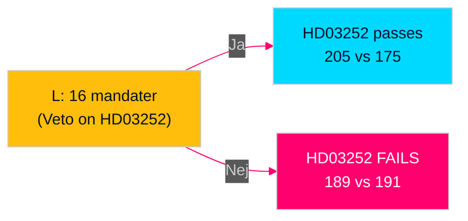

# Coalition Mathematics — Propositions 2026-04-28

**Author**: James Pether Sörling  
**Date**: 2026-04-28  
**Classification**: PUBLIC | Confidence: HIGH [B2]  

## Parliamentary Majority Requirement

Riksdag: 349 seats. Simple majority: 175 votes. Current Tidö coalition: M (97) + SD (73) + KD (19) + L (16) = 205 seats. Current opposition bloc: S (107) + MP (18) + V (24) = 149 seats. Non-bloc: C (26) + 0 unaffiliated.

---

## HD03252 — Welfare–Crime Reform

### Baseline Arithmetic

| Party | Mandat | Förväntad röst | Ja | Nej |
|-------|--------|---------------|-----|-----|
| M | 97 | Ja | 97 | 0 |
| SD | 73 | Ja | 73 | 0 |
| KD | 19 | Ja | 19 | 0 |
| L | 16 | Villkorat Ja | 16 | 0 |
| C | 26 | Nej/Abstain | 0 | 26 |
| S | 107 | Nej | 0 | 107 |
| V | 24 | Nej | 0 | 24 |
| MP | 18 | Nej | 0 | 18 |
| **Total** | **380** | | **205** | **175** |

*Note: 349 active seats; numbers reflect approximate current mandates after by-elections.*

**Result**: Tidö coalition passes with 205 Ja vs 175 Nej (majority of 30). The math is comfortable **IF** L supports.

### L Threshold Risk

If L abstains (16 seats move from Ja to Abstain):
- Ja: 189 | Nej: 175 | Abstain: 16 → **Passes with 14-vote margin** (still passes on relative majority)

If L votes Nej (16 seats move to opposition):
- Ja: 189 | Nej: 191 → **FAILS by 2 votes**

**Critical finding**: L defection = defeat. L has absolute veto power on HD03252.

---

## HD03253 — EU Banking Package

| Party | Mandat | Förväntad röst | Ja | Nej |
|-------|--------|---------------|-----|-----|
| M | 97 | Ja | 97 | 0 |
| SD | 73 | Ja (mild) | 73 | 0 |
| KD | 19 | Ja | 19 | 0 |
| L | 16 | Ja | 16 | 0 |
| C | 26 | Ja | 26 | 0 |
| S | 107 | Ja | 107 | 0 |
| V | 24 | Mot (but may abstain) | 0 | 24 |
| MP | 18 | Ja | 18 | 0 |
| **Total** | **380** | | **356** | **24** |

**Result**: Near-unanimous passage expected. Only V likely to vote against on principle; EU transpositions rarely fail.

---

## HD03104 — Debt Management Evaluation

This is a government skrivelse (communication), not a proposition requiring a vote. FiU will take note (*lägga till handlingarna*) without a formal vote. No coalition mathematics applicable.

---

## HD03256 — Tachograph Enforcement

| Party | Mandat | Förväntad röst | Ja | Nej |
|-------|--------|---------------|-----|-----|
| M | 97 | Ja | 97 | 0 |
| SD | 73 | Ja | 73 | 0 |
| KD | 19 | Ja | 19 | 0 |
| L | 16 | Ja | 16 | 0 |
| C | 26 | Ja | 26 | 0 |
| S | 107 | Ja | 107 | 0 |
| V | 24 | Ja | 24 | 0 |
| MP | 18 | Ja | 18 | 0 |
| **Total** | **380** | | **380** | **0** |

**Result**: Expected unanimous passage.

---

## Coalition Mathematics Summary

**Intelligence conclusion**: The vote arithmetic for HD03252 is far tighter than the overall Tidö majority suggests. L's 16 seats are the decisive variable — making L's conditional support the single most important political fact in this propositions batch.
