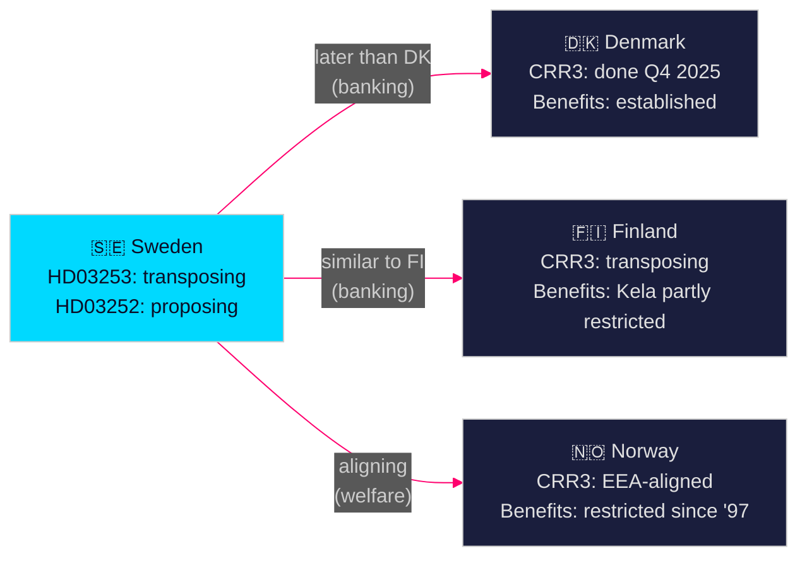

# Comparative International Analysis — Propositions 2026-04-28

**Author**: James Pether Sörling  
**Date**: 2026-04-28  
**Classification**: PUBLIC | Confidence: MEDIUM [C2]  

## Comparator Set

**Comparator set**: Norway (NO), Denmark (DK), Finland (FI), Germany (DE), Netherlands (NL) — Nordic + core EU financial jurisdictions

---

## HD03253 — EU Banking Package (CRR3/CRD6) Comparators

| Jurisdiction | CRR3 Status | IRB Output Floor | Capital Impact | Key Differences |
|--------------|------------|-----------------|----------------|-----------------|
| Sweden (SE) | Transposing (HD03253, 2026-04-23) | 72.5% (mandatory) | Moderate (mortgage heavy IRB models) | FI pillar-2 discretion key |
| Norway (NO) | Norwegian law aligns with EEA | 72.5% EEA-aligned | Similar to SE | Norges Bank FSR tracks closely |
| Denmark (DK) | Transposed Q4 2025 | 72.5% | Lower impact (Jyske, Nykredit) | Danish mortgage bond system provides offset |
| Finland (FI) | Transposing parallel to SE | 72.5% | Lower (smaller IRB exposure) | OP Group less IRB-dependent |
| Germany (DE) | BaFin transition plan 2026 | 72.5% | Higher (Deutsche, Commerzbank) | German Landesbank complexity |
| Netherlands (NL) | DNB implemented Q1 2026 | 72.5% | High (ING, Rabobank IRB heavy) | Most advanced implementation |

**Outside-In**: Sweden is mid-pack in CRR3 implementation. The Netherlands (NL) has moved fastest; Sweden's domestic mortgage IRB exposure makes it more sensitive than Finland but less exposed than Germany. The key Swedish-specific risk is the large mortgage portfolio held by the four major banks with advanced IRB models — the output floor will have disproportionate impact relative to smaller EU members.

---

## HD03252 — Welfare Restriction for Inmates Comparators

| Jurisdiction | Benefit Restriction During Incarceration | Legal Basis | Outcome |
|--------------|------------------------------------------|-------------|---------|
| Sweden (SE) | Proposed (HD03252, 2026-04-23) | Socialförsäkringsbalken amendment | Pending |
| Norway (NO) | Activity allowance suspended during imprisonment | folketrygdloven § 11-21 | Established practice since 1997 |
| Denmark (DK) | Social assistance reduced/suspended during imprisonment | Aktiv socialpolitik § 13 | Long-established |
| Finland (FI) | Social assistance suspended; Kela benefits partly restricted | Laki toimeentulotuesta | Established |
| United Kingdom (GB) | Universal Credit/JSA suspended during imprisonment | Social Security Act 1998 | Established |
| Germany (DE) | Sozialgesetzbuch II/XII suspends benefits during incarceration | SGB II § 7(4) | Established |

**Outside-In**: Sweden is a late mover — most Nordic peers and major EU countries already restrict welfare during imprisonment. HD03252 brings Sweden into alignment with Nordic and EU norms. The specific innovation in HD03252 — covering controlled housing (kontrollerat boende) rather than only traditional imprisonment — is more expansive than most comparators and represents the genuinely novel policy dimension.

---

## Cross-Cutting: Nordic Comparative Context

## Key Intelligence Finding

Sweden is on a convergence path with Nordic peers on both financial regulation (CRR3) and welfare restriction for inmates. The political controversy in Sweden is higher than in comparable jurisdictions because Sweden entered both reforms later and the Tidö government is implementing them in an election year — creating temporal compression that amplifies political salience relative to the policy substance itself.
