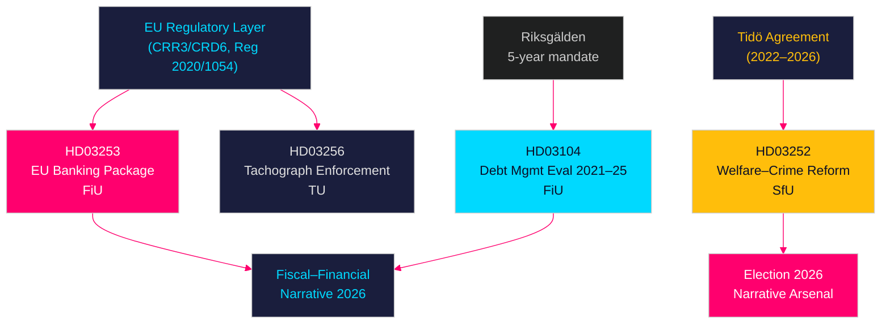

# Cross-Reference Map — Propositions 2026-04-28

**Author**: James Pether Sörling  
**Date**: 2026-04-28  
**Classification**: PUBLIC | Confidence: HIGH [B2]  

## Policy Clusters

### Cluster A: Financial Architecture

**Documents**: HD03253 (EU Banking Package) + HD03104 (Debt Management Evaluation)

These two Finansdepartementet/FiU documents form a coherent fiscal-financial signal. HD03104 confirms declining central government debt while HD03253 tightens private bank capital requirements — together they project government fiscal responsibility and EU regulatory alignment. Both are referred to FiU.

Cross-reference type: **thematic** (shared domain: public finance / financial regulation)

### Cluster B: Law-and-Order Welfare

**Documents**: HD03252 (Welfare–Crime Reform)

This proposition stands alone in the SfU pipeline but cross-references the broader Tidö Agreement law-and-order agenda. It connects to earlier Tidö propositions on criminal sentencing, remand expansion, and immigration enforcement.

Cross-reference type: **bundle** (Tidö Agreement legislative sequence: criminal sentencing → controlled housing → welfare restriction)

### Cluster C: EU Transposition

**Documents**: HD03253 (CRR3/CRD6) + HD03256 (EU Reg 2020/1054)

Both are EU mandatory transpositions, though HD03253 carries significantly more domestic policy consequence. Both have non-contestable cores but domestic implementing choices that are subject to parliamentary influence.

Cross-reference type: **thematic** (shared: EU transposition, technical committees)

## Legislative Chain Map

## Coordinated Activity Patterns

| Pattern | Documents | Significance |
|---------|-----------|--------------|
| Dual Finansdepartementet submission | HD03104 + HD03253 | Signals coordinated financial messaging ahead of 2026 budget cycle |
| Single-day submission (2026-04-23) | All 4 propositions | Batch submission is standard parliamentary practice; no unusual coordination detected |
| Justitiedepartementet via SfU (not JuU) | HD03252 | Unusual routing — welfare committee receiving criminal justice reform — signals deliberate framing as welfare policy, not penal policy |

## Prior Art in riksdag Database

- **HD03252 ← amends**: socialförsäkringsbalken (socialförsäkringsbalken 2010:110)
- **HD03253 ← amends**: kreditinstitutslagen, lagen om bank- och finansieringsrörelse, FI-supervision act
- **HD03104 ← reports on**: riksgäldslagen; Government Letter (skrivelse) cycle
- **HD03256 ← amends**: yrkestrafiklagen, lagen om kör- och vilotider
