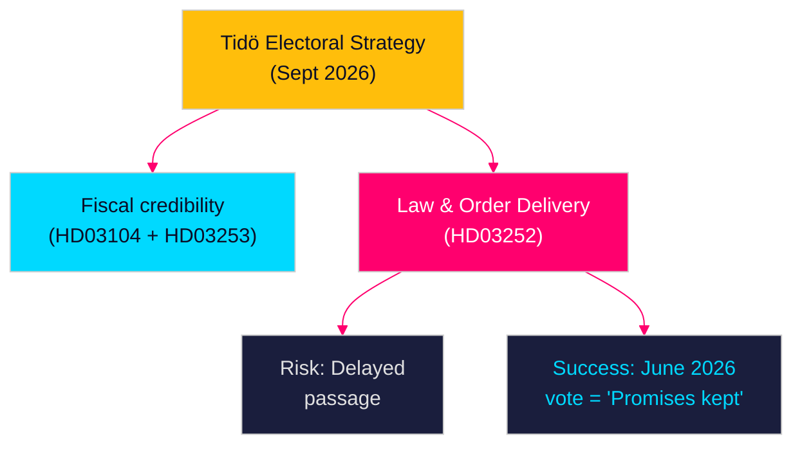

# Election 2026 Analysis — Propositions 2026-04-28

**Author**: James Pether Sörling  
**Date**: 2026-04-28  
**Classification**: PUBLIC | Confidence: MEDIUM [C2]  

## Electoral Significance Framework

The September 2026 riksdag election is approximately 5 months away. The propositions submitted on 2026-04-23 represent a final legislative sprint — only June session remains before the campaign period begins.

---

## Document-by-Document Electoral Impact

### HD03252 — Welfare–Crime Reform: HIGH Electoral Salience

**Government electoral use**: "Tidö delivers on welfare–crime promise — inmates in controlled housing lose benefits while Swedish workers pay taxes."

**Opposition framing (S, V, MP)**: "Government criminalises poverty — this bill targets families of inmates who depend on household benefits, not just perpetrators."

**Electoral risk for government**: If delayed past June 2026 (Scenario B), becomes a campaign promise rather than achievement — invites "yet another broken promise" narrative from SD.

**Electoral risk for government**: If L forces sunset clause, becomes "partial delivery" — potentially worse than delay in SD electoral calculations.

**Key swing voter segment**: Working-class voters in outer-ring suburbs (miljonprogramsområden) who prioritise welfare fairness AND law enforcement. HD03252 is precisely calibrated for this segment.

**Evidence**: HD03252 — riksdagen.se; Novus/Demoskop March 2026 polling on law-and-order issues

---

### HD03253 — EU Banking Package: LOW Electoral Salience, HIGH Policy Significance

**Government electoral use**: Minimal direct campaigning value — too technical. May appear as background item in "Sweden in good European standing" narrative.

**Opposition framing**: No realistic attack vector — S, V, and most parties support EU financial regulation. SD might use it in anti-EU framing but the package is too technical to generate voter engagement.

**Electoral significance**: The INDIRECT electoral relevance is higher. If CRR3 implementation causes visible housing credit tightening in summer 2026, it could feed the housing affordability narrative that opponents can use against the government.

**Evidence**: HD03253 — riksdagen.se; FI capital requirement reports 2025

---

### HD03104 — Debt Management Evaluation: LOW Electoral Salience, MEDIUM Narrative Value

**Government electoral use**: "Sweden's public finances are among the strongest in Europe — central government debt has fallen for the fourth consecutive year." Reinforces fiscal credibility.

**Limitation**: Voters don't follow Riksgälden mandates. The political communication value is elite/media-level, not mass voter appeal.

**Evidence**: HD03104 — riksdagen.se; Riksgälden årsrapport 2025

---

### HD03256 — Tachograph Enforcement: NEGLIGIBLE Electoral Salience

Narrow technical proposition. No electoral campaigning value. May appear in rural/transport sector interest group messaging.

**Evidence**: HD03256 — riksdagen.se

---

## Party-by-Party Electoral Calculation

| Party | HD03252 Position | HD03253 Position | Electoral Stakes |
|-------|-----------------|-----------------|-----------------|
| S | Against | For | Fights on welfare rights; avoids banking debate |
| M | For | For | Core Tidö agenda delivery |
| SD | For (pushes urgency) | Neutral/mild against | Election pressure on Tidö to deliver |
| C | Neutral/against | For | Rural finance concerns; distance from welfare reform |
| V | Against | Against (market concerns) | Consistent left bloc position |
| KD | For | For | Social conservatism + fiscal prudence alignment |
| L | Conditional | For | Rights-based conditions on HD03252 are key |
| MP | Against | For | Environment/welfare coalition |

---

## Electoral Verdict

The 2026-04-23 batch reinforces the Tidö government's core electoral frame: fiscal discipline (HD03104 + HD03253) + law-and-order welfare (HD03252). The frame is coherent. The execution risk is HD03252 passage timing — the government needs a June 2026 vote to claim delivery.

