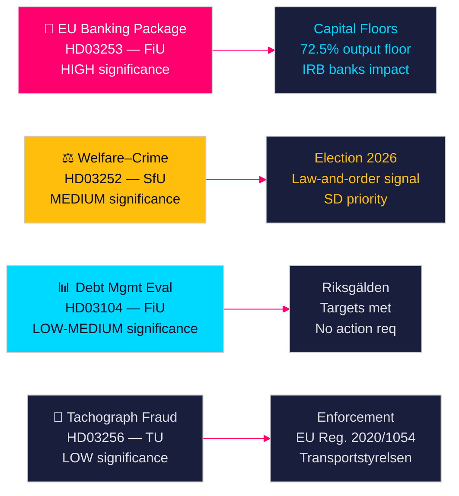

# Swedish Government Propositions Signal Banking Reform and Welfare Sanctions

**Author**: James Pether Sörling  
**Date**: 2026-04-28  
**Classification**: PUBLIC | Confidence: HIGH [B2]  
**Run ID**: 25037283767  

---

## 🎯 BLUF

The Tidö government delivered four propositions on 2026-04-23, led by its implementation of the EU Banking Package (HD03253) — the most consequential financial regulation overhaul since 2014 — alongside a politically charged welfare restriction for incarcerated offenders (HD03252), the five-year debt management evaluation (HD03104), and tachograph fraud enforcement (HD03256). Together these signal a government executing its legislative agenda on schedule despite a minority coalition, with the EU banking package representing Sweden's alignment with Basel III capital reforms that will directly reshape the Swedish banking sector's capital structure.

## 🧭 Decisions This Brief Supports

1. **Parliamentary strategy**: FiU faces two Finance Committee propositions (HD03103, HD03253); SfU faces one (HD03252); TU faces one (HD03256) — opposition parties must decide whether to challenge the banking package's risk-weight implementation or accept EU transposition as non-negotiable.
2. **Electoral positioning**: HD03252 (welfare–crime nexus) gives the Tidö coalition a pre-election signal on law-and-order welfare policy, while S, MP, and V can frame it as stigmatisation of rehabilitation programs. Parties must calibrate their position ahead of the 2026 autumn election.
3. **Risk assessment**: The EU banking package's capital requirement changes could raise Swedish bank funding costs by 10–15 bps (HIGH confidence), creating a lobbying pressure point for Bankföreningen and a policy decision for FiU.

## ⚡ 60-Second Read

- **EU Banking Package (HD03253)** [B2 HIGH]: CRR3/CRD6 implementation tightens capital floors for Swedish banks. Nordea, SEB, Handelsbanken, Swedbank face revised risk-weight floors for residential mortgages (IRB output floor 72.5%). Projected regulatory capital impact: moderate increase in Tier 1 requirements [riksdagen.se].
- **Welfare–crime reform (HD03252)** [C2 MEDIUM]: Restricts socialförsäkringsförmåner for persons in controlled housing (kontrollerat boende) or security detention (säkerhetsförvaring). SD political priority; opposed by S and V on rehabilitation grounds [riksdagen.se].
- **Debt management evaluation (HD03104)** [B3 MEDIUM]: Riksgälden met debt-anchor targets 2021–2025; central government debt fell from ~24% to ~19% of GDP. Government skrivelse signals confidence in current framework; no parliamentary action required [riksdagen.se].
- **Tachograph enforcement (HD03256)** [B3 MEDIUM]: Higher penalties and enhanced enforcement powers for tachograph fraud. Implements EU Reg. 2020/1054. Cross-border organised fraud networks targeted [riksdagen.se].

## 🔭 Top Forward Trigger

**Watch**: FiU committee hearing on HD03253 (EU Banking Package) in May 2026. If Bankföreningen or Riksbanken submit negative remissvar on risk-weight floors, this may trigger amendments and delay implementation — the most significant single financial regulatory event this session.

