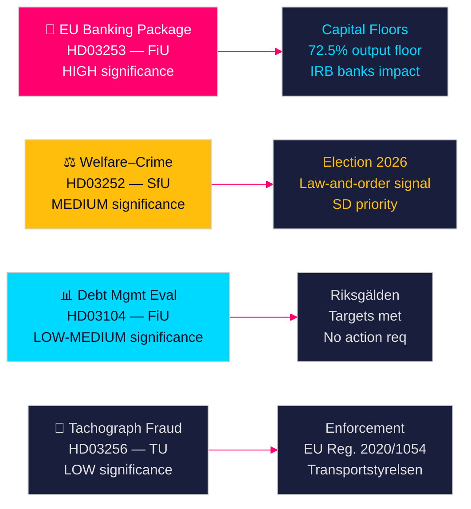

# مقترحات الحكومة السويدية تُشير إلى إصلاح مصرفي وعقوبات على الرعاية الاجتماعية

**المؤلف**: James Pether Sörling  
**التاريخ**: 2026-04-28  
**التصنيف**: عام | مستوى الثقة: مرتفع [B2]  
**معرّف التشغيل**: 25037283767  

---

## 🎯 الخلاصة التنفيذية

قدّمت حكومة Tidö أربعة مقترحات في 23 أبريل 2026، تقودها تطبيق حزمة البنوك الأوروبية (HD03253) — أشمل تنظيم مالي منذ عام 2014 — إلى جانب قيد مشحون سياسياً على استحقاقات الرعاية الاجتماعية للمسجونين (HD03252)، وتقييم إدارة الديون لخمس سنوات (HD03104)، وتطبيق مكافحة تزوير المسجّلات (HD03256). تُشير هذه المقترحات مجتمعةً إلى حكومة تُنفّذ أجندتها التشريعية وفق الجدول الزمني رغم كونها ائتلافاً أقلياً، إذ تمثّل حزمة البنوك الأوروبية انسجام السويد مع إصلاحات رأس المال وفق اتفاقية بازل الثالثة، التي ستُعيد رسم هيكل رأس المال في القطاع المصرفي السويدي مباشرةً.

## 🧭 القرارات التي يدعمها هذا الملخص

1. **الاستراتيجية البرلمانية**: تتولّى لجنة FiU مقترحَين ماليَّين (HD03103، HD03253)؛ وتتولّى SfU مقترحاً واحداً (HD03252)؛ وتتولّى TU مقترحاً واحداً (HD03256) — على أحزاب المعارضة أن تقرّر ما إذا كانت ستطعن في تطبيق أوزان المخاطر في الحزمة المصرفية أو تقبل التحويل الأوروبي باعتباره غير قابل للتفاوض.
2. **التموضع الانتخابي**: يمنح HD03252 (الصلة بين الرعاية الاجتماعية والجريمة) ائتلاف Tidö إشارة مسبقة بشأن سياسة القانون والنظام الاجتماعية، في حين يمكن لـ S وMP وV تأطيره باعتباره وصماً لبرامج إعادة التأهيل. يجب على الأحزاب معايرة موقفها قبيل انتخابات خريف 2026.
3. **تقييم المخاطر**: قد ترفع التغييرات في متطلبات رأس المال للحزمة المصرفية الأوروبية تكاليف تمويل البنوك السويدية بمقدار 10–15 نقطة أساس (ثقة مرتفعة)، مما يُولّد ضغطاً استثارياً على Bankföreningen وقراراً سياسياً على FiU.

## ⚡ قراءة في 60 ثانية

- **حزمة البنوك الأوروبية (HD03253)** [B2 مرتفع]: تطبيق CRR3/CRD6 يُشدّد حدود رأس المال الدنيا للبنوك السويدية. تواجه Nordea وSEB وHandelsbanken وSwedbank حدوداً دنيا مُعدَّلة لأوزان المخاطر للقروض العقارية السكنية (حدّ إنتاج IRB 72.5%). الأثر التنظيمي المتوقع على رأس المال: ارتفاع معتدل في متطلبات الشريحة الأولى [riksdagen.se].
- **إصلاح الرعاية الاجتماعية والجريمة (HD03252)** [C2 متوسط]: يُقيّد socialförsäkringsförmåner للأشخاص الموجودين في kontrollerat boende أو säkerhetsförvaring. أولوية سياسية لـ SD؛ يعارضها S وV لأسباب تتعلق بإعادة التأهيل [riksdagen.se].
- **تقييم إدارة الديون (HD03104)** [B3 متوسط]: حقّقت Riksgälden أهداف مرساة الديون 2021–2025؛ انخفضت الديون الحكومية المركزية من ~24% إلى ~19% من الناتج المحلي الإجمالي. تُشير skrivelse الحكومية إلى ثقة في الإطار الحالي؛ لا حاجة لإجراء برلماني [riksdagen.se].
- **تطبيق المسجّلات (HD03256)** [B3 متوسط]: عقوبات أشدّ وصلاحيات تطبيق معزّزة لمكافحة تزوير المسجّلات. تطبيق للوائح الأوروبية 2020/1054. شبكات الاحتيال العابرة للحدود هي الهدف [riksdagen.se].

## 🔭 أبرز إشارة مستقبلية

**راقب**: جلسة استماع لجنة FiU بشأن HD03253 (حزمة البنوك الأوروبية) في مايو 2026. إذا قدّمت Bankföreningen أو Riksbanken آراء سلبية بشأن حدود أوزان المخاطر، فقد يُفضي ذلك إلى تعديلات وتأخير التطبيق — وهو الحدث التنظيمي المالي الفردي الأكثر أهمية في هذه الدورة.

<!-- source-sha: 85156e01acda6f6589295f5a1f9197b815c84bc8 -->
