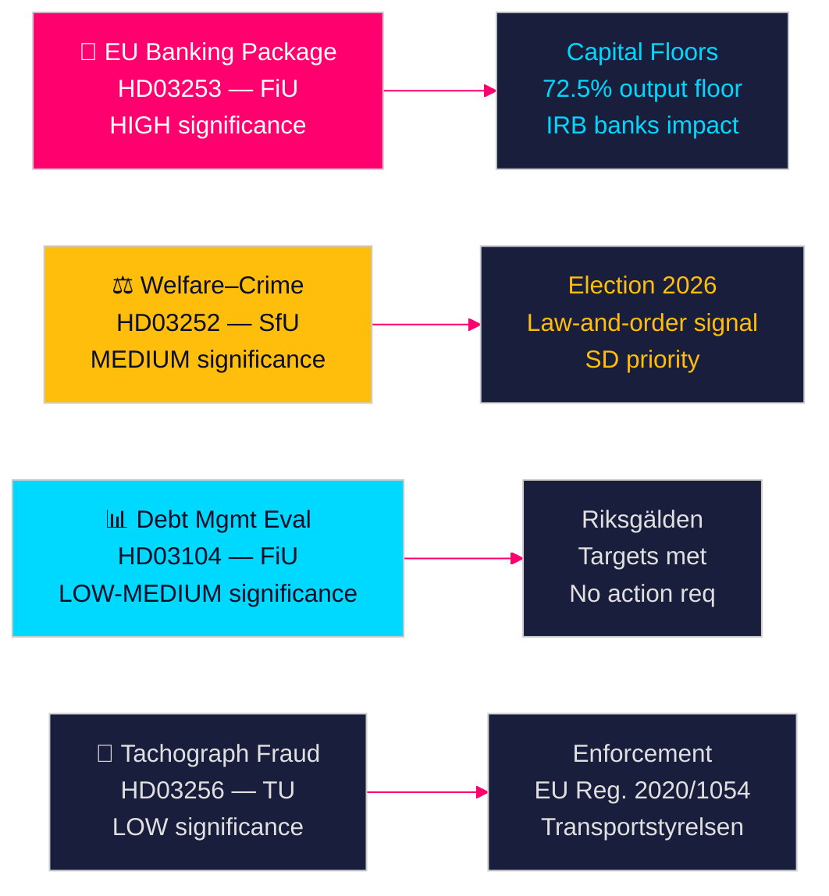

# Svenske regeringspropositioner signalerer bankreform og velfærdssanktioner

**Forfatter**: James Pether Sörling  
**Dato**: 2026-04-28  
**Klassifikation**: OFFENTLIG | Konfidensniveau: HØJ [B2]  
**Kørsels-ID**: 25037283767  

---

## 🎯 BLUF

Tidö-regeringen fremlagde fire propositioner den 23. april 2026, anført af implementeringen af EU-bankpakken (HD03253) — den mest gennemgribende finansielle regulering siden 2014 — sammen med en politisk ladet velfærdsbegrænsning for frihedsberøvede (HD03252), femårsevalueringen af gældsforvaltningen (HD03104) og kontrollen med takografsvig (HD03256). Samlet set signalerer disse en regering, der gennemfører sin lovgivningsmæssige dagsorden på skema trods en mindretalskoalition, hvor EU-bankpakken repræsenterer Sveriges tilpasning til Basel III's kapitalreformer, der direkte vil omforme den svenske banksektor kapitalstruktur.

## 🧭 Beslutninger dette notat understøtter

1. **Parlamentarisk strategi**: FiU behandler to finansudvalgspropositioner (HD03103, HD03253); SfU behandler én (HD03252); TU behandler én (HD03256) — oppositionspartierne skal beslutte, om de vil anfægte bankpakkens implementering af risikovægte eller acceptere EU-transposition som ikke-forhandlingsbar.
2. **Valgpositionering**: HD03252 (velfærd–kriminalitetsneksus) giver Tidö-koalitionen et forhåndssignal om lov-og-orden velfærdspolitik, mens S, MP og V kan fremstille det som stigmatisering af rehabiliteringsprogrammer. Partierne skal kalibrere deres position inden efterårsvalget 2026.
3. **Risikovurdering**: EU-bankpakkens ændrede kapitalkrav kan øge svenske bankers finansieringsomkostninger med 10–15 basispoint (HØJ konfidensniveau), hvilket skaber et lobbyistisk pres for Bankföreningen og en politisk beslutning for FiU.

## ⚡ 60-sekunders læsning

- **EU-bankpakke (HD03253)** [B2 HØJ]: CRR3/CRD6-implementering stramme kapitalgulve for svenske banker. Nordea, SEB, Handelsbanken, Swedbank møder reviderede risikovægtsgulve for boliglån (IRB-outputgulv 72,5 %). Beregnet regulatorisk kapitalindvirkning: moderat stigning i Tier 1-krav [riksdagen.se].
- **Velfærd–kriminalitetsreform (HD03252)** [C2 MEDIUM]: Begrænser socialförsäkringsförmåner for personer i kontrollerat boende eller säkerhetsförvaring. SD's politiske prioritet; modsat af S og V med rehabiliteringsargumenter [riksdagen.se].
- **Gældsforvaltningsevaluering (HD03104)** [B3 MEDIUM]: Riksgälden opfyldte gældsankermål 2021–2025; statslig gæld faldt fra ~24 % til ~19 % af BNP. Regeringsskrivelse signalerer tillid til nuværende ramme; ingen parlamentarisk handling påkrævet [riksdagen.se].
- **Takograftilsyn (HD03256)** [B3 MEDIUM]: Højere sanktioner og styrkede tilsynsbeføjelser for takografsvig. Implementerer EU-forordning 2020/1054. Grænseoverskridende organiserede svignetværk er målet [riksdagen.se].

## 🔭 Vigtigste fremtidssignal

**Følg med**: FiU's udvalgsbehandling af HD03253 (EU-bankpakken) i maj 2026. Hvis Bankföreningen eller Riksbanken indgiver negative høringssvar om risikovægtsgulvene, kan det udløse ændringer og forsinke implementeringen — den vigtigste enkeltbegivenhed inden for finansiel regulering i denne samling.

<!-- source-sha: 85156e01acda6f6589295f5a1f9197b815c84bc8 -->
