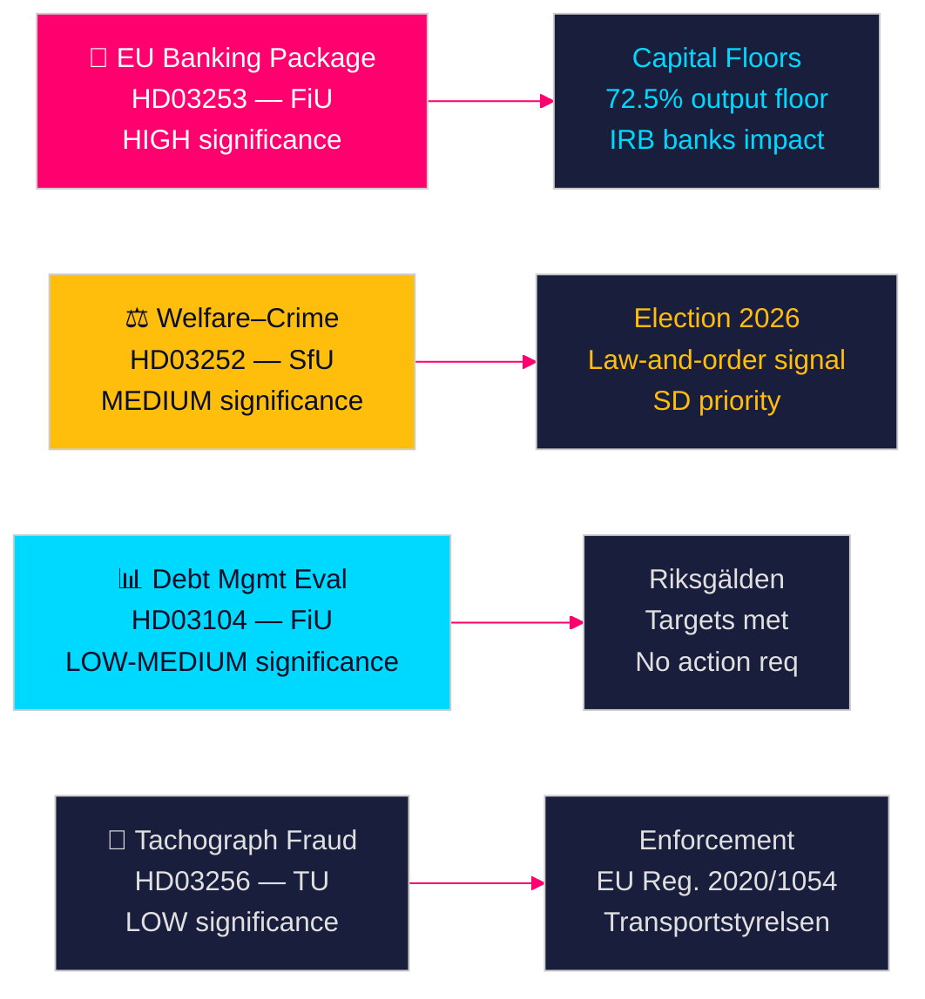

# Schwedische Regierungsvorlagen signalisieren Bankenreform und Sozialleistungssanktionen

**Autor**: James Pether Sörling  
**Datum**: 2026-04-28  
**Klassifikation**: ÖFFENTLICH | Konfidenzniveau: HOCH [B2]  
**Ausführungs-ID**: 25037283767  

---

## 🎯 BLUF

Die Tidö-Regierung legte am 23. April 2026 vier Gesetzentwürfe vor, angeführt von der Umsetzung des EU-Bankenpakets (HD03253) — der weitreichendsten Finanzregulierung seit 2014 — sowie einer politisch aufgeladenen Wohlfahrtsbeschränkung für Inhaftierte (HD03252), der fünfjährigen Schuldenverwaltungsevaluierung (HD03104) und der Durchsetzung von Tachographenbetrug (HD03256). Zusammen signalisieren diese eine Regierung, die ihre Gesetzgebungsagenda trotz einer Minderheitskoalition planmäßig umsetzt, wobei das EU-Bankenpaket Schwedens Ausrichtung an den Basel-III-Kapitalreformen darstellt, die die Kapitalstruktur des schwedischen Bankensektors direkt umgestalten werden.

## 🧭 Entscheidungen, die dieses Briefing unterstützt

1. **Parlamentarische Strategie**: FiU befasst sich mit zwei Finanzausschussvorlagen (HD03103, HD03253); SfU mit einer (HD03252); TU mit einer (HD03256) — Oppositionsparteien müssen entscheiden, ob sie die Risikogewichtsimplementierung des Bankenpakets anfechten oder die EU-Transposition als nicht verhandelbar akzeptieren.
2. **Wahlpositionierung**: HD03252 (Wohlfahrt–Kriminalitätsnexus) gibt der Tidö-Koalition ein Vorabsignal zur Recht-und-Ordnung-Wohlfahrtspolitik, während S, MP und V es als Stigmatisierung von Rehabilitierungsprogrammen rahmen können. Parteien müssen ihre Position vor der Herbstwahl 2026 kalibrieren.
3. **Risikobewertung**: Die geänderten Kapitalanforderungen des EU-Bankenpakets könnten die Finanzierungskosten schwedischer Banken um 10–15 Basispunkte erhöhen (HOHE Konfidenz), was einen Lobbydruck für Bankföreningen und eine politische Entscheidung für FiU schafft.

## ⚡ 60-Sekunden-Lektüre

- **EU-Bankenpaket (HD03253)** [B2 HOCH]: CRR3/CRD6-Implementierung verschärft Kapitaluntergrenzen für schwedische Banken. Nordea, SEB, Handelsbanken, Swedbank sehen sich revidierten Risikogewichtsuntergrenzen für Wohnungshypotheken gegenüber (IRB-Ausgabeuntergrenze 72,5 %). Voraussichtliche regulatorische Kapitalauswirkung: moderater Anstieg der Tier-1-Anforderungen [riksdagen.se].
- **Wohlfahrt–Kriminalitätsreform (HD03252)** [C2 MITTEL]: Beschränkt socialförsäkringsförmåner für Personen in kontrollerat boende oder säkerhetsförvaring. SD-politische Priorität; von S und V aus Rehabilitierungsgründen abgelehnt [riksdagen.se].
- **Schuldenverwaltungsevaluierung (HD03104)** [B3 MITTEL]: Riksgälden erfüllte Schuldenanker-Ziele 2021–2025; Staatsschuld sank von ~24 % auf ~19 % des BIP. Regierungsschreiben signalisiert Vertrauen in den bestehenden Rahmen; kein parlamentarisches Handeln erforderlich [riksdagen.se].
- **Tachographendurchsetzung (HD03256)** [B3 MITTEL]: Höhere Strafen und verstärkte Durchsetzungsbefugnisse bei Tachographenbetrug. Setzt EU-Verordnung 2020/1054 um. Grenzüberschreitende organisierte Betrugsnetzwerke werden ins Visier genommen [riksdagen.se].

## 🔭 Wichtigstes Zukunftssignal

**Beachten**: FiU-Ausschussanhörung zu HD03253 (EU-Bankenpaket) im Mai 2026. Wenn Bankföreningen oder Riksbanken negative Stellungnahmen zu Risikogewichtsuntergrenzen einreichen, könnte dies Änderungen auslösen und die Umsetzung verzögern — das bedeutendste einzelne Finanzregulierungsereignis dieser Legislaturperiode.

<!-- source-sha: 85156e01acda6f6589295f5a1f9197b815c84bc8 -->
