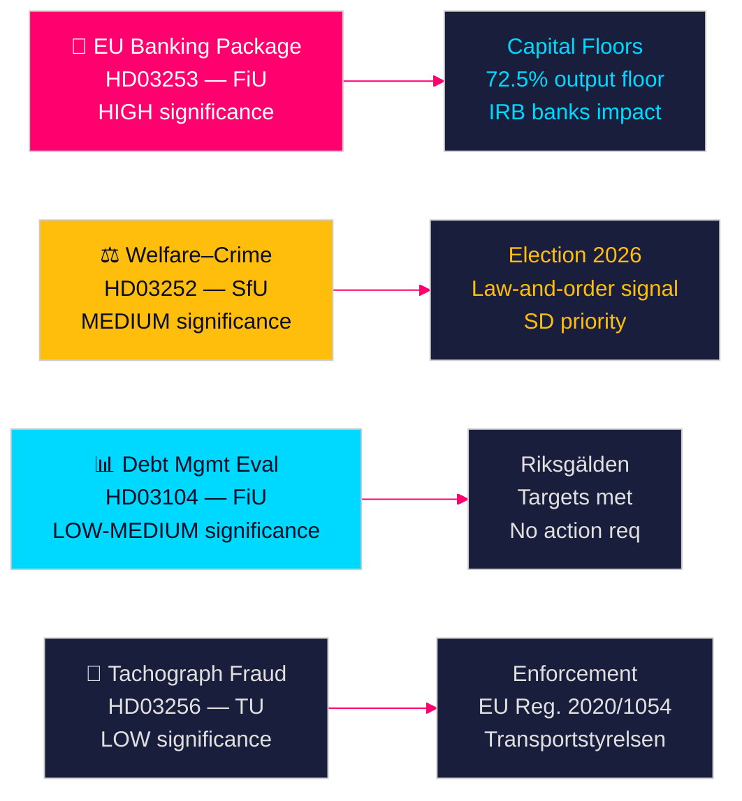

# Las propuestas del gobierno sueco señalan reforma bancaria y sanciones al bienestar social

**Autor**: James Pether Sörling  
**Fecha**: 2026-04-28  
**Clasificación**: PÚBLICO | Nivel de confianza: ALTO [B2]  
**ID de ejecución**: 25037283767  

---

## 🎯 BLUF

El gobierno Tidö presentó cuatro propuestas el 23 de abril de 2026, lideradas por la implementación del paquete bancario de la UE (HD03253) — la reforma regulatoria financiera más significativa desde 2014 — junto con una restrictiva políticamente cargada sobre prestaciones sociales para personas encarceladas (HD03252), la evaluación quinquenal de la gestión de la deuda (HD03104) y la aplicación contra el fraude con tacógrafos (HD03256). En conjunto, estas señalan un gobierno que ejecuta su agenda legislativa según lo previsto a pesar de una coalición minoritaria, siendo el paquete bancario de la UE la alineación de Suecia con las reformas de capital de Basilea III que remodelarán directamente la estructura de capital del sector bancario sueco.

## 🧭 Decisiones que apoya este documento

1. **Estrategia parlamentaria**: FiU trata dos propuestas de la comisión de finanzas (HD03103, HD03253); SfU trata una (HD03252); TU trata una (HD03256) — los partidos de oposición deben decidir si desafían la implementación de ponderaciones de riesgo del paquete bancario o aceptan la transposición de la UE como no negociable.
2. **Posicionamiento electoral**: HD03252 (nexo bienestar–crimen) da a la coalición Tidö una señal previa a las elecciones sobre política de bienestar de ley y orden, mientras que S, MP y V pueden enmarcarlo como estigmatización de programas de rehabilitación. Los partidos deben calibrar su posición antes de las elecciones de otoño de 2026.
3. **Evaluación de riesgos**: Los cambios en los requisitos de capital del paquete bancario de la UE podrían aumentar los costos de financiamiento de los bancos suecos entre 10 y 15 puntos básicos (confianza ALTA), creando presión de cabildeo para Bankföreningen y una decisión política para FiU.

## ⚡ Lectura de 60 segundos

- **Paquete bancario UE (HD03253)** [B2 ALTO]: La implementación de CRR3/CRD6 endurece los suelos de capital para los bancos suecos. Nordea, SEB, Handelsbanken, Swedbank enfrentan suelos de ponderación de riesgo revisados para hipotecas residenciales (suelo de producción IRB 72,5 %). Impacto de capital regulatorio proyectado: aumento moderado de los requisitos de Tier 1 [riksdagen.se].
- **Reforma bienestar–crimen (HD03252)** [C2 MEDIO]: Restringe las socialförsäkringsförmåner para personas en kontrollerat boende o säkerhetsförvaring. Prioridad política de SD; rechazada por S y V por razones de rehabilitación [riksdagen.se].
- **Evaluación de gestión de deuda (HD03104)** [B3 MEDIO]: Riksgälden cumplió los objetivos de anclaje de deuda 2021–2025; la deuda pública cayó de ~24 % a ~19 % del PIB. La skrivelse gubernamental señala confianza en el marco actual; no se requiere acción parlamentaria [riksdagen.se].
- **Aplicación tacógrafo (HD03256)** [B3 MEDIO]: Sanciones más altas y poderes de aplicación mejorados para el fraude con tacógrafos. Implementa el Reglamento UE 2020/1054. Redes organizadas transfronterizas de fraude son el objetivo [riksdagen.se].

## 🔭 Principal señal de futuro

**A vigilar**: Audiencia de la comisión FiU sobre HD03253 (paquete bancario de la UE) en mayo de 2026. Si Bankföreningen o Riksbanken presentan opiniones negativas sobre los suelos de ponderación de riesgo, podría desencadenar enmiendas y retrasar la implementación — el evento regulatorio financiero individual más significativo de esta sesión.

<!-- source-sha: 85156e01acda6f6589295f5a1f9197b815c84bc8 -->
