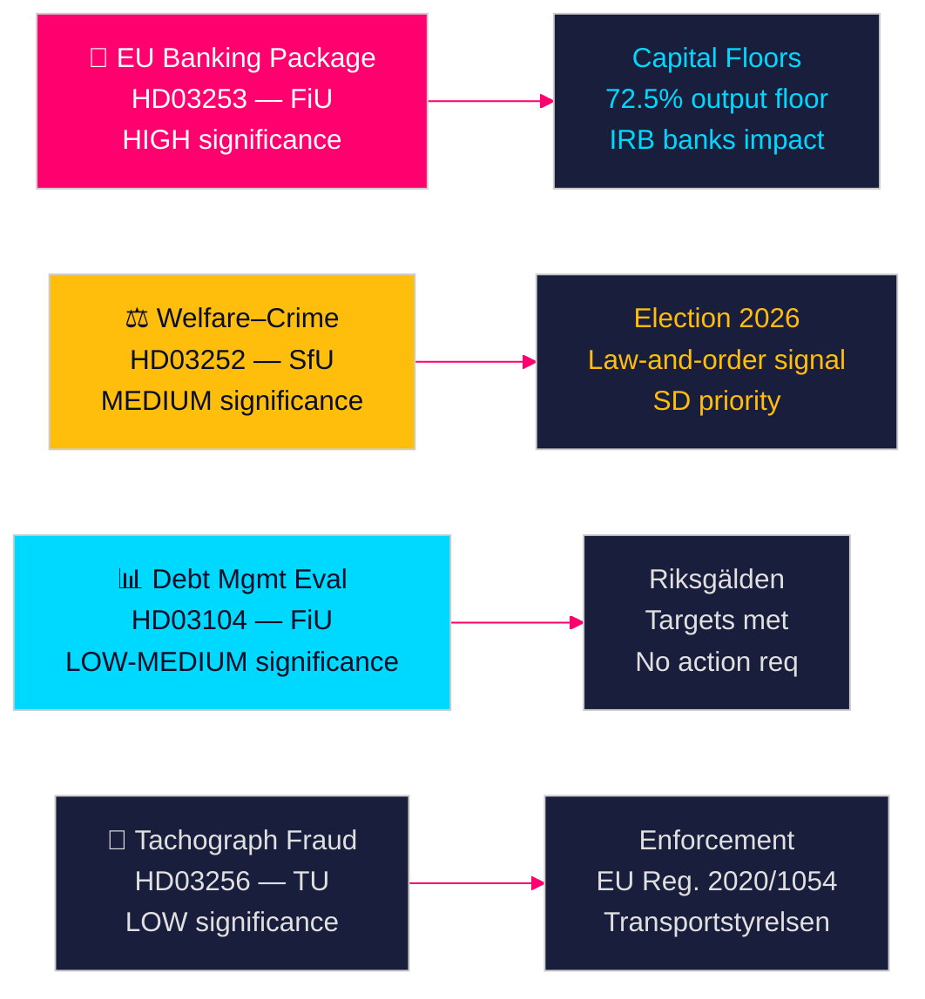

# Ruotsin hallituksen esitykset ennakoivat pankkiuudistusta ja sosiaalietuuksien sanktioita

**Kirjoittaja**: James Pether Sörling  
**Päivämäärä**: 2026-04-28  
**Luokitus**: JULKINEN | Luottamustaso: KORKEA [B2]  
**Ajo-ID**: 25037283767  

---

## 🎯 BLUF

Tidö-hallitus esitti neljä esitystä 23. huhtikuuta 2026, joista merkittävin on EU:n pankkipaketin (HD03253) täytäntöönpano — merkittävin rahoitussääntely vuoden 2014 jälkeen — sekä poliittisesti latautunut vapaudenmenetystä koskeva sosiaalietuuksien rajoitus (HD03252), viisivuotinen velanhallinta-arviointi (HD03104) ja ajopiirturipetoksen valvonta (HD03256). Nämä esitykset osoittavat yhteensä hallituksen toteuttavan lainsäädäntöohjelmaansa aikataulussa vähemmistökoalitiosta huolimatta, ja EU:n pankkipaketti edustaa Ruotsin sopeutumista Basel III:n pääomauudistuksiin, jotka muokkaavat suoraan ruotsalaisen pankkisektorin pääomarakennetta.

## 🧭 Päätökset, joita tämä tiedote tukee

1. **Parlamentaarinen strategia**: FiU käsittelee kahta valtiovarainvaliokunnan esitystä (HD03103, HD03253); SfU käsittelee yhden (HD03252); TU käsittelee yhden (HD03256) — oppositiopuolueiden on päätettävä, haluavatko ne haastaa pankkipaketin riskipainototeutuksen vai hyväksyä EU:n transponoinnin neuvottelukelvottomana.
2. **Vaalipositiointi**: HD03252 (hyvinvointi–rikoskytkös) antaa Tidö-koalitiolle ennakoivan signaalin laki-ja-järjestys-hyvinvointipolitiikasta, kun taas S, MP ja V voivat kehystää sen kuntoutusohjelmat stigmatisoivana. Puolueiden on kalibroitava kantansa ennen syksyn 2026 vaaleja.
3. **Riskinarviointi**: EU:n pankkipaketin muutetut pääomavaatimukset voivat nostaa ruotsalaisten pankkien rahoituskustannuksia 10–15 peruspistettä (KORKEA luottamustaso), mikä luo lobbausvaikutuksen Bankföreningenille ja politiikkapäätöksen FiU:lle.

## ⚡ 60 sekunnin tiivistelmä

- **EU:n pankkipaketti (HD03253)** [B2 KORKEA]: CRR3/CRD6-täytäntöönpano tiukentaa pääomalattioja ruotsalaisille pankeille. Nordea, SEB, Handelsbanken, Swedbank kohtaavat tarkistetut riskipainolattiait asuntolainoille (IRB-tuotosgolvi 72,5 %). Arvioitu sääntelypääomavaikutus: Tier 1 -vaatimusten maltillinen kasvu [riksdagen.se].
- **Hyvinvointi–rikosreformi (HD03252)** [C2 KESKITASO]: Rajoittaa socialförsäkringsförmåner henkilöille, jotka asuvat kontrollerat boende- tai säkerhetsförvaring-tiloissa. SD:n poliittinen prioriteetti; S ja V vastustavat kuntoutusperustein [riksdagen.se].
- **Velanhallinta-arviointi (HD03104)** [B3 KESKITASO]: Riksgälden saavutti velkaankkuritavoitteet 2021–2025; valtion velka laski ~24 %:sta ~19 %:iin BKT:sta. Hallituksen kirjelmä osoittaa luottamuksen nykyiseen kehykseen; parlamentaarisia toimia ei tarvita [riksdagen.se].
- **Ajopiirturien valvonta (HD03256)** [B3 KESKITASO]: Korkeammat rangaistukset ja tehostetut valvontavaltuudet ajopiirturipetokselle. Panee täytäntöön EU:n asetuksen 2020/1054. Rajat ylittävät organisoidut petosverkostot ovat kohteena [riksdagen.se].

## 🔭 Tärkein tulevaisuuden signaali

**Seuraa**: FiU:n valiokunnan kuuleminen HD03253:sta (EU:n pankkipaketti) toukokuussa 2026. Jos Bankföreningen tai Riksbanken jättävät kielteisiä lausuntoja riskipainolattiaoista, tämä saattaa laukaista muutoksia ja viivästyttää täytäntöönpanoa — merkittävin yksittäinen rahoitussääntelytapahtuma tällä vaalikaudella.

<!-- source-sha: 85156e01acda6f6589295f5a1f9197b815c84bc8 -->
