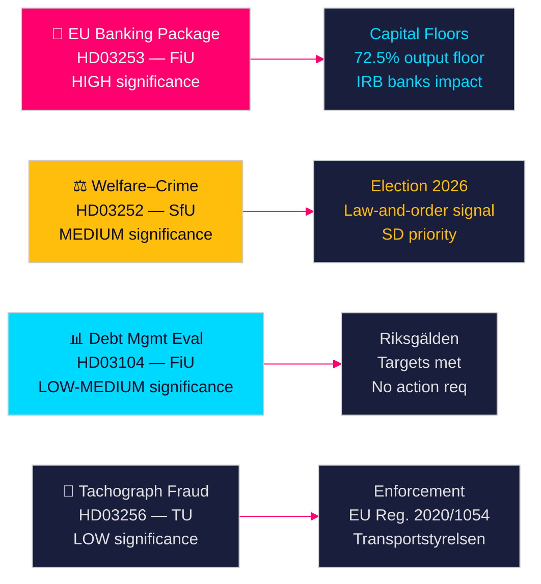

# Les propositions gouvernementales suédoises annoncent une réforme bancaire et des sanctions sociales

**Auteur** : James Pether Sörling  
**Date** : 2026-04-28  
**Classification** : PUBLIC | Niveau de confiance : ÉLEVÉ [B2]  
**ID d'exécution** : 25037283767  

---

## 🎯 BLUF

Le gouvernement Tidö a déposé quatre propositions le 23 avril 2026, menées par la mise en œuvre du paquet bancaire européen (HD03253) — la réforme réglementaire financière la plus conséquente depuis 2014 — accompagnée d'une restriction de prestations sociales politiquement chargée pour les personnes incarcérées (HD03252), de l'évaluation quinquennale de la gestion de la dette (HD03104) et de l'application contre la fraude au tachygraphe (HD03256). Ensemble, ces mesures signalent un gouvernement qui exécute son programme législatif dans les délais malgré une coalition minoritaire, le paquet bancaire européen représentant l'alignement de la Suède sur les réformes de fonds propres de Bâle III qui remodèleront directement la structure du capital du secteur bancaire suédois.

## 🧭 Décisions que ce document soutient

1. **Stratégie parlementaire** : FiU traite deux propositions de la commission des finances (HD03103, HD03253) ; SfU traite une (HD03252) ; TU traite une (HD03256) — les partis d'opposition doivent décider s'ils contestent la mise en œuvre des pondérations de risque du paquet bancaire ou acceptent la transposition européenne comme non négociable.
2. **Positionnement électoral** : HD03252 (nexus bien-être–criminalité) donne à la coalition Tidö un signal avant l'élection sur la politique sociale en matière de loi et d'ordre, tandis que S, MP et V peuvent le cadrer comme une stigmatisation des programmes de réhabilitation. Les partis doivent calibrer leur position avant les élections d'automne 2026.
3. **Évaluation des risques** : Les modifications des exigences de fonds propres du paquet bancaire européen pourraient augmenter les coûts de financement des banques suédoises de 10 à 15 points de base (confiance ÉLEVÉE), créant une pression de lobbying pour Bankföreningen et une décision politique pour FiU.

## ⚡ Lecture en 60 secondes

- **Paquet bancaire UE (HD03253)** [B2 ÉLEVÉ] : La mise en œuvre de CRR3/CRD6 resserre les planchers de fonds propres pour les banques suédoises. Nordea, SEB, Handelsbanken, Swedbank font face à des planchers de pondération de risque révisés pour les prêts hypothécaires résidentiels (plancher de sortie IRB 72,5 %). Impact réglementaire prévu sur les fonds propres : augmentation modérée des exigences Tier 1 [riksdagen.se].
- **Réforme bien-être–criminalité (HD03252)** [C2 MOYEN] : Restreint les socialförsäkringsförmåner pour les personnes en kontrollerat boende ou säkerhetsförvaring. Priorité politique de SD ; opposé par S et V pour des raisons de réhabilitation [riksdagen.se].
- **Évaluation de la gestion de la dette (HD03104)** [B3 MOYEN] : Riksgälden a atteint les objectifs d'ancre de la dette 2021–2025 ; la dette publique est tombée de ~24 % à ~19 % du PIB. La skrivelse gouvernementale signale la confiance dans le cadre actuel ; aucune action parlementaire requise [riksdagen.se].
- **Application tachygraphe (HD03256)** [B3 MOYEN] : Sanctions plus élevées et pouvoirs d'application renforcés pour la fraude au tachygraphe. Met en œuvre le règlement UE 2020/1054. Des réseaux organisés de fraude transfrontaliers sont ciblés [riksdagen.se].

## 🔭 Principal signal prospectif

**À surveiller** : Audition de la commission FiU sur HD03253 (paquet bancaire européen) en mai 2026. Si Bankföreningen ou Riksbanken soumettent des avis négatifs sur les planchers de pondération de risque, cela pourrait déclencher des amendements et retarder la mise en œuvre — l'événement réglementaire financier unique le plus significatif de cette session.

<!-- source-sha: 85156e01acda6f6589295f5a1f9197b815c84bc8 -->
