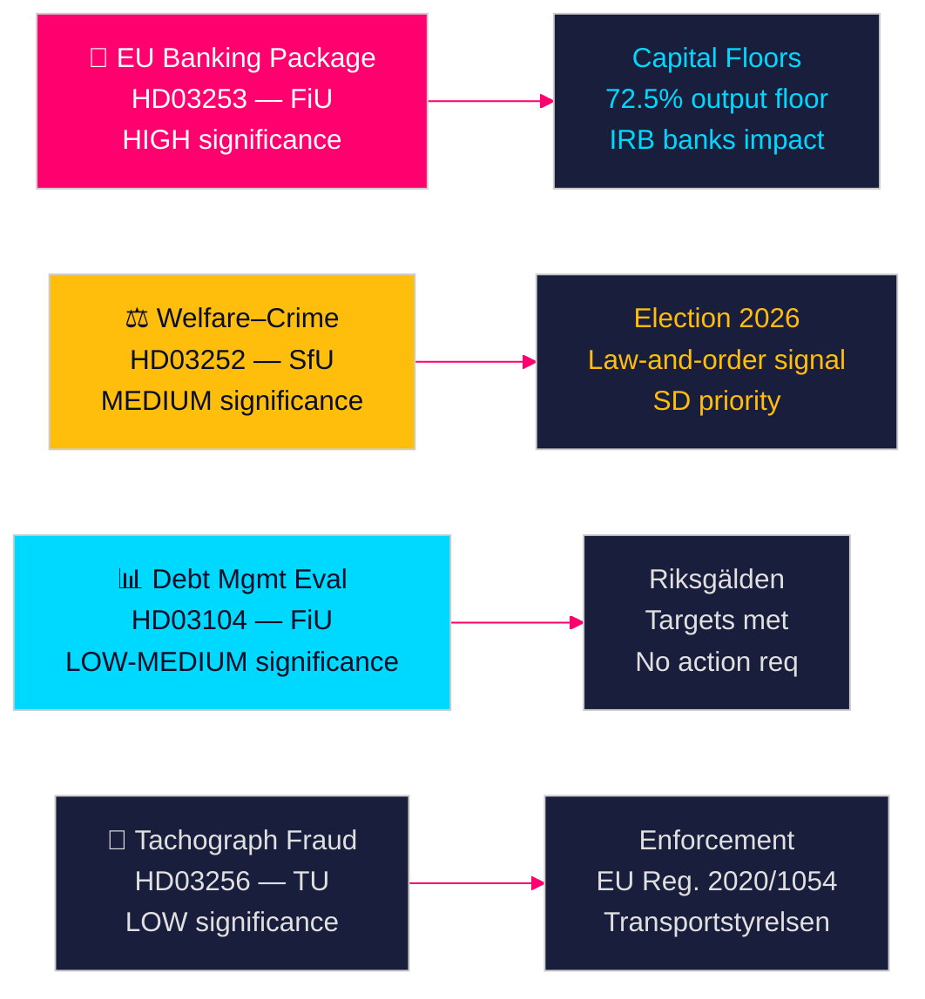

# הצעות ממשלת שוודיה מאותתות על רפורמה בנקאית וסנקציות רווחה

**מחבר**: James Pether Sörling  
**תאריך**: 2026-04-28  
**סיווג**: ציבורי | רמת ביטחון: גבוהה [B2]  
**מזהה הרצה**: 25037283767  

---

## 🎯 תמצית מנהלים

ממשלת Tidö הגישה ארבע הצעות ב-23 באפריל 2026, שעיקרן יישום חבילת הבנקאות האירופית (HD03253) — הרגולציה הפיננסית המקיפה ביותר מאז 2014 — לצד הגבלת הטבות רווחה רגישה פוליטית לאסירים (HD03252), הערכת ניהול חוב לחמש שנים (HD03104), ואכיפת מניעת הונאת טכוגרף (HD03256). ביחד, הצעות אלו מאותתות על ממשלה המבצעת את סדר יומה החקיקתי לפי תוכנית למרות קואליציה מיעוטית, כאשר חבילת הבנקאות מייצגת את התאמת שוודיה לרפורמות ההון של באזל III שיעצבו מחדש את מבנה ההון של מגזר הבנקאות השוודי.

## 🧭 החלטות שמסמך זה תומך בהן

1. **אסטרטגיה פרלמנטרית**: FiU מטפלת בשתי הצעות ועדת האוצר (HD03103, HD03253); SfU מטפלת באחת (HD03252); TU מטפלת באחת (HD03256) — מפלגות האופוזיציה חייבות להחליט האם לערוך על יישום משקולות הסיכון של חבילת הבנקאות או לקבל את הטרנספוזיציה האירופית כלא ניתנת למשא ומתן.
2. **מיצוב בחירות**: HD03252 (קשר רווחה–פשע) מעניק לקואליציית Tidö איתות מוקדם על מדיניות רווחה של חוק וסדר, בעוד S, MP ו-V יכולים למסגר אותה כסטיגמטיזציה של תוכניות שיקום. מפלגות חייבות לכייל עמדתן לפני בחירות סתיו 2026.
3. **הערכת סיכונים**: שינויי דרישות ההון של חבילת הבנקאות האירופית עלולים להעלות עלויות מימון בנקים שוודיים ב-10–15 נקודות בסיס (ביטחון גבוה), מה שיוצר לחץ לובינג עבור Bankföreningen והחלטת מדיניות עבור FiU.

## ⚡ קריאה של 60 שניות

- **חבילת בנקאות אירופית (HD03253)** [B2 גבוה]: יישום CRR3/CRD6 מחמיר רצפות הון לבנקים שוודיים. Nordea, SEB, Handelsbanken, Swedbank מתמודדים עם רצפות משקל סיכון מתוקנות למשכנתאות מגורים (רצפת פלט IRB 72.5%). השפעת הון רגולטורית צפויה: עלייה מתונה בדרישות Tier 1 [riksdagen.se].
- **רפורמת רווחה–פשע (HD03252)** [C2 בינוני]: מגביל socialförsäkringsförmåner לאנשים ב-kontrollerat boende או säkerhetsförvaring. עדיפות פוליטית של SD; מתנגדים לו S ו-V על בסיס שיקום [riksdagen.se].
- **הערכת ניהול חוב (HD03104)** [B3 בינוני]: Riksgälden עמדה ביעדי עוגן חוב 2021–2025; חוב ממשלתי מרכזי ירד מ-~24% ל-~19% מהתמ"ג. skrivelse ממשלתית מאותת על אמון במסגרת הנוכחית; לא נדרשת פעולה פרלמנטרית [riksdagen.se].
- **אכיפת טכוגרף (HD03256)** [B3 בינוני]: עונשים גבוהים יותר וסמכויות אכיפה מחוזקות להונאת טכוגרף. מיישם תקנת EU 2020/1054. רשתות הונאה מאורגנות חוצות גבולות הן היעד [riksdagen.se].

## 🔭 האיתות קדימה העיקרי

**עקוב**: שימוע ועדת FiU על HD03253 (חבילת בנקאות אירופית) במאי 2026. אם Bankföreningen או Riksbanken יגישו עמדות שליליות על רצפות משקל סיכון, זה עלול לעורר תיקונים ולעכב את היישום — האירוע הרגולטורי הפיננסי הבודד המשמעותי ביותר של מושב זה.

<!-- source-sha: 85156e01acda6f6589295f5a1f9197b815c84bc8 -->
