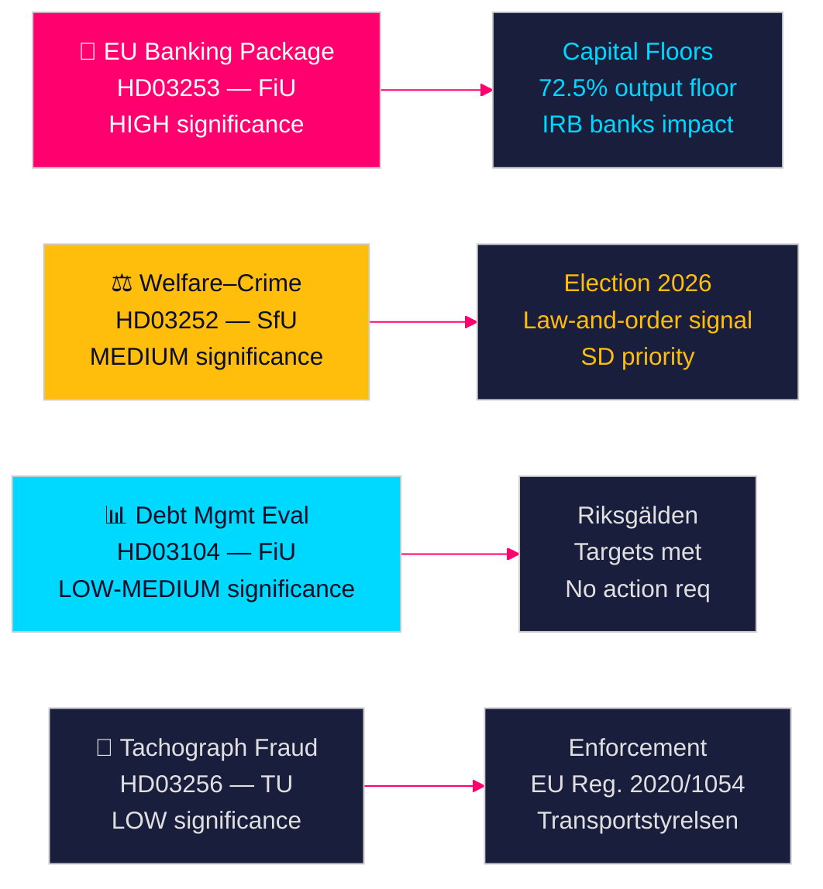

# スウェーデン政府の法案が銀行改革と福祉制裁を示唆

**著者**: James Pether Sörling  
**日付**: 2026-04-28  
**分類**: 公開 | 信頼度: 高 [B2]  
**実行ID**: 25037283767  

---

## 🎯 要約

Tidö政権は2026年4月23日に4件の法案を提出しました。その中心はEU銀行パッケージ（HD03253）の実施——2014年以来最も重要な金融規制改革——に加え、収監者への社会給付制限（HD03252）、5年間の債務管理評価（HD03104）、タコグラフ不正の執行強化（HD03256）です。これらの法案は、少数連立政権にもかかわらず、政府が立法議題を計画通り実行していることを示しています。EU銀行パッケージは、スウェーデンの銀行セクターの資本構造を直接的に再編するバーゼルIII資本改革への整合を意味します。

## 🧭 この文書が支援する決定

1. **議会戦略**: FiUは財政委員会の2つの法案（HD03103、HD03253）を扱い、SfUは1件（HD03252）、TUは1件（HD03256）を扱います。野党は銀行パッケージのリスクウェイト実施に異議を唱えるか、EU転換を交渉の余地なしとして受け入れるかを決定する必要があります。
2. **選挙戦略**: HD03252（福祉と犯罪の関係）はTidö連立に対し法と秩序に関する福祉政策の事前シグナルを与え、一方でS、MP、Vはこれを更生プログラムの烙印付けとして枠組みすることができます。各党は2026年秋の選挙前に立場を調整する必要があります。
3. **リスク評価**: EU銀行パッケージの自己資本要件変更により、スウェーデンの銀行の資金調達コストが10〜15ベーシスポイント上昇する可能性があります（高い信頼度）。これはBankföreningenへのロビー圧力とFiUへの政策決定を生み出します。

## ⚡ 60秒で読む

- **EU銀行パッケージ（HD03253）** [B2 高]: CRR3/CRD6の実施がスウェーデンの銀行の資本フロアを引き締めます。Nordea、SEB、Handelsbanken、Swedbankは住宅ローンに対するリスクウェイトフロアの改定（IRBアウトプットフロア72.5%）に直面します。予想される規制上の資本への影響：Tier 1要件の緩やかな増加 [riksdagen.se]。
- **福祉・犯罪改革（HD03252）** [C2 中]: kontrollerat boendeまたはsäkerhetsförvaringの施設内にいる者のsocialförsäkringsförmånerを制限します。SDの政治的優先事項。SとVは更生を理由に反対しています [riksdagen.se]。
- **債務管理評価（HD03104）** [B3 中]: Riksgäldenは2021〜2025年の債務アンカー目標を達成し、中央政府の債務はGDPの〜24%から〜19%に減少しました。政府のskriveleは現行の枠組みへの信頼を示しています。議会での対応は不要 [riksdagen.se]。
- **タコグラフ執行（HD03256）** [B3 中]: タコグラフ不正に対するより高い罰則と強化された執行権限。EU規則2020/1054を実施します。国境を越えた組織的な不正ネットワークが対象です [riksdagen.se]。

## 🔭 主な今後のシグナル

**注目**: 2026年5月のHD03253（EU銀行パッケージ）に関するFiU委員会の公聴会。Bankföreningenまたはリクスバンクがリスクウェイトフロアに関して否定的な意見を提出した場合、修正案が生じ実施が遅延する可能性があります——今会期で最も重要な単独の金融規制イベントです。

<!-- source-sha: 85156e01acda6f6589295f5a1f9197b815c84bc8 -->
