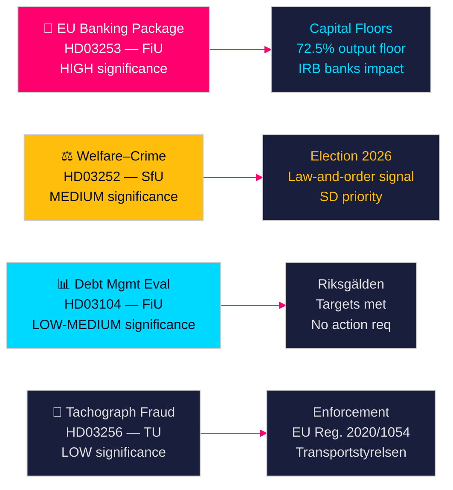

# 스웨덴 정부 법안, 은행 개혁과 복지 제재 예고

**저자**: James Pether Sörling  
**날짜**: 2026-04-28  
**분류**: 공개 | 신뢰도: 높음 [B2]  
**실행 ID**: 25037283767  

---

## 🎯 핵심 요약

Tidö 정부는 2026년 4월 23일 4건의 법안을 제출했습니다. 주요 내용은 EU 은행 패키지(HD03253) 이행——2014년 이후 가장 포괄적인 금융 규제 개혁——과 함께 수감자 사회급여 제한(HD03252), 5년간 부채 관리 평가(HD03104), 타코그래프 사기 집행 강화(HD03256)입니다. 이들 법안은 소수 연립 정부임에도 불구하고 입법 의제를 일정대로 추진하는 정부를 보여주며, EU 은행 패키지는 스웨덴 은행 부문의 자본 구조를 직접 재편할 바젤 III 자본 개혁에 대한 스웨덴의 정렬을 나타냅니다.

## 🧭 이 문서가 지원하는 결정

1. **의회 전략**: FiU는 재정위원회 법안 2건(HD03103, HD03253)을 다루고, SfU는 1건(HD03252), TU는 1건(HD03256)을 다룹니다. 야당은 은행 패키지의 위험 가중치 이행에 이의를 제기할지 아니면 EU 전환을 협상 불가로 수용할지 결정해야 합니다.
2. **선거 포지셔닝**: HD03252(복지–범죄 연계)는 Tidö 연립에 법과 질서 복지 정책에 관한 사전 신호를 제공하는 반면, S, MP, V는 이를 재활 프로그램에 대한 낙인으로 규정할 수 있습니다. 각 당은 2026년 가을 선거 전에 입장을 조율해야 합니다.
3. **위험 평가**: EU 은행 패키지의 자본 요건 변경으로 스웨덴 은행의 자금 조달 비용이 10~15 베이시스 포인트 상승할 수 있으며(높은 신뢰도), 이는 Bankföreningen에 대한 로비 압력과 FiU에 대한 정책 결정을 초래합니다.

## ⚡ 60초 요약

- **EU 은행 패키지(HD03253)** [B2 높음]: CRR3/CRD6 이행으로 스웨덴 은행의 자본 하한선이 강화됩니다. Nordea, SEB, Handelsbanken, Swedbank는 주택 담보 대출에 대한 위험 가중치 하한선 개정(IRB 출력 하한 72.5%)에 직면합니다. 예상 규제 자본 영향: Tier 1 요건 완만한 증가 [riksdagen.se].
- **복지·범죄 개혁(HD03252)** [C2 중간]: kontrollerat boende 또는 säkerhetsförvaring에 있는 자의 socialförsäkringsförmåner를 제한합니다. SD의 정치적 우선순위. S와 V는 재활을 근거로 반대합니다 [riksdagen.se].
- **부채 관리 평가(HD03104)** [B3 중간]: Riksgälden은 2021~2025년 부채 앵커 목표를 달성했으며, 중앙 정부 부채는 GDP의 ~24%에서 ~19%로 감소했습니다. 정부 skrivelse는 현재 체계에 대한 신뢰를 나타냅니다. 의회 조치 불필요 [riksdagen.se].
- **타코그래프 집행(HD03256)** [B3 중간]: 타코그래프 사기에 대한 더 높은 처벌과 강화된 집행 권한. EU 규정 2020/1054 이행. 국경을 초월한 조직적 사기 네트워크가 대상 [riksdagen.se].

## 🔭 주요 미래 신호

**주목**: 2026년 5월 HD03253(EU 은행 패키지)에 관한 FiU 위원회 청문회. Bankföreningen 또는 Riksbanken이 위험 가중치 하한선에 관해 부정적 의견을 제출하면 개정이 촉발되고 이행이 지연될 수 있습니다——이번 회기의 가장 중요한 단일 금융 규제 이벤트입니다.

<!-- source-sha: 85156e01acda6f6589295f5a1f9197b815c84bc8 -->
