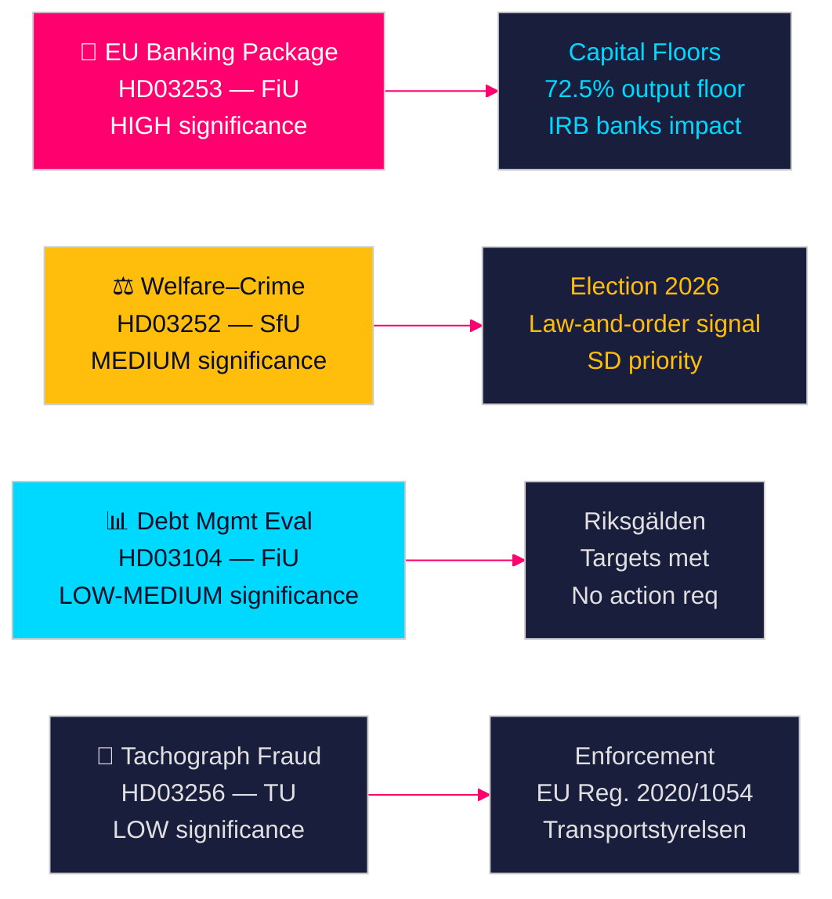

# Zweedse regeringsvoorstellen signaleren bankhervormingen en welzijnssancties

**Auteur**: James Pether Sörling  
**Datum**: 2026-04-28  
**Classificatie**: OPENBAAR | Betrouwbaarheidsniveau: HOOG [B2]  
**Uitvoerings-ID**: 25037283767  

---

## 🎯 BLUF

De Tidö-regering diende op 23 april 2026 vier voorstellen in, aangevoerd door de implementatie van het EU-bankenpakket (HD03253) — de meest ingrijpende financiële regulering sinds 2014 — samen met een politiek geladen welzijnsbeperking voor gedetineerden (HD03252), de vijfjaarlijkse evaluatie van schuldbeheer (HD03104) en handhaving van tachograaffraudue (HD03256). Samen signaleren deze een regering die haar wetgevingsagenda tijdig uitvoert ondanks een minderheidskabinet, waarbij het EU-bankenpakket de afstemming van Zweden op de Basel III-kapitaalhervormingen vertegenwoordigt die de kapitaalstructuur van de Zweedse bankensector direct zullen hervormen.

## 🧭 Beslissingen die dit document ondersteunt

1. **Parlementaire strategie**: FiU behandelt twee financiëncommissievoorstellen (HD03103, HD03253); SfU behandelt één (HD03252); TU behandelt één (HD03256) — oppositiepartijen moeten beslissen of ze de implementatie van risicogewichten van het bankenpakket betwisten of EU-transposition als niet-onderhandelbaar accepteren.
2. **Electorale positionering**: HD03252 (welzijn–misdaad nexus) geeft de Tidö-coalitie een vooruitlopend signaal over wet-en-ordebeleid, terwijl S, MP en V het kunnen framen als stigmatisering van rehabilitatieprogramma's. Partijen moeten hun positie kalibreren voor de verkiezingen van najaar 2026.
3. **Risicobeoordeling**: De gewijzigde kapitaalvereisten van het EU-bankenpakket kunnen de financieringskosten van Zweedse banken verhogen met 10–15 basispunten (HOGE betrouwbaarheid), wat lobbydruk creëert voor Bankföreningen en een beleidsbeslissing voor FiU.

## ⚡ 60-seconden lezing

- **EU-bankenpakket (HD03253)** [B2 HOOG]: CRR3/CRD6-implementatie verstrakt kapitaalvloeren voor Zweedse banken. Nordea, SEB, Handelsbanken, Swedbank worden geconfronteerd met herziene risicogewichtsvloeren voor woninghypotheken (IRB-outputvloer 72,5 %). Verwacht regulatoir kapitaaleffect: matige stijging van Tier 1-vereisten [riksdagen.se].
- **Welzijn–misdaadhervorming (HD03252)** [C2 GEMIDDELD]: Beperkt socialförsäkringsförmåner voor personen in kontrollerat boende of säkerhetsförvaring. SD-politieke prioriteit; tegengewerkt door S en V op rehabilitatiegronden [riksdagen.se].
- **Schuldbeheer evaluatie (HD03104)** [B3 GEMIDDELD]: Riksgälden behaalde schuldanker-doelstellingen 2021–2025; staatsschuld daalde van ~24 % naar ~19 % van het BBP. Regeringsskrivelse signaleert vertrouwen in het huidige kader; geen parlementaire actie vereist [riksdagen.se].
- **Tachograafhandhaving (HD03256)** [B3 GEMIDDELD]: Hogere straffen en versterkte handhavingsbevoegdheden voor tachograaffraude. Implementeert EU-verordening 2020/1054. Grensoverschrijdende georganiseerde fraudenetwerken zijn het doelwit [riksdagen.se].

## 🔭 Belangrijkste toekomstsignaal

**Volg**: FiU-commissievergadering over HD03253 (EU-bankenpakket) in mei 2026. Als Bankföreningen of Riksbanken negatieve adviezen indienen over risicogewichtsvloeren, kan dit wijzigingen teweegbrengen en de implementatie vertragen — de meest significante financiële reguleringsgebeurtenis van deze zitting.

<!-- source-sha: 85156e01acda6f6589295f5a1f9197b815c84bc8 -->
