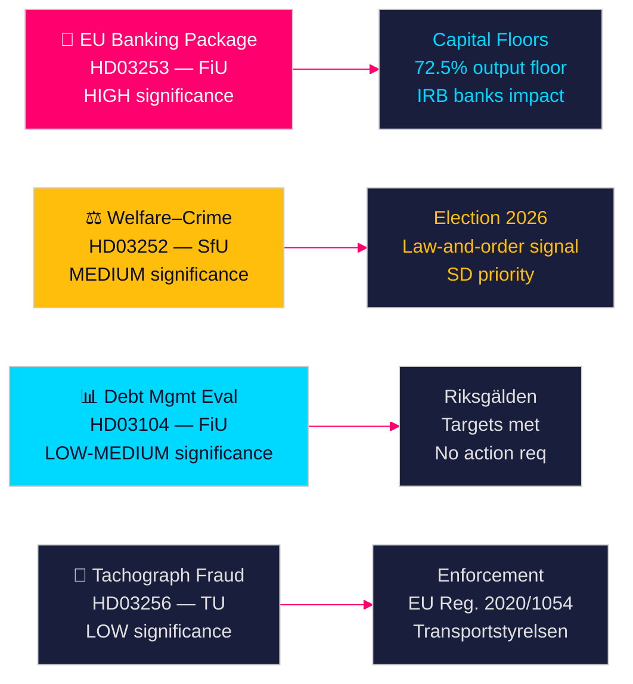

# Svenske regjeringsproposisjoner signaliserer bankereform og velferdsrestriksjoner

**Forfatter**: James Pether Sörling  
**Dato**: 2026-04-28  
**Klassifisering**: OFFENTLIG | Konfidensnivå: HØY [B2]  
**Kjørings-ID**: 25037283767  

---

## 🎯 BLUF

Tidö-regjeringen la frem fire proposisjoner den 23. april 2026, ledet av implementeringen av EU-bankpakken (HD03253) — den mest gjennomgripende finansielle reguleringen siden 2014 — sammen med en politisk ladet velferdsrestriksjon for frihetsberøvede (HD03252), femårsevalueringen av gjeldsforvaltningen (HD03104) og håndhevelse av fartsskriversvindel (HD03256). Samlet signaliserer disse en regjering som gjennomfører sin lovgivningsagenda etter planen til tross for en mindretallskoalisjon, der EU-bankpakken representerer Sveriges tilpasning til Basel III-kapitalreformene som direkte vil omforme den svenske banksektorens kapitalstruktur.

## 🧭 Beslutninger dette notatet støtter

1. **Parlamentarisk strategi**: FiU behandler to finanskomiteen-proposisjoner (HD03103, HD03253); SfU behandler én (HD03252); TU behandler én (HD03256) — opposisjonspartiene må bestemme seg for om de vil utfordre bankpakkens implementering av risikovekter eller akseptere EU-transposisjon som ikke-forhandlingsbart.
2. **Valgposisjonering**: HD03252 (velferd–kriminalitetsneksus) gir Tidö-koalisjonen et forhåndssignal om lov-og-orden velferdspolitikk, mens S, MP og V kan fremstille det som stigmatisering av rehabiliteringsprogrammer. Partiene må kalibrere sin posisjon foran høstvalget 2026.
3. **Risikovurdering**: EU-bankpakkens endrede kapitalkrav kan øke svenske bankers finansieringskostnader med 10–15 basispunkter (HØY konfidensnivå), noe som skaper et lobbypress for Bankföreningen og en politisk beslutning for FiU.

## ⚡ 60-sekunders lesing

- **EU-bankpakke (HD03253)** [B2 HØY]: CRR3/CRD6-implementering strammer kapitalgulv for svenske banker. Nordea, SEB, Handelsbanken, Swedbank møter reviderte risikovektsgulv for boliglån (IRB-outputgulv 72,5 %). Beregnet regulatorisk kapitaleffekt: moderat økning i Tier 1-krav [riksdagen.se].
- **Velferd–kriminalitetsreform (HD03252)** [C2 MIDDELS]: Begrenser socialförsäkringsförmåner for personer i kontrollerat boende eller säkerhetsförvaring. SDs politiske prioritering; motarbeidet av S og V på rehabiliteringsgrunnlag [riksdagen.se].
- **Gjeldsforvaltningsevaluering (HD03104)** [B3 MIDDELS]: Riksgälden oppfylte gjeldsmålanker 2021–2025; statslig gjeld falt fra ~24 % til ~19 % av BNP. Regjeringsskrivelse signaliserer tillit til nåværende rammeverk; ingen parlamentarisk handling kreves [riksdagen.se].
- **Fartsskriverhåndhevelse (HD03256)** [B3 MIDDELS]: Høyere straffer og styrket håndhevelsesmyndighet for fartsskriversvindel. Implementerer EU-forordning 2020/1054. Grenseoverskridende organiserte svindelnettverk er målet [riksdagen.se].

## 🔭 Viktigste fremtidssignal

**Følg med**: FiU-komiteens høring om HD03253 (EU-bankpakken) i mai 2026. Dersom Bankföreningen eller Riksbanken sender inn negative høringssvar om risikovektsgulvene, kan dette utløse endringer og forsinke implementeringen — den viktigste enkeltbegivenheten innen finansiell regulering i inneværende sesjon.

<!-- source-sha: 85156e01acda6f6589295f5a1f9197b815c84bc8 -->
