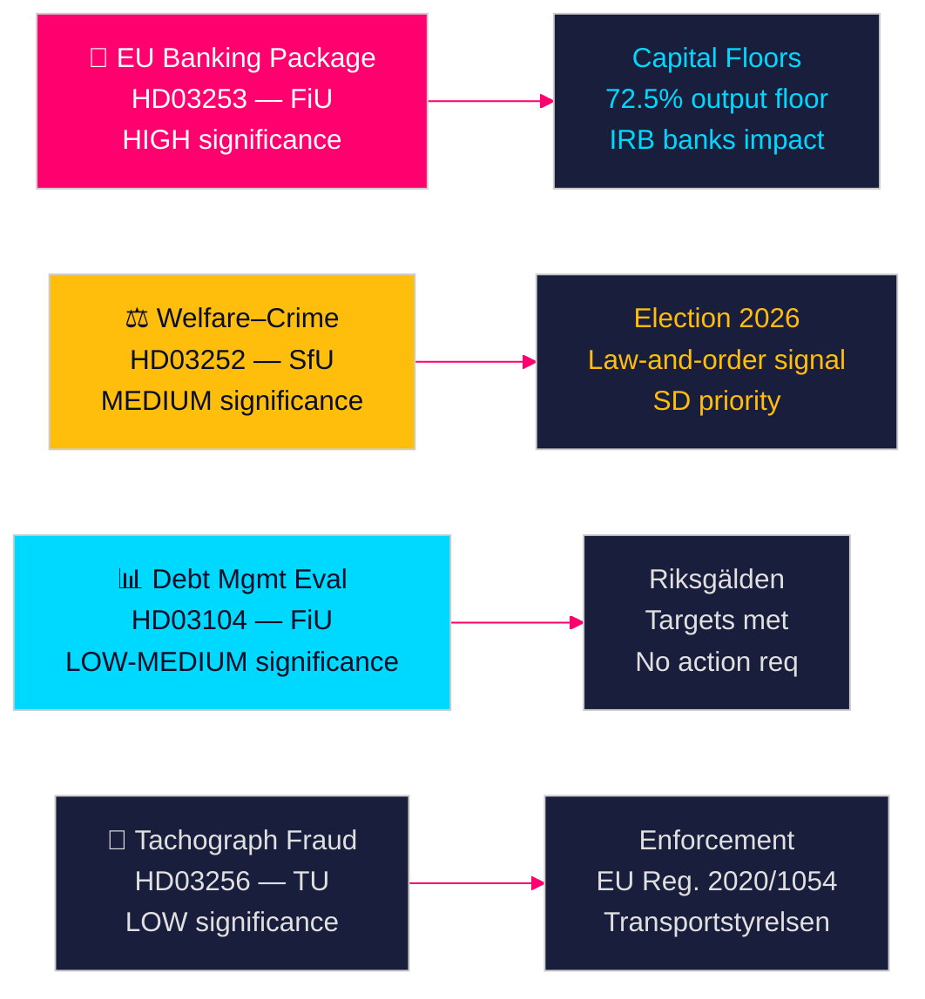

# Svenska statliga propositioner signalerar bankreform och välfärdssanktioner

**Författare**: James Pether Sörling  
**Datum**: 2026-04-28  
**Klassificering**: OFFENTLIG | Konfidensgrad: HÖG [B2]  
**Körnings-ID**: 25037283767  

---

## 🎯 BLUF

Tidö-regeringen lade fram fyra propositioner den 23 april 2026, anförda av implementeringen av EU:s bankpaket (HD03253) — den mest genomgripande finansiella regleringen sedan 2014 — tillsammans med en politiskt laddad välfärdsbegränsning för frihetsberövade (HD03252), femårsutvärderingen av skuldförvaltningen (HD03104) och tillsyn av fardskrivarbedrägeri (HD03256). Sammantaget signalerar dessa en regering som genomför sitt lagstiftningsarbete enligt plan trots en minoritetskoalition, där EU:s bankpaket representerar Sveriges anpassning till Basel III:s kapitalreformer som direkt kommer att omforma den svenska banksektorns kapitalstruktur.

## 🧭 Beslut detta PM stöder

1. **Parlamentarisk strategi**: FiU hanterar två finansutskottspropositioner (HD03103, HD03253); SfU hanterar en (HD03252); TU hanterar en (HD03256) — oppositionspartierna måste besluta om de ska ifrågasätta bankpaketets implementering av riskvikter eller acceptera EU-transposition som icke-förhandlingsbart.
2. **Valpositionering**: HD03252 (välfärd–brottslingsnexus) ger Tidö-koalitionen en signal om lag-och-ordnings välfärdspolitik inför valet, medan S, MP och V kan rama in det som stigmatisering av rehabiliteringsprogram. Partierna måste kalibrera sin position inför höstvalet 2026.
3. **Riskbedömning**: EU-bankpaketets ändrade kapitalkrav kan höja svenska bankers finansieringskostnader med 10–15 baspunkter (HÖG konfidensgrad), vilket skapar ett lobbytryck för Bankföreningen och ett policybeslut för FiU.

## ⚡ 60-sekunders läsning

- **EU-bankpaket (HD03253)** [B2 HÖG]: CRR3/CRD6-implementering skärper kapitalgolven för svenska banker. Nordea, SEB, Handelsbanken, Swedbank möter reviderade riskviktsgolv för bostadslån (IRB-outputgolv 72,5 %). Beräknad regulatorisk kapitaleffekt: måttlig ökning av Tier 1-krav [riksdagen.se].
- **Välfärd–brottsreform (HD03252)** [C2 MEDIUM]: Begränsar socialförsäkringsförmåner för personer i kontrollerat boende eller säkerhetsförvaring. SD:s politiska prioritering; motarbetas av S och V på rehabiliteringsgrunder [riksdagen.se].
- **Skuldförvaltningsutvärdering (HD03104)** [B3 MEDIUM]: Riksgälden uppfyllde skuldankarmål 2021–2025; statsskulden sjönk från ~24 % till ~19 % av BNP. Regeringsskrivelse signalerar förtroende för nuvarande ramverk; inget parlamentariskt agerande krävs [riksdagen.se].
- **Fardskrivartillsyn (HD03256)** [B3 MEDIUM]: Höjda påföljder och förstärkta tillsynsbefogenheter för fardskrivarbedrägeri. Implementerar EU-förordning 2020/1054. Gränsöverskridande organiserade bedrägerinettverk är målet [riksdagen.se].

## 🔭 Viktigaste framåtsignalen

**Bevaka**: FiU:s utskottshearing om HD03253 (EU-bankpaketet) i maj 2026. Om Bankföreningen eller Riksbanken lämnar negativa remissvar om riskviktsgolven kan det utlösa ändringar och fördröja implementeringen — den viktigaste enskilda finansiella regleringshändelsen under innevarande session.

<!-- source-sha: 85156e01acda6f6589295f5a1f9197b815c84bc8 -->
