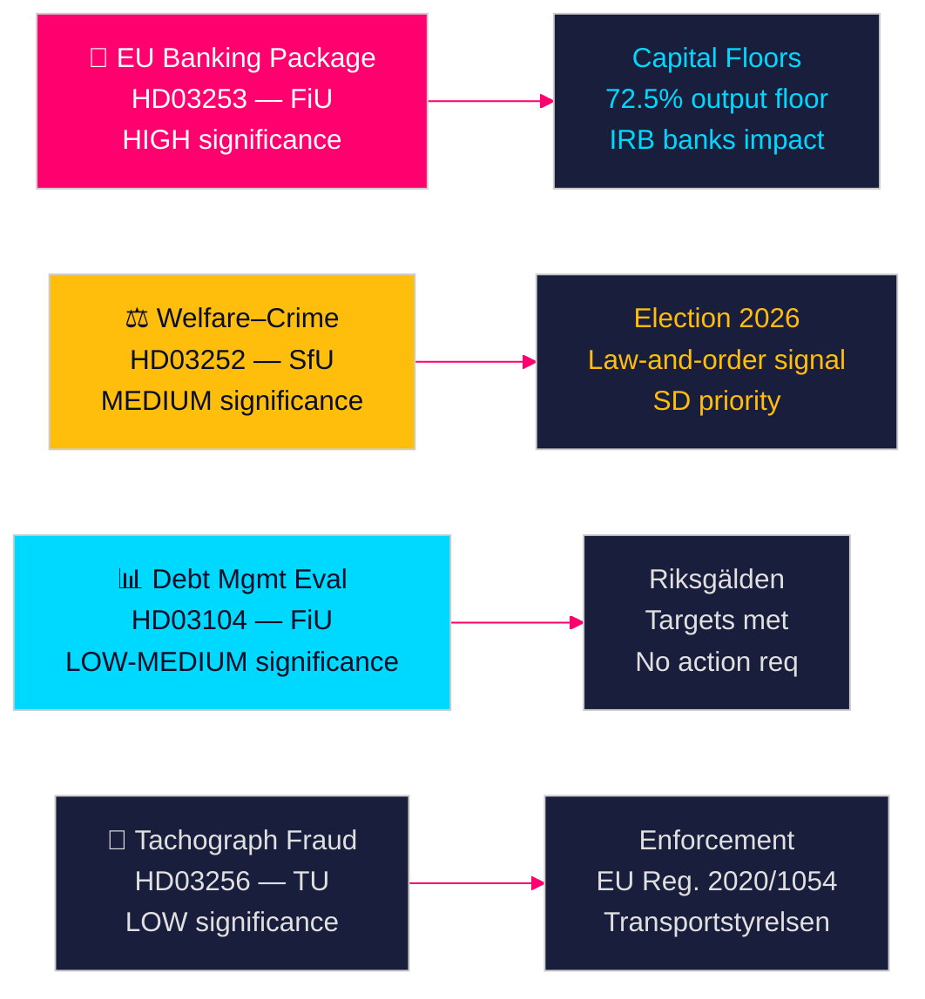

# 瑞典政府提案预示银行改革与福利制裁

**作者**：James Pether Sörling  
**日期**：2026-04-28  
**分类**：公开 | 置信度：高 [B2]  
**运行ID**：25037283767  

---

## 🎯 执行摘要

Tidö政府于2026年4月23日提出四项议案，由欧盟银行一揽子计划（HD03253）的实施牵头——自2014年以来最重要的金融监管改革——以及对在押人员的福利限制措施（HD03252）、五年债务管理评估（HD03104）和打击行驶记录仪欺诈（HD03256）。这些议案总体上表明，政府尽管是少数派联合政府，仍在按计划推进立法议程。欧盟银行一揽子计划代表着瑞典与巴塞尔III资本改革的接轨，将直接重塑瑞典银行业的资本结构。

## 🧭 本文件支持的决策

1. **议会策略**：FiU负责处理两项财政委员会提案（HD03103、HD03253）；SfU处理一项（HD03252）；TU处理一项（HD03256）——反对党必须决定是否挑战银行一揽子计划的风险权重实施，或将欧盟转化视为不可谈判接受。
2. **选举定位**：HD03252（福利与犯罪关联）为Tidö联盟提供了法律与秩序福利政策的预选信号，而S、MP和V可将其定性为对康复项目的污名化。各党需在2026年秋季大选前校准各自立场。
3. **风险评估**：欧盟银行一揽子计划的资本要求变动可能使瑞典银行融资成本提高10至15个基点（高置信度），为Bankföreningen带来游说压力，也为FiU带来政策决策。

## ⚡ 60秒速读

- **欧盟银行一揽子计划（HD03253）** [B2 高]：CRR3/CRD6实施收紧了瑞典银行的资本下限。Nordea、SEB、Handelsbanken、Swedbank面临住房抵押贷款风险权重下限修订（IRB产出下限72.5%）。预计监管资本影响：一级资本要求适度上升 [riksdagen.se]。
- **福利与犯罪改革（HD03252）** [C2 中]：限制处于kontrollerat boende或säkerhetsförvaring中人员的socialförsäkringsförmåner。SD的政治优先事项；S和V以康复理由反对 [riksdagen.se]。
- **债务管理评估（HD03104）** [B3 中]：Riksgälden完成了2021至2025年的债务锚定目标；中央政府债务从约占GDP 24%降至19%。政府skrivelse表明对现行框架的信心；无需议会采取行动 [riksdagen.se]。
- **行驶记录仪执法（HD03256）** [B3 中]：对行驶记录仪欺诈实施更高处罚和强化执法权限。执行欧盟法规2020/1054。跨境有组织欺诈网络为打击对象 [riksdagen.se]。

## 🔭 主要前瞻信号

**关注**：2026年5月FiU委员会关于HD03253（欧盟银行一揽子计划）的听证会。若Bankföreningen或Riksbanken就风险权重下限提交否定意见，可能引发修订并推迟实施——这是本届议会最重要的单一金融监管事件。

<!-- source-sha: 85156e01acda6f6589295f5a1f9197b815c84bc8 -->
