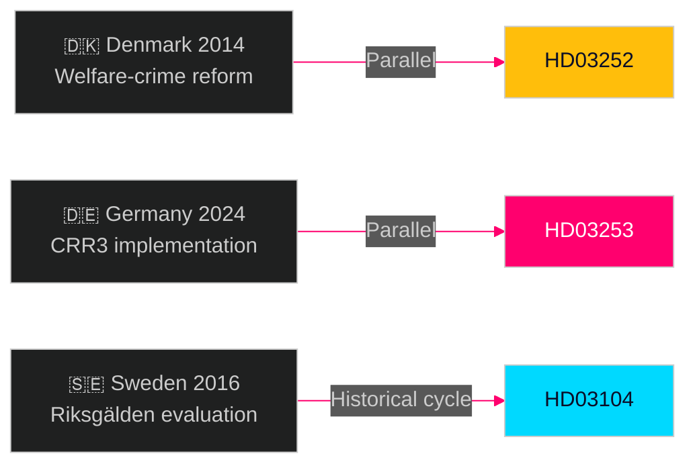

# Historical Parallels — Propositions 2026-04-28

**Author**: James Pether Sörling  
**Date**: 2026-04-28  
**Classification**: PUBLIC | Confidence: MEDIUM [C2]  

## Parallel 1: Welfare Restriction for Inmates — 2014 Danish Reform

**Context**: Denmark's Folketing passed a near-identical amendment to its sociallovgivning in 2014, restricting active social assistance for persons in custody. The reform passed 89-23 with cross-bloc support after a 6-month remiss period.

**Parallel to HD03252**: Almost identical policy logic — welfare state discipline, public cost reduction, law-enforcement signal. The Danish reform was championed by a right-of-centre coalition with dependency-party support.

**Outcome**: Reform passed without major incident. Administrative implementation (coordination between Kriminalvården equivalent and the welfare authority) took 18 months and produced initial overpayment recovery backlogs.

**Lesson for Sweden**: The administrative implementation challenge will likely be larger than the political passage challenge. Kriminalvården and Försäkringskassan coordination protocols are the watch item post-passage.

**Evidence**: HD03252 — riksdagen.se; Danish Aktivlov 2014

---

## Parallel 2: CRR3 Capital Requirements — German Implementation 2023–2024

**Context**: Germany was the first major EU economy to work through the political economy of CRR3 transposition, facing significant pushback from the Sparkassen association (savings banks) that argued the output floor was designed for large IRB banks and would disproportionately burden smaller institutions.

**Parallel to HD03253**: Sweden faces a similar asymmetric impact argument — the major Swedish banks (SEB, Swedbank, SHB, Nordea) are sophisticated IRB modellers; the output floor standardisation hits them differently than smaller institutions. Bankföreningen has been calibrating its remissvar accordingly.

**Outcome**: Germany implemented CRR3 with a phase-in schedule aligned to EBA's transition provisions and added national Pillar-2 guidance for smaller banks. BaFin created a dedicated implementation support package.

**Lesson for Sweden**: FI may need to provide similar tailored guidance for savings banks and credit institutions below the major bank threshold. HD03253 does not address this — it may emerge as a remiss issue.

**Evidence**: HD03253 — riksdagen.se; BaFin CRR3 implementation Q&A 2024

---

## Parallel 3: Riksgälden 5-Year Evaluation — Previous Cycle 2016

**Context**: The previous Riksgälden mandate evaluation (covering 2011–2015) was presented to FiU in 2016. That evaluation was conducted against a backdrop of near-zero interest rates and rising government surpluses.

**Parallel to HD03104**: HD03104 covers the 2021–2025 period — an extraordinary macro environment (COVID, inflation shock, rate rises). The evaluation methodology must account for counterfactual challenges that did not exist in the 2016 cycle.

**Outcome in 2016**: FiU noted the evaluation positively; Riksgälden received the authorisation to maintain its borrowing instruments. No significant political debate emerged.

**Lesson**: The 2026 evaluation (HD03104) is likely to follow the same procedural path. The macro complexity makes the evaluation more analytically interesting but not more politically contentious.

**Evidence**: HD03104 — riksdagen.se; FiU betänkande 2016/17:FiU5

---

## Historical Pattern: End-of-Mandate Legislative Sprint

**Pattern**: Swedish governments consistently front-load their final pre-election parliamentary session with flagship legislation to claim delivery. The Alliansen government in 2013-14 submitted 14 propositions in a single April week. The Social Democratic minority government in 2017-18 submitted 18 propositions in March 2018.

**Parallel**: The 2026-04-23 batch (4 propositions from 3 departments) is consistent with this pattern but is notably compact — either the pipeline has already been cleared, or more proposals are forthcoming in the May 2026 session.

**Monitoring indicator**: Total proposition count in May–June 2026 session compared to 2021–2022 (last pre-election sprint).

