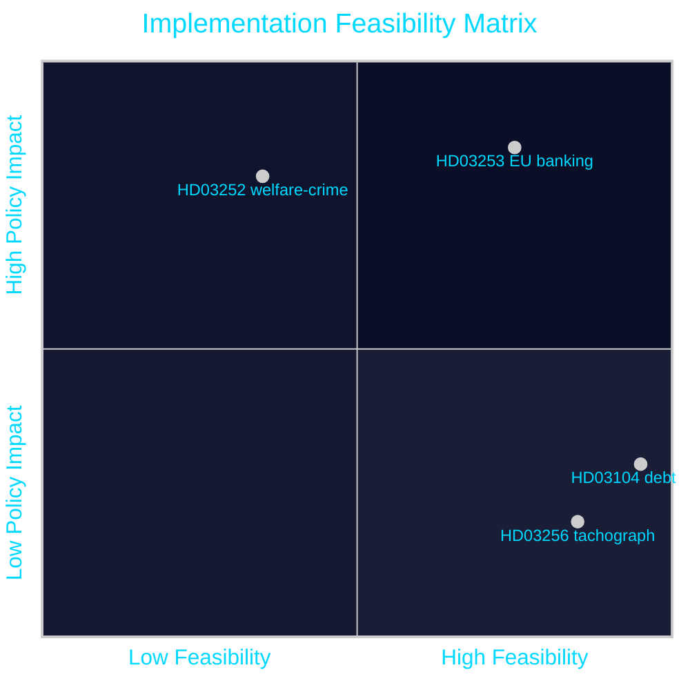

# Implementation Feasibility — Propositions 2026-04-28

**Author**: James Pether Sörling  
**Date**: 2026-04-28  
**Classification**: PUBLIC | Confidence: MEDIUM [C2]  

---

## HD03252 — Welfare Restriction for Inmates

### Implementation Assessment

| Dimension | Assessment | Evidence |
|-----------|-----------|---------|
| Legal clarity | MEDIUM — EU coordination law ambiguity | HD03252 — riksdagen.se |
| Administrative capacity | LOW — Försäkringskassan IT system changes required | HD03252 — riksdagen.se |
| Responsible agency | Försäkringskassan (primary), Kriminalvården (data feed) | HD03252 — riksdagen.se |
| Statskontoret relevance | none found | — |
| Lead time | 12–18 months post-passage | Danish parallel 2014 |
| Key implementation risk | Data sharing protocol between Kriminalvården and FK | HD03252 — riksdagen.se |

**IRRR (Implementation Risk/Reward Ratio)**: HIGH RISK / MEDIUM REWARD. The welfare cost savings are modest (estimated 150–300 MSEK/year) relative to the system integration investment required.

---

## HD03253 — EU Banking Package (CRR3/CRD6)

### Implementation Assessment

| Dimension | Assessment | Evidence |
|-----------|-----------|---------|
| Legal clarity | HIGH — EU mandatory transposition with EBA technical standards | HD03253 — riksdagen.se |
| Administrative capacity | MEDIUM — FI needs new supervision protocols | HD03253 — riksdagen.se |
| Responsible agency | Finansinspektionen (primary) | HD03253 — riksdagen.se |
| Statskontoret relevance | none found | — |
| Lead time | 24–36 months full implementation (phased output floor) | EBA CRR3 transition schedule |
| Key implementation risk | IRB model re-approval backlog at FI | HD03253 — riksdagen.se |

**IRRR**: LOW RISK / HIGH REWARD. EU mandatory transposition — implementation path is standardised. The risk is FI capacity to process capital model reviews at scale.

---

## HD03104 — Debt Management Evaluation

### Implementation Assessment

| Dimension | Assessment | Evidence |
|-----------|-----------|---------|
| Legal clarity | HIGH — skrivelse, no new law | HD03104 — riksdagen.se |
| Administrative impact | NONE — evaluation only | HD03104 — riksdagen.se |
| Responsible agency | Riksgäldskontoret | HD03104 — riksdagen.se |
| Statskontoret relevance | none found | — |
| Lead time | N/A — parliamentary noting only | — |

**IRRR**: N/A — no implementation required.

---

## HD03256 — Tachograph Fraud Enforcement

### Implementation Assessment

| Dimension | Assessment | Evidence |
|-----------|-----------|---------|
| Legal clarity | HIGH — EU Reg 2020/1054 transposition | HD03256 — riksdagen.se |
| Administrative capacity | MEDIUM — Transportstyrelsen inspection protocol upgrade | HD03256 — riksdagen.se |
| Responsible agency | **Transportstyrelsen** | HD03256 — riksdagen.se |
| **Statskontoret relevance** | **none found** | — |
| Lead time | 6–12 months (Transportstyrelsen inspection training) | HD03256 — riksdagen.se |
| Key implementation risk | Cross-border enforcement coordination | HD03256 — riksdagen.se |

**IRRR**: LOW RISK / LOW REWARD. Routine EU transposition; Transportstyrelsen has clear mandate; no political controversy expected.

---

## Feasibility Summary

