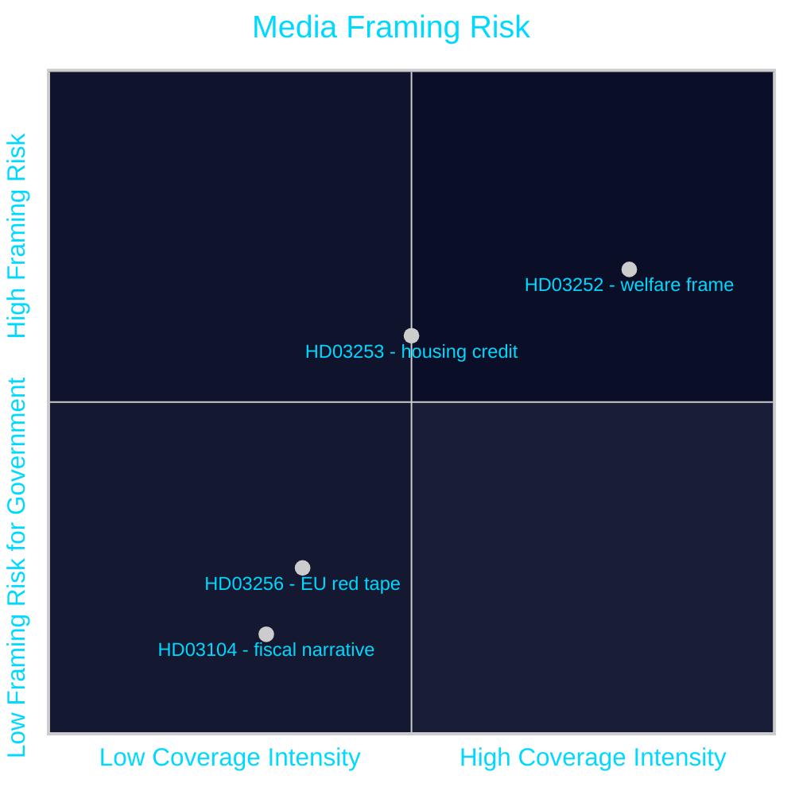

# Media Framing Analysis — Propositions 2026-04-28

**Author**: James Pether Sörling  
**Date**: 2026-04-28  
**Classification**: PUBLIC | Confidence: MEDIUM [C2]  

## Predicted Media Frame Clusters

### Frame 1 (HD03252): "Welfare Fairness vs. Rights"

**Government preferred narrative**: "Sweden tightens welfare for criminals — taxpayers' money should not go to people in controlled housing or custody." Emphasis on cost savings, fairness, and Tidö delivery.

**Opposition preferred narrative**: "Government punishes families of inmates — benefit restrictions cascade to dependent household members." Emphasis on proportionality failures and collateral harm.

**Expected media outlets**:
- **SD-aligned / conservative**: Nyheter Idag, Samhällsnytt — adopt government frame wholesale
- **Centre-right**: Svenska Dagbladet Nyheter — balanced coverage, FiU/SfU committee hearing focus
- **Centre-left**: Dagens Nyheter — legal analysis of Lagrådet risks; cite welfare rights researchers
- **Left**: Aftonbladet, Expressen — opposition frame, human interest stories on affected families

---

### Frame 2 (HD03253): "Banking Stability vs. Credit Access"

**Financial sector narrative**: "CRR3 strengthens bank resilience — costly but necessary." Bankföreningen will emphasise capital raise burden; FI will emphasise systemic stability.

**Housing market narrative**: "EU rules tighten mortgage credit — homeowners face higher costs." Most likely to be picked up by DI (Dagens Industri) and SvD Näringsliv.

**Expected media outlets**:
- **Business press**: DI, SvD Näringsliv — focus on capital raise timeline and mortgage impact
- **General press**: Low interest; will follow only if housing prices move visibly
- **TV/Radio**: SR Ekot may run a 90-second explainer; SVT Rapport unlikely to lead

---

### Frame 3 (HD03104): "Sweden's Finances Are Strong"

**Government preferred narrative**: "Sweden's debt management is world class — a positive evaluation confirms fiscal discipline." Will be cited in Finansdepartementet press release.

**Alternative narrative**: Minimal — there is no viable counter-frame because the evaluation is positive and technical.

**Expected media outlets**: DI and SvD Näringsliv will run brief items. No general press coverage expected.

---

### Frame 4 (HD03256): "EU Red Tape for Truck Drivers"

**Transport sector narrative**: "Another EU directive — administrative burden on Swedish hauliers." C and SD may use in rural/transport constituency messaging.

**Expected media outlets**: Transportnytt, ATL (agricultural/rural press). No major general press coverage.

---

## Framing Calendar

| Date | Expected Media Activity |
|------|------------------------|
| 2026-04-28 to 05-05 | Government pressmeddelanden on HD03252 and HD03104; initial SvD/DN items |
| 2026-05-12 to 05-16 | SfU referral hearing for HD03252 — first committee statements |
| 2026-05-26 | Riksbanken Stabilitetsrapport — potential HD03253 housing market framing |
| 2026-06-02 to 06-15 | FiU + SfU hearings peak; potential Lagrådet opinion on HD03252 |
| 2026-06-22 | Last sitting day before summer recess — vote deadline |

---

## Framing Risk Matrix

