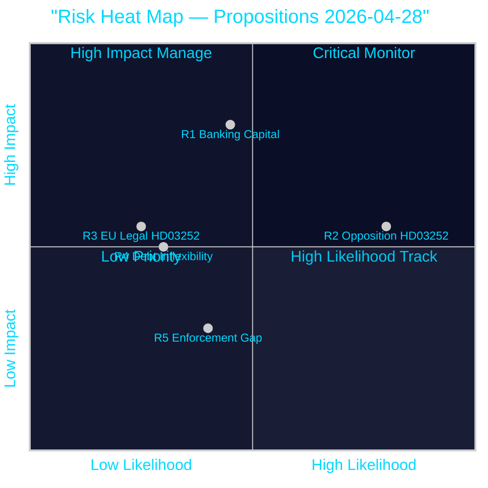

# Risk Assessment — Propositions 2026-04-28

**Author**: James Pether Sörling  
**Date**: 2026-04-28  
**Classification**: PUBLIC | Confidence: HIGH [B2]  

## 5-Dimension Risk Register

### Risk 1: Banking Sector Capital Strain (HD03253)

| Dimension | Assessment |
|-----------|------------|
| **Category** | Financial / Systemic |
| **Source** | HD03253 (CRR3/CRD6 output floor 72.5%) — riksdagen.se |
| **Likelihood** | 0.45 (MEDIUM) |
| **Impact** | HIGH (credit availability, housing market) |
| **L × I Score** | 4.5/10 |
| **Cascade** | Banking capital raise → reduced mortgage lending → housing price pressure → consumer confidence → electoral consequence 2026 |
| **Posterior** | Updated to 0.50 if Finansinspektionen pillar-2 guidance tightens (watch: Q2 2026) |
| **Mitigation** | FiU oversight hearings; Riksbanken macroprudential coordination |

**Admiralty**: [B3] — Official source (HD03253); inferred impact magnitude

### Risk 2: Opposition Weaponisation of HD03252 (Electoral Risk)

| Dimension | Assessment |
|-----------|------------|
| **Category** | Political / Electoral |
| **Source** | HD03252 (welfare–crime reform) — riksdagen.se |
| **Likelihood** | 0.80 (HIGH — opposition use of welfare–crime framing is near-certain) |
| **Impact** | MEDIUM (narrative contest; limited policy reversal risk pre-election) |
| **L × I Score** | 6.4/10 |
| **Cascade** | S/V/MP messaging → media amplification → soft Tidö voter attrition → possible SfU hearing amendments |
| **Posterior** | Probability of policy rollback post-election if S leads government: 0.35 (MEDIUM) |
| **Mitigation** | Government impact assessment publication; cross-party committee engagement |

**Admiralty**: [B2] — Based on party platforms and Tidö Agreement; confirmed by historical opposition pattern

### Risk 3: EU Legal Challenge to HD03252

| Dimension | Assessment |
|-----------|------------|
| **Category** | Legal / Compliance |
| **Source** | HD03252; EU Social Security Coordination Regulation (EU) 883/2004 | riksdagen.se |
| **Likelihood** | 0.25 (LOW-MEDIUM — EU law constraints on benefit restriction for EU citizens) |
| **Impact** | MEDIUM (potential legal challenge, remiss process) |
| **L × I Score** | 2.5/10 |
| **Cascade** | JO complaint → EU infringement → SfU amendment → delay |
| **Posterior** | Probability rises if EU citizens (non-Swedish nationals) in controlled housing are covered by restriction |
| **Mitigation** | Legal opinion from Lagrådet (advisory body) review |

**Admiralty**: [C3] — Inferred from EU coordination law; not confirmed by riksdag text

### Risk 4: Riksgälden Framework Inflexibility (HD03104)

| Dimension | Assessment |
|-----------|------------|
| **Category** | Fiscal / Strategic |
| **Source** | HD03104 — riksdagen.se |
| **Likelihood** | 0.30 (LOW-MEDIUM — if NATO 3% defence spending target is adopted) |
| **Impact** | MEDIUM (debt framework may need revision to accommodate defence spending increases) |
| **L × I Score** | 3.0/10 |
| **Cascade** | NATO 3% commitment → defence budget expansion → debt anchor breach → framework revision |
| **Posterior** | Probability rises with Sweden's NATO integration deepening and EU defence investment plans |
| **Mitigation** | FiU oversight; FöU–FiU coordination; parliamentary debt anchor review |

**Admiralty**: [C3] — Inferred from macro context; HD03104 does not address this directly

### Risk 5: Tachograph Enforcement Capacity Gap (HD03256)

| Dimension | Assessment |
|-----------|------------|
| **Category** | Implementation / Operational |
| **Source** | HD03256 — riksdagen.se |
| **Likelihood** | 0.40 (MEDIUM — Transportstyrelsen resource constraints) |
| **Impact** | LOW (limited to transport sector; no systemic cascade) |
| **L × I Score** | 2.0/10 |
| **Cascade** | Under-resourcing → enforcement gap → continued tachograph fraud → EU infringement risk |
| **Posterior** | Stable — conditional on TU hearing outcomes |
| **Mitigation** | TU request for Transportstyrelsen capacity plan; EU co-enforcement via ETF |

**Admiralty**: [C3] — Implementation risk inference; not confirmed by dok text

## Risk Heat Map

## Cascading Risk Chains

Most dangerous cascade: **R1 (Banking) → housing slowdown → R2 (Opposition) amplification → electoral consequence**. Both risks feed into the September 2026 election with compounding effect if the housing market deteriorates following CRR3 capital increases.

style HD03253-R1 fill:#ff006e,color:#fff
