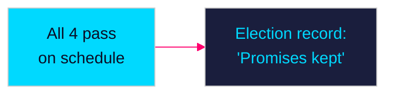

# Scenario Analysis — Propositions 2026-04-28

**Author**: James Pether Sörling  
**Date**: 2026-04-28  
**Classification**: PUBLIC | Confidence: MEDIUM [C2]  

## Scenario Framework

Three distinct scenarios for how the 2026-04-23 propositions batch will shape Swedish politics through the September 2026 election.

---

## Scenario A: Smooth Legislative Passage (Probability: 45%)

**Description**: All four propositions pass FiU/SfU/TU committees on schedule (June 2026). HD03253 EU Banking Package clears with minor technical amendments reflecting bank sector remissvar. HD03252 passes with L providing conditional support after adding a sunset clause or impact evaluation requirement. HD03104 is noted by FiU. HD03256 passes without controversy.

**Mechanism**: The Tidö coalition maintains discipline. L supports HD03252 in exchange for impact evaluation. Banking sector remissvar is incorporated technically by Finansdepartementet.

**Consequence**: Government enters September 2026 election with a completed legislative record including financial reform and welfare–crime agenda delivery. Tidö can campaign on "promises kept."

**Leading indicator**: L publicly endorses HD03252 in FiU/SfU pre-hearing statements (watch: May 2026).

**Evidence base**: HD03252, HD03253 — riksdagen.se; Tidö Agreement s.87

---

## Scenario B: HD03252 Delayed by SfU (Probability: 35%)

**Description**: HD03252 attracts a binding minority report (reservationer) from S, V, and MP in SfU. L demands proportionality analysis and Lagrådet review before final vote. The proposition is delayed until autumn session — coinciding with the election campaign, creating a negative legislative clock story for the government.

**Mechanism**: SfU opposition bloc forces extended remiss period. A critical Lagrådet opinion (yttrande) on EU coordination law compatibility triggers Finansdepartementet redrafting. Timeline slips past the June 2026 parliamentary session.

**Consequence**: Government arrives at election with an incomplete welfare–crime reform — opposition can campaign on government failure; SD becomes frustrated with coalition.

**Leading indicator**: Lagrådet issues critical opinion on HD03252 EU coordination compatibility (watch: May 2026 formal referral).

**Evidence base**: HD03252 — riksdagen.se; Lagrådet procedure (RF 8:22)

---

## Scenario C: Banking Package Creates Housing Market Flashpoint (Probability: 20%)

**Description**: FiU hearings on HD03253 surface Finansinspektionen and Riksbanken data showing that CRR3 output floor will reduce IRB-modelled mortgage exposure room by 15–20%, tightening credit supply. Swedish housing prices — already pressured — fall further in Q2 2026. Opposition pivots from welfare–crime to "Government kills housing market."

**Mechanism**: Bankföreningen remissvar documents capital raise requirements. Riksbanken macroprudential report (April/May 2026) flags reduced household credit availability. Media coverage shifts from welfare reform to housing affordability.

**Consequence**: HD03253 becomes the dominant electoral economic risk narrative. Tidö coalition faces a dual-front attack (welfare–crime from left; housing from centre-right). Potential for FiU to add transitional relief provisions.

**Leading indicator**: Riksbanken Stabilitetsrapport (May 2026) flags mortgage credit tightening as a systemic concern.

**Evidence base**: HD03253 — riksdagen.se; Riksbanken Stabilitetsrapport 2025:2

---

## Probability Sum Check

| Scenario | Probability |
|----------|------------|
| A — Smooth passage | 45% |
| B — HD03252 delayed | 35% |
| C — Banking flashpoint | 20% |
| **Total** | **100%** |

*Note: Scenarios are not mutually exclusive in all dimensions; probabilities reflect dominant path. Scenarios B + C could co-occur (probability ~8%).*
