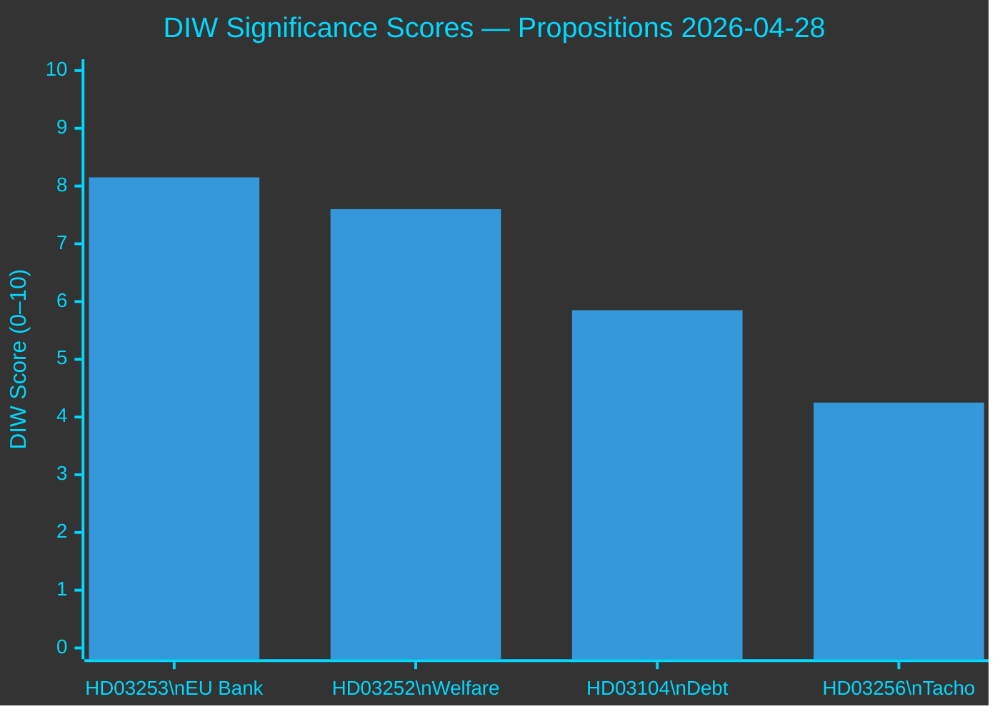
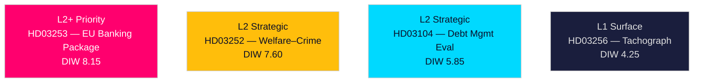

# Significance Scoring — Propositions 2026-04-28

**Author**: James Pether Sörling  
**Date**: 2026-04-28  
**Classification**: PUBLIC | Confidence: HIGH [B2]  

## DIW Scoring Methodology

Each document scored across three dimensions (1–10 each):  
- **D** (Depth): Complexity, evidence base, analytical richness  
- **I** (Impact): Systemic policy impact, societal scope  
- **W** (Watchability): Electoral salience, media interest, citizen relevance  
- **DIW Score** = (D × 0.3) + (I × 0.45) + (W × 0.25)

## Ranked Scoring Table

| Rank | dok_id | D | I | W | DIW | Evidence | Tier |
|------|--------|---|---|---|-----|----------|------|
| 1 | HD03253 | 8 | 9 | 7 | 8.15 | riksdagen.se/HD03253 (EU CRR3/CRD6, FiU) | L2+ Priority |
| 2 | HD03252 | 7 | 7 | 9 | 7.60 | riksdagen.se/HD03252 (SfU, socialförsäkringsbalken) | L2 Strategic |
| 3 | HD03104 | 7 | 6 | 4 | 5.85 | riksdagen.se/HD03104 (FiU, Riksgälden skrivelse) | L2 Strategic |
| 4 | HD03256 | 5 | 4 | 4 | 4.25 | riksdagen.se/HD03256 (TU, EU Reg 2020/1054) | L1 Surface |

## Individual Document Assessments

### 1. HD03253 — EU:s bankpaket [DIW: 8.15 — L2+ Priority]

**Why ranked first**: This is the most substantive financial legislative reform in this batch. CRR3/CRD6 transposition imposes Basel III output floor (72.5%) on Swedish banks' IRB models, directly affecting capital adequacy of Nordea, SEB, Handelsbanken, Swedbank. High depth (technical complexity, EU regulatory chain), high impact (banking sector capital structure, credit supply, mortgage pricing), medium-high watchability (bank stability is a perennial public concern; housing affordability angle). [HD03253, riksdagen.se]

**Sensitivity analysis**: If Finansinspektionen exercises pillar-2 supervisory discretion broadly, actual bank capital impact could be higher (score +1 on I) → DIW 8.60.

### 2. HD03252 — Socialförsäkringsbegränsning [DIW: 7.60 — L2 Strategic]

**Why ranked second**: High watchability — welfare-crime nexus is the most electorally charged policy area in Swedish politics heading into September 2026. This proposal operationalises a core SD–M priority, with clear opposition from S, V, MP. Impact score (7) reflects the moderate direct welfare savings vs high political resonance. [HD03252, riksdagen.se]

### 3. HD03104 — Statens upplåning 2021–2025 [DIW: 5.85 — L2 Strategic]

**Why ranked third**: A government skrivelse (report to parliament) rather than a legislative proposition — no binding parliamentary vote required. High depth (technical debt management evaluation), moderate impact (confirms sound trajectory, no policy change), low watchability (specialised audience). [HD03104, riksdagen.se]

### 4. HD03256 — Tachographmissbruk [DIW: 4.25 — L1 Surface]

**Why ranked fourth**: A targeted enforcement improvement with limited systemic impact. Moderate depth (EU transposition), low-moderate impact (affects transport sector operators and enforcement agencies), low citizen watchability. [HD03256, riksdagen.se]

## Priority Tier Summary

| Tier | Count | Documents |
|------|-------|-----------|
| L2+ Priority | 1 | HD03253 |
| L2 Strategic | 2 | HD03252, HD03104 |
| L1 Surface | 1 | HD03256 |

