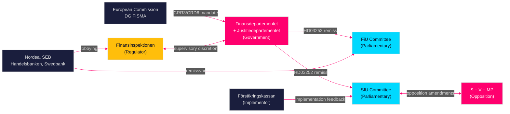

# Stakeholder Perspectives — Propositions 2026-04-28

**Author**: James Pether Sörling  
**Date**: 2026-04-28  
**Classification**: PUBLIC | Confidence: MEDIUM-HIGH [B2]  

## 6-Lens Stakeholder Matrix

### Lens 1 — Government (Proponent)

| Stakeholder | Role | Position | Interest |
|-------------|------|----------|----------|
| Finansdepartementet | Lead ministry HD03253, HD03104 | Strongly supportive | EU regulatory compliance; fiscal credibility |
| Justitiedepartementet | Lead ministry HD03252 | Strongly supportive | Tidö Agreement delivery; law-and-order agenda |
| Landsbygdsdepartementet | Lead ministry HD03256 | Supportive | EU transport regulation compliance |
| Statsrådsberedningen (PMO) | Portfolio coordination | Supportive | Legislative pipeline management |

### Lens 2 — Parliamentary Actors

| Stakeholder | Role | HD03253 | HD03252 | HD03104 | HD03256 |
|-------------|------|---------|---------|---------|---------|
| FiU (Finansutskottet) | Committee for HD03253, HD03104 | Scheduled hearing | — | Scheduled hearing | — |
| SfU (Socialförsäkringsutskottet) | Committee for HD03252 | — | Contentious hearing expected | — | — |
| TU (Trafikutskottet) | Committee for HD03256 | — | — | — | Technical hearing |
| M (Moderaterna) | Coalition | For | For | For | For |
| SD (Sverigedemokraterna) | Coalition anchor | For | Strongly For | For | For |
| KD (Kristdemokraterna) | Coalition | For | For | For | For |
| L (Liberalerna) | Coalition | For | Conditional | For | For |
| S (Socialdemokraterna) | Opposition | For (EU mandate) | Against | For | For |
| MP (Miljöpartiet) | Opposition | For (EU mandate) | Against | For | For |
| V (Vänsterpartiet) | Opposition | For (EU mandate) | Strongly Against | For | For |
| C (Centerpartiet) | Opposition | For | Conditional | For | For |

### Lens 3 — Regulatory Actors

| Stakeholder | Role | Relevant to |
|-------------|------|-------------|
| Finansinspektionen (FI) | Financial supervisor; pillar-2 discretion | HD03253 — riksdagen.se |
| Riksgälden (National Debt Office) | Debt management; subject of HD03104 | HD03104 — riksdagen.se |
| Riksbanken (Riksbank) | Macroprudential coordination | HD03253 (systemic risk) |
| Transportstyrelsen | Road transport enforcement | HD03256 — riksdagen.se |
| Försäkringskassan | Social insurance administration | HD03252 — riksdagen.se |

### Lens 4 — Private Sector

| Stakeholder | Role | Interest |
|-------------|------|---------|
| Nordea, SEB, Handelsbanken, Swedbank | Major banks affected by CRR3 | Capital requirement increases; IRB floor compliance [HD03253 — riksdagen.se] |
| Bankföreningen (Swedish Bankers' Association) | Industry lobby | Transitional relief; supervisory discretion advocacy |
| Swedish Road Haulage Association (Åkeriförbundet) | Transport sector | Effective enforcement against unfair competition [HD03256 — riksdagen.se] |

### Lens 5 — Civil Society

| Stakeholder | Interest |
|-------------|---------|
| SACO/LO/TCO (labour federations) | HD03252 impacts workers in rehabilitation programs |
| Kriminalvården (Prison and Probation Service) | HD03252 implementation burden; controlled housing program integrity |
| BRIS/Rädda Barnen | Welfare of children of incarcerated parents affected by HD03252 |

### Lens 6 — International

| Stakeholder | Interest |
|-------------|---------|
| European Commission (DG FISMA) | CRR3/CRD6 transposition compliance (HD03253) |
| European Banking Authority (EBA) | Supervisory convergence; RTS compliance (HD03253) |
| Council of Europe / CPT | Rehabilitation standards in Swedish corrections (HD03252) |

## Influence Network

