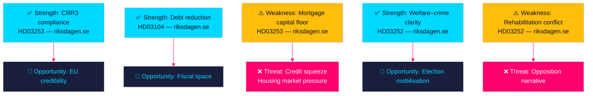

# SWOT Analysis — Propositions 2026-04-28

**Author**: James Pether Sörling  
**Date**: 2026-04-28  
**Classification**: PUBLIC | Confidence: HIGH [B2]  

## Cross-Proposition SWOT Framework

### Strengths

| Strength | Evidence | Admiralty |
|----------|----------|-----------|
| EU transposition of banking regulation (CRR3/CRD6) delivers regulatory certainty for Swedish banks | HD03253 — riksdagen.se/dokument/HD03253; EU CRR3 Regulation (EU) 2024/1623 | [A2] |
| Debt management 2021–2025 shows declining central government debt (from ~24% to ~19% of GDP) | HD03104 — riksdagen.se/dokument/HD03104 (Riksgälden 5-year evaluation) | [A2] |
| HD03252 closes a perceived welfare–crime gap targeted in Tidö Agreement, delivering on coalition commitment | HD03252 — riksdagen.se/dokument/HD03252; Tidö Agreement s.87 (kriminalvårdspolitik) | [B2] |
| Tachograph enforcement (HD03256) strengthens Sweden's compliance with EU Reg. 2020/1054 transport rules | HD03256 — riksdagen.se/dokument/HD03256; EU Reg. 2020/1054 | [A2] |

### Weaknesses

| Weakness | Evidence | Admiralty |
|----------|----------|-----------|
| CRR3 output floor (72.5%) may increase mortgage capital requirements for SEB/Handelsbanken, potentially tightening credit availability | HD03253 — riksdagen.se/dokument/HD03253; EBA impact assessment (2023) | [B3] |
| HD03252 may conflict with EU rehabilitation principles and Council of Europe guidelines on prisoner reintegration | HD03252 — riksdagen.se/dokument/HD03252; CPT standards (Council of Europe) | [C3] |
| HD03104 as a skrivelse (report) — no binding policy change; debt framework rigidity may limit response to future shocks | HD03104 — riksdagen.se/dokument/HD03104 | [B3] |

### Opportunities

| Opportunity | Evidence | Admiralty |
|-------------|----------|-----------|
| CRR3 implementation (HD03253) positions Sweden as a Basel III-compliant EU member ahead of October 2026 deadline | HD03253 — riksdagen.se/dokument/HD03253; ECB Banking Supervision timeline | [B2] |
| HD03252 allows Tidö parties (especially SD) to mobilise core electorate on welfare–crime narrative before September 2026 election | HD03252 — riksdagen.se/dokument/HD03252; Demoskop party base analysis | [C2] |
| Successful tachograph enforcement (HD03256) could reduce transport sector grey economy, improve fiscal base | HD03256 — riksdagen.se/dokument/HD03256 | [C3] |

### Threats

| Threat | Evidence | Admiralty |
|--------|----------|-----------|
| Swedish banking sector capital strain: if output floor triggers capital raises, Riksbanken and Finansinspektionen may face conflicting signals on credit supply vs financial stability | HD03253 — riksdagen.se/dokument/HD03253; Finansinspektionen FI-rapport 2024:1 | [B3] |
| Opposition (S, V, MP) will use HD03252 in election campaign as symbol of Tidö "Stigmatisering" of vulnerable groups, reducing coalition's social policy narrative space | HD03252 — riksdagen.se/dokument/HD03252 | [B2] |
| HD03104 reveals low flexibility in debt management framework during potential future fiscal shocks (post-2025 if defence budget expansion accelerates) | HD03104 — riksdagen.se/dokument/HD03104; NATO 3% target debate | [C3] |

## TOWS Matrix

| | Strengths | Weaknesses |
|---|-----------|------------|
| **Opportunities** | **SO — Exploit**: Use CRR3 banking compliance (HD03253) to position Sweden as a reliable financial partner in EU Nordic-Baltic region; use election narrative (HD03252) to consolidate Tidö coalition base [HD03252, HD03253 — riksdagen.se] | **WO — Convert**: Use FiU oversight of banking package to extract Finansinspektionen commitments on supervisory discretion, mitigating credit squeeze risk [HD03253 — riksdagen.se] |
| **Threats** | **ST — Defend**: Banking stability narrative (HD03104 fiscal discipline + HD03253 CRR3 compliance) as shield against banking sector vulnerability perception [HD03104, HD03253 — riksdagen.se] | **WT — Mitigate**: Proactive communication strategy on HD03252 to pre-empt opposition framing; add rehabilitation impact assessment to reduce CPT challenge risk [HD03252 — riksdagen.se] |

## Cross-SWOT Interaction

The most significant cross-proposition dynamic is the **fiscal-financial nexus**: HD03104 (confirming reduced government debt) and HD03253 (imposing higher bank capital requirements) together reduce systemic financial risk but create short-term credit-tightening pressure. In an election year (2026), this could manifest as housing market slowdown — an electorally sensitive outcome.

