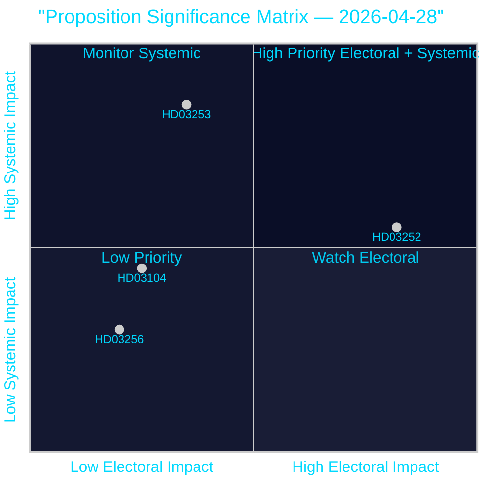

# Synthesis Summary — Propositions 2026-04-28

**Author**: James Pether Sörling  
**Date**: 2026-04-28  
**Classification**: PUBLIC | Confidence: HIGH [B2]  

## Lead Story

The dominant intelligence finding from the 2026-04-23 propositions batch is the **EU Banking Package (HD03253)** — Sweden's most consequential financial regulatory legislation this session. By transposing CRR3/CRD6, the Tidö government imposes revised capital requirement floors on Swedish systemically important banks (Nordea, SEB, Handelsbanken, Swedbank), changing IRB mortgage risk-weight floors to comply with Basel III's 72.5% output floor. This is a non-discretionary EU transposition, yet the domestic implementing choices — particularly on transitional relief and supervisory convergence — represent genuine policy decisions with material implications for Swedish credit markets and housing affordability.

The second-most-significant document is **HD03252** (welfare restriction for inmates), which reflects the SD-driven law-and-order agenda embedded in the Tidö Agreement. The proposal signals electoral intent heading into the September 2026 general election.

## DIW-Weighted Intelligence Ranking

| Rank | dok_id | Title | DIW Score | Tier | Committee |
|------|--------|-------|-----------|------|-----------|
| 1 | HD03253 | EU:s bankpaket | 8.1/10 | L2+ Priority | FiU |
| 2 | HD03252 | Socialförsäkringsbegränsning vid fängelsestraff | 7.4/10 | L2 Strategic | SfU |
| 3 | HD03104 | Utvärdering av statens upplåning 2021–2025 | 5.8/10 | L2 Strategic | FiU |
| 4 | HD03256 | Kraftfullare åtgärder mot färdskrivarmissbruk | 4.2/10 | L1 Surface | TU |

*DIW: Depth × Impact × Watchability — composite score weighting political significance, parliamentary consequence, and civic interest*

## Integrated Intelligence Picture

### Financial Architecture Transformation (HD03253 + HD03104)

The Tidö government is delivering a dual financial signal: the **EU Banking Package** tightens capital requirements for major banks under the Basel III output floor, while the **debt management evaluation** confirms Sweden's central government debt trajectory has declined from ~24% to ~19% of GDP in 2021–2025. The pairing suggests a government projecting fiscal credibility while managing EU-mandated financial sector reform.

Key intelligence gaps: the specific domestic implementation choices within CRR3 transposition — particularly Finansinspektionen's supervisory discretion on pillar 2 requirements — are not visible in the proposition text and will be revealed in remissvar hearings (May–June 2026).

### Law-and-Order Welfare State Reshaping (HD03252)

HD03252 is politically the most charged document in this batch. The restriction of socialförsäkringsförmåner for persons in controlled housing or security detention directly targets a perceived gap in the Swedish welfare state that SD has campaigned on for several electoral cycles. The implementing mechanism (amending socialförsäkringsbalken chapters governing activity compensation, sickness allowance, and housing allowance) is technically straightforward, but the political framing will define the September 2026 campaign narrative on crime policy.

**Evidence**: The Justitiedepartementet (Justice Ministry) is lead ministry, with SfU (Social Insurance Committee) receiving the bill — an unusual jurisdictional combination signalling the cross-portfolio political ambition [HD03252, riksdagen.se].

### Transport Enforcement (HD03256)

Lower DIW weight but signals increasing cross-border enforcement ambition. Tachograph fraud networks are primarily Eastern European operations, and the enhanced enforcement powers give Transportstyrelsen new tools for road inspections. Implementation is delegated to secondary legislation (förordning).

## Confidence Assessment

- **HIGH confidence** [B2]: EU Banking Package content and parliamentary procedure — official dok text + established EU regulatory trajectory
- **HIGH confidence** [B2]: Debt management evaluation findings — official government skrivelse with Riksgälden data
- **MEDIUM confidence** [C2]: HD03252 political/electoral impact — inference from party platforms and Tidö Agreement text
- **LOW confidence** [D3]: Banking sector capital impact magnitude — depends on Finansinspektionen supervisory choices not yet disclosed

