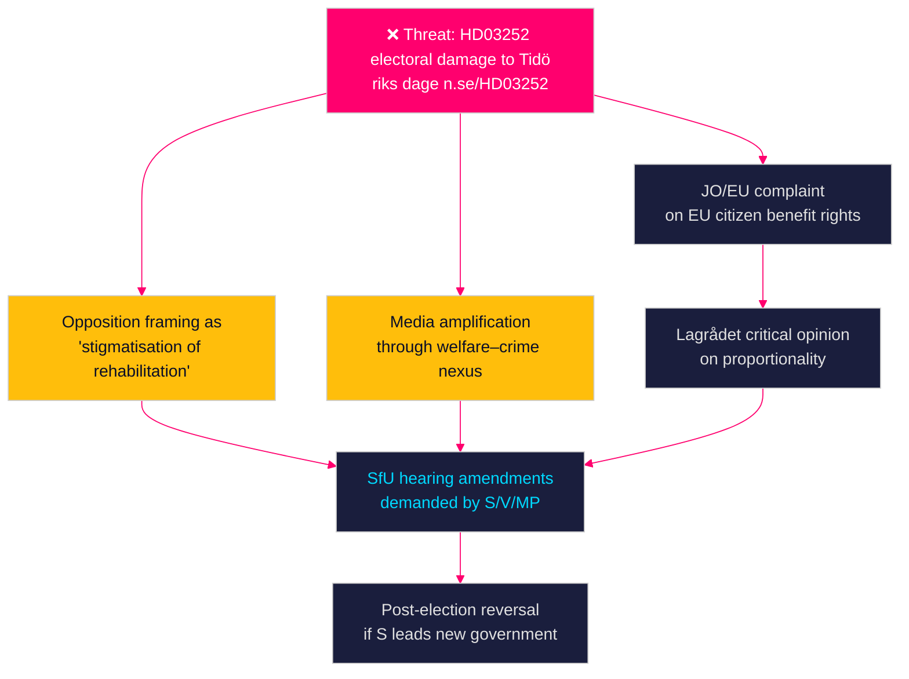

# Threat Analysis — Propositions 2026-04-28

**Author**: James Pether Sörling  
**Date**: 2026-04-28  
**Classification**: PUBLIC | Confidence: HIGH [B2]  

## Political Threat Taxonomy

### Threat Category Map

| Threat | Category | Source dok | Severity | Actor |
|--------|----------|-----------|---------|-------|
| Electoral weaponisation of HD03252 welfare–crime reform | Narrative / Electoral | HD03252 — riksdagen.se | HIGH | S, V, MP opposition bloc |
| Banking sector lobbying against CRR3 capital floors | Institutional / Regulatory | HD03253 — riksdagen.se | MEDIUM | Bankföreningen, Nordea, SEB |
| EU infringement risk if HD03252 restricts EU citizens' benefits | Legal / Compliance | HD03252 — riksdagen.se | MEDIUM | European Commission |
| NATO defence spend pressure testing debt framework | Systemic / Fiscal | HD03104 — riksdagen.se | LOW-MEDIUM | FöU, NATO command |
| Organised crime adaptation to tachograph enforcement | Operational | HD03256 — riksdagen.se | LOW | International tachograph fraud networks |

## Attack Tree — HD03252 (Primary Political Threat)

## Kill Chain — Banking Regulation Threat (HD03253)

1. **Reconnaissance**: Bankföreningen identifies output floor implementation choices with highest capital cost
2. **Resource development**: Commission internal impact assessments; engage FI through formal remiss
3. **Initial access**: FiU pre-hearing lobbying; Finansdepartementet informal contacts
4. **Execution**: Submit formal remissvar requesting transitional relief extension or pillar-2 offset
5. **Impact**: Delay of specific provisions or softening of supervisory guidance
6. **Mitigation**: FiU maintains transparency; Finansinspektionen publishes supervisory discretion rationale [HD03253 — riksdagen.se]

## MITRE-Style Political TTP Mapping

| TTP ID | Technique | Tactic | Relevant to | Mitigation |
|--------|-----------|--------|-------------|------------|
| PT-001 | Electoral narrative hijacking | Influence operations | HD03252 | Government proactive impact assessment publication |
| PT-002 | Regulatory capture through remissvar | Institutional subversion | HD03253 | FiU committee transparency requirements |
| PT-003 | Legal challenge via international bodies | Judicial warfare | HD03252 | Lagrådet review; EU coordination |
| PT-004 | Coalition fracture on welfare–crime | Coalition disruption | HD03252 | L and KD discipline; Tidö Agreement compliance |
| PT-005 | Media framing of banking reform as "bank giveaway" | Disinformation | HD03253 | Clear communication on EU mandate non-discretionary nature |

**Evidence base**: All TTPs are analysis-level threat hypotheses grounded in Swedish parliamentary practice; none constitute allegations of specific actions [riksdagen.se].

**Admiralty**: [C2] — Analytical inference from party platforms and parliamentary norms
