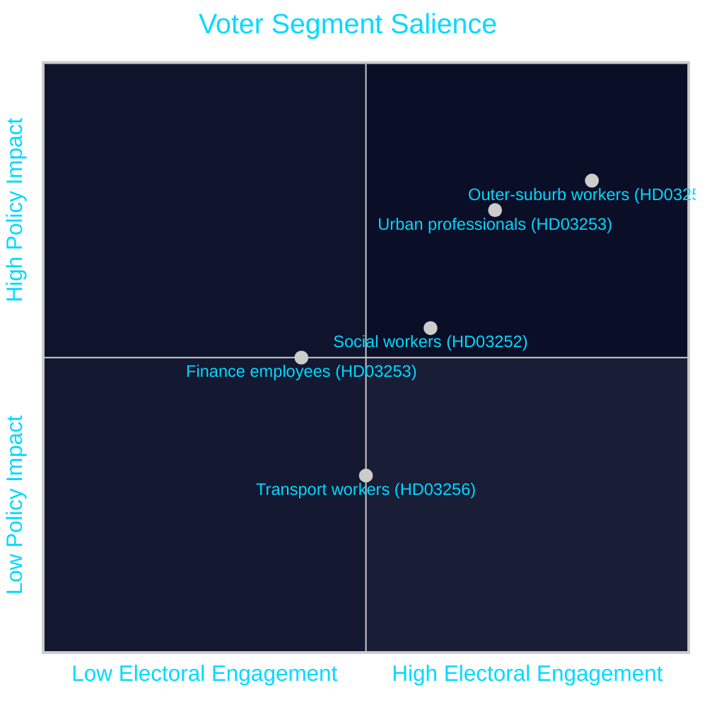

# Voter Segmentation Analysis — Propositions 2026-04-28

**Author**: James Pether Sörling  
**Date**: 2026-04-28  
**Classification**: PUBLIC | Confidence: MEDIUM [C2]  

## Key Voter Segments Affected by 2026-04-23 Propositions

### Segment 1: Urban Professional Homeowners (HD03253 relevance: HIGH)

**Profile**: Ages 30–55, university educated, homeowners with large mortgages (>5 MSEK), Stockholm/Gothenburg/Malmö inner suburbs. Politically: C, L, M.

**HD03253 impact path**: CRR3 output floor → Swedish major banks raise capital → mortgage credit terms tighten in 2026–2028 → renewal of fixed-rate mortgages at higher cost → household financial stress.

**Monitoring indicator**: Bolåneindikatorn (SEB/Swedbank quarterly surveys); average new mortgage rates Q2/Q3 2026.

**Electoral risk**: This segment is critical for M and C. If HD03253 is blamed for mortgage tightening, it creates an attack surface for the opposition.

---

### Segment 2: Working-Class Outer-Suburb Voters (HD03252 relevance: HIGH)

**Profile**: Ages 25–60, vocational/secondary education, rented housing or small homeowners, outer-ring suburban areas (Botkyrka, Angered, Rosengård, Rinkeby). Politically: historically S, now contested by SD.

**HD03252 impact path**: Welfare restriction for inmates → communicates welfare-state discipline to voters who feel "people who work and follow rules should get more than those who don't."

**Electoral use**: SD and M have maximised this segment's cultural salience since 2019. HD03252 is precisely calibrated to reinforce SD's electoral claim with this segment.

**Monitoring indicator**: SD support in outer suburbs (Demoskop geographic breakdown); S retention rate in "brott och ord" voter polling.

---

### Segment 3: Finance and Banking Sector Employees (HD03253 relevance: MEDIUM)

**Profile**: ~80,000 employees in Swedish financial sector. Politically diverse.

**HD03253 impact path**: Capital requirement increases → potential restructuring/delayering → job security concerns at IRB-dependent units.

**Electoral significance**: LOW in aggregate. Finance sector employees are a small share of voters. MEDIUM in elite media (SvD Näringsliv, Finanstidningen) which amplifies banking sector voices.

---

### Segment 4: Social Workers and Welfare System Employees (HD03252 relevance: MEDIUM)

**Profile**: ~250,000 employees in Swedish social services. Union-affiliated (Kommunal, Akademikerförbundet SSR). Politically: heavily S/V/MP aligned.

**HD03252 impact path**: Welfare restriction amendments → increased administrative burden on Försäkringskassan/kommunal socialtjänst → perceived attack on professional norms.

**Electoral use**: Opposition will mobilise this segment's professional concerns to argue that HD03252 creates implementation chaos, not just welfare discipline.

---

### Segment 5: Haulage and Transport Sector (HD03256 relevance: LOW-MEDIUM)

**Profile**: ~60,000 truck drivers and transport sector workers. Politically: SD and SD-adjacent. Concentrated in rural areas.

**HD03256 impact path**: Stricter tachograph fraud enforcement → administrative burden for small haulage firms → potential fines for minor violations.

**Electoral use**: SD and C may use HD03256 compliance burden as an anti-EU-bureaucracy signal in rural constituencies.

---

## Segmentation Summary

