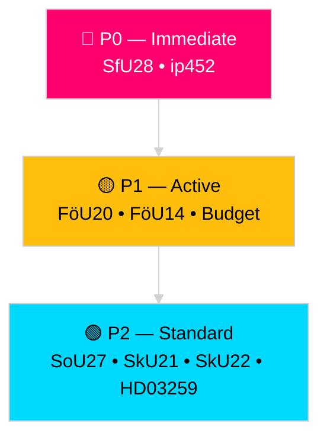

# Classification Results — Riksdag Realtime Pulse 28 April 2026

**Author**: James Pether Sörling
**Date**: 2026-04-28

## 7-Dimension Classification Per Document

### HD01SfU28 — Skärpta krav för svenskt medborgarskap [B2]

| Dimension | Classification |
|-----------|----------------|
| Policy domain | Immigration / Citizenship |
| Political valence | Government initiative; SD-M-KD-L supportive; S-V-C-MP opposed |
| Legislative stage | Committee betänkande (SfU28), scheduled for chamber debate |
| EU compliance trigger | Partial — domestic law, consistent with EU Blue Card Directive |
| GDPR impact | Art. 9(2)(e)(g) — citizenship process data; no new high-risk processing |
| Security classification | PUBLIC |
| Retention | Standard (political data, publicly available) |

### HD01FöU20 — CER Directive Transposition [A2]

| Dimension | Classification |
|-----------|----------------|
| Policy domain | National Security / Critical Infrastructure |
| Political valence | Government initiative; broad cross-party support expected |
| Legislative stage | Betänkande (FöU20) — planned Riksdag vote 2026-06-15 |
| EU compliance trigger | Mandatory — EU Directive 2022/2557 (CER) transposition deadline |
| GDPR impact | Minimal — operator-level data, not individual |
| Security classification | PUBLIC |
| Retention | Standard |

### HD01FöU14 — Military Cooperation Framework [B2]

| Dimension | Classification |
|-----------|----------------|
| Policy domain | Defence / NATO integration |
| Political valence | Cross-party support (M, S, KD, L, C); SD broadly supportive; V cautious |
| Legislative stage | Betänkande (FöU14) — planned vote 2026-06-15 |
| EU compliance trigger | None direct; NATO Article 5 alignment |
| GDPR impact | None |
| Security classification | PUBLIC |
| Retention | Standard |

### HD10452 — Constitutional Amendment Interpellation [B1]

| Dimension | Classification |
|-----------|----------------|
| Policy domain | Constitutional Law / Democracy |
| Political valence | Widding (ind.) challenges M/government position; potentially amplified by SD |
| Legislative stage | Interpellation (ip 452) — response due 2026-05-19 |
| EU compliance trigger | None |
| GDPR impact | None |
| Security classification | PUBLIC |
| Retention | Standard |

## Priority Tiers

- **P0 (Immediate monitoring)**: HD01SfU28, HD10452
- **P1 (Active tracking)**: HD01FöU20, HD01FöU14, Spring Budget motions
- **P2 (Standard cycle)**: HD01SoU27, HD01SkU21, HD01SkU22, HD03259

