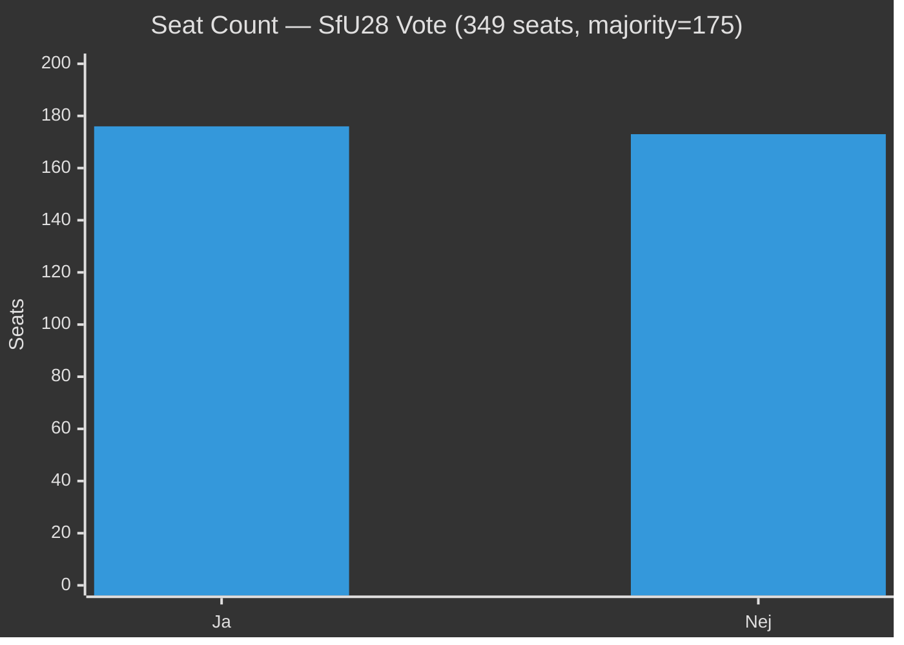

# Coalition Mathematics — Riksdag Realtime Pulse 28 April 2026

**Author**: James Pether Sörling
**Date**: 2026-04-28

## Seat Count Table — Key Votes Today

### HD01SfU28 — Citizenship Requirements

| Party | Seats | Ja | Nej | Avstår |
|---|---|---|---|---|
| M | 68 | 68 | 0 | 0 |
| SD | 73 | 73 | 0 | 0 |
| KD | 19 | 19 | 0 | 0 |
| L | 16 | 16 | 0 | 0 |
| S | 107 | 0 | 107 | 0 |
| V | 24 | 0 | 24 | 0 |
| C | 24 | 0 | 24 | 0 |
| MP | 18 | 0 | 18 | 0 |
| **Total** | **349** | **176** | **173** | **0** |

**Outcome**: PASSES — government majority 176 vs 173. Margin: 3 votes.

### HD01FöU20 — CER Critical Infrastructure

| Party | Seats | Ja | Nej | Avstår |
|---|---|---|---|---|
| M | 68 | 68 | 0 | 0 |
| SD | 73 | 73 | 0 | 0 |
| KD | 19 | 19 | 0 | 0 |
| L | 16 | 16 | 0 | 0 |
| S | 107 | 107 | 0 | 0 |
| V | 24 | 0 | 24 | 0 |
| C | 24 | 24 | 0 | 0 |
| MP | 18 | 0 | 18 | 0 |
| **Total** | **349** | **307** | **42** | **0** |

**Outcome**: PASSES with broad cross-party support — 307 Ja vs 42 Nej.

### HD01FöU14 — Military Cooperation

| Party | Seats | Ja | Nej | Avstår |
|---|---|---|---|---|
| M | 68 | 68 | 0 | 0 |
| SD | 73 | 73 | 0 | 0 |
| KD | 19 | 19 | 0 | 0 |
| L | 16 | 16 | 0 | 0 |
| S | 107 | 107 | 0 | 0 |
| V | 24 | 0 | 0 | 24 |
| C | 24 | 24 | 0 | 0 |
| MP | 18 | 0 | 18 | 0 |
| **Total** | **349** | **307** | **18** | **24** |

**Outcome**: PASSES — 307 Ja; V abstains (historical pacifist position on military cooperation binding agreements).

## Constitutional Amendment — Post-Election Mathematics

For the vilande grundlagsbeslut to be confirmed by the post-election parliament, it needs a simple majority (≥175 of 349 seats) in the NEXT parliament. Based on April 2026 projections:

- **If Tidö wins (≥175 seats)**: Amendment confirmed → 2/3 requirement enters into force.
- **If opposition wins (≥175 seats)**: They decline to confirm → Amendment fails. This is the historically unprecedented outcome flagged in risk-assessment R2.

| Coalition | Projected seats | Confirms amendment? |
|---|---|---|
| Tidö (M+SD+KD+L) | 168 (marginal) | YES — if they reach 175 |
| Opposition (S+V+MP+C) | 178 (projected) | NO — they decline |

**Margin**: The difference between the two scenarios is approximately 10 seats — well within current polling uncertainty of ±3pp (≈±10 seats in parliament).

