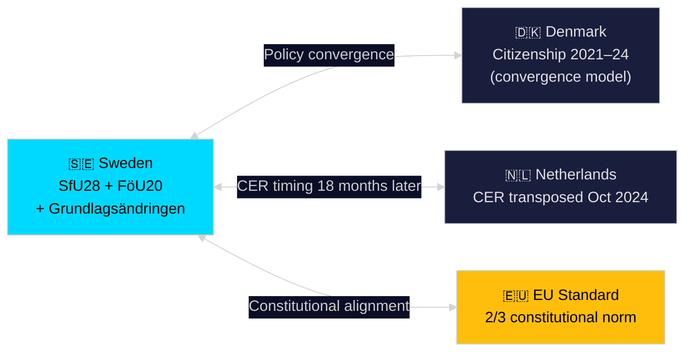

# Comparative International Analysis — Riksdag Realtime Pulse 28 April 2026

**Author**: James Pether Sörling
**Date**: 2026-04-28

## Comparator Rows

### Row 1: Danish Citizenship Tightening (Nordic)

| Dimension | Sweden (HD01SfU28) | Denmark (Indfødsretsloven 2021–2024) |
|---|---|---|
| Key measure | Extended residency (8→10 years), language tests, income thresholds | Already required 9-year residency, Danish language test level 3, active citizenship requirement |
| Political driver | Tidö coalition (M+SD+KD+L) — SD pressure | Socialdemokraterne + liberal-right coalition support |
| EU compatibility | Compatible with Blue Card; some EU-citizen carveout debate | Compatible; opt-out on EU citizenship rules maintained |
| Civil society reaction | Strong UNHCR/CRD opposition | Similar NGO criticism, but public opinion broadly supportive |
| Electoral outcome | Citizenship as election issue in Sept 2026 | Citizenship tightening credited to S-led government winning 2023 election |
| Lesson | Danish case shows that centre-left credibility on citizenship can neutralise the policy as an SD exclusive — suggests S should adopt its own reform plan |

### Row 2: EU Critical Infrastructure (CER Directive transposition — Netherlands & France)

| Dimension | Sweden (HD01FöU20) | Netherlands | France |
|---|---|---|---|
| Transposition deadline | June 2026 (compliant) | October 2024 (completed) | October 2024 (completed) |
| Sector scope | Energy, transport, digital, water, health, space | Energy, transport, digital, water, health, finance | Same +government sector |
| Enforcement agency | MSB (Myndigheten för samhällsskydd) | NCTV + sectoral regulators | SGDSN + ANSSI |
| Fines for non-compliance | Proposed: up to 1% annual revenue | Up to €1M per violation | Up to €0.5M per violation |
| Lesson | Sweden is slightly behind NL/FR but ahead of EU average; MSB capacity is the key implementation risk given budget constraints | | |

### Row 3: Constitutional Supermajority Requirements (EU Comparators)

| Country | Supermajority requirement | Blocking minority concern |
|---|---|---|
| Sweden (proposed) | 2/3 majority both pre- and post-election confirmation | Widding ip452 argues ≥34% can block |
| Germany | 2/3 Bundestag + Bundesrat for Basic Law amendments | Established, rarely controversial |
| Finland | 2/3 or urgent 5/6 majority | Strong historical precedent |
| Ireland | Referendum required | No supermajority in parliament, but popular vote |

**Key finding**: Sweden's proposed 2/3 requirement aligns with Nordic/EU standards. The Widding narrative ("minority blocks democratic majority") conflates ordinary legislation with constitutional protection — a category error common in populist constitutional discourse.

## Synthesis

Nordic citizenship trends confirm that Sweden's SfU28 is a convergence with Danish/Finnish models, not an outlier. On CER, Sweden is compliant-on-track. On constitutional amendments, the 2/3 standard is European norm — Widding's critique is a domestic political argument, not a cross-national anomaly.

