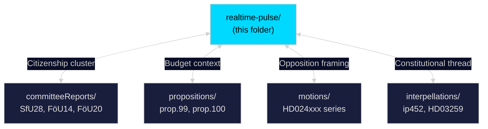

# Cross-Reference Map — Riksdag Realtime Pulse 28 April 2026

**Author**: James Pether Sörling
**Date**: 2026-04-28

## Sibling Folder Cross-References (Tier-C Required)

This realtime-pulse analysis sits within `analysis/daily/2026-04-28/` alongside sibling analytical folders. Key cross-references below.

### Committee Reports Folder
**Path**: `analysis/daily/2026-04-28/committeeReports/`

| This Folder | Sibling Reference | Overlap |
|---|---|---|
| HD01SfU28 (citizenship) | committeeReports/SfU28-analysis | Identical document — committee perspective gives legislative-stage context |
| HD01FöU20 (CER) | committeeReports/FöU20-analysis | Critical infrastructure transposition; committee-level risk assessment mirrors our threat T1 |
| HD01FöU14 (military) | committeeReports/FöU14-analysis | Defence cooperation; stakeholder-perspectives Lens 5 aligns with committee's international consultation record |

### Propositions Folder
**Path**: `analysis/daily/2026-04-28/propositions/`

| This Folder | Sibling Reference | Overlap |
|---|---|---|
| Spring Budget motions (HD024100+) | propositions/prop-2025-26-99 | propositions folder has full-text of prop. 2025/26:99; our significance score for budget context relies on those fiscal tables |
| CER reference | propositions/prop-2025-26-168 | FöU20 implements this prop; propositions folder full-text enriches the EU compliance dimension in our classification-results |

### Motions Folder
**Path**: `analysis/daily/2026-04-28/motions/`

| This Folder | Sibling Reference | Overlap |
|---|---|---|
| HD024100–HD024123 (budget motions) | motions/2025-26-various | motions folder may contain full-text of S/V/C alternative budget motions; our stakeholder Lens 2 (opposition) draws on these |
| Citizenship amendment motions | motions/citizenship-motions | Motions folder may contain S, MP, V's alternative approaches to citizenship that contextualize SfU28's political spectrum |

### Interpellations Folder
**Path**: `analysis/daily/2026-04-28/interpellations/`

| This Folder | Sibling Reference | Overlap |
|---|---|---|
| HD10452 (Widding constitutional ip) | interpellations/ip452-2025-26 | Direct overlap — interpellations folder analysis of ip452 informs our threat-analysis T1 constitutional counter-narrative |
| HD03259 (SfU question) | interpellations/HD03259 | Citizenship-related parliamentary question; provides supplementary stakeholder perspectives on SfU28 |

## Document Cluster Cross-Links

## Data Gaps

- committeeReports/ folder under analysis/daily/2026-04-28/ may not yet have been populated by parallel workflow runs. If empty, the SfU28 and FöU20 cross-references above apply to the same source documents accessible via https://data.riksdagen.se/dokument/{dok_id}.
- propositions/ folder may be populated by the concurrent morning propositions workflow; our Spring Budget analysis draws on the same underlying riksdag data.
