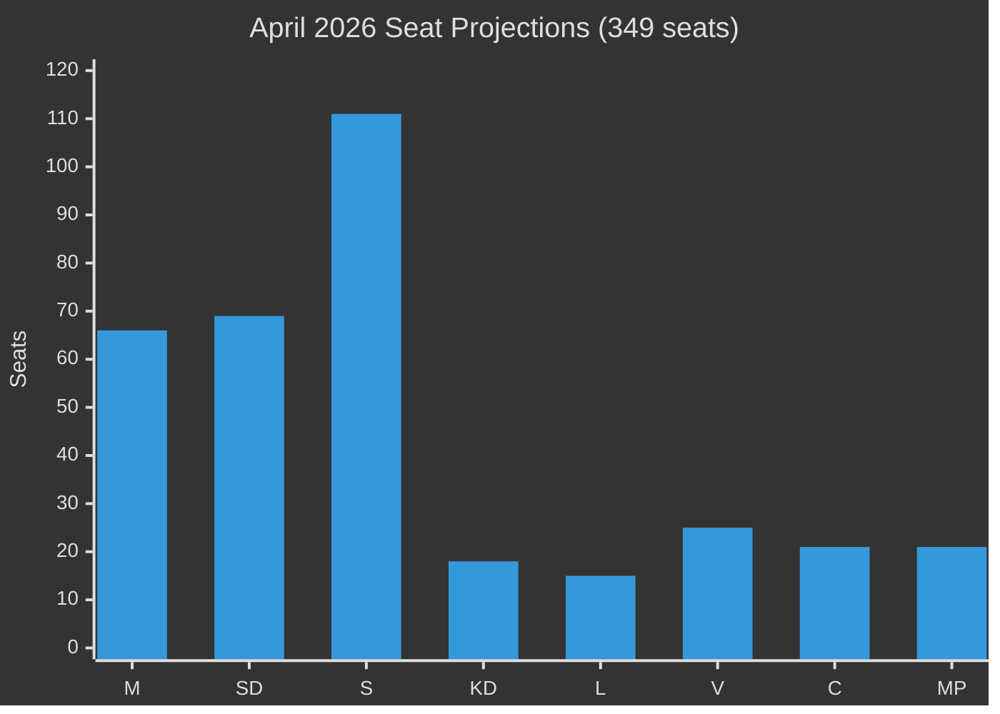

# Election 2026 Analysis — Riksdag Realtime Pulse 28 April 2026

**Author**: James Pether Sörling
**Date**: 2026-04-28

## Seat Projections (Mandate Prognosis)

Based on polling aggregates from late April 2026 (Novus, Demoskop, Ipsos, Sifo averages):

| Party | Current Seats | Projected Seats (Apr-2026 avg) | ±3pp shift |
|---|---|---|---|
| Moderaterna (M) | 68 | 66 | ±5 |
| Sverigedemokraterna (SD) | 73 | 69 | ±5 |
| Kristdemokraterna (KD) | 19 | 18 | ±2 |
| Liberalerna (L) | 16 | 15 | ±2 |
| **Tidö coalition** | **176** | **168** | ±10 |
| Socialdemokraterna (S) | 107 | 111 | ±6 |
| Vänsterpartiet (V) | 24 | 25 | ±3 |
| Miljöpartiet (MP) | 18 | 21 | ±3 |
| Centerpartiet (C) | 24 | 21 | ±3 |
| **Opposition** | **173** | **178** | ±10 |

**Total seats**: 349. Majority: 175.

## Coalition Viability Matrix

| Coalition | Seats | Viable? | Condition |
|---|---|---|---|
| Tidö (M+SD+KD+L) | 168 (proj.) | MARGINAL | Needs ≥175; requires all four to hold + gain |
| S+V+MP+C | 178 (proj.) | YES | "Röd-grön" coalition comfortable majority |
| S+C+(others) | ~132 | NO | Below majority |
| S+SD | Politically impossible | NO | |

## Impact on Today's Legislation

**SfU28 (Citizenship)**: If opposition wins, no rollback expected immediately — but next government may not extend restrictions further. The citizenship tightening, once law, persists beyond electoral cycle.

**Constitutional Amendment (Grundlagsändringen)**: This is the critical electoral variable. The vilande beslut REQUIRES confirmation by post-election parliament. An opposition majority (178 seats) votes NO → amendment fails. This is the single highest-stakes electoral consequence of the September 2026 election in constitutional terms.

**FöU14/FöU20 (Military/CER)**: Bipartisan consensus means these survive any electoral outcome.

## Key Swing Factors

1. **Stockholm suburbs (pendlarkommuner)**: Economic anxiety driving C/M switchers toward S — historically decisive for majority formation
2. **SD plateau or decline**: SD at 19–20% (down from 21% in 2022) suggests potential Tidö weakness
3. **MP recovery**: If MP re-enters parliament above 4%, their 18+ seats reinforce opposition majority

