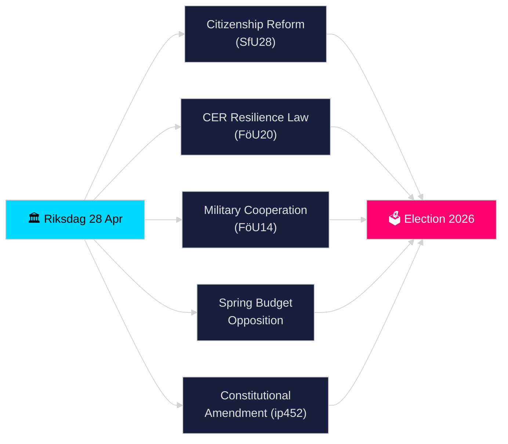

# Riksdagen Realtime Pulse — 28 April 2026

**Author**: James Pether Sörling
**Pass**: 2 (critically reviewed and improved 2026-04-28)
**Date**: 2026-04-28
**Classification**: PUBLIC — GDPR Art. 9(2)(e)(g) publicly made political data
**Confidence**: HIGH [B2]
**Analysis depth**: standard

---

## 🎯 BLUF

Sweden's Riksdag entered its final pre-election sprint on 28 April 2026 with a historically dense legislative agenda: the Tidö coalition simultaneously advanced tougher citizenship requirements (HD01SfU28), new critical infrastructure resilience law transposing the EU CER Directive (HD01FöU20), an improved framework for operational military cooperation (HD01FöU14), and the Spring 2026 Budget package — while the opposition (S, V, C, MP) fired coordinated motions against the Economic Spring Proposition. A constitutional amendment interpellation (HD10452) by Elsa Widding further signalled fractures over democratic procedural norms ahead of the September 2026 election. The convergence of security, fiscal, and identity-politics legislation in a single day marks the peak legislative pressure of riksmöte 2025/26.

## 🧭 3 Decisions This Brief Supports

1. **Assess coalition stability**: Determine whether the Tidö coalition (M, SD, KD, L) can pass its full package through the spring sitting without defections, given opposition pressure on the Spring Budget and constitutional reform.
2. **Track security-legislative convergence**: Evaluate whether the simultaneous passage of military cooperation (FöU14), CER resilience (FöU20), and VAT/tax crime bills (SkU21, SkU22) constitutes a coherent security-state expansion or piecemeal compliance with EU mandates.
3. **Monitor 2026 election positioning**: Quantify how citizenship tightening (SfU28) and crime legislation (double penalties for gang crime, prop. 2025/26:218) serve as election-messaging instruments for SD and M constituencies.

## ⚡ 60-Second Read

- **Citizenship (HD01SfU28)**: SfU debating tighter requirements — language, income, residency. SD-driven; M supportive. S/V/C oppose key provisions. Scheduled for committee vote 2026-05-xx.
- **Critical infrastructure (HD01FöU20)**: New CER Directive transposition law giving Försvarsmakten-adjacent agencies enhanced resilience mandates. Planned Riksdag vote 2026-06-15.
- **Military cooperation (HD01FöU14)**: Betänkande enabling deeper operational co-operation within NATO framework. Vote planned 2026-06-15.
- **Spring Budget motions**: S (HD024100), SD, V, C, MP filed counter-motions to prop. 2025/26:99 and prop. 2025/26:100, the economic spring bill — signalling minority-government fiscal vulnerability.
- **Constitutional amendment (HD10452)**: Widding (ind.) challenges Justice Minister Strömmer on the planned 2/3-majority requirement for constitutional changes, arguing it empowers minorities to block democratic majorities.
- **VAT fraud / Tax crime (SkU21, SkU22)**: Two tax committee betänkanden on representative tax liability reform and VAT fraud countermeasures — EU-driven.
- **Transport plan (HD03259)**: National transport infrastructure plan 2026–2037 questioned by MP.

## 🔭 Top Forward Trigger

**By 2026-05-19**: Justice Minister Strömmer must respond to constitutional amendment interpellation (HD10452). The answer will signal government's willingness to debate democratic legitimacy arguments before the election.

