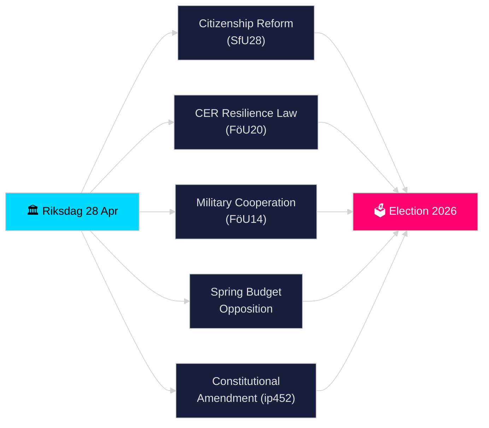

# نبضة الوقت الفعلي لريكسداغن — 28 أبريل 2026

**المؤلف**: جيمس بيتر سورلينغ
**المراجعة**: 2 (تمت المراجعة النقدية والتحسين في 2026-04-28)
**التاريخ**: 2026-04-28
**التصنيف**: عام — اللائحة العامة لحماية البيانات المادة 9(2)(ه)(ز) بيانات سياسية منشورة
**مستوى الثقة**: عالٍ [B2]
**عمق التحليل**: معياري

---

## 🎯 الملخص التنفيذي

بدأ ريكسداغن في 28 أبريل 2026 فترة الاندفاع المكثف تاريخياً قبيل الانتخابات: تقدّم ائتلاف تيدو في تشديد متطلبات الجنسية (HD01SfU28)، وقانون جديد لمرونة البنية التحتية الحيوية ينقل توجيه CER الأوروبي (HD01FöU20)، وإطار محسّن للتعاون العسكري العملياتي (HD01FöU14)، وحزمة ميزانية الربيع 2026 — فيما قدّمت المعارضة (S, V, C, MP) مقترحات مضادة منسّقة للاقتراح الاقتصادي الربيعي. كشف استجواب دستوري (HD10452) من إلسا ويدينغ عن مزيد من الشقوق حول معايير الإجراءات الديمقراطية قبيل انتخابات سبتمبر 2026. يمثّل تقاطع التشريعات الأمنية والمالية وسياسة الهوية في يوم واحد ذروة الضغط التشريعي في دورة ريكسموتيه 2025/26.

## 🧭 3 قرارات يدعمها هذا الملخص

1. **تقييم استقرار الائتلاف**: تحديد ما إذا كان ائتلاف تيدو (M, SD, KD, L) قادراً على تمرير حزمته الكاملة خلال دورة الربيع دون انشقاقات، في ظل ضغط المعارضة على فارودبدجيت وإصلاح الدستور.
2. **تتبع تقارب التشريعات الأمنية**: تقييم ما إذا كان الإقرار المتزامن للتعاون العسكري (FöU14) ومرونة CER (FöU20) وتشريعات ضريبة القيمة المضافة/الجرائم الضريبية (SkU21, SkU22) يمثّل توسعاً متماسكاً لدولة الأمن أم تنفيذاً مجزأً للتفويضات الأوروبية.
3. **رصد التموضع الانتخابي 2026**: قياس كيف تعمل تشديدات الجنسية (SfU28) وتشريعات الجرائم (مضاعفة العقوبات لجرائم العصابات، اقتراح 2025/26:218) طُعماً انتخابياً لناخبي SD وM.

## ⚡ قراءة 60 ثانية

- **الجنسية (HD01SfU28)**: تناقش لجنة SfU متطلبات أكثر صرامة — اللغة والدخل والإقامة. تقوده SD؛ M داعمة. S/V/C تعارض الأحكام الرئيسية. مقرر للتصويت في اللجنة 2026-05-xx.
- **البنية التحتية الحيوية (HD01FöU20)**: قانون جديد ينقل توجيه CER يمنح الوكالات القريبة من Försvarsmakten تفويضات مرونة معزّزة. تصويت ريكسداغن المقرر 2026-06-15.
- **التعاون العسكري (HD01FöU14)**: بيتانكاندي يتيح تعاوناً عملياتياً أعمق ضمن إطار حلف الناتو. التصويت مقرر 2026-06-15.
- **مقترحات مضادة لميزانية الربيع**: قدّمت S (HD024100), SD, V, C, MP مقترحات مضادة لاقتراح 2025/26:99 واقتراح 2025/26:100، الاقتراح الاقتصادي الربيعي — يشير إلى هشاشة مالية لحكومة أقلية.
- **التعديل الدستوري (HD10452)**: تُعارض ويدينغ (مستقلة) وزير العدل ستروميروفي شرط الأغلبية الثلثين المقرر لتغييرات الدستور، مدّعيةً أنه يمنح الأقليات سلطة تعطيل الأغلبيات الديمقراطية.
- **احتيال ضريبة القيمة المضافة / الجرائم الضريبية (SkU21, SkU22)**: اثنان من بيتانكاندي لجنة الضرائب حول المسؤولية الضريبية التمثيلية ومكافحة احتيال ضريبة القيمة المضافة — تقودهما الاتحاد الأوروبي.
- **خطة النقل (HD03259)**: الخطة الوطنية للبنية التحتية للنقل 2026–2037 التي استجوبها MP.

## 🔭 أهم إشارة مستقبلية

**بحلول 2026-05-19**: يجب على وزير العدل ستروميروف الرد على الاستجواب الدستوري (HD10452). سيشير الرد إلى مدى استعداد الحكومة لمناقشة حجج الشرعية الديمقراطية قبيل الانتخابات.

<!-- source-sha: 85156e01acda6f6589295f5a1f9197b815c84bc8 -->
