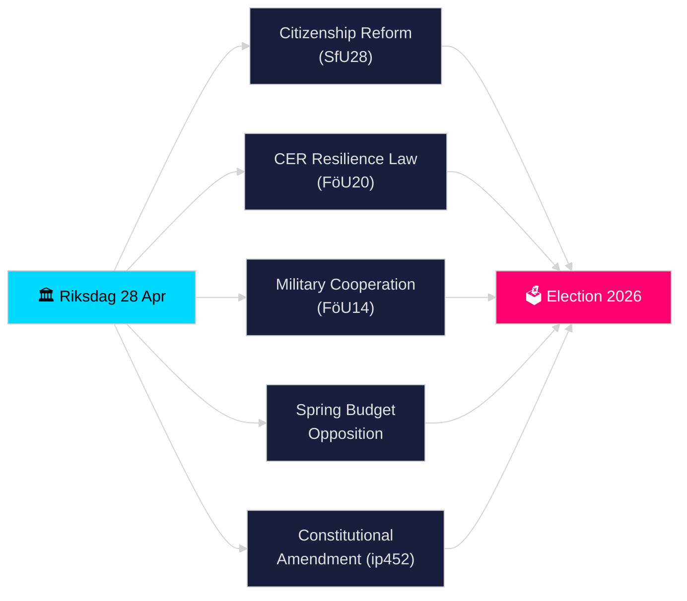

# Riksdagen Realtidspuls — 28. april 2026

**Forfatter**: James Pether Sörling
**Gennemgang**: 2 (kritisk gennemgået og forbedret 2026-04-28)
**Dato**: 2026-04-28
**Klassifikation**: OFFENTLIG — GDPR Art. 9(2)(e)(g) offentliggjorte politiske data
**Konfidensniveau**: HØJ [B2]
**Analysedybde**: standard

---

## 🎯 BLUF

Sveriges Riksdag indledte sin historisk intensive pre-valssprint den 28. april 2026: Tidö-koalitionen fremrykkede skærpede statsborgerskabskrav (HD01SfU28), en ny lov om kritisk infrastrukturresiliens, der transponerer EU CER-direktivet (HD01FöU20), en forbedret ramme for operativt militært samarbejde (HD01FöU14) og Forårsbudgetpakken 2026 — mens oppositionen (S, V, C, MP) indgav koordinerede modforslag mod den økonomiske forårspropositionen. En grundlovsinterpelatlon (HD10452) fra Elsa Widding signalerede yderligere splittelser om demokratiske procedurenormer forud for valget i september 2026. Konvergensen af sikkerheds-, finans- og identitetspolitisk lovgivning på en enkelt dag markerer toppen af lovgivningstrykket i riksmöte 2025/26.

## 🧭 3 beslutninger dette notat understøtter

1. **Vurder koalitionsstabilitet**: Afgør om Tidö-koalitionen (M, SD, KD, L) kan vedtage hele sin pakke i forårssamlingen uden defektioner, givet oppositionspres på Forårsbudgettet og grundlovsreformen.
2. **Spor sikkerhedslovgivningens konvergens**: Vurder om den samtidige vedtagelse af militært samarbejde (FöU14), CER-resiliens (FöU20) og moms-/skattebrottslovgivning (SkU21, SkU22) udgør en sammenhængende sikkerhedsstatlig ekspansion eller stykkevis EU-mandatopfyldelse.
3. **Overvåg valgpositionering 2026**: Kvantificer, hvordan strammet statsborgerskab (SfU28) og kriminalitetslovgivning (dobbelte straffe for bandekriminalitet, prop. 2025/26:218) fungerer som valgbudskaber for SDs og Ms vælgere.

## ⚡ 60-sekunders læsning

- **Statsborgerskab (HD01SfU28)**: SfU debatterer skærpede krav — sprog, indkomst, bopæl. SD-drevet; M støttende. S/V/C modsætter sig nøglebestemmelser. Planlagt til udvalgsafstemning 2026-05-xx.
- **Kritisk infrastruktur (HD01FöU20)**: Ny lov om CER-direktivtransposition, der giver Försvarsmakten-nærstående myndigheder styrket resiliensmandater. Planlagt Riksdag-afstemning 2026-06-15.
- **Militært samarbejde (HD01FöU14)**: Betänkande der muliggør dybere operativt samarbejde inden for NATO-rammen. Afstemning planlagt 2026-06-15.
- **Forårsbudgetmotioner**: S (HD024100), SD, V, C, MP indgav modforslag til prop. 2025/26:99 og prop. 2025/26:100, den økonomiske forårspropositionen — signalerer fiskal sårbarhed for en mindretalsregering.
- **Grundlovsændring (HD10452)**: Widding (uafhængig) udfordrer justitsminister Strömmer om det planlagte 2/3-flertalskrav til grundlovsændringer, idet hun hævder, at det giver mindretal magt til at blokere demokratiske flertal.
- **Momssvig / Skattebrott (SkU21, SkU22)**: To skatteudvalgs betänkanden om repræsentativt skatteansvar og modforanstaltninger mod momssvig — EU-drevne.
- **Transportplan (HD03259)**: National transportinfrastrukturplan 2026–2037 sat spørgsmålstegn ved MP.

## 🔭 Vigtigste fremtidssignal

**Inden 2026-05-19**: Justitsminister Strömmer skal besvare grundlovsinterpelatlon (HD10452). Svaret signalerer regeringens vilje til at debattere argumenter om demokratisk legitimitet inden valget.

<!-- source-sha: 85156e01acda6f6589295f5a1f9197b815c84bc8 -->
