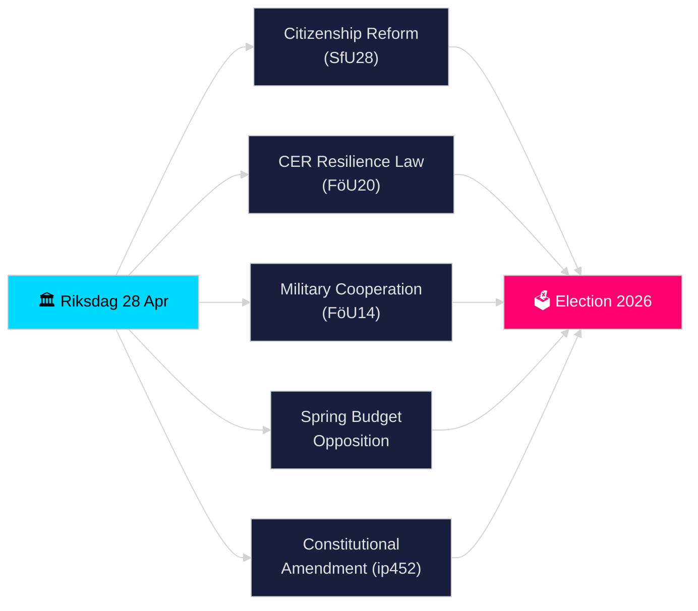

# Riksdagen Echtzeit-Puls — 28. April 2026

**Autor**: James Pether Sörling
**Überprüfung**: 2 (kritisch überprüft und verbessert 2026-04-28)
**Datum**: 2026-04-28
**Klassifizierung**: ÖFFENTLICH — DSGVO Art. 9(2)(e)(g) veröffentlichte politische Daten
**Konfidenzniveau**: HOCH [B2]
**Analysetiefe**: Standard

---

## 🎯 BLUF

Der Riksdagen begann seinen historisch dichten Vorwahlspurt am 28. April 2026: Die Tidö-Koalition schritt bei strengeren Staatsbürgerschaftsanforderungen (HD01SfU28), einem neuen Gesetz zur Resilienz kritischer Infrastrukturen zur Umsetzung der EU-CER-Richtlinie (HD01FöU20), einem verbesserten Rahmen für militärische Zusammenarbeit (HD01FöU14) und dem Frühjahrsbudgetpaket 2026 voran — während die Opposition (S, V, C, MP) koordinierte Gegenanträge zur wirtschaftlichen Frühjahrsproposition einreichte. Eine Verfassungsinterpellation (HD10452) von Elsa Widding signalisierte weitere Risse bei demokratischen Verfahrensnormen vor den Wahlen im September 2026. Die Konvergenz von Sicherheits-, Finanz- und Identitätspolitik-Gesetzgebung an einem einzigen Tag markiert den Höhepunkt des Gesetzgebungsdrucks in der Riksmöte 2025/26.

## 🧭 3 Entscheidungen, die dieser Bericht unterstützt

1. **Koalitionsstabilität beurteilen**: Feststellen, ob die Tidö-Koalition (M, SD, KD, L) ihr gesamtes Paket durch die Frühjahrssitzung ohne Abtrünnige verabschieden kann, angesichts des Oppositionsdrucks auf das Vårbudget und die Verfassungsreform.
2. **Konvergenz der Sicherheitsgesetzgebung verfolgen**: Bewerten, ob die gleichzeitige Verabschiedung von militärischer Zusammenarbeit (FöU14), CER-Resilienz (FöU20) und MWST-/Steuerrechtsverstößen (SkU21, SkU22) eine kohärente Sicherheitsstaatsexpansion oder stückweise EU-Mandatserfüllung darstellt.
3. **Wahlpositionierung 2026 überwachen**: Quantifizieren, wie verschärfte Staatsbürgerschaft (SfU28) und Kriminalitätsgesetzgebung (doppelte Strafen für Bandenverbrechen, prop. 2025/26:218) als Wahlköder für SDs und Ms Wähler dienen.

## ⚡ 60-Sekunden-Lektüre

- **Staatsbürgerschaft (HD01SfU28)**: SfU debattiert strengere Anforderungen — Sprache, Einkommen, Wohnsitz. SD-getrieben; M unterstützend. S/V/C bekämpfen Schlüsselbestimmungen. Für Ausschussabstimmung geplant 2026-05-xx.
- **Kritische Infrastruktur (HD01FöU20)**: Neues Gesetz zur CER-Richtlinienumsetzung, das Försvarsmakten-nahen Behörden gestärkte Resilienzmandate gibt. Geplante Riksdag-Abstimmung 2026-06-15.
- **Militärische Zusammenarbeit (HD01FöU14)**: Betänkande, das tiefere operative Zusammenarbeit im NATO-Rahmen ermöglicht. Abstimmung geplant 2026-06-15.
- **Frühjahrsbudget-Gegenanträge**: S (HD024100), SD, V, C, MP reichten Gegenanträge zu prop. 2025/26:99 und prop. 2025/26:100 ein, der wirtschaftlichen Frühjahrsproposition — signalisiert fiskalische Anfälligkeit für eine Minderheitsregierung.
- **Verfassungsänderung (HD10452)**: Widding (unabhängig) fordert Justizminister Strömmer zur geplanten 2/3-Mehrheitsanforderung für Verfassungsänderungen heraus und behauptet, sie gebe Minderheiten Macht, demokratische Mehrheiten zu blockieren.
- **MWST-Betrug / Steuervergehen (SkU21, SkU22)**: Zwei Steuerausschuss-Betänkanden zu repräsentativer Steuerhaftung und Bekämpfung von MWST-Betrug — EU-getrieben.
- **Verkehrsplan (HD03259)**: Nationaler Verkehrsinfrastrukturplan 2026–2037, hinterfragt von MP.

## 🔭 Wichtigstes Zukunftssignal

**Bis 2026-05-19**: Justizminister Strömmer muss auf die Verfassungsinterpellation (HD10452) antworten. Die Antwort wird signalisieren, inwieweit die Regierung bereit ist, demokratische Legitimitätsargumentationen vor der Wahl zu debattieren.

<!-- source-sha: 85156e01acda6f6589295f5a1f9197b815c84bc8 -->
