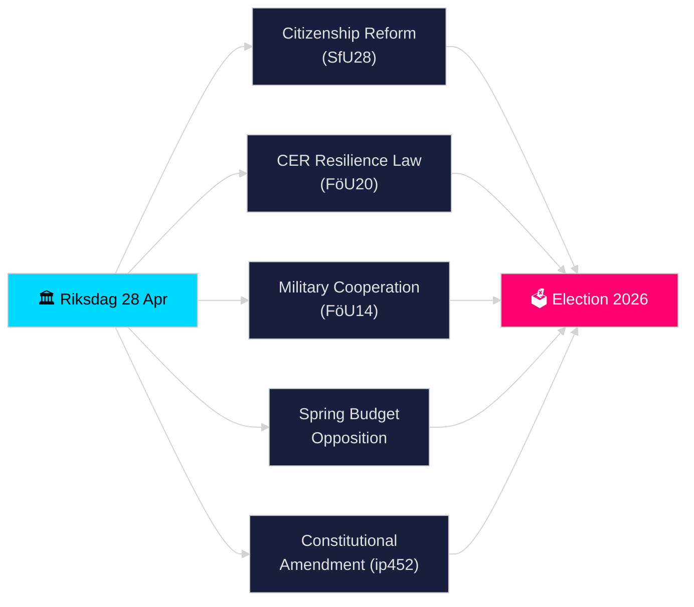

# Riksdagen Pulso en Tiempo Real — 28 de abril de 2026

**Autor**: James Pether Sörling
**Revisión**: 2 (revisado críticamente y mejorado el 2026-04-28)
**Fecha**: 2026-04-28
**Clasificación**: PÚBLICO — RGPD Art. 9(2)(e)(g) datos políticos publicados
**Nivel de confianza**: ALTO [B2]
**Profundidad de análisis**: estándar

---

## 🎯 BLUF

El Riksdagen inició su período de sprint preelectoral históricamente denso el 28 de abril de 2026: la coalición Tidö avanzó en el endurecimiento de los requisitos de ciudadanía (HD01SfU28), una nueva ley de resiliencia de infraestructuras críticas que transpone la directiva UE CER (HD01FöU20), un marco mejorado de cooperación militar operativa (HD01FöU14) y el paquete de presupuesto de primavera 2026 — mientras la oposición (S, V, C, MP) presentaba contraporposiciones coordinadas a la propuesta económica de primavera. Una interpelación constitucional (HD10452) de Elsa Widding señaló más fracturas sobre las normas de procedimiento democrático antes de las elecciones de septiembre de 2026. La convergencia de legislación de seguridad, financiera y de identidad en un solo día marca el pico de presión legislativa del riksmöte 2025/26.

## 🧭 3 decisiones que este resumen apoya

1. **Evaluar la estabilidad de la coalición**: Determinar si la coalición Tidö (M, SD, KD, L) puede aprobar su paquete completo durante la sesión de primavera sin deserciones, dada la presión opositora sobre el Vårbudget y la reforma constitucional.
2. **Rastrear la convergencia de la legislación de seguridad**: Evaluar si la aprobación simultánea de cooperación militar (FöU14), resiliencia CER (FöU20) y legislación de IVA/delitos fiscales (SkU21, SkU22) constituye una expansión coherente del Estado de seguridad o una ejecución fragmentada de los mandatos UE.
3. **Monitorear el posicionamiento electoral de 2026**: Cuantificar cómo el endurecimiento de la ciudadanía (SfU28) y la legislación criminal (penas dobles por crímenes de pandillas, prop. 2025/26:218) sirven como cebo electoral para los votantes de SD y M.

## ⚡ Lectura de 60 segundos

- **Ciudadanía (HD01SfU28)**: SfU debate requisitos más estrictos — idioma, ingresos, residencia. Impulsado por SD; M apoyando. S/V/C combaten disposiciones clave. Previsto para votación en comité 2026-05-xx.
- **Infraestructura crítica (HD01FöU20)**: Nueva ley que transpone la directiva CER dando a agencias cercanas a Försvarsmakten mandatos de resiliencia reforzados. Votación prevista en Riksdag el 2026-06-15.
- **Cooperación militar (HD01FöU14)**: Betänkande que permite una cooperación operativa más profunda dentro del marco OTAN. Votación prevista el 2026-06-15.
- **Contramociones del presupuesto de primavera**: S (HD024100), SD, V, C, MP presentaron contramociones a prop. 2025/26:99 y prop. 2025/26:100, la propuesta económica de primavera — señala vulnerabilidad fiscal para un gobierno minoritario.
- **Enmienda constitucional (HD10452)**: Widding (independiente) desafía al ministro de Justicia Strömmer sobre el requisito previsto de mayoría de 2/3 para cambios constitucionales, afirmando que da a las minorías poder para bloquear mayorías democráticas.
- **Fraude de IVA / Delitos fiscales (SkU21, SkU22)**: Dos betänkanden de comité fiscal sobre responsabilidad fiscal representativa y lucha contra el fraude de IVA — impulsados por la UE.
- **Plan de transporte (HD03259)**: Plan nacional de infraestructura de transporte 2026–2037 cuestionado por MP.

## 🔭 Principal señal futura

**Antes del 2026-05-19**: El ministro de Justicia Strömmer debe responder a la interpelación constitucional (HD10452). La respuesta señalará la disposición del gobierno a debatir argumentos de legitimidad democrática antes de las elecciones.

<!-- source-sha: 85156e01acda6f6589295f5a1f9197b815c84bc8 -->
