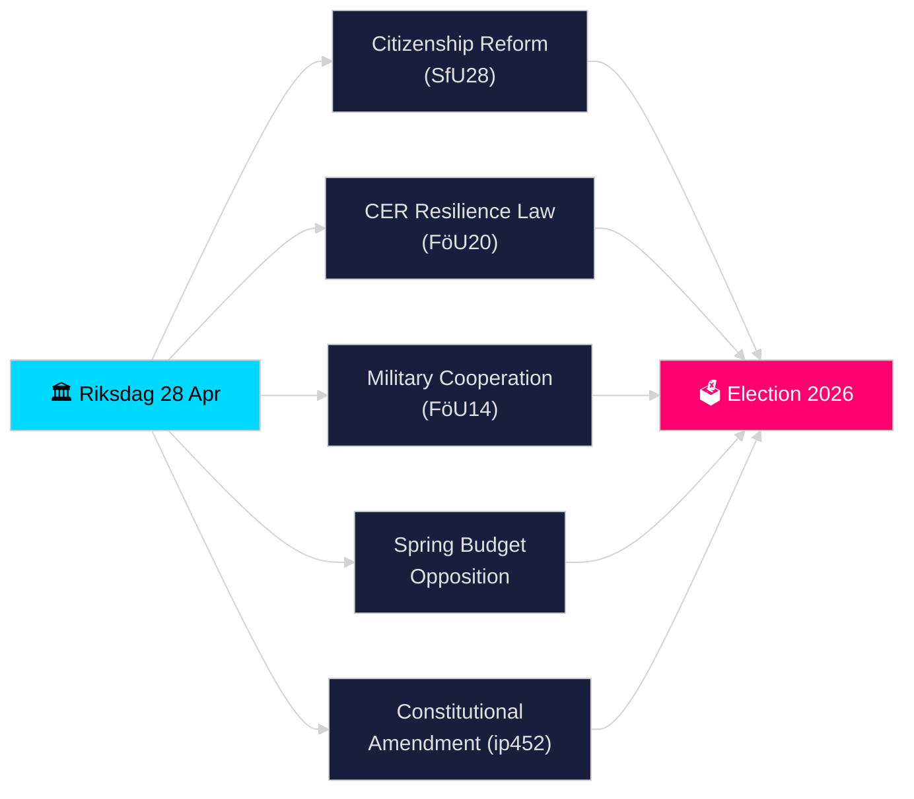

# Riksdagen Reaaliaikapulssi — 28. huhtikuuta 2026

**Kirjoittaja**: James Pether Sörling
**Läpikäynti**: 2 (kriittisesti tarkistettu ja parannettu 2026-04-28)
**Päivämäärä**: 2026-04-28
**Luokitus**: JULKINEN — GDPR Art. 9(2)(e)(g) julkisesti esitettyä poliittista tietoa
**Luottamustaso**: KORKEA [B2]
**Analyysin syvyys**: standardi

---

## 🎯 BLUF

Ruotsin Riksdagen aloitti historiallisen tiheän vaaleja edeltävän kiirehuippunsa 28. huhtikuuta 2026: Tidö-koalitio eteni tiukentamalla kansalaisuusvaatimuksia (HD01SfU28), uudella kriittisen infrastruktuurin selviytymislailla, joka transponoi EU:n CER-direktiivin (HD01FöU20), parannetulla puolustusvoimien operatiivisen yhteistyön kehyksellä (HD01FöU14) ja kevään 2026 budjettipaketilla — kun oppositio (S, V, C, MP) jätti koordinoituja vastaesityksiä taloudellista kevätpropositionsa vastaan. Elsa Widdingin perustuslain muutosta koskeva interpellaatio (HD10452) merkitsi lisää repeämiä demokratiaprosessin normeissa ennen syyskuun 2026 vaaleja. Turvallisuus-, talous- ja identiteettipolitiikan lainsäädännön yhtyminen yhdessä päivässä merkitsi riksmöte 2025/26:n lainsäädäntöpaineen huippua.

## 🧭 3 päätöstä, joita tämä tiedote tukee

1. **Koalition vakauden arviointi**: Selvitä, voiko Tidö-koalitio (M, SD, KD, L) hyväksyä koko pakettinsa kevätistunnossa ilman hajaannusta ottaen huomioon oppositiopaineenpuolueen Vårbudgeten ja perustuslakiuudistuksen suhteen.
2. **Turvallisuuslainsäädännön konvergenssin seuranta**: Arvioi, muodostaako samanaikainen sotilasyhteistyön (FöU14), CER-resilienssin (FöU20) ja ALV-/verorikos- (SkU21, SkU22) lainsäädännön hyväksyminen johdonmukaisen turvallisuusvaltion laajentumisen vai paloittaisen EU-velvoitteiden täyttämisen.
3. **Vuoden 2026 vaalipositioinnin seuranta**: Kvantifioi, kuinka kansalaisuustiukennukset (SfU28) ja rikoslainsäädäntö (kaksinkertaiset rangaistukset jengirikoksista, prop. 2025/26:218) toimivat SD:n ja M:n äänestäjäkunnalle suunnattuina vaalivisteina.

## ⚡ 60 sekunnin tiivistelmä

- **Kansalaisuus (HD01SfU28)**: SfU debatoi tiukennetuista vaatimuksista — kieli, tulot, asuinpaikka. SD-vetoinen; M tukeva. S/V/C vastustavat keskeisiä säännöksiä. Aikataulutettu valiokunnan äänestettäväksi 2026-05-xx.
- **Kriittinen infrastruktuuri (HD01FöU20)**: Uusi CER-direktiivin transponoiva laki, joka antaa Försvarsmakten-läheiisille virastoille tehostettuja resilienssimandaatteja. Suunniteltu Riksdagen-äänestys 2026-06-15.
- **Sotilasyhteistyö (HD01FöU14)**: Betänkande joka mahdollistaa syvemmän operatiivisen yhteistyön NATO-kehyksessä. Äänestys suunniteltu 2026-06-15.
- **Kevätbudjettiesitykset**: S (HD024100), SD, V, C, MP jättivät vastaesityksiä prop. 2025/26:99:lle ja prop. 2025/26:100:lle, taloudelliselle kevätpropositionsa — signaloi fiskaalista haavoittuvuutta vähemmistöhallitukselle.
- **Perustuslain muutos (HD10452)**: Widding (riippumaton) haastaa oikeusministeri Strömmerin kaavaillun 2/3-enemmistövaatimuksen perustuslain muutoksille, väittäen sen antavan vähemmistöille vallan estää demokraattiset enemmistöt.
- **ALV-petos / Verorikos (SkU21, SkU22)**: Kaksi verokomitean betänkandea edustuksellisesta verotilinpidostosta ja ALV-petoksen torjuntatoimenpiteistä — EU-vetoisia.
- **Liikennesuunnitelma (HD03259)**: Kansallinen liikenneinfrastruktuurisuunnitelma 2026–2037, jonka MP kyseenalaisti.

## 🔭 Tärkein tulevaisuuden signaali

**Viimeistään 2026-05-19**: Oikeusministeri Strömmerin on vastattava perustuslain muutosta koskevaan interpellaatioon (HD10452). Vastaus signaloi hallituksen halukkuutta debatata demokraattisen legitimiteetin argumenteista ennen vaaleja.

<!-- source-sha: 85156e01acda6f6589295f5a1f9197b815c84bc8 -->
