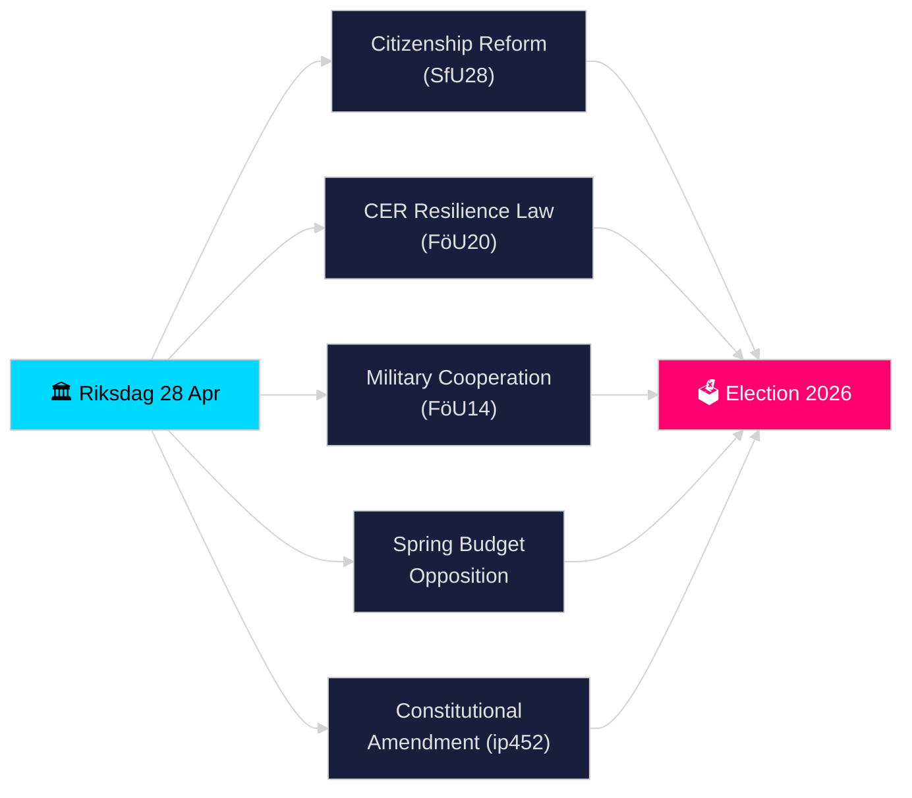

# Riksdagen Pulse en Temps Réel — 28 avril 2026

**Auteur** : James Pether Sörling
**Révision** : 2 (révisé de manière critique et amélioré le 2026-04-28)
**Date** : 2026-04-28
**Classification** : PUBLIC — RGPD Art. 9(2)(e)(g) données politiques publiées
**Niveau de confiance** : ÉLEVÉ [B2]
**Profondeur d'analyse** : standard

---

## 🎯 BLUF

Le Riksdagen a entamé sa période de sprint pré-électoral historiquement dense le 28 avril 2026 : la coalition Tidö a avancé sur le renforcement des exigences de citoyenneté (HD01SfU28), une nouvelle loi sur la résilience des infrastructures critiques transposant la directive UE CER (HD01FöU20), un cadre amélioré de coopération militaire opérationnelle (HD01FöU14) et le paquet de budget de printemps 2026 — tandis que l'opposition (S, V, C, MP) déposait des contre-propositions coordonnées à la proposition de printemps économique. Une interpellation constitutionnelle (HD10452) d'Elsa Widding a signalé de nouvelles fractures sur les normes de procédure démocratique avant les élections de septembre 2026. La convergence des législations de sécurité, financière et d'identité en une seule journée marque le pic de la pression législative dans le riksmöte 2025/26.

## 🧭 3 décisions que cette note soutient

1. **Évaluer la stabilité de la coalition** : Déterminer si la coalition Tidö (M, SD, KD, L) peut adopter son paquet complet lors de la session de printemps sans défections, compte tenu de la pression de l'opposition sur le Vårbudget et la réforme constitutionnelle.
2. **Suivre la convergence de la législation sécuritaire** : Évaluer si l'adoption simultanée de la coopération militaire (FöU14), de la résilience CER (FöU20) et de la législation TVA/infractions fiscales (SkU21, SkU22) constitue une expansion cohérente de l'État sécuritaire ou une exécution morcelée des mandats UE.
3. **Surveiller le positionnement électoral 2026** : Quantifier comment la citoyenneté renforcée (SfU28) et la législation criminelle (doubles peines pour crimes de gangs, prop. 2025/26:218) servent d'appâts électoraux aux électeurs de SD et M.

## ⚡ Lecture en 60 secondes

- **Citoyenneté (HD01SfU28)** : SfU débat des exigences renforcées — langue, revenu, résidence. Conduit par SD ; M soutenant. S/V/C combattent les dispositions clés. Prévu pour vote en commission 2026-05-xx.
- **Infrastructure critique (HD01FöU20)** : Nouvelle loi transposant la directive CER donnant aux agences proches de Försvarsmakten des mandats de résilience renforcés. Vote au Riksdag prévu le 2026-06-15.
- **Coopération militaire (HD01FöU14)** : Betänkande permettant une coopération opérationnelle plus profonde dans le cadre OTAN. Vote prévu le 2026-06-15.
- **Contre-motions du budget de printemps** : S (HD024100), SD, V, C, MP ont déposé des contre-motions à prop. 2025/26:99 et prop. 2025/26:100, la proposition économique de printemps — signale une vulnérabilité fiscale pour un gouvernement minoritaire.
- **Amendement constitutionnel (HD10452)** : Widding (indépendant) challenge le ministre de la justice Strömmer sur la condition prévue des 2/3 de majorité pour les changements constitutionnels, affirmant qu'elle donne aux minorités le pouvoir de bloquer les majorités démocratiques.
- **Fraude TVA / Infractions fiscales (SkU21, SkU22)** : Deux betänkanden de comité fiscal sur la responsabilité fiscale représentative et la lutte contre la fraude TVA — conduits par l'UE.
- **Plan de transport (HD03259)** : Plan national d'infrastructure de transport 2026–2037 remis en question par MP.

## 🔭 Principal signal futur

**D'ici le 2026-05-19** : Le ministre de la justice Strömmer devra répondre à l'interpellation constitutionnelle (HD10452). La réponse signalera la volonté du gouvernement de débattre des arguments de légitimité démocratique avant les élections.

<!-- source-sha: 85156e01acda6f6589295f5a1f9197b815c84bc8 -->
