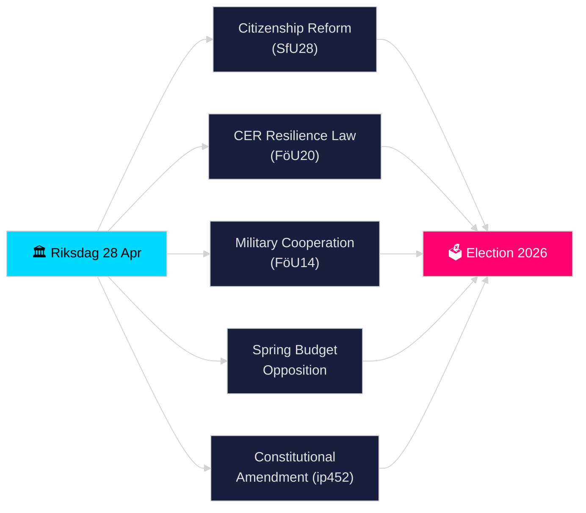

# דופק הריקסדאגן בזמן אמת — 28 באפריל 2026

**מחבר**: ג'יימס פיתר סורלינג
**סקירה**: 2 (נבדק באופן ביקורתי ושופר ב-2026-04-28)
**תאריך**: 2026-04-28
**סיווג**: ציבורי — תקנת הגנת המידע הכללית סעיף 9(2)(ה)(ז) נתונים פוליטיים שפורסמו
**רמת אמינות**: גבוהה [B2]
**עומק ניתוח**: סטנדרטי

---

## 🎯 תמצית

הריקסדאגן פתח את תקופת הספרינט הצפוף היסטורית שלפני הבחירות ב-28 באפריל 2026: קואליציית טידו התקדמה בהחמרת דרישות האזרחות (HD01SfU28), חוק חדש לחוסן תשתיות קריטיות המשנה את הנחיית CER האירופאית (HD01FöU20), מסגרת משופרת לשיתוף פעולה צבאי מבצעי (HD01FöU14) וחבילת תקציב האביב 2026 — בעוד האופוזיציה (S, V, C, MP) הגישה הצעות נגד מתואמות להצעת האביב הכלכלית. הפנייה החוקתית (HD10452) של אלסה וידינג איתתה על סדקים נוספים בנורמות הפרוצדורה הדמוקרטית לפני בחירות ספטמבר 2026. התכנסות חקיקת הביטחון, הפיננסים ומדיניות הזהות ביום אחד מסמנת את שיא הלחץ החקיקתי בריקסמוטה 2025/26.

## 🧭 3 החלטות שתדריך זה תומך בהן

1. **הערכת יציבות הקואליציה**: לקבוע האם קואליציית טידו (M, SD, KD, L) מסוגלת לאשר את החבילה המלאה שלה בהפגרת האביב ללא עריקות, בהינתן לחץ האופוזיציה על וורבודג'ט ורפורמת החוקה.
2. **מעקב אחר התכנסות חקיקת הביטחון**: להעריך האם האישור הסימולטני של שיתוף פעולה צבאי (FöU14), חוסן CER (FöU20) וחקיקת מע"מ/עבירות מס (SkU21, SkU22) מהווה הרחבה קוהרנטית של מדינת הביטחון או מילוי מאולץ של מנדטים אירופאיים.
3. **מעקב אחר מיצוב לקראת בחירות 2026**: לכמת כיצד האחזה באזרחות (SfU28) וחקיקת הפשע (עונשים כפולים לפשע כנופיות, הצעה 2025/26:218) משמשים כפתיון בחירות לבוחרי SD ו-M.

## ⚡ קריאה ב-60 שניות

- **אזרחות (HD01SfU28)**: ועדת SfU דנה בדרישות מחמירות יותר — שפה, הכנסה, מגורים. מונע על ידי SD; M תומך. S/V/C נאבקות נגד הוראות מרכזיות. מתוכנן להצבעה בוועדה 2026-05-xx.
- **תשתית קריטית (HD01FöU20)**: חוק חדש המשנה את הנחיית CER המעניק לסוכנויות הקרובות ל-Försvarsmakten מנדטי חוסן מחוזקים. הצבעת ריקסדאגן מתוכננת ל-2026-06-15.
- **שיתוף פעולה צבאי (HD01FöU14)**: בטנקנדה המאפשר שיתוף פעולה מבצעי עמוק יותר במסגרת נאט"ו. הצבעה מתוכננת ל-2026-06-15.
- **הצעות נגד לתקציב האביב**: S (HD024100), SD, V, C, MP הגישו הצעות נגד להצעה 2025/26:99 ולהצעה 2025/26:100, הצעת האביב הכלכלית — מאותת על פגיעות פיסקלית לממשלת מיעוט.
- **תיקון חוקתי (HD10452)**: וידינג (עצמאית) מאתגרת את שר המשפטים סטרומר על דרישת הרוב של 2/3 המתוכננת לשינויים חוקתיים, בטענה שהיא מעניקה למיעוטים כוח לחסום רוב דמוקרטי.
- **הונאת מע"מ / עבירות מס (SkU21, SkU22)**: שני בטנקנדות של ועדת המס על אחריות מס ייצוגית ומאבק בהונאת מע"מ — מונע על ידי האיחוד האירופאי.
- **תוכנית תחבורה (HD03259)**: תוכנית תשתית תחבורה לאומית 2026–2037 שנשאלה על ידי MP.

## 🔭 אות העתיד המרכזי

**עד 2026-05-19**: שר המשפטים סטרומר חייב להשיב על הפנייה החוקתית (HD10452). התגובה תאותת על נכונות הממשלה לדון בטיעוני הלגיטימיות הדמוקרטית לפני הבחירות.

<!-- source-sha: 85156e01acda6f6589295f5a1f9197b815c84bc8 -->
