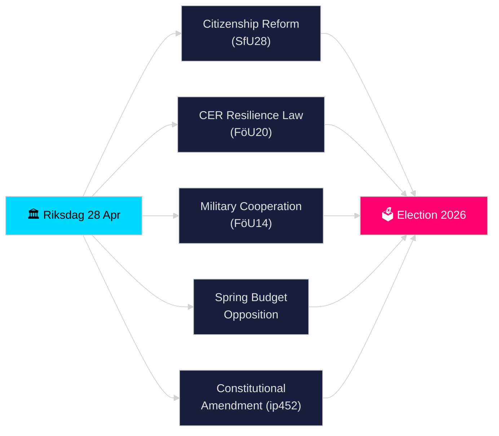

# リクスダーゲン リアルタイム・パルス — 2026年4月28日

**著者**: ジェームズ・ペター・ソルリング
**レビュー**: 2（2026-04-28に批判的に見直し・改善済み）
**日付**: 2026-04-28
**分類**: 公開 — GDPR第9条(2)(e)(g) 公開された政治データ
**信頼レベル**: 高 [B2]
**分析深度**: 標準

---

## 🎯 要点

リクスダーゲンは2026年4月28日、歴史的に密度の高い選挙前スプリント期間を開始した：ティドー連立政権は市民権要件の厳格化（HD01SfU28）、EU CER指令を国内法化する重要インフラ強靭化法（HD01FöU20）、改善された作戦的軍事協力枠組み（HD01FöU14）および2026年春季予算パッケージを推進した。一方で野党（S、V、C、MP）は経済春季予算提案に対して協調した対案を提出した。エルサ・ヴィッディングによる憲法質問（HD10452）は、2026年9月選挙を前に民主的手続き規範についてのさらなる亀裂を示した。1日での安全保障・財政・アイデンティティ政策立法の収斂は、リクスモーテ2025/26における立法圧力のピークを示している。

## 🧭 このブリーフィングが支援する3つの意思決定

1. **連立の安定性評価**: ヴォールブジェットと憲法改革に対する野党の圧力を考慮した上で、ティドー連立（M、SD、KD、L）が春季会期を通じて完全なパッケージを離反者なく可決できるかを判断する。
2. **安全保障立法の収斂を追跡**: 軍事協力（FöU14）、CER強靭化（FöU20）、付加価値税・税務犯罪立法（SkU21、SkU22）の同時採択が、連立した安全保障国家の拡大を構成するのか、それとも断片的なEU義務履行なのかを評価する。
3. **2026年選挙ポジショニングの監視**: 市民権の厳格化（SfU28）と犯罪立法（組織犯罪への倍増罰則、提案2025/26:218）がSDとMの有権者への選挙アピールとして機能する程度を定量化する。

## ⚡ 60秒まとめ

- **市民権（HD01SfU28）**: SfUが厳格化された要件を討議中 — 言語、収入、居住。SD主導；M支持。S/V/Cは主要条項に反対。2026-05-xx委員会投票予定。
- **重要インフラ（HD01FöU20）**: フェルスヴァルスマクテン関連機関に強化された強靭性権限を与えるCER指令国内法化新法。リクスダーゲン投票予定2026-06-15。
- **軍事協力（HD01FöU14）**: NATOの枠組み内でより深い作戦的協力を可能にするベタンカンデ。投票予定2026-06-15。
- **春季予算対案**: S（HD024100）、SD、V、C、MPが提案2025/26:99および提案2025/26:100（経済春季提案）に対案を提出 — 少数派政府の財政的脆弱性を示唆。
- **憲法改正（HD10452）**: ヴィッディング（無所属）が憲法変更の3分の2多数要件についてストロメル司法大臣に問い、少数派に民主的多数派を阻止する権限を与えると主張。
- **付加価値税詐欺・税務犯罪（SkU21、SkU22）**: 代表的な税務責任と付加価値税詐欺対策に関する2つの税委員会ベタンカンデ — EU主導。
- **交通計画（HD03259）**: 国家交通インフラ計画2026–2037についてMPが質問。

## 🔭 最重要の将来シグナル

**2026-05-19まで**: ストロメル司法大臣は憲法質問（HD10452）に回答しなければならない。回答は、政府が選挙前に民主的正当性の議論をどこまで交わす意志があるかを示す。

<!-- source-sha: 85156e01acda6f6589295f5a1f9197b815c84bc8 -->
