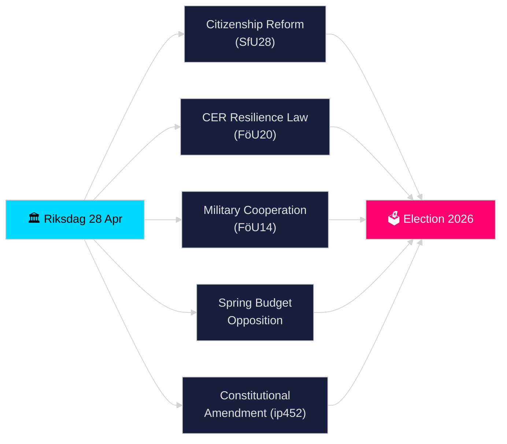

# 릭스다겐 실시간 펄스 — 2026년 4월 28일

**저자**: 제임스 페터 솔링
**검토**: 2 (2026-04-28 비판적 검토 및 개선 완료)
**날짜**: 2026-04-28
**분류**: 공개 — GDPR 제9조(2)(e)(g) 공개된 정치 데이터
**신뢰 수준**: 높음 [B2]
**분석 깊이**: 표준

---

## 🎯 핵심 요약

릭스다겐은 2026년 4월 28일 역사적으로 밀도 높은 선거 전 스프린트 기간을 시작했다: 티도 연립 정권은 시민권 요건 강화(HD01SfU28), EU CER 지침을 국내법으로 전환하는 새로운 중요 인프라 탄력성 법(HD01FöU20), 개선된 작전적 군사 협력 프레임워크(HD01FöU14), 2026년 춘계 예산 패키지를 추진했다. 반면 야권(S, V, C, MP)은 경제 춘계 제안서에 대한 협조된 대안을 제출했다. 엘사 비딩의 헌법 질의(HD10452)는 2026년 9월 선거를 앞두고 민주적 절차 규범에서 추가적인 균열을 알렸다. 하루에 안보·재정·정체성 정책 입법이 수렴된 것은 릭스모테 2025/26에서 입법 압력의 정점을 나타낸다.

## 🧭 이 브리핑이 지원하는 3가지 의사결정

1. **연립의 안정성 평가**: 봐르뷔제트와 헌법 개혁에 대한 야당의 압력을 고려하여 티도 연립(M, SD, KD, L)이 탈당자 없이 춘계 회기 전체 패키지를 통과시킬 수 있는지 판단한다.
2. **안보 입법 수렴 추적**: 군사 협력(FöU14), CER 탄력성(FöU20), 부가가치세/세금 범죄 입법(SkU21, SkU22)의 동시 채택이 일관된 안보 국가 확장을 구성하는지, 단편적인 EU 의무 이행인지 평가한다.
3. **2026년 선거 포지셔닝 모니터링**: 시민권 강화(SfU28)와 범죄 입법(조직 범죄 이중 처벌, 제안 2025/26:218)이 SD와 M 유권자들을 위한 선거 미끼로 얼마나 기능하는지 정량화한다.

## ⚡ 60초 요약

- **시민권(HD01SfU28)**: SfU가 강화된 요건 토론 중 — 언어, 소득, 거주. SD 주도; M 지지. S/V/C는 핵심 조항에 반대. 2026-05-xx 위원회 표결 예정.
- **중요 인프라(HD01FöU20)**: 페르스바르스마크텐 관련 기관에 강화된 탄력성 권한을 부여하는 CER 지침 전환 신법. 릭스다겐 표결 예정 2026-06-15.
- **군사 협력(HD01FöU14)**: NATO 프레임워크 내 더 깊은 작전적 협력을 가능하게 하는 베탄칸데. 표결 예정 2026-06-15.
- **춘계 예산 대안**: S(HD024100), SD, V, C, MP가 제안 2025/26:99와 제안 2025/26:100(경제 춘계 제안)에 대안 제출 — 소수 정부의 재정 취약성 시사.
- **헌법 개정(HD10452)**: 비딩(무소속)이 헌법 변경 3분의 2 다수 요건에 대해 스트뢰메르 법무장관에 도전, 소수파에게 민주적 다수를 막을 권한을 준다고 주장.
- **부가가치세 사기/세금 범죄(SkU21, SkU22)**: 대표적 세금 책임과 부가가치세 사기 대응에 관한 세금 위원회 베탄칸데 2건 — EU 주도.
- **교통 계획(HD03259)**: 국가 교통 인프라 계획 2026–2037에 대해 MP가 질의.

## 🔭 가장 중요한 미래 신호

**2026-05-19까지**: 스트뢰메르 법무장관은 헌법 질의(HD10452)에 답해야 한다. 답변은 정부가 선거 전 민주적 정당성 논거를 어디까지 토론할 의지가 있는지 나타낼 것이다.

<!-- source-sha: 85156e01acda6f6589295f5a1f9197b815c84bc8 -->
