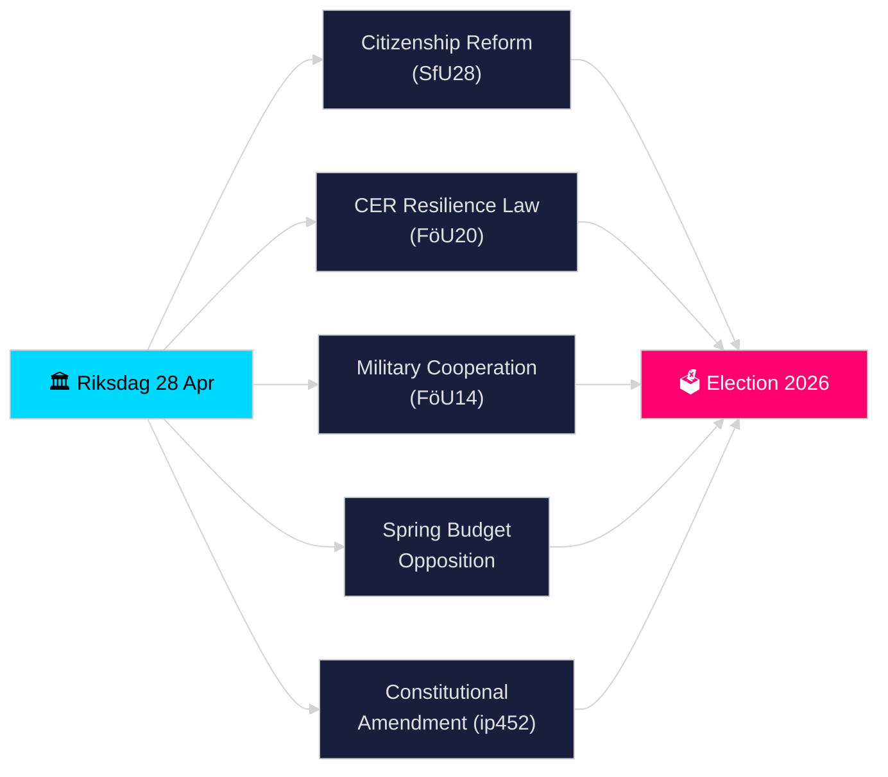

# Riksdagen Realtime Puls — 28 april 2026

**Auteur**: James Pether Sörling
**Beoordeling**: 2 (kritisch beoordeeld en verbeterd op 2026-04-28)
**Datum**: 2026-04-28
**Classificatie**: OPENBAAR — AVG Art. 9(2)(e)(g) openbaar gemaakte politieke gegevens
**Betrouwbaarheidsniveau**: HOOG [B2]
**Analysediepte**: standaard

---

## 🎯 BLUF

De Riksdagen begon zijn historisch drukke pre-verkiezingsspurt op 28 april 2026: de Tidö-coalitie boekte vooruitgang bij het aanscherpen van staatsburgerschapseisen (HD01SfU28), een nieuwe wet inzake veerkracht van kritieke infrastructuur die de EU CER-richtlijn omzet (HD01FöU20), een verbeterd kader voor operationele militaire samenwerking (HD01FöU14) en het voorjaarsbegrotingspakket 2026 — terwijl de oppositie (S, V, C, MP) gecoördineerde amendementen indiende bij de economische voorjaarsproposie. Een constitutionele interpellatie (HD10452) van Elsa Widding signaleerde verdere breuken over democratische procedurenormen vóór de verkiezingen van september 2026. De convergentie van veiligheids-, financieel en identiteitsbeleid-wetgeving op één enkele dag markeert het hoogtepunt van de wetgevingsdruk in de riksmöte 2025/26.

## 🧭 3 beslissingen die deze briefing ondersteunt

1. **Coalitie-stabiliteit beoordelen**: Bepalen of de Tidö-coalitie (M, SD, KD, L) haar volledig pakket door de voorjaarszitting kan loodsen zonder afvallers, gezien de oppositiedruk op het Vårbudget en de grondwetshervorming.
2. **Convergentie van veiligheidswetgeving volgen**: Beoordelen of de gelijktijdige aanneming van militaire samenwerking (FöU14), CER-veerkracht (FöU20) en BTW-/belastingdelicten-wetgeving (SkU21, SkU22) een coherente uitbreiding van de veiligheidsstaat of een stukgewijze EU-mandaatvervulling vormt.
3. **Verkiezingspositionering 2026 monitoren**: Kwantificeren hoe aangescherpt burgerschap (SfU28) en criminele wetgeving (dubbele straffen voor bendecriminaliteit, prop. 2025/26:218) als verkiezingslokaas voor SD- en M-kiezers dienen.

## ⚡ Lezen in 60 seconden

- **Staatsburgerschap (HD01SfU28)**: SfU debatteert over strengere eisen — taal, inkomen, verblijfplaats. SD-gedreven; M ondersteunend. S/V/C bestrijden sleuteldeterminanten. Gepland voor commissiestemming 2026-05-xx.
- **Kritieke infrastructuur (HD01FöU20)**: Nieuwe wet ter omzetting van de CER-richtlijn die aan Försvarsmakten-gerelateerde agentschappen versterkte veerkrachtmandaten geeft. Geplande Riksdag-stemming 2026-06-15.
- **Militaire samenwerking (HD01FöU14)**: Betänkande dat diepere operationele samenwerking binnen het NAVO-kader mogelijk maakt. Stemming gepland op 2026-06-15.
- **Voorjaarsbegroting-amendementen**: S (HD024100), SD, V, C, MP dienden amendementen in op prop. 2025/26:99 en prop. 2025/26:100, de economische voorjaarsproposie — signaleert fiscale kwetsbaarheid voor een minderheidsregering.
- **Grondwetswijziging (HD10452)**: Widding (onafhankelijk) daagt minister van Justitie Strömmer uit over de geplande 2/3-meerderheidsvereiste voor grondwetswijzigingen, bewerend dat het minderheden de macht geeft democratische meerderheden te blokkeren.
- **BTW-fraude / Belastingdelicten (SkU21, SkU22)**: Twee belastingcommissie-betänkanden over representatieve belastingaansprakelijkheid en bestrijding van BTW-fraude — EU-gedreven.
- **Transportplan (HD03259)**: Nationaal transportinfrastructuurplan 2026–2037 in vraag gesteld door MP.

## 🔭 Belangrijkste toekomstige signaal

**Vóór 2026-05-19**: Minister van Justitie Strömmer moet reageren op de constitutionele interpellatie (HD10452). Het antwoord zal signaleren in hoeverre de regering bereid is om democratische legitimiteitsargumenten te debatteren vóór de verkiezingen.

<!-- source-sha: 85156e01acda6f6589295f5a1f9197b815c84bc8 -->
