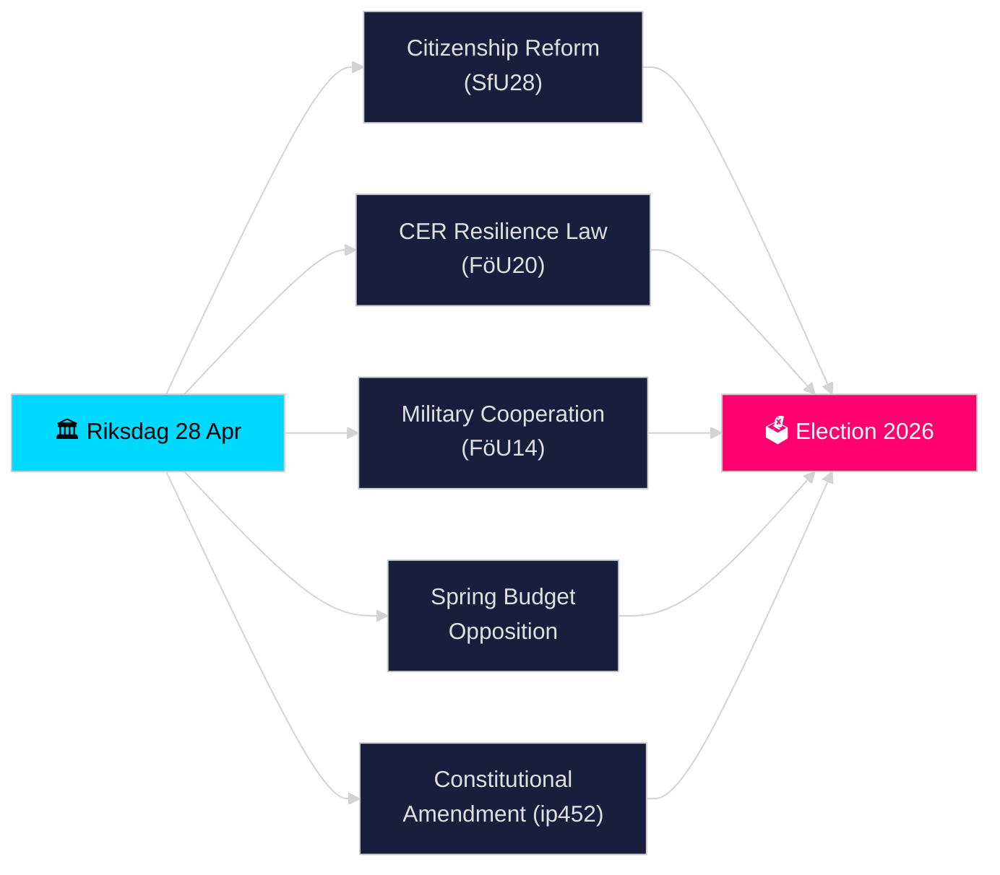

# Riksdagen Realtidspuls — 28. april 2026

**Forfatter**: James Pether Sörling
**Gjennomgang**: 2 (kritisk gjennomgått og forbedret 2026-04-28)
**Dato**: 2026-04-28
**Klassifisering**: OFFENTLIG — GDPR Art. 9(2)(e)(g) offentliggjorte politiske data
**Konfidensnivå**: HØY [B2]
**Analysedybde**: standard

---

## 🎯 BLUF

Riksdagen startet sin historisk tette pre-valsspurt 28. april 2026: Tidö-koalisjonen fremmet strengere statsborgerskapskrav (HD01SfU28), en ny lov om kritisk infrastrukturresiliens som transponerer EU CER-direktivet (HD01FöU20), et forbedret rammeverk for operativt militært samarbeid (HD01FöU14) og Vårbudsjettspakken 2026 — mens opposisjonen (S, V, C, MP) innga koordinerte motforslag til den økonomiske vårproposisjonen. En grunnlovsinterpellasjon (HD10452) fra Elsa Widding signaliserte ytterligere brudd om demokratiske prosedyrenormer foran valget i september 2026. Konvergensen av sikkerhets-, finans- og identitetspolitisk lovgivning på én enkelt dag markerer toppen av lovgivningspresset i riksmøte 2025/26.

## 🧭 3 beslutninger dette notatet støtter

1. **Vurder koalisjonsstabilitet**: Avgjør om Tidö-koalisjonen (M, SD, KD, L) kan vedta sin fulle pakke gjennom vårsesjonen uten defeksjoner, gitt opposisjonspress på Vårbudsjettet og grunnlovsreformen.
2. **Spor sikkerhetslovgivningens konvergens**: Vurder om den samtidige vedtakelsen av militært samarbeid (FöU14), CER-resiliens (FöU20) og moms-/skattelovgivning (SkU21, SkU22) utgjør en sammenhengende sikkerhetsstatlig ekspansjon eller stykkevis EU-mandatoppfyllelse.
3. **Overvåk valgposisjonering 2026**: Kvantifiser hvordan skjerpet statsborgerskap (SfU28) og kriminalitetslovgivning (doble straffer for gjengkriminalitet, prop. 2025/26:218) fungerer som valgbudskap for SDs og Ms velgere.

## ⚡ 60-sekunders lesing

- **Statsborgerskap (HD01SfU28)**: SfU debatterer strengere krav — språk, inntekt, botid. SD-drevet; M støttende. S/V/C motarbeider nøkkelbestemmelser. Planlagt for komitéavstemning 2026-05-xx.
- **Kritisk infrastruktur (HD01FöU20)**: Ny lov om CER-direktivtransposisjon som gir Försvarsmakten-nærstående etater styrket resiliensmandater. Planlagt Riksdag-avstemning 2026-06-15.
- **Militært samarbeid (HD01FöU14)**: Betänkande som muliggjør dypere operativt samarbeid innenfor NATO-rammen. Avstemning planlagt 2026-06-15.
- **Vårbudsjetmotsjoner**: S (HD024100), SD, V, C, MP innga motforslag til prop. 2025/26:99 og prop. 2025/26:100, den økonomiske vårproposisjonen — signaliserer fiskal sårbarhet for en mindretallsregjering.
- **Grunnlovsendring (HD10452)**: Widding (uavhengig) utfordrer justisminister Strömmer om det planlagte 2/3-flertallskravet for grunnlovsendringer, og hevder det gir minoriteter makt til å blokkere demokratiske flertall.
- **Momssvik / Skattebrott (SkU21, SkU22)**: To skattekomiteers betänkanden om representativt skatteansvar og motvirkning av momssvik — EU-drevne.
- **Transportplan (HD03259)**: Nasjonal transportinfrastrukturplan 2026–2037 stilt spørsmål ved MP.

## 🔭 Viktigste fremtidssignal

**Innen 2026-05-19**: Justisminister Strömmer må svare på grunnlovsinterpellasjonen (HD10452). Svaret vil signalisere regjeringens vilje til å debattere demokratisk legitimitetsargumentasjon foran valget.

<!-- source-sha: 85156e01acda6f6589295f5a1f9197b815c84bc8 -->
